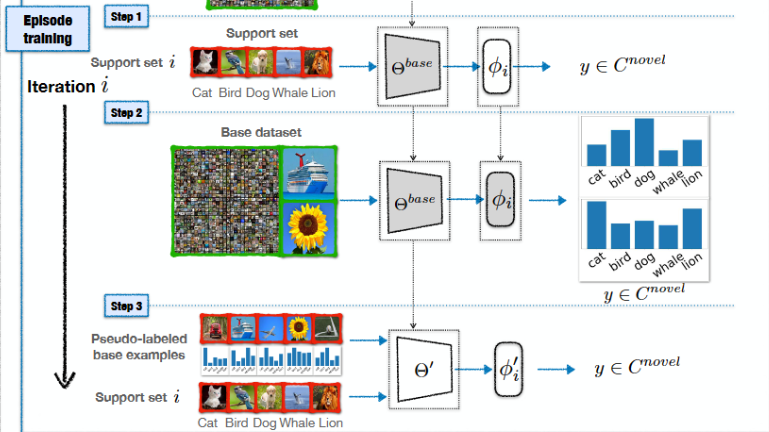

## Label Hallucination for Few-Shot Classification

作者：Yiren Jian（达特茅斯学院）

来源：AAAI 2022


论文：[[aaai](https://ojs.aaai.org/index.php/AAAI/article/view/20659/20418)]

代码：[[github](https://github.com/yiren-jian/LabelHalluc)]

引用数：10

### 创新点

如果在大型数据集上预训练模型然后微调用于小样本分类会导致严重的过拟合问题。与此同时，在从大型标记数据集中学习到的“冻结”特征上训练一个简单的线性分类器，不能使模型适应新类的特性，会导致欠拟合问题。

在本篇工作中，作者在novel数据集上训练了一个线性分类器，用这个分类器给base类里的图像打上“伪标签”，然后用蒸馏损失，在整个打了“伪标签”的base集合上微调模型。

打伪标签的目的：之前的一些工作都是在base类上预训练好一个特征提取器之后，冻结参数，在novel类中的每一个小样本分类任务上训练一个分类器，但是数据少，容易过拟合。所以，这篇的工作是不冻结参数，对整个体征提取器进行微调。那么微调过程中，数据还是很少，怎么办？这时就用到了“伪标签”，让模型在整个打上“伪标签”的base集合上微调，这样数据就够了。


直觉上看，尽管novel类没有在base类中“正确”表示，但许多base图像可能包括与novel类相似的图像，这些图像由定义属于novel类概率的soft伪标签编码。

### 实验结果

| miniImageNet & tieredImageNet                               | CIFAR-FS & FC-100                                           |
| ----------------------------------------------------------- | ----------------------------------------------------------- |
|  |  |

| 不同的迁移方法                                              |
| ----------------------------------------------------------- |
|  |

### 3. 方法

#### 3.1. 在base数据集上训练特征提取器

用RFS中的训练方法训练：


其中， $\Theta$ 是ResNet-12的参数， $\phi$ 是分类器（MLP）的参数。

根据之前的工作，还可以用自蒸馏，旋转自监督的方式进一步提升特征提取器的性能。

> In the experiements presented in this paper, we follow the embedding learning strategies of SKD (Ra-asegaran et al. 2020) (using self-supervised distillation) and IER (Rizve et al. 2021)  (leveraging invariant and equivariant representations).

#### 3.2. 用novel的类标签给base集合打“伪标签”

图1，每一个episode，（1）用support集合训练一个分类器，  （2）用这个分类器给整个base集合打上“伪标签”（分类器的softmax输出），（3)通过知识蒸馏重新训练整个网络。

#### 3.3. 微调整个模型识别novel类

接上面的第（3）步，用小批量，每个小批量support和base里样本的比例相同，微调整个网络。base样本用蒸馏损失，support样本用交叉熵损失。


其中， $\hat{y}$ 是“伪标签”（softmax输出）， $\mathcal{L}_{KL}$ 是KL散度，KL散度的两项分别是：模型的输出，伪标签（softmax）。

由于support集合太小，用RFS中验证阶段的数据扩增方法增加support的view数量，达到小批量的一半，另一半是打“伪标签”的base样本。

### 代码实现

#### 预训练

完全遵循RFS，SKD等baseline的实现。

#### 微调

微调过程中，每个小样本的任务都在整个base set上微调epochs遍，训练的比较慢。



首先看微调的整体逻辑：

把嵌入网络resnet-12最后一层的分类器的参数删除，重新随机初始化。

```python
net_state_dict = net.state_dict().copy()          # Starting point for each episode finetuning.
del net_state_dict['classifier.weight']    # Remove parameters the final classifier
del net_state_dict['classifier.bias']      # So at the beginning of each episode learning, model.feature is
                                               # initialized with base model, model.classifier is initialized randomly
```

对应上图中的step1，使用sklearn库里的LogisticRegression在support上学习一个分类器（5个类）。

```python
clf = LogisticRegression(penalty='l2',
                                     random_state=0,
                                     C=1.0,
                                     solver='lbfgs',
                                     max_iter=1000,
                                     multi_class='multinomial')
            clf.fit(support_features, support_ys)
```

step2：现在我们得到了在第i个小样本上的一个分类器clf，然后用这个clf对整个train_loader里的数据打上伪标签（这里是大样本的采样方式）。

```python
for _, (input, target, trainset_item) in enumerate(trainloader1):
    input_feat, _ = net(input, is_feat=True)
    input_feat = input_feat[-1].view(input.size(0), -1)
    
    input_feat = input_feat.detach().cpu().numpy()
    label = target.numpy() # hard label
    pseudo_y = clf.decision_function(input_feat)
    trainset_pseudo_ys.append(pseudo_y)
```

step3：给训练集全部打上伪标签之后，对嵌入网络resnet-12进行微调。

```python
# 这个就是上面删掉classifier参数的resnet-12
learner = create_model(opt.model, opt.n_ways, opt.dataset)   # model for each episode
learner.load_state_dict(net_state_dict, strict=False)

# 随机初始化函数
optimizer = optim.SGD()
# 初始化KL散度损失（蒸馏损失）
kd_criterion = DistillKL(T=opt.T)
train_one_epoch(epoch, trainloader2, trainset_pseudo_ys, numpy_support_xs, support_ys, query_xs, query_ys, learner, kd_criterion, optimizer, opt)
```

train_one_epoch函数：在打上伪标签的train_loader上整个训练一遍，这次的train_loader的图像transform不一样。每次的train_batch是125=5*25（每个support有25数据增强版本）。那么一个batch就是250=125\*2，前125是带伪标签的base set的数据，后125是这次小样本任务的supprt数据。

```python
for idx, (input, target, item) in enumerate(train_loader):
	support_xs = torch.stack(list(map(lambda x: image_transform(x.squeeze()), numpy_support_xs)))
    input = torch.cat((input, support_xs), dim=0)
    output = model(input, norm_feat=opt.norm_feat)
    loss1 = kd_criterion(output[:opt.train_batch_size], pseudo_y)
    loss2 = nn.CrossEntropyLoss()(output[opt.train_batch_size:], support_ys)
    loss = opt.alpha1*loss1 + opt.alpha2*loss2
```


