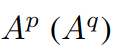

## Cross Attention Network for Few-shot Classification

作者：Ruibing Hou（中科院）

来源：nips 2019

论文：[[neurips](https://proceedings.neurips.cc/paper/2019/file/01894d6f048493d2cacde3c579c315a3-Paper.pdf)]

代码：[[github](https://github.com/blue-blue272/fewshot-CAN)]

引用数：377

### 创新点

同一个网络从support和query提取的特征差异性不大，所以作者引入了一个交叉注意力模块处理这个问题。

- 使用交叉注意力模块处理看不见的类的问题（novel）。这个模块给每对类特征和query特征生成交叉注意力图，注意力图高亮了目标区域，让特征更有区分性。
- 提出一个转导推理算法去避免数据少的问题，迭代利用query集合去扩增support集合，因此让类特征更具代表性。

### 实验结果

| miniImageNet & tieredImageNet                                |
| ------------------------------------------------------------ |
|  |

### 3. 交叉注意力模块（CAM）

**训练方式** episodic的方式。

**CAM概述。** 在这个工作中，我们采用**度量学习**来获得每对support类和query样本的合适的特征表示。现在一些方法都是，support和query单独过网络得到特征，CAM让他们一起过网络，得到的特征更有语义上的相关性。

CAM如上图2所示，（接下来为了简单起见，忽略上下标，输入的特征表示为 $P,Q$ ，输出的特征是 $\bar{P}, \bar{Q}$）。

| 变量                                                         | 备注                                                         |
| ------------------------------------------------------------ | ------------------------------------------------------------ |
|  | support的特征，k是第几个类                                   |
|  | query的特征，b是第几个样本                                   |
|  | 为生成的交叉注意力图 |
|   | 用交叉注意力图加权过后的特征                                 |

 

**相关性层（Correlation Layer）。** 图2，我们首先设计了一个相关性层计算 $P,Q$ 之间的相关性图，随后用这个相关性图生成交叉注意力图。首先，把 $P,Q$ reshape成 $\mathbb{R}^{c \times m}$ ，其中，  ，（$m = h \times w$）是特征图空间位置的数量。 。相关性层计算了  之间的相关性，使用的余弦距离，生成相关性图  ：

然后，我们基于 $R$ 定义了两个相关性图：类相关性图  ，query相关性图  ，其中  表示每个类的局部特征 $p_i$ 和所有的query特征  的相关性，  表示query的局部特征 $q_i$ 和所有类特征  的相关性。那么 $R_p$ 和 $R_q$ 记录了类和query特征图之间的相关性。

**元融合层（Meta Fusion Layer）**。 然后用之前的相关性图，生成类和query注意力图。那类的相关性图 $R_p$ 为输入做例子，进行一个核为 $m \times 1$ 的卷积 $w \in \mathbb{R}^{m \times 1}$ ，把相关性图 $R^p$ 中的每个局部向量 $\{r^p_i\}$ 融合进一个注意力标量中。然后用一个softmax函数归一化这个注意力标量，去得到第 $i^{th}$ 位置的类注意力：

其中， $\tau$ 是温度超参。越小熵越小，使分布集中在几个高置信度位置。然后类注意力图这样得到：把 $A^p$ reshape成一个矩阵 $\mathbb{R}^{h \times w}$ 。注意， $w$ 在融合中发挥了重要的作用，它将类特征的局部 $p_i$ 和所有query特征的局部 $\{q_j\}^m_{j=1}$ 之间的相关性聚合为第 $i^{th}$ 个位置处的注意力标量。更重要的是，加权聚合应该引起对目标对象的关注，而不是简单地突出显示support类和query样本中视觉上相似的区域。

基于上述分析，我们设计了一个元学习器，根据类与query特征之间的相关性自适应地生成核。第一，我们给 $R^p$ 用了一个GAP，去得到一个平均query相关性向量，这个向量之后输入到原学习器，产生核 $w \in \mathbb{R}^m$ ：

其中，  是元学习器的参数， $\sigma$ 是ReLU函数。对于每一对类和query特征，元学习器都会生成一个 $w$ ，它可以引起对目标对象的交叉关注。这在元训练中通过最小化query样本上的分类错误来实现。

同理，可以得到query注意力图  。最后使用了一个残差注意力机制，其中初始的特征图 $P,Q$ 按 $1 + A^p,1+A^q$ 对每个元素加权，从而形成更具区分性的特征图  。

**复杂度分析**。

### 4. 交叉注意力网络

网络结构如图3，三部分组成：嵌入网络，交叉注意力模块，分类模块。

**训练（Model Training via Optimizatio）**。 最小化分类模块的两个损失：都是监督分类交叉熵损失。其中，NN计算是余弦相似度，Global分类器直接过一个全连接层。