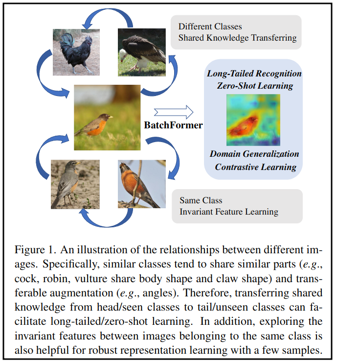
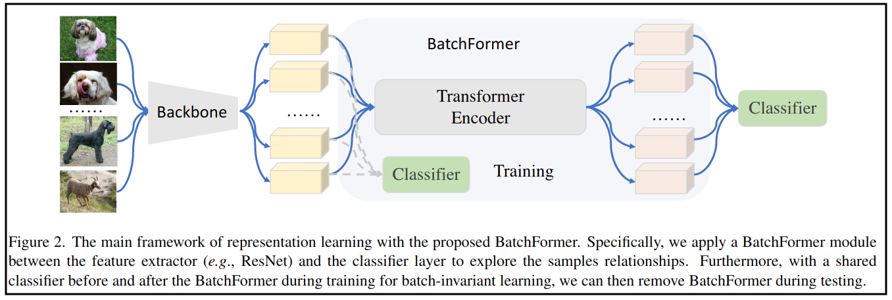
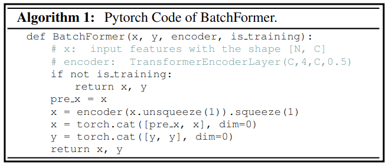
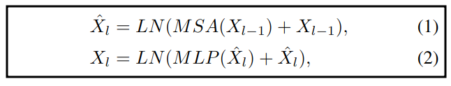

## BatchFormer: Learning to Explore Sample Relationships for Robust Representation Learning
Representation Learning

作者：Zhi Hou侯志（悉尼大学）

来源：CVPR 2022

论文：[[thecvf](https://openaccess.thecvf.com/content/CVPR2022/papers/Hou_BatchFormer_Learning_To_Explore_Sample_Relationships_for_Robust_Representation_Learning_CVPR_2022_paper.pdf)]

代码：[[github](https://github.com/zhihou7/BatchFormer)]

引用数：9

参考：[[作者知乎](https://zhuanlan.zhihu.com/p/556847310)]

### 创新点

学习每个mini-batch里样本之间的关系。

为了缩小训练和测试的差距，共享了classifer的参数，所以BatchFormer在测试的时候可以去掉。

在长尾识别问题，Compositional Zero-Shot Recognition，domain generalization，contrastive learning上都做了实验。

不同类间特征迁移，相同类间学习不变性。



### 3.方法

#### 3.1 概述



1. 首先在每个mini-batch内提取每个样本的特征，这个过程没有cat操作。
2. 接一个Transformer（里面是交叉注意力机制），并把这个模块叫BatchFormer。
3. BatchFormer出来的cls_token（或者是patches）送进classifier分类。
4. 两个classifier共享权重。



#### 3.2. BatchFormer

**Transformer Encoder.** 多头注意力（MSA）+MLP+LayerNorm（LN）。$X \in R^{N \times C}$，表示输入encoder的特征，$N$是batch大小，$C$是特征维度，$l$是encoder的第几层。那么，encoder的输出是：



用多头注意力学习一个batch里的关系。BatchFormer和一般的Transformer的输入不一样，BatchFormer首先要把输入reshape一下，transformer才能作用在batch维度上。

**Shared Classifier.** 一个辅助的分类器，和最后的分类器共享权重，这样不仅学到了最后的分类结果，还学到了特征的不变性。在测试阶段可以把BatchFormer模块去掉。

BatchFormer是一个学习鲁棒性表征可拔插的模块。在训练阶段，BatchFormer可以和backbone（特征提取，CNNs和Vit）用端到端的方式一起训练。

#### 3.3. BatchFormer: A Gradient View

数学上的解释。


### 10. 代码分析

```python
def BatchFormer(x, y, encoder, is_training):
    # x: input features with the shape [N, C]
    # encoder: TransformerEncoderLayer(C,4,C,0.5) (特征输入维度，头数，MLP输出维度，dropout)
    if not is_training:
        return x, y
    pre_x = x	# 过encoder之前的特征
    x = encoder(x.unsqueeze(1)).squeeze(1)	# [N,1,C]送进encoder，为了实现batch维度的attn
    x = torch.cat([pre_x, x], dim=0)	# encoder前后的两个特征训练classifier
    y = torch.cat([y, y], dim=0)	# 匹配[pre_x, x]的维度
    return x, y	# 训练两个classifier的样本和标签
```

具体实现的代码：

`config_model.py`：BatchFormer的实现

```python
class TransformerDecorator(torch.nn.Module):
    '''
    	......
    '''
    def forward_feats(self, feature):
        feature[0] = feature[0].view(feature[0].size(0), -1)

        old_feat = feature[0]
        if self.model.training and self.add_bt or self.eval_bt:
            feature[0] = feature[0].unsqueeze(1)
            feature[0] = self.encoder_layers(feature[0])
            feature[0] = featu1re[0].squeeze(1)
            if self.add_bt > 1:	# 是否加入batchFormer
                feature[0] = torch.cat([old_feat, feature[0]], dim=0)
      	return feature

    def forward(self, feature):
        feature = self.forward_feats(feature)
        feature[0] = self.model(feature)	# 得到encoder出来的特征算损失

        return feature[0]
```

`visual_product.py`：model的实现（classifier和计算损失）

```python
class VisualProductNN(nn.Module):
    '''
    	......
    '''
    def train_forward(self, x):
        img, attrs, objs = x[0],x[1], x[2]

        attr_pred = self.attr_clf(img)	# 两个classifier
        obj_pred = self.obj_clf(img)

        attr_loss = F.cross_entropy(attr_pred, attrs)
        obj_loss = F.cross_entropy(obj_pred, objs)

        loss = attr_loss + obj_loss  # 1:1 

        return loss, None
```

那么上面的attrs和objs是什么？

见MIT-States的数据集构成：[[paper with code](https://paperswithcode.com/dataset/mit-states)]

`czsl/data/dataset.py`：的数据集构成

```python
    def __getitem__(self, index):
        '''
        	......
        '''

        return data
    
    def get_split_info(self):
        '''
        Helper method to read image, attrs, objs samples

        Returns
            train_data, val_data, test_data: List of tuple of image, attrs, obj
        '''
        data = torch.load(ospj(self.root, 'metadata_{}.t7'.format(self.split)))

        train_data, val_data, test_data = [], [], []

        for instance in data:
            image, attr, obj, settype = instance['image'], instance['attr'], \
                instance['obj'], instance['set']
            curr_data = [image, attr, obj]

            if attr == 'NA' or (attr, obj) not in self.pairs or settype == 'NA':
                # Skip incomplete pairs, unknown pairs and unknown set
                continue

            if settype == 'train':
                train_data.append(curr_data)
            elif settype == 'val':
                val_data.append(curr_data)
            else:
                test_data.append(curr_data)

        return train_data, val_data, test_data
```

