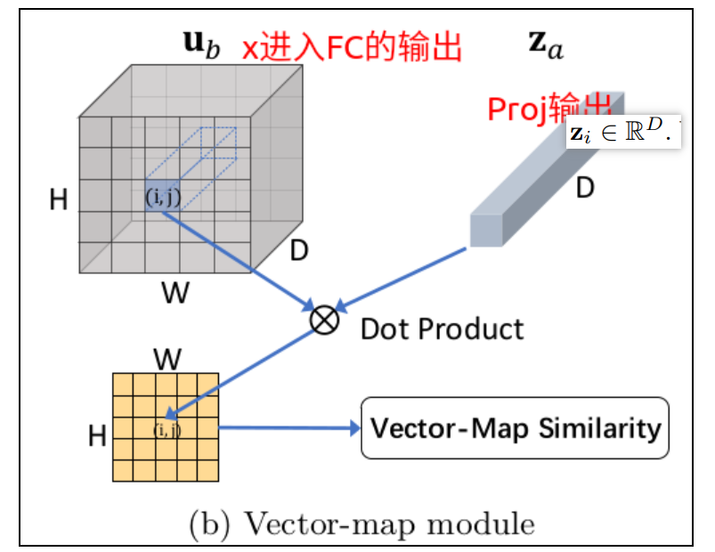
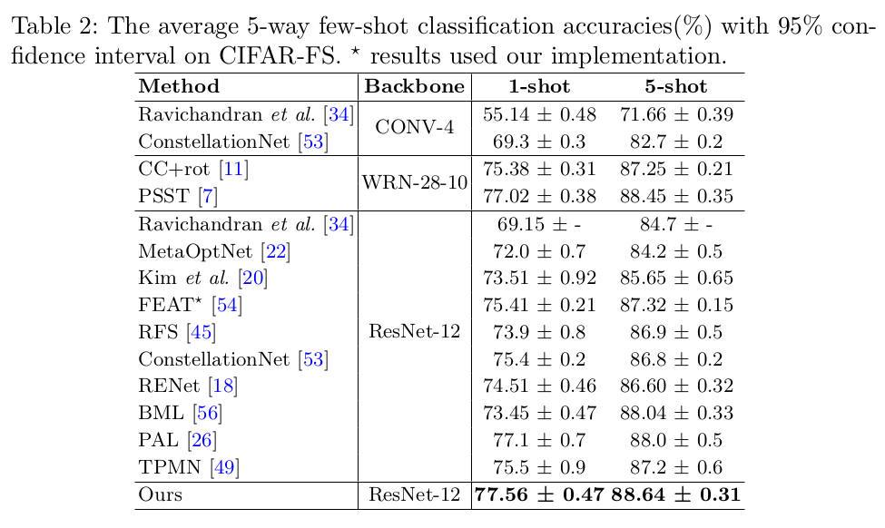
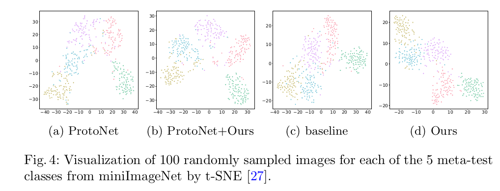
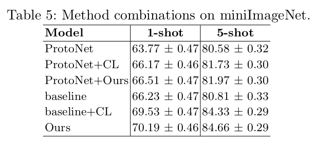
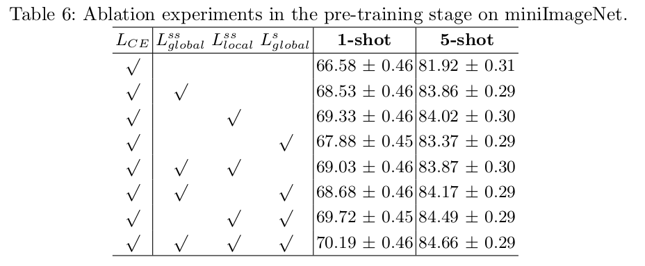

## Few-Shot Classification with Contrastive Learning


### 创新

在pre-training和meta-training中都加入了`instance-discriminative contrastive learning`

- pre-training

  加入了map-map和vector-map的自监督contrastive loss损失。

- meta-training

  将`contrastive learning`和正常的episodic训练结合。

  定义了`distance-scaled contrastive loss`，用来提升表示的传递性。


### 训练框架


其中，

```json
DA: '数据扩增'， // 把N个样本扩增到
CNN： '提取特征', //(C, H, W)
GAP: '全局特征', // (C), 输出h
Proj: '映射成D维的向量', // C -> D，一个隐层的MLP实现，输出z
Attn: '注意力机制', // 把number of heads修改为1
```


### pre-training

- 创新点


- 作用：

  self-supervision能提高表示的广泛性。

  使用supervised contrastive loss能捕捉相同类中不同实例之间的联系。

  

- 损失定义

  

  1. 同源和不同源之间的InstDisc。(infoNCE loss)

  

  其中，
  $$
  z_i:第一个view中Proj的输出，\\
  z_i^,: 第二个view中Proj的输出 \\
  \mathbb{1}:  indicator function
  $$
  

  2. 

     提高表示的鲁棒性。

     

     - **map-map**(infoNCE loss)

       

       

       

       其中，

       $ f_q,f_k,f_v把输入的x_i分别映射成 $ query, key, value: $ q_i,k_i,v_i $

       

       

       两个view输入的x之间的相似度：

       

       维度：

       

       

       

       

     - **vector-map** 

       

       

       **FC的输出：**

       

       

       

  3. 

     

     其中，

     

     <font color=red>$ P(i) $ 和 $x_i$ 同类(有标签)的样本集合。</font>


### Meta-training 

- 创新点

  `cross-viewepisodic training`机制

  

  在GAP之后计算prototype

  

  其中，

  $ S_r^k $是第r个view第k个类的support set，r = {1,2}，k = {1, 2, ..., M}，M是train set一共M个类。

  

  使用`Attn`去aligned prototype：

  

  基于上述结果计算query中样本的概率：（用欧式距离进行分类）
  

  其中，d是欧式距离。

  

  然后一个episode上的` the nearest centroid classifier`损失：

  交叉着计算两个Q的损失

  

  其中，m,n = {1, 2}。

  不同于原始的episodic训练方法，这里在S1和S2上对Q1进行了分类，对Q2也执行了一样的操作。

  **the cross-view classification loss:**

  

- Distance-scaled Contrastive Loss（距离扩大的对比损失，**监督对比损失**）

  先计算经过一个`Proj`的prototype，计算降维之后的prototype。

  

  > For each query vector zi in Q1 and Q2, we reconstruct its positive sample set by using corresponding augmented version z ′ i and the samples of class yi in both support sets.
  >
  > Therefore, we reformulate the supervised contrastive loss [19] in the form of episodic training as follows:
  >
  > 对于每个在 $Q_1$ 和 $Q_2$ 中的query向量 $z_i$，目的要重建  $z_i$ 的正样本（同类非同源，为了使用监督对比损失）集合，就可以用同源的 $z^{'}_i$  和两个support set 中的同类数据，来构成 $z_i$ 的同类集 $H(z_i)$。
  >
  > $A(z_i)$ 就是support set所有样本的集合(多加了prototype $o_k^r$ )，用来当监督对比损失的分母(归一化因子)。  
  
  
  
  其中，
  
  
  
  
  
  然后，（监督对比损失）
  
  
  
  
  
  

​	

### 实验部分


#### 4.1 数据集和实现

- 数据集

  miniImageNet，tieredImageNet，CIFAR-FS

- 实现细节

  ```json
  CNN: 'ResNet-12',
  Attn: 'multihead attention(head = 1)',
  optimizer: 'SGD(decay=5e-4, momentum=0.9)',
  // 在pre-training阶段，初始化lr=0.1，使用cosine lr scheduler
  Temperature parameters τ1,2,3,4: '0.1',
  balance scalars α1,2,3 : '1.0'
  // During meta-training
  temperature τ5 : '0.1',
  (StepLR, gamma, β) : '(40, 0.5, 0.01)', // 1-shot
  (StepLR, gamma, β) : '(50, 0.5, 0.1)', // 5-shot
  ```

- Evaluation

  在meta-testing阶段，使用欧式距离进行分类。

  ```json
  episode: '2000',
  query sample: '15', // 从novel类中选M类，每类15个
  ```

- 数据扩增

  standard and SimCLR-style的DA。

  standard：randomresizedcrop， colorJitter， randomhorizontalflip

  SimCLR-style：randomresizedcrop， randomhorizontalflip， randomcolorjitter，randomgrayscale.

​		

#### 4.2 主要结果

CIFAR-FS，[Table2_p12](./2022ECCV%20Few-Shot%20Classification%20with%20Contrastive%20Learning.pdf?#page=12)，分类的准确率，95%置信区间。



#### 4.3 消融实验

**更详细的在补充材料。**


#### 4.4 进一步分析 

- 数据扩增

  

- 可视化

  

- 和其他方法的结合

  


### 补充材料




### 模型细节

