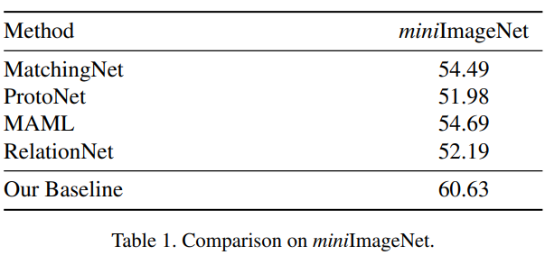
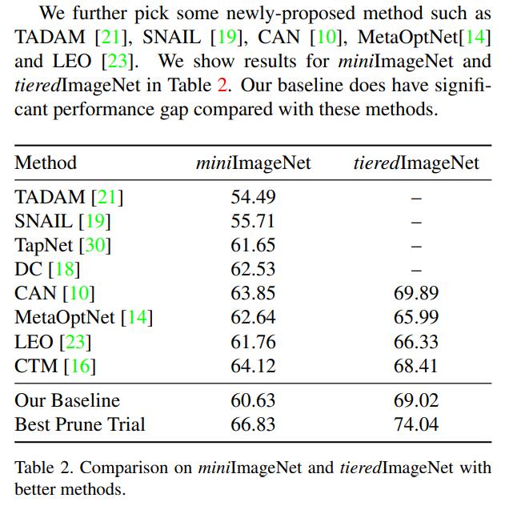
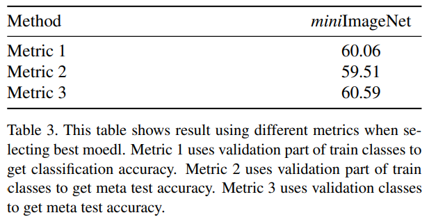
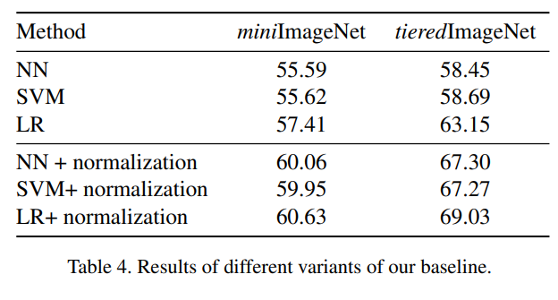

## An Embarrassingly Simple Baseline to One-shot Learning

来源： CVPR 2020

作者：Chen Liu，复旦大学

论文：[下载地址](https://openaccess.thecvf.com/content_CVPRW_2020/papers/w54/Liu_An_Embarrassingly_Simple_Baseline_to_One-Shot_Learning_CVPRW_2020_paper.pdf)

代码：[github](https://github.com/corwinliu9669/embarrassingly-simple-baseline)


### 摘要

提出1-shot任务和普通的预训练任务不一样，不要直接从预训练好的网络中拿特征来用，要做适当的修剪（prune）。

### 结论

提出了非常简单的1-shot学习方法。不用复杂的网络结构和优化策略，作者直接对预训练网络中的特征进行修剪，从而让特征适用于1-shot识别任务，未来的工作可以利用强化学习来学习更好的修剪掩模（pruning mask）。

### 2.方法

#### 2.1. Problem setup

train和test阶段设置不一样。训练阶段：使用 多-shot 的识别方式。$X, Y$ 表示图像和标签。

- Training

  C个类。每个类里的数据组成：（图像，标签）：$\{(x^{c_i}_j, y^{c_i}_j)\}^{n_i}_{j=1}$，其中 $n_i$是第 $i$ 类的样本总数。

- Testing

  5-way 1-shot的设置。query = 15。

#### 2.2.2.2. Baseline

训练了一个ResNet-12。作者把全连接层之间的网络记为 $\Phi(\cdot)$ 。全连接层记为 $\Psi(\cdot)$，它的作用是当一个分类器。

$\Phi(x)$ 是embedding网络，$\Psi(\cdot)$ 输出预测概率，$\Psi(\cdot)$ 最后跟softmax函数。

- Training

  $\Phi(x)$ 输出是经过GAP的512维的特征。使用了图像识别中广泛使用的交叉熵损失。

  - 损失定义
    $$
    \frac{1}{B} \sum^B_{i=1} L(\psi(\Phi(x)), y_i) \\
    其中，B是batch大小
    $$

  训练完之后，$\Psi(\cdot)$ 丢掉，固定 $\Phi(\cdot)$ 的参数。

- Testing

  只用 $\Phi(\cdot)$  。作者使用了三种分类器：**LR，SVM，NN**（最邻近分类器）。对LR，SVM分类器，把support set送进 $\Phi(\cdot)$ 得到512维的特征，用这些特征训练分类器，然后再用分类器对query分类。对NN分类器直接计算query和prototype之间的距离进行分类。

在标准的机器学习算法中，归一化是一个重要的步骤。虽然作者使用了BN，但是BN只是用来避免平均偏移和得到更好的损失。这些BN之后的特征大小可能不合适。对于深度学习，用全连接层就可以解决问题。但是，作者还是决定对 $\Phi(x)$ 的输出加一个L2归一化操作。

#### 2.3. Random pruning

图像识别模型参数量相对较多，修剪参数可能对模型的性能有轻微的影响。作者想判断：是否所有的参数对 1-shot 学习任务来说都重要。受[ Snip: Single-shot network pruning based on connection sensitivity](https://arxiv.org/abs/1810.02340)启发，作者尝试去找到embedding网络是否存在一个子集，这个子集能使用于所有的特定任务（1-shot）。

- 细节

  对每个任务，作者做了一些实验找到合适的 0—1mask。假设有一个比例 $p \in (0,1)$ 。对于每个mask $B$ ，$P$ 的概率是0，其他是1。然后和embedding网络相乘 $\Phi(x)' = \Phi(x)B$ ，这个操作是逐元素的（每个参数）？用的时候 $\Phi(x)'$ 后别忘了归一化。每个任务都选准确率最好的那个mask。作者表示，这里的实验只是找到那些属性对 1-shot 任务有影响，没有用训练和其他的技巧。每个任务都是随机实验的。

### 3.实验

- 数据集
  - miniImageNet：60,000 imgs，100 class，64，16，20
  - tieredImageNet：779,165，351 class，351，97，160
  - 图像大小：84x84
  - DA：random horizontal flip（training）

- 实现细节

  - ```python
    SGD(lr=0.1)	# 每30个epoch衰减0.1
    ```

  - 训练100个epoch
  -  momentum term is set to be 0.9 and 5e-4 for weight decay
  - 使用NN分类器，验证网络
  - Testing：5-way 1-shot 15-query 1200-episodes

- 实验结果

  







