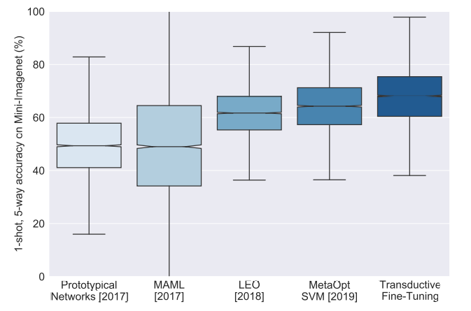

## A BASELINE FOR FEW-SHOT IMAGE CLASSIFICATION

来源：ICLR2020

作者：Guneet S. Dhillon（AWS）

被引次数：337

下载：[[arxiv](https://arxiv.org/pdf/1909.02729)] [[pdf](file:///home/mkid/%E6%A1%8C%E9%9D%A2/A/%E8%AE%BA%E6%96%87/%E5%AF%B9%E6%AF%94%E5%B0%8F%E6%A0%B7%E6%9C%AC%E5%AD%A6%E4%B9%A0/A%20Baseline%20for%20Few-shot%20Image%20Classification.pdf)]

代码：[[github](https://github.com/amazon-science/few-shot-baseline)]

参考：[[csdn](https://blog.csdn.net/qq_38900441/article/details/107013477)]

### 摘要

使用标准的交叉熵损失微调深度网络，在小样本学习中是一个有用baseline方法。作者发现metaa-training过程中，类越多，分类准确率越高。

> We find that using a large number of meta-training classes results in high few-shot accuracies even for a large number of few-shot classes. 

作者提出了一个指标，可以量化小样本episode的"hardness"，这可以更系统的说明小样本算法的性能。

### 结论

提高小样本学习的实用性。现在的很多方法，为了提高精度，方法越来越复杂，方法中的评估策略也不充分。

作者提出了一个baseline：**transductive fine-tuning**，和一个系统性的评估方法 **hardness metric**。

作者提出的transductive fine-tuning不新，但是效果优于之前的算法。

### 背景

图1：方法在进步吗？方框表示 +-25% 分位数，中间表示95%置信区间的准确率。方框上下的直线表示1.5倍的四分卫间距，其捕获正态分布概率质量的99.3%。准确率的标准差很大，这说明，进展可能是虚幻的，而且之前的方法，也没有优于本文中提到的方法（最右边）。

根据图1，平均准确率方差可能会很小（0），而准确率的方差可能会很大（任意大）。

作者的目标是提出一个baseline，即不需要不同的way和shot（？5-way 1-shot 和 5-shot训练方法一样0），也不需要为不同的protocols设置不同的超参。

> Our goal is to develop a simple baseline for few-shot learning, one that does not require specialized training depending on the number of ways or shots, nor hyper-parameter tuning for different protocols.

能想到最简单的baseline是：在meta-training数据集上使用标准交叉熵预训练一个模型，然后在few-shot数据集上微调。

现有的小样本方法很难扩展到很大的数据集上，例如ImageNet-21K（1420万张图片，21814类）。

### 2. 问题定义

- $(x,y)$ 是图像和标签
- 训练集：$D_s = \{x_i, y_i\}^{N_s}_{i=1}$ ，测试集：$D_q = \{x_i, y_i\}^{N_q}_{i=1}$ 。

- 小样本学习中，由episode的形式构建训练（support）和测试集（query）。

### 3. 方法

？

#### 3.1. 基于support的初始化

- 给定一个预训练好的模型（称为backone），在后面添加一个全连接层当分类器。
- 给定一个support样本 $(x, y)$ ，backbone分类器的输出是 $z(x; \theta) \in \mathbb{R}^{\vert C_m \vert}$ ，$C_m$ 要预测类的个数， $\vert C_t \vert$ 是输入类的个数。分类器的weight和bias： $w \in \mathbb{R}^{\vert C_t \vert \times \vert C_m \vert}$ 和 $b \in \mathbb{R}^{\vert C_t \vert}$ 。$k^{th}$ 行：$w_k, b_k$ 。Relu：$(.)_+$ 。
- 如果