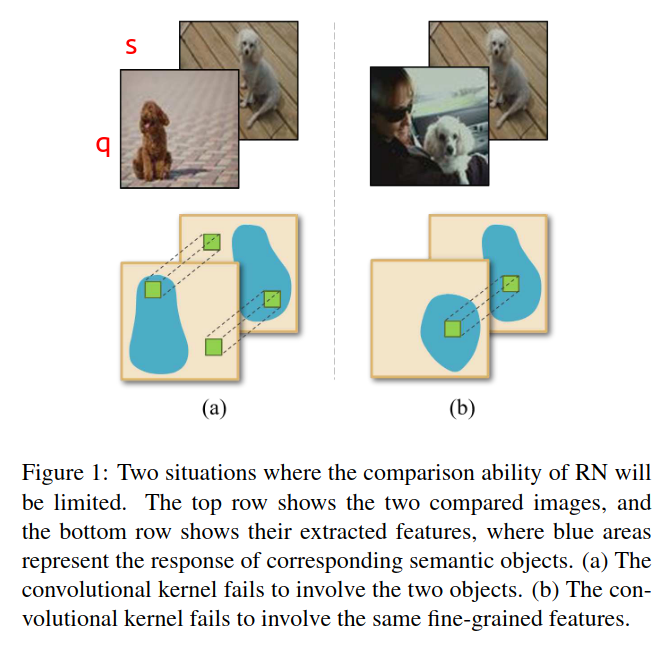
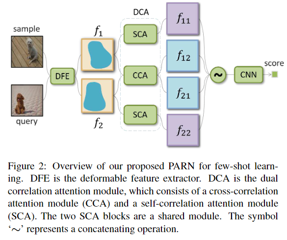
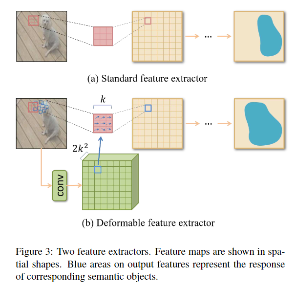
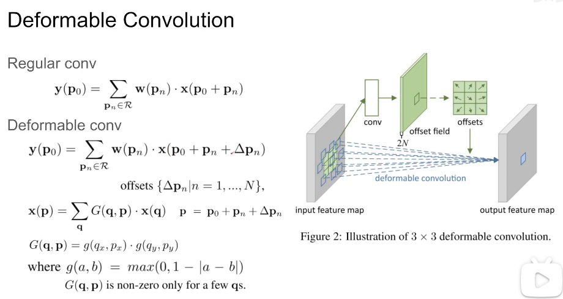
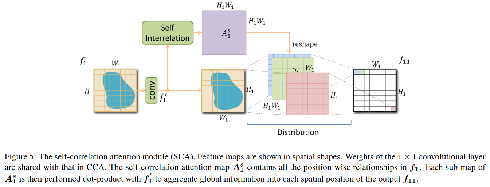
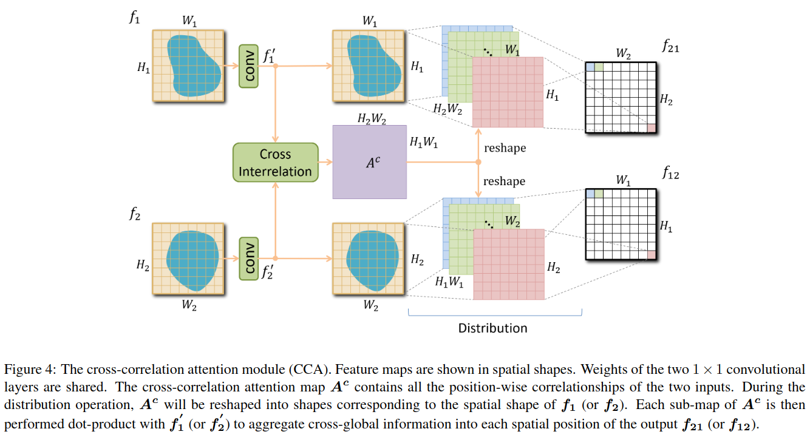

## PARN: Position-Aware Relation Networks for Few-Shot Learning

来源：ICCV2019

作者：Ziyang Wu 华南理工大学

论文：[[thecvf](https://openaccess.thecvf.com/content_ICCV_2019/papers/Wu_PARN_Position-Aware_Relation_Networks_for_Few-Shot_Learning_ICCV_2019_paper.pdf)]

代码：[[github](https://github.com/eezywu/PARN)]

引用数：80

### 创新点

- DFE：deformable feature extractor，提取更有效的特征。
- DCA：dual correlation attention mechanism ，解决 RN 在下图中的两个问题。

（a）语义对象的空间位置完全不同，（b）空间位置相同了，但是细粒度特征不相同（q狗的身子对应s狗的头）。

RN 是把q和s拼到一起，让网络去学习q和s之间的关系，从而解决上面两个问题。

这个论文，提供了更高效的特征提取器，更鲁棒的深度度量网络，解决上述问题。改进 RN ，让 RN 能获得不同空间位置的细粒度特征之间的关系。



### 方法

- 方法总览

  

- DFE

  参考：[[知乎](https://zhuanlan.zhihu.com/p/52476083)] [[B站](https://www.bilibili.com/video/BV1C94y1272t)]

  
  
  [[原论文](http://openaccess.thecvf.com/content_ICCV_2017/papers/Dai_Deformable_Convolutional_Networks_ICCV_2017_paper.pdf)]中对Deformable Convolutional 的解释：[[笔记](/home/mkid/Typora/深度学习/经典的模型和机制/3.Deformable Convolutional Networks.md)]
  
  
  
  
  
  **代码实现**
  
  ```python
  
  ```
  
  q列举了特征图x中的所有积分空间位置


- Self-correlation attention module

  

- Cross-correlation attention module

  

