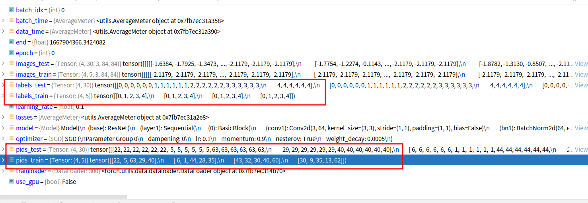
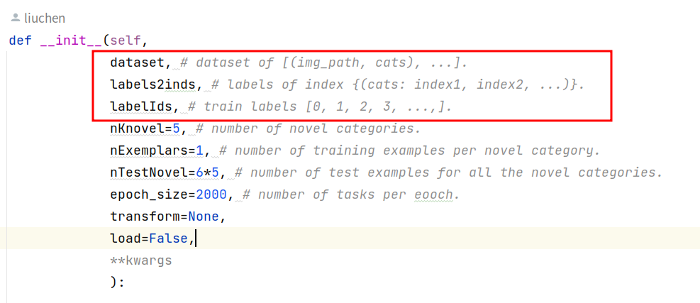
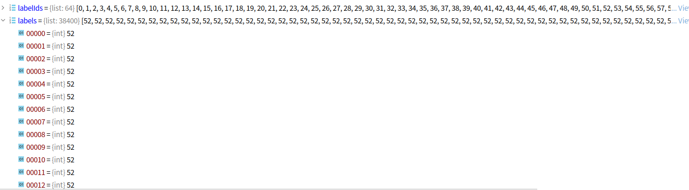
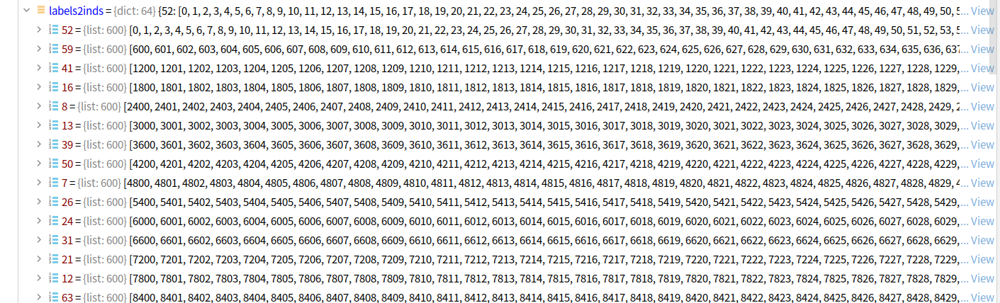
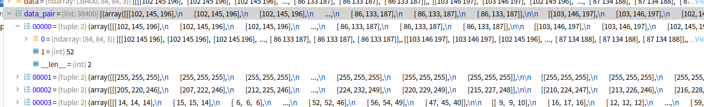
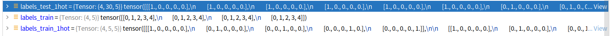
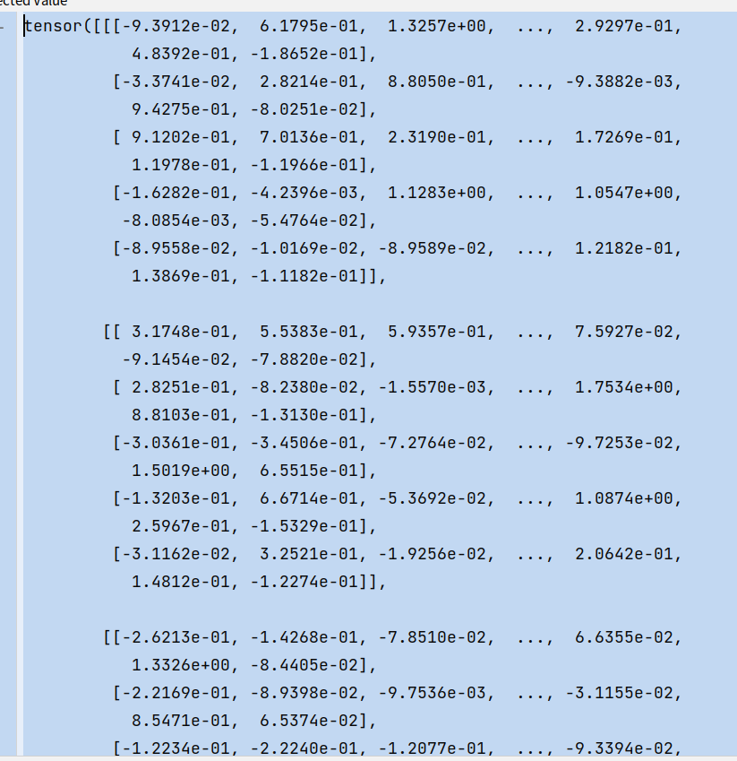
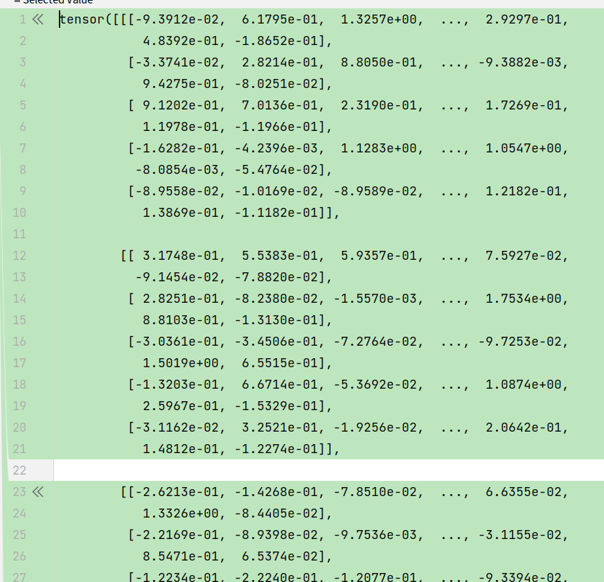
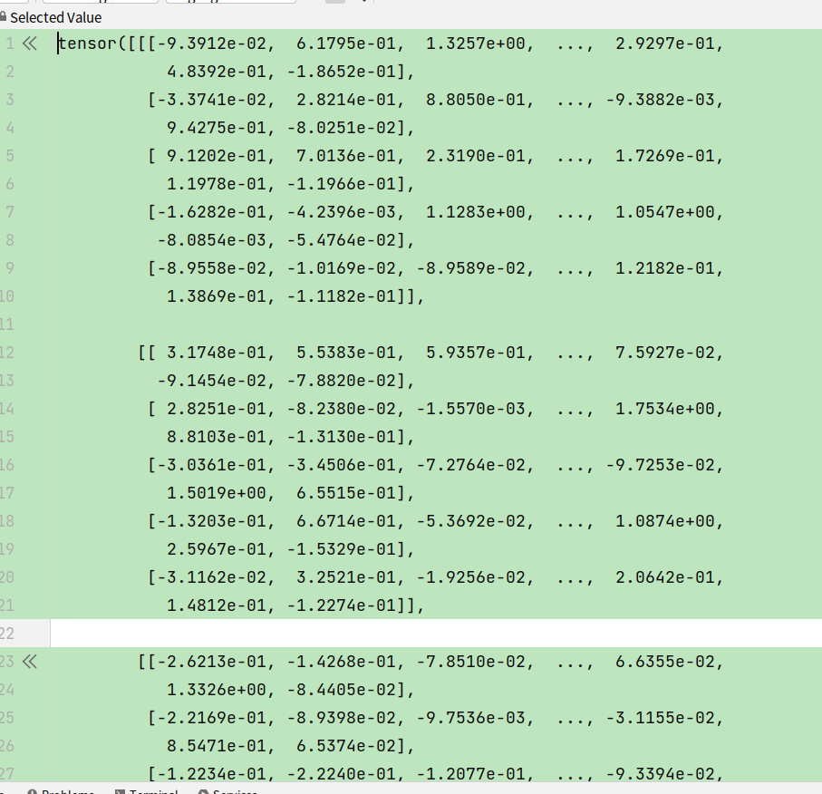

## Learning a Few-shot Embedding Model with Contrastive Learning

来源：AAAI2021

作者：复旦大学脑科学MOE Frontiers Center，腾讯YouTu实验室

下载：[https://www.aaai.org/AAAI21Papers/AAAI-2249.LiuC.pdf](https://www.aaai.org/AAAI21Papers/AAAI-2249.LiuC.pdf)

代码：[https://github.com/corwinliu9669/Learning-a-Few-shot-Embedding-Model-with-Contrastive-Learning](https://github.com/corwinliu9669/Learning-a-Few-shot-Embedding-Model-with-Contrastive-Learning)

关键词：==InfoPatch==


### 摘要

- 训练few-shot embedding model，使用对比学习的监督的NCE损失。
- 提出新的对比训练方案，InfoPatch，挖掘patch之间的关系，改善infoNCE。
- 证明了InfoPatch是有效的。
- 在下游识别任务中达到了SOT(MiniImagenet)，不错的效果(tieredImageNet, FC-100)。


### 介绍

此外，原则上，embedding不应该通过存储的训练数据来学习source class的归纳偏差，因为这可能会破坏这种embedding的泛化性能。

目前对比学习的关键是，选择更好的正负样本对。

为了在embedding空间选择更好的样本对，作者提出了一个生成hard example的策略。

人类可以只看图片中的一部分，识别图片的种类。作者通过随机block调图片的一部分，模拟这种想法。

- **support里的图片随机block一部分，query的图片分成了patch(split with grid)。**

- 为了避免模型学到source class里的归纳偏置，比如：马和草在一张图片中同时出现的情况是很常见的，那么模型可能就会学到把草和query里马的图片匹配到一起。为了避免这种情况，作者提出了**PatchMix**的方法(下图)。


### 方法


#### 问题定义

基本的小样本分类问题，把数据分成训练，验证，测试集。做5-way 1-shot和5-way 5-shot的任务。query images的数量是 $n_q$ 。

##### Baseline

[few-shot baseline，Am](https://github.com/amazon-science/few-shot-baseline/)

使用监督与训练重建baseline：[An Embarrassingly Simple Baseline to One-Shot Learning.(2020 CVPR)](https://openaccess.thecvf.com/content_CVPRW_2020/papers/w54/Liu_An_Embarrassingly_Simple_Baseline_to_One-Shot_Learning_CVPRW_2020_paper.pdf)，[A baseline for few-shot image classification.(ICLR,2020)](https://arxiv.org/abs/1909.02729)。上述两篇论文中，作者猜测监督预训练在FSL上的效果会非常好。特别地，上述这些方法通常在source classes上用一个分类器(交叉熵损失)训练网络。网络用于提取target classes中的特征。由于方法比较简单，这篇文章使用上述的工作作为baseline。

- 上述两篇论文中的损失

  - An Embarrassingly Simple Baseline to One-shot Learning（同一个作者）

    

##### InfoPatch

为了提高baseline的embedding的表征能力，提出InfoPatch，包含两个部分：

- 把infoNCE改成了FSL形式，利用扩增的方法挖掘hard sample。
- 数据扩增技术，PatchMix。

#### Episodic contrastive learning

变量的定义：

**episode**包含一组数据：$N \times k$ 的support set，$N \times n_q$ query set。support 和 query 里的样本表示为 $x^s$ 和 $x^q$。标签是 $y^s$ 和 $y^q$ 。

$\Phi$ 是embedding网络(ResNet12)。embedding网络的输入输出的张量形状分别是 $C_{in} \times H_{in} \times W_{in}$ 和 $C_{out} \times H_{out} \times W_{out}$ 。训练过程都是N-way k-shot的任务。

把embedding 网络 $\Phi$ 记为 $f$ 。$f^q$ 和 $f^s$ 分别是query 和 support的映射输出。在对比学习中，还要把这两个特征做归一化。作者使用了Baseline第一篇论文中提到的方法做归一化。

##### Training phase

为每个query样本构建对比对。训练和测试构建的方法一样。

对每个query样本 $x_i^q$ ，support set同类是正样本，不同类的是负样本。query 和 support 使用相同的embedding 网络 $\Phi$ 。

<span id='local_loss'>第 $i$ 个query样本 $x_i^q$ 的infoNCE：</span>
$$
L_i = - \log  \frac{\sum\limits_{y_j^s = y_i^q} e^{f_j^s f_i^q}}{\sum\limits_{y_j^s = y_i^q} e^{f_j^s f_i^q} + \sum\limits_{y_k^s \neq y_i^q} e^{f_k^s f_i^q}} \\
\tag{1}
$$
$f_j^s f_i^q$ 是两个特征向量的内积。训练一个episode的损失是所有样本的平均：$L = \sum\limits_{i=1}^{N \times n_q}L_i $ 。

在训练中，作者把baseline中的监督损失和infoNCE组合到了一起，比例分别是 1，0.5。

##### Testing phase

support set 有标签，query set 没标签。

对每个query 样本，计算它和所有support样本的内积。测试中，$\Phi$ 的参数冻结。$ f_i^q $ 是query样本的特征，计算过程如下：
$$
j^* = \arg \max_j f_i^q f_j^s \\
\tag{2}
$$
那么，预测结果是：$\hat{y}_i^q = \hat{y}_{j^*}^q $ 。


#### 构建hard samples

[Contrastive Multiview Coding](https://arxiv.org/abs/1906.05849)中提出对比学习的关键是找到hard samples。挖掘hard samples的好方法就是强迫模型学习更又用的信息。只使用图片中的一部分可以让模型学到更有用的信息。所以在episode式训练过程中，要修改输入，support 和 query 的修改方法是：

- random block：随机的mask调一些图像块。(Fig.1)

- 使用网格把query分成patches。

  对每个query样本 $x_i^q$ ，它每个patch $wh_{th}$ 的向量表示为 $f_{iwh}^q$，每个向量都有query样本的一部分信息。为了完全学到像素之间的联系，作者仍然把整张图片送进了embedding 网络(即图一中的grid之前的输入)。损失函数做小修改：
  $$
  L_{iwh} = - \log  \frac{\sum\limits_{y_j^s = y_i^q} e^{f_j^s f_{iwh}^q}}{\sum\limits_{y_j^s = y_{iwh}^q} e^{f_j^s f_i^q} + \sum\limits_{y_k^s \neq y_i^q} e^{f_k^s f_{iwh}^q}} \\
  \tag{3}
  $$
  整个损失：$L = \sum\limits_{i=1}^{N \times n_q} \sum\limits_{w=1}^{W} \sum\limits_{h=1}^{H} L_{iwh} $，这里W是横着有几个patch，H是竖着有几个patch。

#### 使用PatchMix提高对比学习的性能

实现：随机mix图像patches。使用了和[TapNet: Neural Network Augmented with Task-Adaptive Projection for Few-Shot Learning](https://arxiv.org/abs/1905.06549)中的**Cutmix**相似的实现方法。PatchMix在一个episode之内执行。为了减少噪声，只在query中进行mix。

实现细节：在每个episode中，每个 $x_i^q$ 都随机选一个box $(w_1, h_1, w_2, h_2)$(Fig.1 左上角的box)。选取box的实现类似于Cutmix。把 $x_i^q$ 中的一个patch替换成  $x_k^q$ 中的patch：
$$
x^q_i[w_1 : w_2, h_1 : h_2] = x^q_k[w_1 : w_2, h_1 : h_2] \\
\tag{4}
$$
Patch和Cutmix的区别在mix之后。Cutmix之后使用交叉熵损失训练。PatchMix进行对比学习，并为每个patch分配了label。


#### 两个loss的代码实现

- 第一个loss：

  把support和query set进行cat操作之后，送进embedding network（resnet12），然后把得到的嵌入向量（support+query）送进线性分类器（Conv2d或者Linear实现都行），得到分类分数，然后送进损失计算函数（patch_loss_global）。

  在进行交叉熵计算时，先做了如下操作：

  - 把input展平，(140, 64, 11, 11) -> (16940, 64)
  - target：把suport和query的标签分别展平，并cat到一起，(4,5) (4,30,11,11)  -> (4,5,11,11) (14520)  -> (2420) + (14520) -> (16940）

  然后计算CrossEntropyLoss(input, target)。

  特点：计算了query中所有mix之后每个grid（11 x 11）的交叉熵损失。<font color=#87CEFA>计算过程中，support里的样本也参与了计算（前4x5x11x11=2420），但是support并没有经过patchmix和block处理，即support里的grid的标签还是原图像的标签。</font>

- 第二个loss：

  这个实现和第一个loss函数里面的实现一样，不过这个里面只算了query的交叉熵损失。

  但是在送进损失计算（path_loss_local）之前，在模型的forward的时候要做如下操作，来得到[上述损失](#local_loss)中的两个矩阵相乘的结果：

  - （reform）先把support set的维度扩展到和query set一样，为了计算后面query和prototype相似度时，维度一样
  - 构建对比损失infoNCE前，要先把输入归一化
  - 把归一化后的support和query向量相乘，然后在dim=3维相加，把512维消掉，目的是匹配标签的size
  - scale_cls=7值是计算网络输出的一个常数，其他地方没有用到。

  这里support是经过block处理的，后面计算损失时，query经过了patchmix。

  对比损失infoNCE的计算可以解释为：

  ```python
  # 记query和support prototype的距离为dist
  dist = ftest_norm * ftrain_norm
  ```

  
  $$
  L_i = - \log  \frac{\sum\limits_{y_j^s = y_i^q} e^{f_j^s f_i^q}}{\sum\limits_{y_j^s = y_i^q} e^{f_j^s f_i^q} + \sum\limits_{y_k^s \neq y_i^q} e^{f_k^s f_i^q}} \\
  \tag{1}
  $$
  那么根据dist和当前query的标签值：
  $$
  记dist_{i} = f^s_j f^q_j，即query离得最近的prototype，	\\
  记dist_{all}是和所有prototype的距离。	\\
  那么一个query的损失	\\
  L_i = -\log \frac{e^{dist_i}}{\sum dist_{all}}
  $$
  
  代码实现就是：
  
  ```python
  loss_local = CrossEntropyLoss(距离矩阵, labels)	# 交叉熵会根据label选择离的最近的索引
  ```
  


#### 准确率的计算

testloader：2000*16（16：support 1张 + query 15张）

在test过程中，模型做完reform操作之后，就单独进入模型的test逻辑。

- model: forward_test
  - 对query做GAP
  - 对support和query做归一化
  - 和上述损失一样，返回query和prototype的距离

- 每10个epoch对2000个任务里的acc取平均，当作每10个epoch的准确率


### 实验

- Dataset and setting

  tieredImageNet和miniImageNet里的图片尺寸调整为84x84，FC100调整为32x32。训练阶段的数据扩增：水平翻转，随机剪裁。

- Implementation details

  ResNet12是模型结构(细节：[TADAM: Task dependent adaptive metric for improved few-shot learning](https://arxiv.org/abs/1805.10123))。初始化模型：[he-nomal何凯明](Delving Deep into Rectifiers: Surpassing Human-Level Performance on ImageNet Classification)。SGD，初始lr=0.1，miniImageNet在12000,14000,16000个episode下降，tieredImageNet每24000减半。所有实验都测试了2000个episode。训练时，每个batch，4个episode。


### 代码(MiniImageNet)

main.py的命令行选项：

运行：`...`

```json
// 数据集
-d/--dataset: 'miniImageNet',
-load: '是否已经加载了图片'
-j/--workers: 4,
--height: 84,
--width: 84,

// 优化器
--lr: 0.1,
--weight-decay: 5e-04,
--max-epoch: 90,
--start-epoch: 0, // 用来恢复训练
--stepsize: [60], // 衰减lr的位置
--LUT_lr: [(60, 0.1), (70, 0.006), (80, 0.0012), (90, 0.00024)], // 衰减多次lr
--train-batch: 4,
--test-batch:4,

// 结构设置
--num_classes: 64,
--scale_cls:7,

// 路径
--save-dir: './mini_final_5shot/',
--resume: '',
--gpu-devices: 0,

// FSL设置
--nKnovel: 5,	// novel class的数量
--nExemplars: 1,  // 每个novel class中训练样本的数量
--train_nTestNovel: 6*5, // 训练时，所有novel class的测试样本数(每个novek class6个样本)
--train_epoch_size: 1200, // 训练时，每个epoch中，batches的数量
--nTestNovel: 15*5, // 所有novel class的测试样本数
--epoch_size: 2000, // 每个epoch中，tasks的数量


```


代码运行的一些数据



















