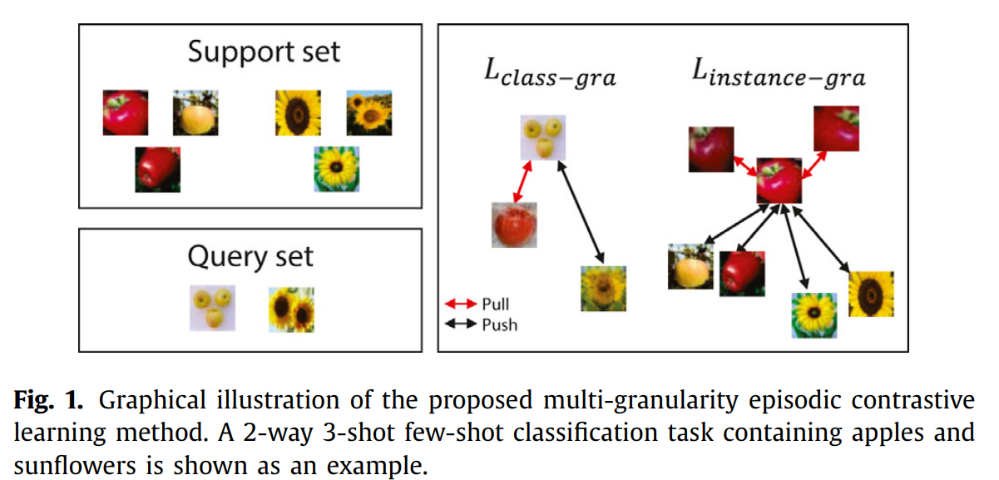
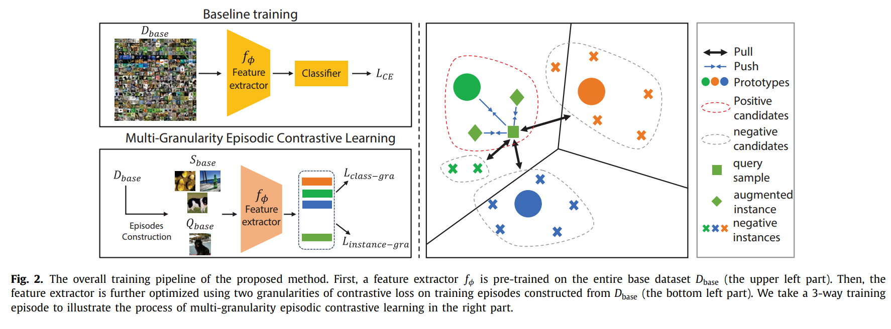
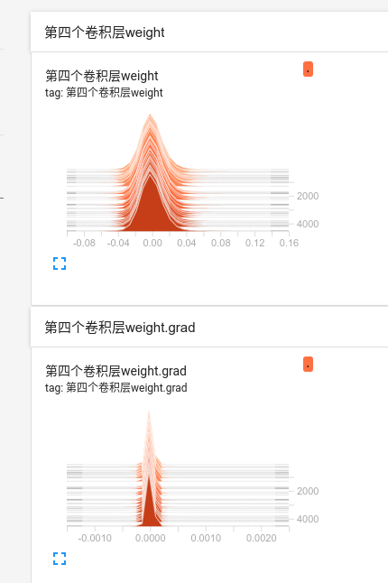

# Multi-granularity episodic contrastive learning for few-shot learning

来源：ScienceDirect

作者：天津大学

下载：[https://www.sciencedirect.com/science/article/pii/S0031320322003016](https://www.sciencedirect.com/science/article/pii/S0031320322003016)

代码：[https://github.com/z1358/MGECL_PR](https://github.com/z1358/MGECL_PR)


### 摘要

为了获取更好的特征表征能力，提出了MGECL(多粒度对比学习方法)，把对比学习引入了episode形式的训练中。特别地，作者的模型可以学出更好的分类模式，学到更好的特征表征，通过作者提出的在类和样本粒度上的对比损失。

### 介绍

介绍了FSL最近的发展。

FSL现在存在的两个问题：

- 大多数现存的方法使用交叉熵损失函数，它在遇到没见过的类时，表现不好。
- 现在的meta-learning方法，大多强调不同类prototype的差异，忽略了一个类内不同样本之间的差异，导致失去很多信息。

提出了两个损失：

- class-granularity contrastive loss：不同类prototype之间的损失。
- instance-granularity contrastive loss：同一类内不同样本之间的损失。



### 3 方法

#### 3.1 问题定义

meta-learning形式划分数据集和任务。一个任务里包含一个support set和一个query set。

#### 3.2 迁移学习baseline

> [A Baseline for Few-Shot Image Classification](https://arxiv.org/abs/1909.02729v5) : Fine-tuning a deep network trained with the standard cross-entropy loss is a strong baseline for few-shot learning.

首先在 $D_{base}$ 上用一个分类器对网络 $f_{\Phi}$ 进行预训练，$\Phi$ 是网络参数。
$$
\Phi = \arg \min \mathcal{L}_{\mathrm{CE}}(D_{base}; \Phi) \\
\tag{1}
$$
$\mathcal{L}_{\mathrm{CE}}$ 是交叉熵损失。训练完固定网络的参数 $\Phi$ ，在 $D_{novel}$ 上当一个embedding模块，把输入的图像映射到嵌入空间。


#### 3.3 Multi-granularity episodic contrastive learning

[Spatial Contrastive Learning for Few-Shot Classification](https://arxiv.org/abs/2012.13831) 提出交叉熵损失可能会迫使网络学到base classes中的特征信息，忽略了一些对泛化有用的特征。为了捕获特征之间的区别，作者提出了两个颗粒对比损失。在 $f_{\Phi}$ 嵌入之后，需要做一个默认的归一化。

整体流程：



##### 3.3.1. Class-granularity contrastive loss

首先计算每个support set里的prototype：(直接算平均)
$$
W_c = \frac{1}{K} \sum\limits_{(x^s_i,y^s_i) \in S \cap y^s_i = c}z^s_i \\
\tag{2}
$$
然后对于每个输入的query样本 $x^q_i$ 就可以组成一个三样本对 $(z^q_i, w_{li}, w_j)$ ，它们分别表示，$x^q_i$ 经过 $f_{\Phi}$ 的输出，$x^q_i$ 所属的prototype作为正样本，不属于的类作为负样本。然后就可以使用这个损失优化 $f_{\Phi}$ ：


其中，$|Q|$ 是qurey set的大小，$[\cdot]$ 表示 $max(0, \cdot)$ 。这个损失限制了，与正样本之间的相似分数高，负样本低。

##### 3.3.2. Instance-granularity contrastive loss

同类内不同样本之间的差异性。作者提出了这个损失，通过最大化原图像和其DA版本之间的相似度(SimCLR)。让 $\{i_+\}$ 和 $\{i_-\}$ 分别当作support样本 $x^s_i$ 的正负样本集。$sim(\cdot)$ 是内积相似度。损失公式：


其中 $\tau$ 是超参数。

样本 $x^s_i$ 的所有正样本就是本身和其DA版本，所有负样本是除此之外的所有样本和它们的DA版本。 

<font color= #87CEFA>是不是可以把上面的损失优化成：</font>
$$
\mathcal{L}_{instance-gra} = - \sum\limits^{|S|}_i \sum\limits_{j \in \{i_+\}} \log \frac{\exp(sim(z^s_i, z_j) / \tau)}{\sum_{k \in \{i_+\} \cup \{i_-\}}\exp(sim(z^s_i, z_j) / \tau)}	\tag{4}
$$


##### 3.3.3. Overall objective


训练完成后，$f_{\Phi}$ 的参数 $\Phi$ 固定，在meta-testing阶段当作embedding模块。


#### 3.4. Meta-testing phase

首先从 $D_{novel}$ 中给一个任务 $(S^t_{novel}, Q^t_{novle})$，然后训练一个线性分类器 $f_{\theta}$ ，根据S推出Q的类别。


这里的线性分类器是一个多元逻辑回归模型。对每个task，线性分类器都要重新初始化，然后在这个task上的support重新训练。

### 实验

- 数据集

  miniImageNet，tieredImageNet，FC100。每个数据集都分成了train，val，test。

- 网络结构

  embedding模块使用ResNet-12，每个残差块后都有一个2x2的最大池化层，网络的最后跟一个全局平均池化层，然后输出嵌入向量。

- 实现细节

  **baseline training：**

  ```json
  SGD(momentum=0.9, w_d=5e-4)
  DA:random crop, color jittering and random horizontal flip
  lr=0.05, decay=0.1
  batch_size=64
  // FC100，第60个epoch下架lr
  epochs=65
  // tiered，第30个epoch下降lr三倍
  epoc=60
  // mini
  epoch=400
  ```

  **meta-training**：

  ```json
  SGD一样
  lr = 5e-4
  N-way k-shot 15query
  // instance-granularity
  DA(SimCLR): random crop, color jittering, random horizontal flip and random grayscale conversion
  // tiered,mini
  τ = 0.1
  // FC100
  τ = 1.0
  // final loss function
  λ = 1.0
  ```
  
  **meta-testing**
  
  使用l2归一化的特征训练线性分类器。

###  结论

引入对比学习来补偿交叉熵损失的缺点，让特征学到的信息更多，更具迁移性。

未来的方向：挖掘hard examples，训练的时候可以多使用图像的局部信息。

### 代码实现

根据上面的网络图：在MGECL训练的过程中，不需要baseline中的分类器，只需要之前的层用来提取特征。然后用特征训练 $f_{\Phi}$ ，让它得到更好的特征。

- class_gra_loss

  ```python
  # 1-shot
  def loss_class_gra(model_out, support_labels, query_labels, args):
      support_features = model_out[:args['way']]  # (5,640)
      query_features = model_out[args['way']:]    # (75,640)
      # prototypes = support_features
      '''构建triple tuple(query, 同类proto, 多个不同类proto)'''
      triple_list = []
      for i in range(query_features.shape[0]):
          # 为第i个query构建三元组
          label_query_i = query_labels[i]
          same_support_index = support_labels[label_query_i == support_labels]
          not_same_support_index = support_labels[label_query_i != support_labels]
          query_i = query_features[i].reshape(1, query_features.shape[1])
          triple_tuple = torch.cat([query_i, support_features[same_support_index], 				           support_features[not_same_support_index]], dim=0)  # (6,640)
          triple_list.append(triple_tuple)
      triple_stack = torch.stack(triple_list, dim=0)  # (75,6,640)
      '''计算损失,三元组的第一项是query，第二项是同类proto，接下来的四项是不同类proto'''
      alpha = args['loss_class_gra_alpha']
      loss_i_list = []
      for i in range(triple_stack.shape[0]):
          query, same, not_same = triple_stack[i][0], triple_stack[i][1], triple_stack[i][2:]
          loss_i = torch.matmul(query, same.T) + torch.matmul(query, not_same.T) + alpha
          loss_i = torch.sum(loss_i[loss_i > 0])
          loss_i_list.append(loss_i)
      loss = torch.sum(torch.tensor(loss_i_list))
      return loss
  ```

- loss_instance_gra

  论文[SimCLR](https://arxiv.org/pdf/2002.05709.pdf)中的DA具体操作是：在进行对比损失（infoNCE）计算之前，不要当前的样本 $x$ 了，只要它的两个DA版本 $\tilde{x}_i,\tilde{x}_j$ ，把一个大小为N的batch变成 2N，在这2N个样本上，两两做infoNCE计算。

  那么，在本篇论文的小样本对比学习代码实现中，暂定这样的步骤：

  - 得到一个 5-way 1-shot 的任务

  - 根据论文中的框架图，不忽略的当前的样本 $x^s_i$ ，额外SimCLR中的DA方法复制5个版本 $\tilde{x}_i*5$ 。

  - 每个类都做上一步的操作，那么一个 5-way 1-shot 的support set最后的组成是：
    $$
    support\ set = 
    \begin{cases}
    0:x_0, \tilde{x}_0*5	\\
    1:x_1, \tilde{x}_1*5	\\
    ...	\\
    4:x_4, \tilde{x}_4*5
    \end{cases}
    $$

  拿第1个类里的样本计算infoNCE的就是（$\exp,\tau$ 省略没写，）：
  $$
  \mathcal{L}_{s_1} = -\log \frac{sim(x_1, \tilde{x}_1*5)}
  	{sim(x_0, \tilde{x}_0*5) + sim(x_1, \tilde{x}_1*5) + ...+ sim(x_4, \tilde{x}_4*5)}
  $$
  那么一个 5-way 1-shot 的任务的损失就是：
  $$
  \mathcal{L}_{instance-gra} = \mathcal{L}_{s_0} + \mathcal{L}_{s_1} + ...+ \mathcal{L}_{s_4}
  $$

  - 代码实现（参考SimCLR的损失实现）

    使用相似矩阵。similarity_matirx
    
    ```python
    
    ```
    
    

  

- 验证过程LR分类器的实现
  - 手写线性层
  - 使用sklearn.linear_model的LogisticRegression：[embarrassingly-simple-baseline中LR的实现](https://github.com/corwinliu9669/embarrassingly-simple-baseline/blob/master/test_pretrain_model_with_prune.py#L109)

### 代码实现过程中遇到的问题

- 加载了RFS里面的预训练模型之后，网络损失不下降。

  在损失反向传播时，到resnet12的第4个layer的第一个卷积层，梯度几乎为0。

  

- 参考[A Baseline for Few-shot Image Classification](/home/mkid/桌面/A/论文/对比小样本学习/A Baseline for Few-shot Image Classification.pdf)中的代码，重新训练resnet12。

- 参考RFS[10]中的代码，先训练RFS中的模型，先把梯度降下来再说。

  RFS和本篇论文中的不同：

  - 微调的时候RFS用的交叉熵
