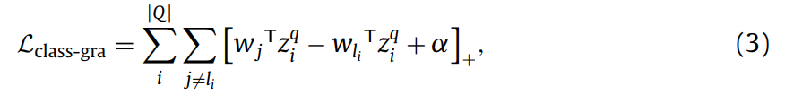
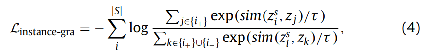
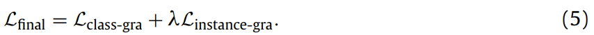
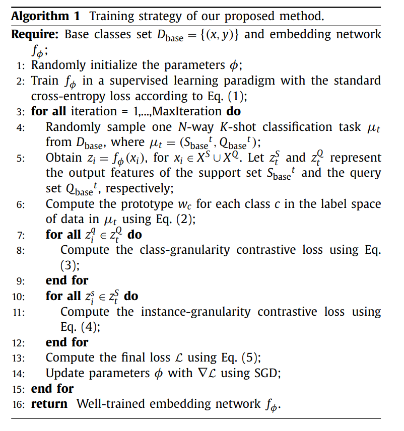
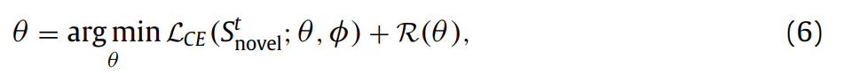

# Multi-granularity episodic contrastive learning for few-shot learning

来源：ScienceDirect

作者：天津大学

下载：[https://www.sciencedirect.com/science/article/pii/S0031320322003016](https://www.sciencedirect.com/science/article/pii/S0031320322003016)

代码：[https://github.com/z1358/MGECL_PR](https://github.com/z1358/MGECL_PR)


### 摘要

为了获取更好的特征表征能力，提出了MGECL(多粒度对比学习方法)，把对比学习引入了episode形式的训练中。特别地，作者的模型可以学出更好的分类模式，学到更好的特征表征，通过作者提出的在类和样本粒度上的对比损失。

### 介绍

介绍了FSL最近的发展。

FSL现在存在的两个问题：

- 大多数现存的方法使用交叉熵损失函数，它在遇到没见过的类时，表现不好。
- 现在的meta-learning方法，大多强调不同类prototype的差异，忽略了一个类内不同样本之间的差异，导致失去很多信息。

提出了两个损失：

- class-granularity contrastive loss：不同类prototype之间的损失。
- instance-granularity contrastive loss：同一类内不同样本之间的损失。


### 3 方法

#### 3.1 问题定义

meta-learning形式划分数据集和任务。一个任务里包含一个support set和一个query set。

#### 3.2 迁移学习baseline

> [A Baseline for Few-Shot Image Classification](https://arxiv.org/abs/1909.02729v5) : Fine-tuning a deep network trained with the standard cross-entropy loss is a strong baseline for few-shot learning.

首先在 $D_{base}$ 上用一个分类器对网络 $f_{\Phi}$ 进行预训练，$\Phi$ 是网络参数。
$$
\Phi = \arg \min \mathcal{L}_{\mathrm{CE}}(D_{base}; \Phi) \\
\tag{1}
$$
$\mathcal{L}_{\mathrm{CE}}$ 是交叉熵损失。训练完固定网络的参数 $\Phi$ ，在 $D_{novel}$ 上当一个embedding模块，把输入的图像映射到嵌入空间。


#### 3.3 Multi-granularity episodic contrastive learning

[Spatial Contrastive Learning for Few-Shot Classification](https://arxiv.org/abs/2012.13831) 提出交叉熵损失可能会迫使网络学到base classes中的特征信息，忽略了一些对泛化有用的特征。为了捕获特征之间的区别，作者提出了两个颗粒对比损失。在 $f_{\Phi}$ 嵌入之后，需要做一个默认的归一化。

整体流程：


##### 3.3.1. Class-granularity contrastive loss

首先计算每个support set里的prototype：(直接算平均)
$$
W_c = \frac{1}{K} \sum\limits_{(x^s_i,y^s_i) \in S \cap y^s_i = c}z^s_i \\
\tag{2}
$$
然后对于每个输入的query样本 $x^q_i$ 就可以组成一个三样本对 $(z^q_i, w_{li}, w_j)$ ，它们分别表示，$x^q_i$ 经过 $f_{\Phi}$ 的输出，$x^q_i$ 所属的prototype作为正样本，不属于的类作为负样本。然后就可以使用这个损失优化 $f_{\Phi}$ ：



其中，$|Q|$ 是qurey set的大小，$[\cdot]$ 表示 $max(0, \cdot)$ 。这个损失限制了，与正样本之间的相似分数高，负样本低。

##### 3.3.2. Instance-granularity contrastive loss

同类内不同样本之间的差异性。作者提出了这个损失，通过最大化原图像和其DA版本之间的相似度(SimCLR)。让 $\{i_+\}$ 和 $\{i_-\}$ 分别当作support样本 $x^s_i$ 的正负样本集。$sim(\cdot)$ 是内积相似度。损失公式：



其中 $\tau$ 是超参数。

样本 $x^s_i$ 的所有正样本就是本身和其DA版本，所有负样本是除此之外的所有样本和它们的DA版本。 

##### 3.3.3. Overall objective



训练完成后，$f_{\Phi}$ 的参数 $\Phi$ 固定，在meta-testing阶段当作embedding模块。



#### 3.4. Meta-testing phase

首先从 $D_{novel}$ 中给一个任务 $(S^t_{novel}, Q^t_{novle})$，然后训练一个线性分类器 $f_{\theta}$ ，根据S推出Q的类别。



这里的线性分类器是一个多元逻辑回归模型。对每个task，线性分类器都要重新初始化，然后在这个task上的support重新训练。

### 实验

- 数据集

  miniImageNet，tieredImageNet，FC100。每个数据集都分成了train，val，test。

- 网络结构

  embedding模块使用ResNet-12，每个残差块后都有一个2x2的最大池化层，网络的最后跟一个全局平均池化层，然后输出嵌入向量。

- 实现细节

  **baseline training：**

  ```json
  SGD(momentum=0.9, w_d=5e-4)
  DA:random crop, color jittering and random horizontal flip
  lr=0.05, decay=0.1
  batch_size=64
  // FC100，第60个epoch下架lr
  epochs=65
  // tiered，第30个epoch下降lr三倍
  epoc=60
  // mini
  epoch=400
  ```

  **meta-training**：

  ```json
  SGD一样
  N-way k-shot 15query
  // instance-granularity
  DA(SimCLR): random crop, color jittering, random horizontal flip and random grayscale conversion
  // tiered,mini
  τ = 0.1
  // FC100
  τ = 1.0
  // final loss function
  λ = 1.0
  ```

  **meta-testing**

  使用l2归一化的特征训练线性分类器。

###  结论

引入对比学习来补偿交叉熵损失的缺点，让特征学到的信息更多，更具迁移性。

未来的方向：挖掘hard examples，训练的时候可以多使用图像的局部信息。