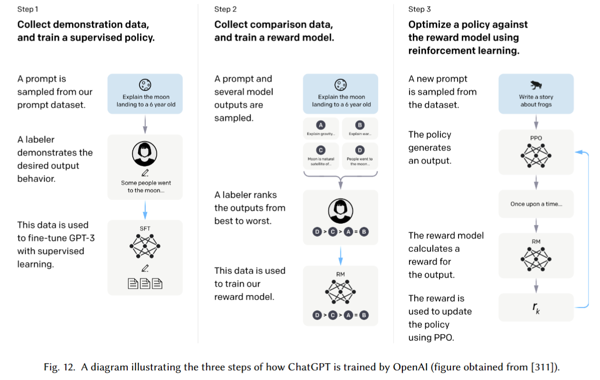

## A Complete Survey on Generative AI (AIGC): Is ChatGPT from GPT-4 to GPT-5

作者：CHAONING ZHANG（韩国庆熙大学、KAIST）

来源：谷歌学术，预印本

论文：[[arxiv](https://arxiv.org/pdf/2303.11717)]

代码：综述

引用数：26

参考：[]

关键词：AIGC

### 4.1 text to text

**chatbots** 对话系统（chatbots）的主要任务是提供人和机器之间更好的交流[85, 299]。对话系统可以分为两种：（1）特定任务的对话（TOD）[323, 502, 533]。（2）开放对话系统（OOD）[4, 532, 541]。特定任务系统例子：餐厅预订和订票 [533]。开放对话系统的例子：数据驱动的没有领域限制的跟人对话 [353, 533]。

**Task-oriented systems** TOD系统分为两种：模块化的、端到端的。模块化的有4个主要模块：自然语言理解（NLU）[395, 409]、对话状态跟踪（DST）[382, 462]、对话规则学习（DPL）[169, 483]、自然语言生成（NLG）[25, 99]。这4个模块目的是以可控的方式生成回答，并且每个模块可以被单独的优化。但是，一些模块是不能微分（优化）的，并且单个模块的优化可能不会对整个系统产生优化 [533]。

为了解决这个问题，端到端的方法要么就是训练一个端到端的pipeline，让每个模块可以微分（优化）[139, 162]，要么就再对话系统中使用单个的端到端模块 [==498==, 531]。

模块化的、端到端的系统都存在的问题：如何改进DST的效率 [208, 312]、如何再数据受限下提高端到端系统的生成质量 [145, 148, 282]。

**Open-domain systems** 开放对话系统不受领域限制 [353, 533]，可以分为3种类型：基于检索的系统、生成系统、集成（ensemble）系统 [533]。具体说，基于检索的系统能在语料库中找到现存的回答，生成系统能生成在训练集中没有的回答，集成系统把检索和生成集合在一起：要么选择两者中最好的回答，要么微调基于检索的回答并以生成的方式输出 [378, 533, 546]。

先前的工作从多个方面改进了开放域系统，包括对话上下文建模 [105, 181, 250, 282]、提高响应一致性 [9, 117, 251, 483]和多样性 [31, 211, 335, 408]。最近，ChatGPT（见图12）取得了前所未有的成功，也属于开放域对话系统的范围。除了回答各种问题外，ChatGPT还可以用于论文写作、代码调试、表生成等。

### text to text文献参考列表

[85]

[299]

[323]

[502]

[533]

[4]

[532]

[541]

[353]

[395]

[409]

[382]

[462]

[169]

[483]

[25]

[99]

[139]

[162]

[498]

[531]

[208]

[312]

[145]

[148]

[282]

[378]

[546]

[105]

[181]

[250]

[9]

[117]

[251]

[31]

[211]

[335]

[408]