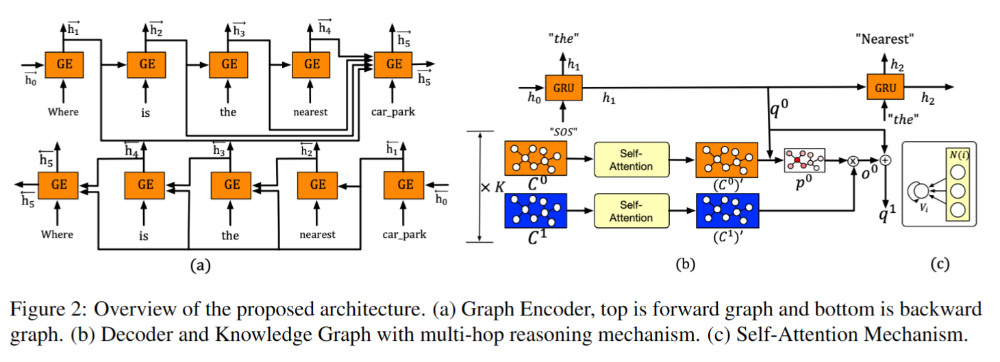

## GraphDialog: Integrating Graph Knowledge into End-to-End Task-Oriented Dialogue Systems
作者：Shiquan Yang（墨尔本大学）

来源：EMNLP2020

论文：[[arxiv](https://arxiv.org/pdf/2010.01447)]

代码：[]

引用数：38

参考：[]

关键词：对话系统、基于图的端到端的对话模型、图上的多条推理

#### 任务概述

### 结论

1. 提出了一个基于图的端到端的模型，有效地将外部知识库整合到面向任务的对话系统中。
2. 提出了一个新的循环神经单元架构，探索对话历史的图结构信息。结合图上的多跳推理能力探索知识库中实体之间的关系。
3. 在两个真实世界特定任务对话数据集（SMD和MultiWOZ 2.1）上做了测试，达到了SOAT的效果。

### 3. 方法

模型结构分成3部分：encoder、decoder、图上的多条推理能力。

通常，有一个序列的token： $X = \{x_1, \ldots, x_n\}$ ，$x_i \in X$ 代表对话历史中的一个单词。

我们首先得到一个对话图$\hat{G}$，它是对话历史X中事件的依赖解析图（dependency parsing graph），作为encoder的输入。encoder然后学习一个固定长度的向量，作为对话历史的表征（在$\hat{G}$上），这个向量随后输入到decoder作为隐状态的初始化。知识图谱用另一个图$G = \{V, E\}$来存储和检索外部的知识数据，其中$V$表示实体，$E$表示边。decoder生成系统回答$Y = \{y_1, \ldots, y_m\}$，生成是逐token生成的，生成方式要么是直接查询知识图谱从$G$中直接复制已有实体，要么从语料库中生成tokens。图2是模型的整体架构。

#### 3.1 图encoder

##### 3.1.1 对话图

为了能够学习具有各种关系的单词的语义丰富的表示，例如形容词和依赖关系，我们首先使用现成的工具[[spacy](https://spacy.io/)]来提取对话历史$X$中单词之间的依赖关系。图3给出了依赖项分析结果的示例。

单词之间的双向边缘允许信息从从属到头部以及从头部到从属。直觉是，应该允许主词的表征学习受到从属词的影响，反之亦然，从而允许学习过程捕捉主词和从属词之间的相互关系，以提供更丰富的表征。

我们通过将获得的依赖关系与单词之间的顺序关系（即Next和Pre）相结合来组成对话图，该顺序关系用作图编码器的输入。为了进一步支持双向表示学习，我们把得到的对话图分成了两个部分：前向图（从左到右）和后向图（从右到左）。

##### 3.1.2 循环神经单元结构

循环神经单元结构（图4）是图encoder进行计算的核心单元，它计算每个单词的隐状态。循环神经单元格根据对话历史中的单词顺序依次遍历对话图中的单词。

计算时间步$t$的隐状态$h_t$。$x_t$是时间步$t$的输入单词表征。$P(t) = \{p_1, p_2, \ldots, p_k\}$是$x_t$的一个先例（precedent）单词的集合，其中$p_i \in P(t)$表示$x_t$在对话图谱中对应的单词，$k$是$x_t$的总数。$H(t) = \{h_1, h_2, \ldots, h_k\}$是隐状态集合，其中，每个元素$h_j \in H$表示第$j$个先例$p_j \in P(t)$的隐状态。

循环神经单元的输入分为两部分：输入单词向量$x_t$，输入的先例隐状态$H$。首先，我们在$H$中的$k$个隐藏状态上循环，并为它们中的每一个计算重置门（reset gate）。计算第$j$个隐状态：

其中，$\sigma$是激活函数，$x_t$和$h_j$是当前输入、时间步$t$ 下的第$j$个先例的隐状态。$W_r$和$U_r$是要学习的参数。我们然后计算一个候选的隐状态：

其中，$\phi$是双曲正切函数（hyperbolic tangent function），$k$是单词$x_t$的先例的数量，$W_n$和$U_n$是要学习的参数矩阵。直觉上，$\widetilde{h_t}$是当前输入$x_t$的上下文表示。

接下来，我们把得到的候选隐状态$\widetilde{h_t}$和先例隐状态$H$组合到一起，并且使用一个masked注意力机制（等式6）去聚合两个状态，然后产生输入在时间步$t$隐状态$h_t$。为了得到更好的表征，我们首先给输入$x_t$和隐状态$h_j \in H$使用线性变换：

其中，$W_z$和$U_z$是要学习的参数，$t$是时间步，$H^{'} = \{h^{'}_1, h^{'}_2, \ldots, h^{'}_k\}$是线性变换过后的隐状态集合。然后我们把之前得到的候选隐状态$\widetilde{h_t}$加到$H^{'}$上，到得到$H^{''} = \{h^{'}_1, h^{'}_2, \ldots, h^{'}_k\, \widetilde{h_t}\}$。直觉上，输出的隐状态不仅取决于历史信息（$h^{'}_1$到$h^{'}_k$）和当前输入（$\widetilde{h_t}$）。

然后执行自注意力机制，$H^{''}$是key值，当前输入$x_t$是query值。直觉上，不同的输入（例如，不同的在$H^{''}$的先例）应该对隐状态$h_t$有不同的影响，并且我们希望模型能够去捕获到这些。然而，输入在不同的时间步可能有不同数量的先例。为了处理这个，受Transformer的影响，我们使用了一个masked注意力机制去学习每个时间步每个先例的重要性，因此避免了pad信息影响学习过程。attn计算：

其中，$v$是可学习的参数，$h_j^{'}$是$H^{''}$第$j$个向量，$\alpha_j$表示$H^{''}$中第$j$个向量的注意力权重，$[\cdot]_m$表示mask操作。在我们的实现中，我们把不用的token设置成了负无穷。最后，计算加注意力权重后的每个时间步的隐状态$h_t$：

直觉上，重置门控制当前时间步的信息流，从多个先例到隐状态。如果前一个字与当前输入字的相关性更强，则期望使前一个词的信息流过门以影响当前时间步长的表示。

##### 3.1.3 双向表示

为了得到对话历史的双向表示，使用3.1.2中的前向和后向结构来得到表征。前向表征$\overrightarrow{h_n}$和后向表征$\overleftarrow{h_n}$。然后把这两个特征聚合到一起形成最后的表征$h_n^e=[\overrightarrow{h_n};\overleftarrow{h_n}]$作为decoder的输入表征。

#### 3.2 知识图谱上的多跳推理

探索知识库中的图信息的一种简单方法是将知识库表示为图结构，然后使用解码器隐藏状态的注意力机制查询图（知识库）。然而，我们预先的实验用这种方法效果不好。我们推测，这可能是由于这种方法推理能力差。为了解决这个问题，我们用多跳推理机制扩展了图，旨在增强图的推理能力，并通过自注意捕捉实体之间的图结构信息。在下面的部分中，我们称之为知识图谱模块。

形式上，知识图模块包含两组可训练参数$C = \{C^1\, C^2, \ldots, C^{K+1}\}$，其中每个$C^k$是一个嵌入矩阵，将token映射到向量表示。$V = \{V^1, V^2, \ldots, V^{K+1} \}$，其中，每个$V^k$是用于计算自注意系数的权重向量，K是最大跳数。

现在我们描述如何计算知识图谱的输出向量。该模型在输入图上的$K$跳上循环。在每一跳$k$，一个query向量$q^k$当作读取头（reading head）。首先，模型使用嵌入层$C^k$的得到知识图谱中每个节点$i$的连续向量表示$C_i^k$，其中$C_i^k = C^k(n_i)$并且$n_i$是图谱中的第$i$个节点。然后我们对节点执行自注意机制：

其中，$\varphi $是LeakyReLU（with negative input slope $\alpha$ = 0.2），$V^k$是跳跃$k$处注意力机制的参数化权重向量，$C_i^k$和$C_i^k$是图谱中$k$跳的第$i$和第$j$个节点的节点表征。$\Vert$ 是concat操作。然后，我们使用softmax函数归一化每个节点$i$相对于其所有一阶邻居的系数：

其中，$N_i$是节点$i$的一阶邻居的数量（包括$i$）。

然后更新每个节点的权重：

接下来，使用查询向量$q_k$来关注图中的最新节点，在k跳计算每个节点的注意力权重：

为了得到知识图谱的输出，使用了相同的自注意力机制（等式8和9）和更新策略（等式10），到$C_i^{k+1}$。我们在这里使用$C_i^{k+1}$，因为采用了相邻加权平局策略。输出的更新节点表示表示为$(C_i^{k+1})^{'}$。一旦得到，模型读出图$o^k$：

然后query向量$q^k$更新：$q^{k+1} = q^k + o^k$。图谱最后的输出就是$o^K$，它将成为encoder输入的一部分。

##### 3.2.1 图构建

就是正常的构建知识图谱的方式。

在实现中，对话系统通常使用知识库（主要是关系数据库格式）来提供外部知识。我们将原始关系数据库转换为图结构，以利用知识库实体之间的关系信息。首先，我们找到关系数据库中的所有实体作为图的节点。然后，根据关系数据库中的记录，如果一对实体之间存在关系，我们将为它们分配一条边。从而可以获得图结构的外部知识。

#### 3.3 Decoder

使用标准的GRU逐单词的生成回答。初始的隐状态$h_0$有两个部分：graph encoder的输出和知识图谱的输出（外部知识库）。初始的query向量$q_0$是graph encoder输出的隐状态$h_n^e$  ，去查询外部知识库（知识图谱），并且得到输出$o^K$。初始隐状态：

在每个decoder时间步$t$，GRU取先前生成的单词$\hat{y}_{t-1}$和之前的隐状态$h_{t-1}$作为输入，然后生成一个新的隐状态$h_t$：

接下来，我们遵循（Wu et al.，2019b），decoder学习生成草图回答，即回答中的实体被某些标签替换。标签是从训练数据中提供的本体中获得的。隐状态$h_t$用于两个目的。第一个是在词汇表上的所有单词上生成词汇分布$P_{vocab}$：

$W_o$是可学习的参数。第二种方法是query知识图谱以生成图中所有节点上的图分布$P_{graph}$。我们使用知识图$p^K_t$最后一跳的注意力权重作为$P_{graph}$。

在每个时间步$t$，如果从$P_{vocab}$生成的单词（该词具有最大的后验概率）是标签（tag），然后decoder从$P_{graph}$中直接复制一个实体，该实体和从$P_{vocab}$里生成的单词注意力权重最大。否则，decoder将从$P_{vocab}$生成目标单词。训练过程中，是端到端的优化两个交叉熵损失：（1）$P_{vocab}$和$y_t \in Y$之间。（2）$P_{graph}$和$G_t^{Label}$之间，$G_t^{Label}$是与当前输出$y_t$相对应的节点id。

### 4. 实验

#### 4.1 数据集

Stanford multi-domain dialogue (SMD)、MultiWOZ 2.1。

SMD是一个用于车载导航任务的人-人数据集。它包括三个不同的任务域：兴趣点导航、日历调度和天气信息检索。

MultiWOZ 2.1数据集是最近发布的人与人对话语料库，具有更大的数据量和更丰富的语言表达，使其成为面向端到端任务的对话建模的更具挑战性的基准。它由七个不同的任务领域组成：餐厅、酒店、牵引、火车、医院、出租车和警察。