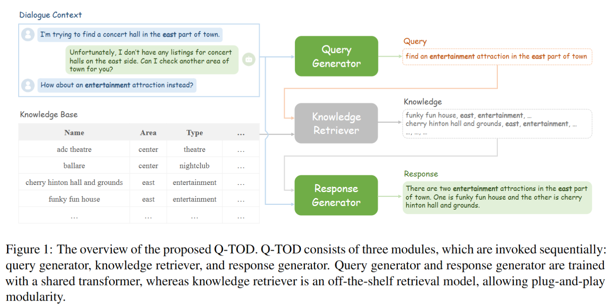
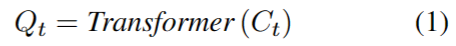
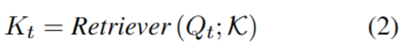
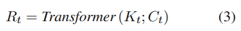
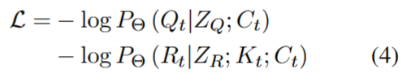
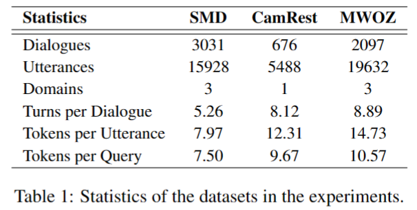

## Q-TOD: A Query-driven Task-oriented Dialogue System

作者：Xin Tian（百度）

来源：paperwithcode

论文：[[arxiv](https://arxiv.org/pdf/2210.07564v1.pdf)]

代码：[Q-TOD: [github](https://github.com/PaddlePaddle/Knover/tree/develop/projects/Q-TOD)] [[基于飞桨的大规模开放域知识地面覆盖系统](https://github.com/PaddlePaddle/Knover/tree/develop)]

引用数：3

参考：[]

关键词：Task-oriented，Q-TOD

### 结论

特定任务对话系统，由三个模块组成：（1）query生成器将对话上下文中的基本和最新信息分解为简单的query。（2）现成的知识检索器利用生成的query检索相关的知识记录。（3）回答生成器产生最后的回答，使用检索到的知识记录和对话上下文。

基于询问的对话系统有两个好处：

（1）query是非结构化的自然语言，其不局限于知识库，并且能够减轻领域自适应的问题（domain adaptation）。

（2）通过合并（incorporation）查询，Q-TOD将知识检索与回答生成解耦，避免了知识库的可扩展性问题（knowledge base scalability）。

### 系统概述

### 介绍

现有的特定任务对话系统的实现方式：

（1）依赖外部知识库，通过检索和生成回答。

（2）一些端到端的方法，把外部知识库编码到内存中，让外部知识库中的相关记录参与到回答的生成中。但是这种方式对内存和计算的消耗很大。

（3）最近，一些工作利用了预先训练的语言模型的力量，将整个线性化的知识库作为输入，以帮助生成回答。但是整个知识库的序列太长了，很难放进Transformer中。

考虑到工业知识库中有数千或数百万条记录，知识库的可扩展性（knowledge base scalability ）成为这些端到端方法面临的关键挑战。

（4）为了解决上面的挑战，在现实中开发的系统中，对话系统一般由4个模块组成：NLU自然语言理解、DST对话状态跟踪、DPL对话规则学习、SRG系统回答生成。

为了在外部知识库中检索相关的信息，这些方法需要根据知识库预先定义话语状态（dialogue state）的语义规则。由于这些语义规则有很强的领域联系，所以很难扩展到其他领域。

（5）为了解决上面的问题，本篇论文提出了Q-TOD（结论中的3点）。

### 2 方法

分为三个模块：query generator, knowledge retriever, and response generator。

#### 2.1 query generator

query generator就是一个Transformer，它从对话的上下文中抽取必要的信息（无用新的信息删除）。一个$t$轮对话表示为：$C_t = \{ U_0, R_0, \ldots, U_t \}$，$U_i$是每次用户说的话，$R_i$是每次系统生成的回答。第$t$轮的query：

最近，在一些知识密集型的对话中，有一种趋势是使用query来提高相关知识检索的性能。在会话提问中，为了处理省略（ellipsis）和共指（coreference），引入了一个问题重写任务，将上下文相关的问题转换为自包含的查询。

Q-TOD是第一个把自然语言的query编码到特定任务的对话系统中。与上述方法不同的是，Q-TOD中的查询是为了满足基本和最新的用户需求而设计的。

#### 2.2 knowledge retriever

knowledge retriever是利用已有的检索工具，在知识库中进行检索：

$\kappa $是知识库，$K_t = \{ k_t^1, k_t^2, \ldots, k_t^n \}$是top-n相关的记录。

在本片论文中的对话系统中，知识检索模块是一个黑盒。在实现上，所有已有的知识检索器都可以用在Q-TOD上，如：BM-25、密度检索模型。这样灵活的设计得益于，简洁的query。

事实上，知识检索器模块是Q-TOD知识库可扩展性的关键。给定一个大规模的知识库，检索器过滤掉大量无关的知识记录，并挑选出top-n个相关的知识记录。

#### 2.3 response generator

response generator是和query generator共享权重的Transformer。response generator根据对话上下文和检索到的top-n个知识记录生成回答：

在Q-TOD中，response generator和query generator在训练的时候是一个共享权重的Transformer。为了在单个模型中区分这些任务，采用了两个特定于任务的提示$Z_Q$和$Z_R$，concat到剩余输入之后。对于query生成，prompt $Z_Q$是“把对话上下文转换成query”。对于response生成，prompt 就是“基于知识和对话上下文生成回答”。最后，损失函数就是最小化负似然函数：

知识检索器是个黑盒，因此不用训练优化。

### 3 实验

#### 3.1 数据集

三个数据集：SMD、CamRest、MWOZ。我们收集了三个公开可用的面向多回合任务的对话数据集的query注释。query注释分三个阶段收集。作者首先为每个数据集提供了十个带有查询公告的对话会话示例。然后，群组工作人员在阅读示例后完成这些对话上的所有查询注释。最后，为了确保注释的质量，多位数据专家将对其进行审查。我们将公布收集到的数据以供进一步研究。在我们的实验中，我们利用了所有基准数据集的训练/验证/测试分区。

#### 3.2 实验设置

我们的实验是用T5进行的（Raffel等人，2020），其中使用了两种型号：T5 Large和T5-3B。对于知识检索器，我们利用现成的检索模型Rock-etQA（Ren et al.，2021）。特别是，我们使用AdamW优化器（Loshchilov和Hutter，2019）和Noam学习率调度器（Vaswani et al.，2017）对T5进行了微调。在推理过程中，采用了波束搜索的解码策略（decoding strat-
egy of beam search），波束大小为4。并且检索到的知识记录的数量top-n被设置为3。

在8张A100上训练50个epoch。

#### 3.3 Baselines

**DSR**（Wen et al.，2018）将对话状态建模为分布式表示，用注意力机制查询知识库。

**KB Retriever**（Qin et al.，2019）提出了一种实体一致性增强解码器，通过记忆网络和注意力机制来关注知识库的单行。

**GLMP**（Wu et al.，2019）利用全局到局部指针网络首先生成草图回答，然后用知识库中的实体填充槽。

**DF Net**（Qin et al.，2020）应用专家混合机制（MoE）动态利用目标域和所有源域之间的相关性。

**GPT-2+KE**（Madotto等人，2020）提出通过对话数据扩充将知识库隐含地打包到模型参数中。

**CDNET**（Raghu et al.，2021）计算知识记录的提取分布，用于获得实体选择的最终副本分布。

**COMET**（Gou et al.，2021）引入了一种记忆屏蔽编码器，以强制实体在同一知识记录内进行交互，旨在避免分散对无关实体的注意力。

**UnifiedSKG**（Xie et al.，2022）将21个结构化的知识基础任务重新构建成一个统一的文本到文本语言模型（包括面向任务的对话建模），并在这些任务上实现了最先进的性能。

