## A Survey of Knowledge-Enhanced Text Generation（综述）

作者：WENHAO YU（圣母大学）、微软、港中文

来源：谷歌学术 2022

论文：[[arxiv](https://arxiv.org/pdf/2010.04389)]

代码：[]

引用数：137

参考：[]

关键词：知识增强的文本生成，NLG（natural language generation）

### 摘要

这篇论文的引言部分主要介绍了自然语言生成（NLG）的重要性和挑战性。NLG的目标是生成可理解的文本，这是自然语言处理（NLP）中最重要但也最具挑战性的任务之一。尽管已经提出了各种神经编码器-解码器模型来通过学习将输入文本映射到输出文本来实现这个目标，但是输入文本本身往往只能提供有限的知识来生成期望的输出，因此在许多实际场景中，文本生成的性能仍然远远不能令人满意。

为了解决这个问题，研究人员已经考虑将（i）嵌入在输入文本中的内部知识和（ii）来自诸如知识库和知识图谱等外部来源的外部知识融入到文本生成系统中。这个研究主题被称为知识增强文本生成。

在这篇综述中，作者对过去五年在这个主题上的研究进行了全面的回顾。主要内容包括两部分：（i）将知识整合到文本生成中的一般方法和架构；（ii）根据不同形式的知识数据的特定技术和应用。这篇综述可以为学术界和工业界的研究者和实践者提供广泛的参考。

### 1 介绍

#### 1.1 什么是Knowledge-enhanced Text Generation

一般来说，知识是对特定主题的熟悉度、认识或理解。在自然语言生成（NLG）系统中，知识是对输入文本及其周围上下文的认识和理解。这些知识源可以分为内部知识和外部知识（见图1）。

内部知识的创建发生在输入文本内部，包括但不限于关键词、主题、语言特征和内部图结构。外部知识的获取发生在从外部来源（例如知识库、外部知识图谱和基于知识的文本）提供知识时。这些来源提供的信息（例如常识三元组、主题词、评论、背景文档）可以通过各种神经表示学习方法作为知识使用，然后应用于增强文本生成的过程。此外，知识为模型引入了具有明确语义的可解释性。将知识融入文本生成的这一研究方向被称为知识增强文本生成。

问题1（知识增强文本生成）。给定一个文本生成问题，系统给出一个输入序列𝑋，并试图生成一个输出序列𝑌。假设我们还可以访问表示为𝐾的额外知识。知识增强文本生成的目标是通过利用输入文本、知识和输出文本之间的依赖关系，将知识𝐾融入到生成𝑌的过程中，从而增强给定𝑋的生成。

许多现有的知识增强文本生成系统在生成信息丰富、逻辑清晰、连贯的文本方面表现出了令人鼓舞的性能。在对话系统中，一个主题感知的Seq2Seq模型帮助理解输入序列的语义含义，并生成更多信息的响应，例如对前面提到的示例输入“My skin is so dry.”生成“Then hydrate and moisturize your skin.”的响应。在摘要中，知识图谱生成了一个结构化的摘要，并突出了相关概念的接近性，当与同一实体相关的复杂事件可能跨越多个句子时。一个知识图谱增强的Seq2Seq模型生成的摘要能够正确回答10%更多与主题相关的问题[54]。在问答（QA）系统中，存储在知识库中的事实补充了问题中的缺失信息，并详细说明了以便于生成答案[30,48]。在故事生成中，使用从知识图谱获取的常识知识有助于理解故事线并更好地逐步叙述接下来的情节，因此每一步都可以反映为知识图谱上的一个链接，整个故事将是一条路径[46]。

#### 1.2 为什么要形成知识增强文本生成综述

近年来，开发将知识融入到自然语言生成（NLG）中的方法引起了人们的极大兴趣。然而，这个研究主题还缺乏全面的调研。相关的调研已经为讨论这个主题奠定了基础。例如，Garbacea等人[37]和Gatt等人[38]回顾了核心NLG任务的模型架构，但没有讨论知识增强方法。Ji等人[58]提出了一个关于可以用于增强NLG的知识图谱技术的回顾。Wang等人[125]总结了如何表示结构化知识，如知识库和知识图谱，以便进行阅读理解和检索。

据我们所知，这是第一篇对知识增强文本生成进行全面回顾的调研。它旨在为NLG研究者提供一个综合的研究指南。我们的调研包括了关于如何让NLG从深度学习和人工智能的最新进展中受益的详细讨论，包括图神经网络、强化学习和神经主题建模等技术。

#### 1.3 Knowledge-enhanced Text Generation面临的挑战

在知识增强文本生成中，面临的挑战主要有两个。首先，我们需要从各种来源获取有用的相关知识。已经有一系列的工作在发现来自主题、关键词、知识库、知识图谱和知识驱动文本的知识。第二个挑战是如何有效地理解和利用获得的知识来促进文本生成。已经有多种方法被探索用于改进编码器-解码器架构（例如，注意力机制、复制和指向机制）。基于第一个挑战，我们的调研主要内容分为两部分：（1）将知识整合到文本生成中的一般方法（第2节）；（2）根据不同知识来源的特定方法和应用（第3节和第4节）。更确切地说，由于知识可以从不同的来源获得，我们首先将现有的知识增强文本生成工作分为两类：内部知识增强（句子内部）和外部知识增强的文本生成。内部和外部知识的划分被管理科学广泛采用[88]，这可以类似于知识增强的文本生成。基于第二个挑战，我们对最近的知识增强文本生成方法进行了分类，这些方法是从如何提取知识并将其纳入每个部分的文本生成过程中演变而来的（命名为M1、M2等）。此外，我们在每一节中回顾了各种自然语言生成应用程序的方法，以帮助从业者选择、学习和使用这些方法。我们总共讨论了在2016年或之后发表或发布的80多篇论文中提出的7个主流应用程序。

如图2所示，本次调查的其余部分组织如下。第2节介绍了NLG的基本模型和将知识集成到文本生成中的一般方法。第3节回顾了内部知识增强的NLG方法和应用。内部知识是从主题、关键词、语言特征和内部图结构中获得的。第4节回顾了外部知识增强的NLG方法和应用。外部知识源包括知识库、知识图和基础文本。第5节介绍了知识增强型NLG基准。第6节讨论了未来的工作并总结了调查结果。

###  2 把知识融入NLG的方法

#### 2.1 基本的文本生成模型

早期的编码器-解码器框架通常基于递归神经网络（RNN），如RNN-Seq2Seq[117]。基于卷积神经网络（CNN）的编码器-解码器[39]和Transformer编码器-解码器[122]已被越来越广泛地使用。从概率的角度来看，编码器-解码器框架学习以另一个可变长度序列为条件的可变长度序列上的条件分布：

**编码器**。编码器学习将可变长度序列编码为固定长度向量表示。RNN编码器读取输入语句𝑋 按顺序。CNN编码器在顺序窗口中对单词及其周围单词执行卷积运算。Transformer编码器避免重复，而是完全依赖于自注意机制来绘制输入中不同令牌之间的全局依赖关系𝑋. 我们将它们统一表示为：

其中e(𝑥𝑖)是单词的嵌入𝑥𝑖, h𝑖 是𝑥𝑖的表征。

**解码器**。解码器将给定的固定长度矢量表示解码为可变长度序列[117]。特别地，解码器在每个时间步长生成一个输出序列一个令牌。在每一步，模型都是自回归的，在生成下一个令牌时，将先前生成的令牌作为额外输入。形式上，解码函数表示为：

其中Readout（·）是一个非线性多层函数，它输出𝑦𝑡的概率。

**优化**。生成过程被认为是一个连续的多标签分类问题。它可以通过负对数似然（NLL）损失直接优化。因此，通过最大似然估计（MLE）的文本生成模型的目标被公式化为：

#### 2.2 Knowledge-enhanced模型架构

##### 2.2.1 注意力机制

在编码器和解码器中捕获每个时间步长的权重是有用的[3]。在解码阶段，上下文向量c𝑡 添加了，因此隐藏状态s𝑡 是：

与等式（3）不同，ct是上下文向量，由输入序列的隐向量（$H = \{h_i\}_{i=1}^n$）计算得到：（离t处越近，输入向量所产生的影响越大）

𝜂（·）是一个mlp，整个式子是一个softmax式子。

在Transformer解码器中，在编码器的两个子层之上，解码器插入第三个子层，该第三子层对编码器堆栈H的输出执行多头关注。Transformer的有效实现使用缓存的历史矩阵S𝑡 以生成下一个令牌。为了与RNN-Seq2Seq进行比较，我们使用递归表示法总结了Transformer解码器：

**Knowledge-related attention**. 在最近的知识增强NLG工作中，注意力机制已被广泛用于结合知识边缘表示。一般的想法是学习一个知识感知的上下文向量（表示为𝑡) 通过组合两个隐藏上下文向量（c𝑡) 和知识上下文向量（表示为$c_t^K$ ) 进入解码器更新，例如$\tilde{c_t}$ =𝑓𝑚𝑙𝑝 （c𝑡 ⊕c𝐾𝑡 ). 知识上下文向量（c𝐾𝑡 ) 计算知识表示（例如，主题向量、知识图中的节点向量）上的注意力。表1总结了各种知识注意力，包括关键词注意力[69，70，73]、主题注意力[79，134，139，152]、知识库注意力[34，48]、知识图注意力[54，63151]和基础文本注意力[9，87]。

##### 2.2.2 Copy and Pointing Mechanisms

CopyNet和Pointer-generator（PG）被用来选择输入序列中的子序列，并将它们放在输出序列的适当位置。CopyNet和PG具有可微网络架构，可以轻松地以端到端的方式进行训练。在CopyNet和PG中，生成目标令牌的概率是两种模式（生成模式和复制模式）的概率的组合。首先，它们表示全局词汇表V和源序列词汇表VX中的唯一令牌。它们构建了一个扩展词汇表Vext=V∪VX∪{unk}。CopyNet和PG计算扩展词汇表上的分布的方式有所不同。CopyNet通过𝑝(𝑦𝑡)=𝑝𝑔(𝑦𝑡)+𝑝𝑐(𝑦𝑡)来计算分布，其中𝑝𝑔(·|·)和𝑝𝑐(·|·)代表生成模式和复制模式的概率。不同的是，PG显式计算生成模式和复制模式之间的切换概率𝑝𝑚。它回收注意力分布以作为复制分布。通过𝑝(𝑦𝑡)=𝑝𝑚(g)·𝑝𝑔(𝑦𝑡)+(1−𝑝𝑚(g))·𝑝𝑐(𝑦𝑡)来计算Vext上的分布，其中𝑝𝑚(g)表示选择生成模式的概率，该概率由非线性多层感知器（MLP）函数获得。重要的是，CopyNet和指针生成器网络已经被用作许多知识增强NLG工作的基础模块。

知识相关模式。知识相关模式选择在获取的知识中的子序列，并将它们放在输出序列的适当位置。它帮助NLG模型生成不包含在全局词汇表（V）和输入序列（VX）中的单词。例如，通过添加知识库模型，扩展词汇表（Vext）添加了来自知识库的实体和关系，即Vext=V+VX+VKB。生成目标令牌的概率是三种模式的概率的组合：生成模式，复制模式和知识库模式。因此，知识相关模式不仅能够常规生成单词，而且还能够在知识源中生成适当的子序列。表1总结了不同种类的知识相关模式，如主题模式，关键词模式，知识库模式，知识图模式和背景模式。

##### 2.2.3 存储网络

存储网络（MemNNs）是对可能的大型外部存储进行循环注意的模型。它们将外部记忆写入几个嵌入矩阵，并使用查询（通常是输入序列X）向量反复读取记忆。这种方法编码了长对话历史并记住了外部信息。给定一个输入集{m1，···，mi}存储在内存中。MemNN的记忆由一组可训练的嵌入矩阵C={C1，···，C𝐾+1}表示，其中每个C𝑘将令牌映射到向量，查询向量h𝑘X用作读取头。模型在𝐾跳上循环，并在跳𝑘上为每个记忆𝑚𝑖计算注意权重：p𝑘𝑖=softmax((h𝑘X)⊤C𝑘𝑖)，其中C𝑘𝑖=C𝑘(𝑚𝑖)是𝑖-th位置的记忆内容，即将𝑚𝑖映射到记忆向量。这里，p𝑘是一个软记忆选择器，它决定了记忆与查询向量h𝑘X的相关性。然后，模型通过对C𝑘+1的加权和读出记忆o𝑘，o𝑘=∑︁𝑖p𝑘𝑖C𝑘+1𝑖。然后，查询向量为下一个跳更新，使用h𝑘+1X=h𝑘X+o𝑘。编码步骤的结果是记忆向量o𝐾，并成为解码步骤的输入。

知识相关记忆。记忆增强的编码器-解码器框架在许多NLG任务中取得了令人鼓舞的进展。例如，MemNNs广泛用于编码任务导向对话系统中的对话历史。这些框架使解码器能够在生成过程中从记忆中检索信息。最近的工作探索了使用存储网络模型外部知识，如知识库和主题。

##### 2.2.4 Graph Network

图网络通过在图的节点之间传递消息来捕获图的依赖性。图神经网络（GNNs）和图到序列（Graph2Seq）有潜力弥合图表示学习和文本生成之间的差距。知识图，依赖图和其他图结构可以通过各种GNN算法集成到文本生成中。我们将图表示为G=(U,E)，其中U是实体节点的集合，E是（类型化）边的集合。现代GNN通常遵循邻域聚合方法，通过聚合其邻近节点和边的信息来迭代更新节点的表示。在𝑘次聚合后，节点表示捕获了其𝑘跳邻域内的结构信息。形式上，节点𝑢∈U的𝑘-th层是：u(𝑘)=Combine𝑘(u(𝑘−1),Aggregate𝑘(\b(u(𝑘−1)𝑖,e(𝑘−1)𝑖𝑗,u(𝑘−1)𝑗):∀(𝑢𝑖,𝑒𝑖𝑗,𝑢𝑗)∈N(𝑢)\t))，其中N(𝑢)={(𝑢𝑖,𝑒𝑖𝑗,𝑢𝑗)∈E|𝑢𝑖=𝑢or𝑢𝑗=𝑢}表示包含节点𝑢的边的集合，u(𝑘)和e(𝑘)𝑖𝑗是节点𝑢和𝑢𝑖和𝑢𝑗之间的边在𝑘-th迭代/层的特征向量。在GNNs中选择Aggregate(·)和Combine(·)是至关重要的。在不同的GNN工作中已经提出了许多用于Aggregate(·)的架构，如GAT。同时，用于标记图（例如，知识图）的Aggregate(·)函数通常被视为那些用于建模关系图的GNNs。为了获得图G的表示（表示为h𝐺），Readout(·)函数（无论是简单的置换不变函数还是复杂的图级池化函数）从最后的迭代中池化节点特征。

总的来说，目标是通过将隐藏的上下文向量（c𝑡）和知识上下文向量（表示为c𝐾𝑡）结合到解码器更新中，学习一个知识感知的上下文向量（表示为ec𝑡），例如ec𝑡=𝑓𝑚𝑙𝑝(c𝑡⊕c𝐾𝑡)。知识上下文向量（c𝐾𝑡）计算知识表示（例如，主题向量，知识图中的节点向量）上的注意力。表1总结了各种知识注意力，包括关键词注意力，主题注意力，知识库注意力，知识图注意力和基于文本的注意力。

##### 2.2.5 Pre-trained Language Models

预训练语言模型旨在通过对大规模未标记语料库进行自我监督训练来学习通用语言表示。最近，诸如BERT[25]和T5[104]之类的大量PLM在各种NLP下游任务中取得了显著的性能。然而，这些PLM在执行知识密集型任务时会遇到两个问题。首先，这些模型很难掌握结构化的世界知识，例如概念和关系，这在语言理解中非常重要。例如，BERT不能在许多常识性推理和QA任务上提供出色的性能，其中许多概念直接链接在常识性知识图谱上[146]。其次，由于预训练和微调之间的领域差异，这些模型在特定领域的任务中表现不佳。例如，在处理医疗领域的电子病历分析任务时，BERT并不能充分发挥其价值[78]。

最近，人们在研究如何将知识整合到PLM中做出了很多努力[45，78，80，140，146，161]。具体来说，我们将介绍一些为NLG任务设计的PLM。总的来说，这些方法可以分为两类：第一类是将实体表示显式地注入到PLM中，其中表示是从外部来源预先计算的[80，155]。例如，KG-BART使用TransE[11]等知识嵌入算法对KGs的图结构进行编码，然后将信息实体嵌入作为辅助输入[80]。然而，将实体表示显式注入PLM的方法被认为，文本中单词的嵌入向量和KG中实体的嵌入向量是以不同的方式获得的，这使得它们的向量空间不一致[78]。第二种是通过执行知识相关任务，如概念顺序恢复[161]、实体类别预测[146]，将知识信息隐式建模为PLM。例如，CALM提出了一个新的对比目标，用于将更多的常识性知识打包到参数中，并联合预训练生成和对比目标，以增强常识性NLG任务[161]。

#### 2.3 Knowledge-enhanced Learning and Inference

除了专门的模型架构外，将知识注入生成模型的一种常见方式是通过监督知识学习。例如，可以将知识编码到目标函数中，该目标函数指导模型训练以获得所需的模型行为[27，61]。这种方法具有灵活性，可以通过将不同类型的知识表示为特定形式的目标来整合这些知识。一般来说，知识增强学习与模型体系结构无关，可以与上述体系结构相结合。

##### 2.3.1 Learning with knowledge-related tasks

人们可以根据知识设计学习任务，以便对模型进行训练以获取知识信息。

**Knowledge as target**。 这些方法主要可以分为两类，如图3所示。第一类知识相关任务基于知识创建学习目标，并对模型进行训练以恢复目标。这些任务可以作为辅助任务与文本生成任务相结合，从而形成多任务学习设置。

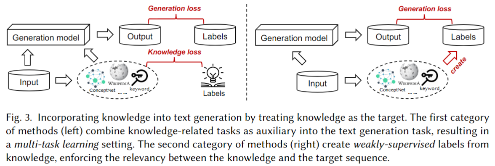

例如，知识损失被定义为预测的和真实的知识句子之间的交叉熵，并将其与标准会话生成损失相结合，以增强接地气（grounded conversation）的会话[27，61]。类似的任务包括关键词提取丢失[70]、模板重新排序丢失[13129]、知识图上的链接预测丢失[57]、路径推理丢失[81]、模式丢失[137159]、单词袋（BOW）丢失[741143]等。第二类方法直接从知识中推导出文本生成目标，并且在标准文本生成任务中使用那些（通常是噪声的）目标作为监督。这种方法被称为弱监督学习。弱监督学习强化了知识和目标序列之间的相关性。例如，在基于方面的摘要问题中，工作[118]基于外部知识库自动创建目标摘要，用于在有监督的模型中训练摘要模型。

**Knowledge as condition**. 设计知识相关任务的第二种方法是通过以知识为条件来增加文本生成任务。也就是说，目标是学习一个函数𝑝𝜃 (𝑌|𝑋,𝐾), 哪里𝑋 是输入序列，𝑌 是目标文本，并且𝐾 就是知识。一般来说𝐾 首先从外部给出（例如，风格、情感），或者从外部资源（例如，来自知识库的事实、来自维基百科的文档）中检索，或者从给定的输入文本（例如，关键词、主题词）中提取。其次，使用条件文本生成模型来合并知识并生成目标输出序列。在实践中，知识通常通过软强制算法进行补救，如注意力机制[3]和复制/指向机制[43109]。以知识为条件在知识增强文本生成中得到了广泛的应用。例如，通过考虑人物角色[154]和情绪[158]，控制反应的各个方面，如礼貌[96]，将反应建立在外部知识来源的基础上[27，42159]，并生成主题连贯序列[1191143]，已经完成了个性化对话反应的工作。此外，使用变分自动编码器（VAE）来执行以知识为条件的生成过程是无监督NLG的一种流行方法。通过操纵某些属性的潜在空间，如主题[132]和风格[50]，可以在不使用并行数据进行监督的情况下生成具有所需属性的输出序列。

##### 2.3.2 Learning with knowledge constraints

知识增强学习的另一个范式是将知识视为约束条件，以规范文本生成训练目标，而不是在封装知识的标准任务中创建训练目标。

提出了后验正则化（PR）框架来限制模型在未标记数据上的后验空间，以此引导模型朝着期望的行为发展[35164]。PR已被用作对概率模型（包括深度网络）施加知识约束的原则框架[515153]。PR增强了任何常规训练目标L(𝜃) （例如，负对数似然，如等式（5）中所示），具有对相关知识进行编码的约束项。形式上，将约束函数表示为𝑓 (𝑋,𝑌) ∈R使得𝑓 (𝑋,𝑌)值表示生成的序列更好𝑌 其中包含了知识。PR引入了一种辅助分布𝑞(𝑌|𝑋), 并对𝑞 通过鼓励𝑓 (𝑋,𝑌) 值：E𝑞[𝑓 (𝑋,𝑌)]. 同时，模型𝑝𝜃 被鼓励靠近𝑞 通过KL发散项。因此，学习问题是一个受约束的优化：

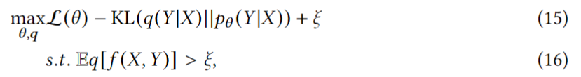

其中𝜉 是松弛变量。PR框架还与其他约束驱动的学习方法有关[14,83]。我们建议读者参考[35]进行更多讨论

##### 2.3.3 Inference with knowledge constraints

经过预训练的语言模型利用了大量未标记的数据和简单的对数似然训练目标。如果我们不修改模型架构以允许外部输入知识或使用特定数据进行微调，那么在预先训练的模型中通过特定知识控制语言生成是困难的[24]。即插即用语言模型（PPLM）为在推理过程中控制具有特定知识的语言生成开辟了一条新途径。在推理过程中的每一个生成步骤，PPLM都会将历史矩阵向两个梯度之和的方向移动：一个梯度朝向属性的更高对数似然𝑎 条件属性模型下𝑝(𝑎|𝑌)另一个是未修改的预训练生成模型的更高对数似然性𝑝(𝑌|𝑋) （例如GPT）。具体来说，属性模型𝑝(𝑎|𝑌)对ΔS进行基于梯度的更新𝑡 如下所示：

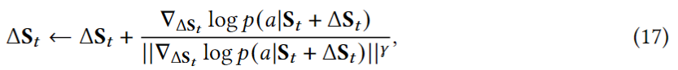

### 3 内部知识增强的NLG

#### 3.1 NLG Enhanced by Topic

主题可以被认为是文本的一种代表性或压缩形式，经常被用来保持语义连贯性和指导NLG过程。主题建模是一种强大的工具，可以以潜在主题的形式找到文档集的高级内容[10]。一种经典的主题模型，潜在狄利克雷分配（LDA），已被广泛用于推断捕获单词和文档潜在语义的低维表示[10]。在LDA中，每个主题被定义为单词上的分布，每个文档被定义为主题上的混合分布。LDA根据文档的主题分布和主题的单词分布生成文档中的单词。神经技术的最新进展开辟了一种从单词预测和上下文预测任务中学习单词低维表示的新方法，使神经主题模型成为从文本中寻找潜在主题的流行选择[12，47]。

接下来，我们将介绍通过主题增强的流行NLG应用程序：

**Dialogue system**。 香草（vanilla）Seq2Seq通常会在语料库中生成频繁单词或短语的琐碎或不确定的句子[139]。例如，聊天机器人可能会经常说“我不知道”、“我看到了”。尽管这些偏离主题的回复可以安全地回复许多查询，但它们的信息很少，很无聊。这样的反应可能会很快导致对话结束，严重损害用户体验。因此，非常需要生成主题响应。

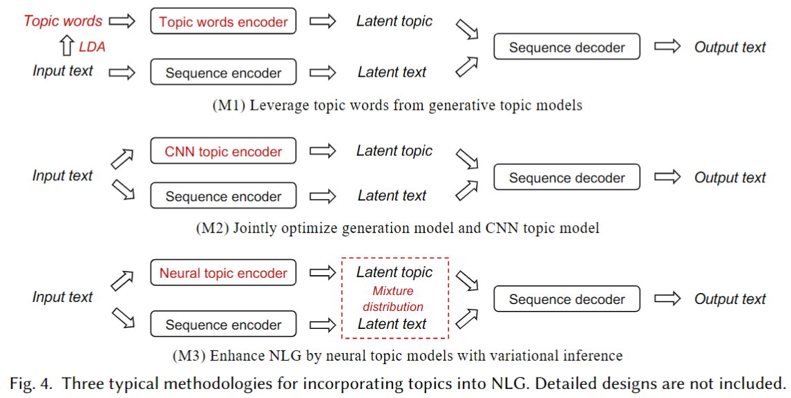

**Machine translation**。尽管输入和输出语言不同（例如，将英文翻译成中文），但在同一主题下，内容是相同的，而且是全球性的。因此，主题可以作为一种辅助指导，将一种语言的输入文本的语义信息保存到另一种语言中的输出文本中。

**Paraphrase**。 主题信息在一定程度上有助于理解潜在含义并确定语义范围。自然，转述涉及同一主题，这可以作为促进源语义保存的辅助指导。

如图4所示，我们将主题增强的NLG方法总结为三种方法：（M1）利用生成主题模型中的主题词；（M2）联合优化生成模型和CNN主题模型；（M3）通过具有变分推理的神经主题模型来增强NLG。

### 4 外部知识增强的NLG

#### 4.1 NLG Enhanced by Knowledge Base

NLG中最大的挑战之一是发现序列内和/或输入和输出序列之间元素的相关性。依赖关系实际上是各种类型的知识，如常识、事实事件和语义关系。知识库（KB）是一种流行的技术，用于为搜索引擎等基于知识的系统收集、存储和管理大规模信息。它有大量由主语、谓语和宾语组成的三元组。人们也称它们为“事实”或“事实三胞胎”。最近，研究人员一直在设计使用知识库作为外部知识的方法，以便更容易、更快、更好地学习依赖关系。

接下来，我们将介绍通过知识库增强的流行NLG应用程序：

**Question answering**。仅仅根据一个给定的问题通常很难得到正确的答案。这是因为，根据问题的目的，一个好的答案可能有不同的形式。它可以用缺失的信息准确地完成问题。它可能会详细说明问题的某些部分。它可能需要基于一些事实和/或常识进行推理和推理。因此，由于缺乏常识/事实知识，仅将输入问题纳入神经生成模型往往无法完成任务[8]。可以从知识库中检索到常识和事实的相关结构化信息。

**Dialogue system**。 KB在生成对话或对话方面的需求与QA相关，但有两个方面的不同。首先，当以“你有什么建议吗？”这样的开放话题开始时，对话或对话可以是公开的讨论。其次，在某个步骤中回应一句话需要回忆以前的上下文，以确定涉及的实体。知识库将在识别长期上下文中的依赖关系方面发挥重要作用。

为了处理知识库和输入/输出序列之间的不同类型的关系，这些方法可以分为两种方法，如图5所示：（M1）围绕知识库设计监督任务以进行联合优化；（M2）通过选择知识库或事实来增强整合。

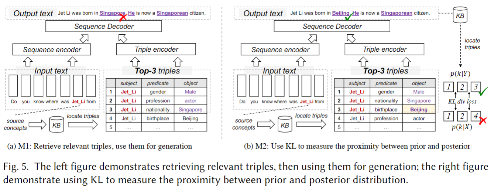

##### 4.1.1 M1: Design Supervised Tasks around KB for Joint Optimization.

获取、存储和表示事实知识的知识库（KBs）可用于增强文本生成。然而，设计有效的合并来实现所需的增强是具有挑战性的，因为普通的Seq2Seq通常无法表示离散的孤立概念，尽管它们在学习平滑的共享模式（例如，语言多样性）方面表现良好。为了充分利用知识库，其思想是在多个任务上联合训练神经模型。例如，目标任务是生成答案序列，其他任务包括知识库中的问题理解和事实检索。知识可以在统一的编码器-解码器框架设计中共享。通常，问题理解和事实检索是相关和有用的任务，因为问题可以被解析为将其主语和谓语与KB中的事实三元组的组成部分相匹配（例如，字符串匹配、实体链接、命名实体识别），而答案是三元组的对象。KBCopy是第一个使用事实知识库生成回复的作品[29]。在生成过程中，KBCopy可以从KB中复制单词。然而，直接从知识库中复制相关单词是极具挑战性的。CoreQA使用复制和检索机制以端到端的方式生成答案序列[48]。具体来说，它有一个检索模块来理解问题并从知识库中查找相关事实。然后，通过两个独立的编码器将问题和所有检索到的事实转换为潜在表示。在解码阶段，通过对输入序列和检索到的事实进行联合关注，将集成表示馈送到解码器中。图5（a）展示了一个通用管道，它首先从KB中检索相关的三元组，然后将排名靠前的三元组用于生成过程。

##### 4.1.2 M2: Enhance Incorporation by Selecting KB or Facts in KB

理想情况下，事实的相关性在输入和输出序列依赖性方面是令人满意的，然而，在实际情况下并不总是如此。Lian等人提出了基于检索模型（例如语义相似性）从知识库中选择相关事实的问题，这可能无法有效地实现适当的知识选择[74]。原因是不同种类的选择的知识事实可以用于对相同的输入话语产生不同的响应。给定特定的话语和响应对，话语和响应在知识库上的后验分布可以为知识选择提供额外的指导。挑战在于前后分布之间的差异。具体来说，该模型仅根据先验分布来学习选择有效知识，因此在推理过程中很难获得正确的后验分布。

为了解决这个问题，Lian等人[74]和Wu等人[137]（如图5（b）所示）的工作使用先验分布来近似后验分布，以便在没有后验信息的情况下选择适当的知识。他们引入了一种辅助损失，称为Kullback-Leibler发散损失（KLDivLoss），以测量先验分布和后验分布之间的接近度。KLDivLoss的定义如下：

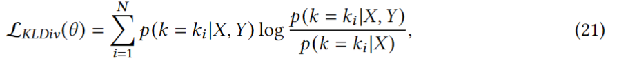

其中，𝑁 是检索到的事实数。当最小化KLDivLoss时，后验分布𝑝(𝑘|𝑋,𝑌) 可以被视为应用先前分发的标签𝑝(𝑘|𝑋) 用于近似𝑝(𝑘|𝑋,𝑌). 最后，总损失记为KLDivLoss和NLL（发电）损失之和。

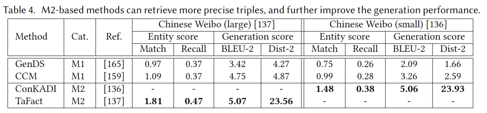

##### 4.1.3 Discussion and Analysis of Different Methods

知识库中的三元组和输入序列之间的相关性在发现序列生成的知识方面起着核心作用。M1中的方法通常遵循解析输入序列、检索相关事实的过程，随后，可以基于输入序列和先前检索的事实生成知识感知输出。尽管通过使用内存网络对KB建模[82]进行了改进，但现有的KG增强方法仍然无法有效地选择精确的三元组。M2的方法改进了事实的选择，其中地面实况响应作为后验上下文知识来监督先验事实概率分布的训练。吴等人使用精确匹配和召回来测量检索到的三元组是否用于生成目标输出[136]。表4显示了[136137]中报告的基于M1的方法和基于M2的方法的实体召回得分。我们观察到，与基于M1的方法相比，基于M2的方法可以大大提高三重检索的准确性以及生成质量。KB增强的方法仍然存在挑战。一种是检索到的事实可能包含噪声信息，使生成不稳定[61]。这个问题在NLG任务中是极其有害的，例如，基于知识库的问答和面向任务的对话系统，因为知识库中的信息通常是响应中预期的实体。

#### 4.2 NLG Enhanced by Knowledge Graph

知识图作为一种结构化的人类知识，已经引起了学术界和工业界的广泛关注。KG是由实体*、关系和语义描述组成的事实的结构化表示（也称为知识三元组）[58]。“知识库”和“知识图”这两个术语可以互换使用，但它们不一定是同义词。知识图被组织为一个图，因此实体之间的连接是其中的一流公民。在KG中，人们可以很容易地遍历链接，发现实体是如何相互连接以表达某些知识的。人工智能研究的最新进展已经证明了在推荐系统等各种应用中使用KGs的有效性[127]。

接下来，我们将介绍知识图增强的流行NLG应用程序：

**Commonsense reasoning**。 它旨在使机器能够在一代人的过程中从KG中获取人类的常识。这些方法利用了常识KG的结构和语义信息，并在多跳关系路径上进行推理，以便用常识推理的证据链来增加有限的信息。常识推理生成中的流行任务包括溯因推理（例如𝛼NLG任务）[7，57]、反事实推理[56，57]和实体描述生成[21]。

**Dialogue system**。 它经常使用KG来表示链接实体和关系中的语义[97，121，151，159]。对话可以将焦点从一个实体转移到另一个实体，将一个话语分解为几个片段，可以表示为连接实体及其关系的链接路径

**Creative writing**。 这项任务可以在科学和讲故事两个领域找到。科学写作旨在逐步解释自然过程和现象，因此每一步都可以反映为KG上的一个环节，整个解释就是一条路径[63310]。在故事生成中，KG中的隐含知识可以促进对故事情节的理解，并更好地预测下一个情节会发生什么[45，46，80]。

与单独、独立的知识三元组相比，知识图为模型提供了全面、丰富的实体特征和关系，以克服数据分布的影响，增强其鲁棒性。因此，节点嵌入和关系路径在各种文本生成任务中发挥了重要作用。相应的技术是知识图嵌入（KGE）[131]和基于路径的知识图推理[17]。此外，使用新兴的图神经网络（GNN）[138]和图到序列（Graph2Seq）框架[6]，可以对KG中的多跳和高阶关系进行编码。

**Definition 4.1(Knowledge graph (KG))**。 知识图（KG）是一种由实体和关系组成的有向多关系图，这些实体和关系被视为节点和不同类型的边。形式上，KG定义为G=（U，E，R），其中Ui是实体节点的集合，E⊆U×R×U是关系模式R中具有特定关系的U中节点之间的类型边的集合。

然后，给定文本生成任务中的输入/输出序列，与序列相关联的KG的子图可以定义如下。

**Definition 4.2 (Sequence-associated K-hop subgraph)**。 一个与序列相关的K-hop子图被定义为G𝑠𝑢𝑏 =（U𝑠𝑢𝑏, E𝑠𝑢𝑏,R） ，其中U𝑠𝑢𝑏 是通过实体链接函数映射的实体节点集的并集𝜓 : U×X→U𝑠𝑢𝑏 以及K-hops中的邻居。类似地，E𝑠𝑢𝑏 ⊆ U𝑠𝑢𝑏 ×R×U𝑠𝑢𝑏 是在U𝑠𝑢𝑏中节点之间的类型化边的集合U𝑠𝑢𝑏。序列关联子图提供了任务数据（即序列）的图形形式，从而能够将KGs和序列集成到图算法中。已经提出了许多方法来学习KG语义与输入/输出序列之间的关系。它们可以分为四种方法，如图6所示：（M1）将知识图嵌入纳入语言生成；（M2）将知识转化为具有三元组信息的语言模型；（M3）通过路径查找策略对知识图进行推理；以及（M4）利用图神经网络改进图嵌入。

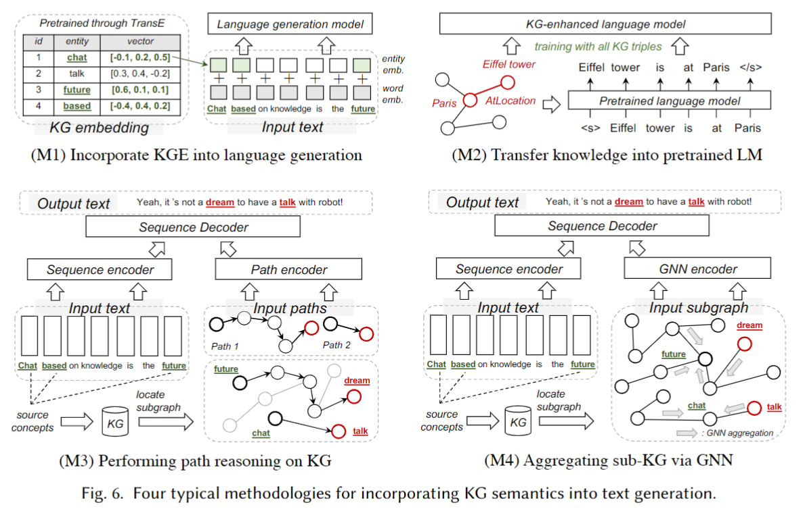

##### 4.2.1 M1: Incorporate Knowledge Graph Embeddings into Language Generation

知识边缘图嵌入（KGE）技术从KG[131]中学习节点嵌入。KGE旨在从KG中实体节点的连接信息（即不同类型的关系）中捕捉实体节点之间的语义相关性。其主要思想是在低维向量空间Rd中表示实体和关系，其中𝑑 ≪ |u U R|在保持KG固有结构的同时降低数据维度。TransE[11]是最广泛使用的KGE技术。在TransE中，给定KG边缘(𝑢𝑖,𝑟,𝑢𝑗), 该关系被视为嵌入实体u的平移向量r 以至于 u𝑖 和u𝑗 可以与低翻译误差连接，即u𝑖 +r≈u𝑗. 例如，我们有→𝑇𝑜𝑘𝑦𝑜 +→𝐼𝑠𝐶𝑎𝑝𝑡𝑖𝑐𝑎𝑙𝑂𝑓 ≈→𝐽𝑎𝑝𝑎𝑛 知识优势（𝑇𝑜𝑘𝑦𝑜 ，IsCapticalOf，𝐽𝑎𝑝𝑎𝑛 ）。如图6（a）所示，将KGE合并到NLG中的一种常见策略是将原始单词表示（x）与来自KGE的相应实体表示（u）连接起来[151，159]。

##### 4.2.2 M2: Transfer Knowledge into Language Model with Knowledge Triplet Information

实体嵌入（来自KGE）和单词嵌入（来自预先训练的语言模型）的向量空间通常是不一致的[80]。除了简单的串联之外，最近的方法已经探索了直接在知识图三元组上微调语言模型。Guan等人使用模板将常识三元组（在ConceptNet和ATOMIC中）转换为可读句子，如图6（b）所示。然后，语言模型（例如，==GPT-2==）对转换后的句子进行微调，以学习常识知识，从而改进文本生成。

##### 4.2.3 M3: Perform Reasoning over Knowledge Graph via Path Finding Strategies（通过路径查找策略对知识图进行推理） 

KGE通过一定的语义相关性（例如TransE）从单跳关系中学习节点表示。然而，Xiong等人认为，智能机器应该能够对关系路径进行显式推理，以做出多个相互关联的决策，而不仅仅是将实体嵌入KG[141]。以QA任务为例。该机器对KGs进行推理，以处理没有明显答案的复杂查询，推断潜在的答案相关实体，并生成相应的答案。因此，挑战在于识别所需实体的子集，并在响应中正确提及它们[91]。因为连接的实体通常遵循自然的概念线索，它们有助于生成合理和合乎逻辑的答案，以保持对话的吸引力和意义。如图6（c）所示，基于路径的方法探索实体节点之间的各种连接模式，如元路径和元图。然后，他们从KGs上的可步行路径中学习，为生成过程提供辅助指导。基于路径查找的方法主要可分为两类：（1）基于路径排序的方法和（2）基于强化学习的路径查找方法。

**M3.1: Path routing and ranking**。路径排序算法（PRA）是一种在大型KGs上学习和推断路径的有前途的方法[65]。PRA使用随机行走来执行多个有界深度优先搜索过程，以找到关系路径。结合基于弹性网络的学习[166]，PRA选择看似合理的路径，并修剪非理想的，尽管事实上是正确的KG路径。例如，Tuan等人在动态知识图上提出了一个具有PRA的神经会话模型[121]。在解码阶段，它在每个时间步长从两个网络中选择一个输出，一个是通用GRU解码器网络，另一个是基于PRA的多跳推理网络。Bauer等人通过三步评分策略对路径进行排序和过滤，以确保信息质量和多样性：初始节点评分、累积节点评分和路径选择[5]。Ji等人启发式地修剪了实体节点之间的噪声边缘，并提出了一种路径路由算法，将边缘概率沿着多跳路径传播到实体节点[56]。

**M3.2: Reinforcement learning based path finding**。基于强化学习的方法使智能体在连续空间中进行推理以找到路径。这些方法在路径查找的奖励函数中包含了各种标准，使路径查找过程变得灵活。Xiong等人提出了DeepPath，这是第一项采用马尔可夫决策过程（MDP）并使用基于RL的方法在KGs中查找路径的工作[141]。利用基于RL的路径查找进行NLG任务通常包括两个阶段[81，97]。首先，他们将一个序列作为输入，检索一个起始节点𝑢0，然后进行多跳图推理，最终到达目标节点𝑢𝑘 其包含用于输出序列生成的知识。其次，它们代表序列𝑋 并选择路径Φ𝑘 (𝑢0，𝑢𝑘)通过两个独立的编码器。他们对输入序列和选择的路径进行多源关注的序列解码。基于路径的知识图推理将KG的图结构转换为线性路径结构，该线性路径结构可以很容易地由序列编码器（例如，RNN）表示[30，97121]。例如，Niu等人用两个独立的RNN编码选定的路径和输入序列，并用基于一般注意力的RNN解码器生成序列[97]。为了增强RL过程，Xu等人提出了在强化学习过程中训练agent的六个奖励函数。例如，函数寻找精确到达目标节点以及起始节点和目标节点之间的最短路径，即最小化所选路径的长度Φ𝑘 (𝑢0，𝑢𝑘)[142]。

##### 4.2.4 M4: Improve the Graph Embeddings with Graph Neural Networks

KGs上相关实体周围的上下文在理解实体和生成关于其交互的适当文本方面发挥着重要作用[46，63]。例如，在科学写作中，重要的是要考虑分类学上相关概念的相邻节点和/或科学知识图的全局上下文[63]。然而，无论是KGE还是关系路径都不能完全表示这样的信息。基于图的表示旨在聚合图数据上的上下文/相邻信息；GNN模型的最新进展证明了基于图的表示学习的有希望的进展[138]。为了改进文本生成，图到序列（Graph2Seq）模型在神经编码器-解码器架构中对KG的结构信息进行编码[6]。从那时起，GNN在改进NLG模型方面发挥了重要作用。它们已经应用于编码和解码阶段。

**Learning KG-aware input text representation with GNNs (Encoding)**。对于编码阶段，利用GNN合并KG的一般过程是通过与KG上的单词的对应实体节点向量的向量组合来增强输入文本中单词的语义[46,54150159]。预定义的实体链接功能𝜓 : U×X→U𝑠𝑢𝑏 将输入序列中的单词映射到KG上的实体节点。给定一个输入序列𝐾-跳组成序列相关的K-跳子图G𝑠𝑢𝑏 （在定义4.2中正式定义）。对于G中的每个实体节点𝑠𝑢𝑏, 它使用KG结构以及实体和边缘特征（例如，语义描述，如果可用）来学习表示向量u。具体地，GNN模型遵循邻域聚合方法，该方法通过聚合来自节点的相邻节点和边缘的信息来迭代地更新节点的表示。之后𝑘 聚合的迭代，节点表示捕获其内部的结构信息𝑘-嘻哈社区。从形式上讲𝑘-节点的第th层𝑢 ∈U𝑠𝑢𝑏 是：

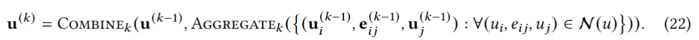

子图表示h𝑠𝑢𝑏𝐺 通过Readout（·）函数从所有实体节点表示（即，h𝑠𝑢𝑏𝐺 =读数（｛u(𝑘),𝑢 ∈U𝑠𝑢𝑏 }). 周等人是第一个设计这样一个知识图解释器的人，使用图注意力网络（GAT）在ConceptNet上丰富具有相邻概念的上下文表示[159]。

**Dynamically attending KG representation (Decoding)**。序列解码器使用注意力机制从KG的表示以及输入文本的隐藏状态中找到有用的语义，其中KG的表示通常由GNN生成。特别地，隐藏状态由子图表示h扩充𝑠𝑢𝑏𝐺, 即s0=h𝑛 ⊕h𝑠𝑢𝑏𝐺 [6] 。然后，解码器仔细读取检索到的子图，以获得图感知上下文向量。然后，它使用矢量来更新解码状态[46，57，80，151，159]。它从检索到的子图中自适应地选择一个通用词或实体来生成输出词。由于仅图级注意力可能会忽略细粒度的知识边缘信息，最近的一些方法采用了分层图注意力机制[46,80159]。它仔细阅读检索到的子图G𝑠𝑢𝑏 然后仔细阅读所有知识边缘E𝑠𝑢𝑏 参与G𝑠𝑢𝑏. Ji等人根据解码状态添加了反映知识边缘相关性的相关性得分[57]。

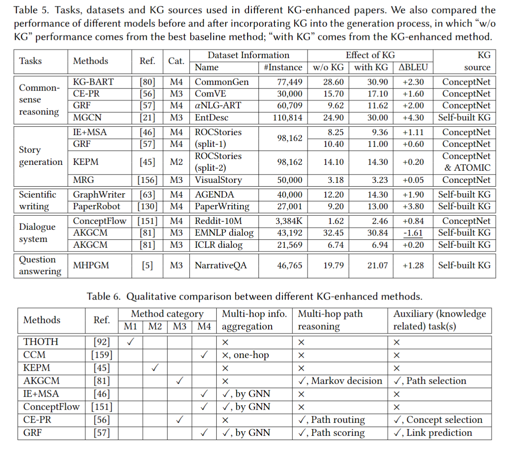

##### 4.2.5 Discussion and Analysis of the Methodologies and Methods.

**Pros and cons**。知识图嵌入（M1）是最早将包含实体和关系的KG的组成部分嵌入到连续向量空间中并使用它们来改进文本生成的尝试。这些实体和关系嵌入可以简单地用于丰富输入文本表示（例如，串联嵌入），桥接潜在空间中从输入文本链接的实体词之间的连接。由于图投影和文本生成是两个独立的步骤，因此知识图中的嵌入向量和输入文本中的隐藏状态位于两个不同的向量空间中。该模型必须学会弥合这一差距，这可能会对文本生成的性能产生负面影响。

在KG三元组（M2）上微调预先训练的语言模型可以消除两个向量空间之间的间隙。然而，M1和M2有两个缺点。首先，它们只保留KG中直接（单跳）关系的信息，例如M1中的成对邻近性和M2中的KG三元组，但忽略了概念的间接（多跳）关系。间接关系可以为一些文本生成任务提供复杂推理的合理证据。其次，从用M1或M2方法编码KGs的时候起，生成模型将不再能够访问KGs，而是能够访问它们的连续表示。然后，模型就不能像下游任务的常识性KG推理那样支持推理。由于这两个原因，M1和M2通常用于创建基本的KG表示，在此基础上，KG路径推理（M3）和GNN（M4）可以进一步丰富隐藏状态[151159]。

KG推理（M3）的路径查找方法在一跳关系之外对KG执行多跳行走。它实现了许多文本生成场景所需的推理，如常识推理和会话问答。同时，它为整个生成过程提供了更好的可解释性，因为KG推理算法选择的路径将被明确用于生成。然而，由于数量的限制，所选择的路径可能无法捕捉推理过程的全部上下文。此外，基于强化学习的路径查找使用启发式奖励来驱动策略搜索，使模型对噪声和对抗性示例敏感。

与考虑多跳路径的M3相比，GNN和Graph2Seq（M4）的算法可以有效地聚合来自KGs上多跳邻域的语义和结构信息。因此，广泛的相关信息可以直接嵌入编码器/解码器的隐藏状态。同时，M4支持反向传播，用于联合优化文本编码器和图形编码器。此外，GNN和Graph2Seq中应用的注意力机制（例如，图注意力）可以在一定程度上解释模型的输出，尽管来自M3的多跳路径具有更好的可解释性。

M3和M4与M1和M2相比能够使用多跳关系信息。然而，他们有两个弱点。首先，它们比M1和M2具有更高的复杂性。在M3中，由于知识图的大尺寸和稀疏性，路径查找算法的动作空间可能非常大。在M4中，解码器必须仔细读取输入序列和知识图。其次，M3和M4检索的子图可能提供用于生成输出的有用概念的低覆盖率。例如，人们使用广泛使用的常识KG ConceptNet来检索三个生成常识推理任务的子图。任务数据集是ComVE[57]，𝛼-NLG[7]和ROCStory[46]。我们发现，在ConceptNet上可以找到输出中25.1%/24.2%/21.1%的概念，但在检索到的2-操作序列相关子图上只能分别找到输出中11.4%/8.1%/5.7%的概念。这意味着在生成过程中没有使用KG的大部分相关概念。

**Quantitative analysis**。表5总结了现有KG增强工作中使用的任务、数据集和KG来源。应该提到三件重要的事情。首先，表中的所有数据集都是公共的，我们在表11中包含了它们的链接。CommonGen[76]、ComVE[124]和𝛼-NLG[7]有一个公开的竞争排行榜。其次，对于KG来源，我们观察到8篇（57.1%）论文使用ConceptNet作为外部资源，而6篇（42.9%）论文从特定领域的语料库中构建了自己的KG。例如，Koncel等人通过应用SciIE工具（科学领域信息提取）创建了一个科学知识图[63]。此外，赵等人比较了使用ConceptNet和使用自建KG的模型的性能，发现具有自建KG的模式可以更好地执行故事生成和评论生成任务[156]。第三，我们观察到，KG增强的NLG方法对生成常识推理任务的改进最大，其中ΔBLEU的平均改进为+2.55%，而对所有不同任务的平均改进均为+1.32%。

**Qualitative analysis**。表6从三个维度比较了不同的KG增强方法：多跳信息聚合、多跳路径推理和辅助知识图相关任务。M3通常用于多跳路径推理，M4用于多跳信息聚合，除了CCM[159]仅聚合一跳邻居。此外，与KG相关的辅助任务通常用于进一步帮助模型从KG中学习知识。例如，[56，57，81]中的消融研究表明，路径选择、概念选择和链路预测任务可以进一步提高发电性能。GRF[57]同时学习这三种能力。它在三代任务上实现了最先进的性能。

#### 4.3 NLG enhanced by Grounded Text

#### 4.4 M2: Modeling Background Knowledge into Response Generation

### 5 BENCHMARK, TOOLKIT AND LEADERBOARD PERFORMANCE

开发文本生成的通用评估基准有助于促进相关领域研究的发展。现有的文本生成基准并没有特别关注于选择已被广泛用于知识增强文本生成的任务和数据集。因此，我们从现有的四个文本生成基准中重新筛选，即GLGE[77]、GEM[40]、KilT[99]、GENIE[60]，并确定了9个用于评估知识增强NLG方法的基准数据集。以下是我们的选择标准：

- 我们只考虑具有开放访问下载链接的基准数据集。
- 我们专注于各种文本生成任务，涉及各种应用程序。
- 我们为每个文本生成任务最多选择三个基准数据集。
- 我们包括以内部和外部知识为重点的数据集。
- 我们更喜欢使用多参考数据集进行稳健的自动评估。

基于基准选择标准，我们完成了9项以知识为中心的任务，涵盖了各种NLG任务，包括常识推理、文本摘要、问题生成、生成性问题回答和对话。数据统计如表9所示。描述和数据集链接如下所示：

-  Wizard of Wikipedia (WOW)：这是一个开放域对话数据集，两位发言人在这里进行开放式转换，直接基于从维基百科检索到的知识。（数据链接：https://parl.ai/projects/wizard_of_wikipedia/)
- CommonGen：它是一个生成性常识推理数据集。给定一组共同的概念，任务是使用这些概念生成一个连贯的句子来描述日常场景。（数据链接：https://inklab.usc.edu/CommonGen/)
- 𝛼NLG-ART：它是一个生成的常识推理数据集。考虑到对世界的不完全观察，它的任务是对部分可观察的过去和未来的可能解释产生一个有效的假设。（数据链接：http://abductivecommonsense.xyz/)
- ComVE：它是一个生成的常识推理数据集。任务是在给出反事实陈述的情况下生成一个解释，以便于理解。（数据链接：https://github.com/wangcunxiang/SemEval2020-Task4-Commonsense-Validation-and-Expansion
- ELI5：这是一个用于长形式问答的数据集。任务是为不同的问题提供解释性的多句答案。网络搜索结果被用作回答问题的证据文档。（数据链接：https://facebookresearch.github.io/ELI5/)
- SQuAD：这是一个用于生成答案感知问题的数据集。任务是根据给定的文本段落或文档，在给定的答案范围内生成一个问题。（数据链接：https://github.com/magic282/NQG)
- CNN/每日邮报（CNN/DM）：这是一个用于摘要的数据集。给定一个新闻摘要，目标是生成一个摘要，代表原始内容中最重要或最相关的信息。（数据链接：https://www.tensorflow.org/datasets/catalog/cnn_dailymail)
- Gigaword：这是一个用于摘要的数据集。与CNN/DM类似，目标是为新闻文章生成标题。（数据链接：https://www.tensorflow.org/datasets/catalog/gigaword)
- PersonaChat：这是一个开放域对话数据集。它提出了一项任务，通过对个人资料信息的限制，使闲聊更具吸引力。（数据链接：https://github.com/facebookresearch/ParlAI/tree/main/projects/personachat

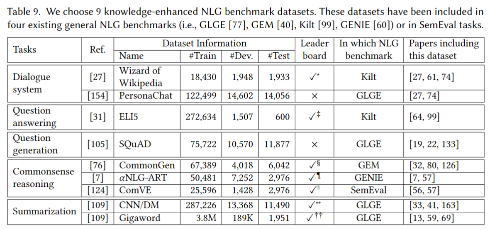
