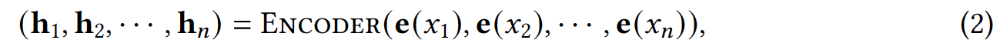
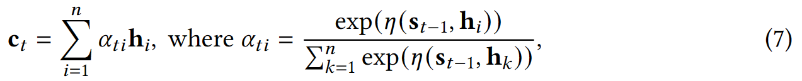

## A Survey of Knowledge-Enhanced Text Generation（综述）

作者：WENHAO YU（圣母大学）、微软、港中文

来源：谷歌学术 2022

论文：[[arxiv](https://arxiv.org/pdf/2010.04389)]

代码：[]

引用数：137

参考：[]

关键词：知识增强的文本生成，NLG（natural language generation）

### 摘要

这篇论文的引言部分主要介绍了自然语言生成（NLG）的重要性和挑战性。NLG的目标是生成可理解的文本，这是自然语言处理（NLP）中最重要但也最具挑战性的任务之一。尽管已经提出了各种神经编码器-解码器模型来通过学习将输入文本映射到输出文本来实现这个目标，但是输入文本本身往往只能提供有限的知识来生成期望的输出，因此在许多实际场景中，文本生成的性能仍然远远不能令人满意。

为了解决这个问题，研究人员已经考虑将（i）嵌入在输入文本中的内部知识和（ii）来自诸如知识库和知识图谱等外部来源的外部知识融入到文本生成系统中。这个研究主题被称为知识增强文本生成。

在这篇综述中，作者对过去五年在这个主题上的研究进行了全面的回顾。主要内容包括两部分：（i）将知识整合到文本生成中的一般方法和架构；（ii）根据不同形式的知识数据的特定技术和应用。这篇综述可以为学术界和工业界的研究者和实践者提供广泛的参考。

### 1 介绍

#### 1.1 什么是Knowledge-enhanced Text Generation

一般来说，知识是对特定主题的熟悉度、认识或理解。在自然语言生成（NLG）系统中，知识是对输入文本及其周围上下文的认识和理解。这些知识源可以分为内部知识和外部知识（见图1）。

内部知识的创建发生在输入文本内部，包括但不限于关键词、主题、语言特征和内部图结构。外部知识的获取发生在从外部来源（例如知识库、外部知识图谱和基于知识的文本）提供知识时。这些来源提供的信息（例如常识三元组、主题词、评论、背景文档）可以通过各种神经表示学习方法作为知识使用，然后应用于增强文本生成的过程。此外，知识为模型引入了具有明确语义的可解释性。将知识融入文本生成的这一研究方向被称为知识增强文本生成。

问题1（知识增强文本生成）。给定一个文本生成问题，系统给出一个输入序列𝑋，并试图生成一个输出序列𝑌。假设我们还可以访问表示为𝐾的额外知识。知识增强文本生成的目标是通过利用输入文本、知识和输出文本之间的依赖关系，将知识𝐾融入到生成𝑌的过程中，从而增强给定𝑋的生成。

许多现有的知识增强文本生成系统在生成信息丰富、逻辑清晰、连贯的文本方面表现出了令人鼓舞的性能。在对话系统中，一个主题感知的Seq2Seq模型帮助理解输入序列的语义含义，并生成更多信息的响应，例如对前面提到的示例输入“My skin is so dry.”生成“Then hydrate and moisturize your skin.”的响应。在摘要中，知识图谱生成了一个结构化的摘要，并突出了相关概念的接近性，当与同一实体相关的复杂事件可能跨越多个句子时。一个知识图谱增强的Seq2Seq模型生成的摘要能够正确回答10%更多与主题相关的问题[54]。在问答（QA）系统中，存储在知识库中的事实补充了问题中的缺失信息，并详细说明了以便于生成答案[30,48]。在故事生成中，使用从知识图谱获取的常识知识有助于理解故事线并更好地逐步叙述接下来的情节，因此每一步都可以反映为知识图谱上的一个链接，整个故事将是一条路径[46]。

#### 1.2 为什么要形成知识增强文本生成综述

近年来，开发将知识融入到自然语言生成（NLG）中的方法引起了人们的极大兴趣。然而，这个研究主题还缺乏全面的调研。相关的调研已经为讨论这个主题奠定了基础。例如，Garbacea等人[37]和Gatt等人[38]回顾了核心NLG任务的模型架构，但没有讨论知识增强方法。Ji等人[58]提出了一个关于可以用于增强NLG的知识图谱技术的回顾。Wang等人[125]总结了如何表示结构化知识，如知识库和知识图谱，以便进行阅读理解和检索。

据我们所知，这是第一篇对知识增强文本生成进行全面回顾的调研。它旨在为NLG研究者提供一个综合的研究指南。我们的调研包括了关于如何让NLG从深度学习和人工智能的最新进展中受益的详细讨论，包括图神经网络、强化学习和神经主题建模等技术。

#### 1.3 Knowledge-enhanced Text Generation面临的挑战

在知识增强文本生成中，面临的挑战主要有两个。首先，我们需要从各种来源获取有用的相关知识。已经有一系列的工作在发现来自主题、关键词、知识库、知识图谱和知识驱动文本的知识。第二个挑战是如何有效地理解和利用获得的知识来促进文本生成。已经有多种方法被探索用于改进编码器-解码器架构（例如，注意力机制、复制和指向机制）。基于第一个挑战，我们的调研主要内容分为两部分：（1）将知识整合到文本生成中的一般方法（第2节）；（2）根据不同知识来源的特定方法和应用（第3节和第4节）。更确切地说，由于知识可以从不同的来源获得，我们首先将现有的知识增强文本生成工作分为两类：内部知识增强（句子内部）和外部知识增强的文本生成。内部和外部知识的划分被管理科学广泛采用[88]，这可以类似于知识增强的文本生成。基于第二个挑战，我们对最近的知识增强文本生成方法进行了分类，这些方法是从如何提取知识并将其纳入每个部分的文本生成过程中演变而来的（命名为M1、M2等）。此外，我们在每一节中回顾了各种自然语言生成应用程序的方法，以帮助从业者选择、学习和使用这些方法。我们总共讨论了在2016年或之后发表或发布的80多篇论文中提出的7个主流应用程序。

如图2所示，本次调查的其余部分组织如下。第2节介绍了NLG的基本模型和将知识集成到文本生成中的一般方法。第3节回顾了内部知识增强的NLG方法和应用。内部知识是从主题、关键词、语言特征和内部图结构中获得的。第4节回顾了外部知识增强的NLG方法和应用。外部知识源包括知识库、知识图和基础文本。第5节介绍了知识增强型NLG基准。第6节讨论了未来的工作并总结了调查结果。

###  2 把知识融入NLG的方法

#### 2.1 基本的文本生成模型

早期的编码器-解码器框架通常基于递归神经网络（RNN），如RNN-Seq2Seq[117]。基于卷积神经网络（CNN）的编码器-解码器[39]和Transformer编码器-解码器[122]已被越来越广泛地使用。从概率的角度来看，编码器-解码器框架学习以另一个可变长度序列为条件的可变长度序列上的条件分布：

**编码器**。编码器学习将可变长度序列编码为固定长度向量表示。RNN编码器读取输入语句𝑋 按顺序。CNN编码器在顺序窗口中对单词及其周围单词执行卷积运算。Transformer编码器避免重复，而是完全依赖于自注意机制来绘制输入中不同令牌之间的全局依赖关系𝑋. 我们将它们统一表示为：

其中e(𝑥𝑖)是单词的嵌入𝑥𝑖, h𝑖 是𝑥𝑖的表征。

**解码器**。解码器将给定的固定长度矢量表示解码为可变长度序列[117]。特别地，解码器在每个时间步长生成一个输出序列一个令牌。在每一步，模型都是自回归的，在生成下一个令牌时，将先前生成的令牌作为额外输入。形式上，解码函数表示为：

其中Readout（·）是一个非线性多层函数，它输出𝑦𝑡的概率。

**优化**。生成过程被认为是一个连续的多标签分类问题。它可以通过负对数似然（NLL）损失直接优化。因此，通过最大似然估计（MLE）的文本生成模型的目标被公式化为：

#### 2.2 Knowledge-enhanced模型架构

##### 2.2.1 注意力机制

在编码器和解码器中捕获每个时间步长的权重是有用的[3]。在解码阶段，上下文向量c𝑡 添加了，因此隐藏状态s𝑡 是：

与等式（3）不同，ct是上下文向量，由输入序列的隐向量（$H = \{h_i\}_{i=1}^n$）计算得到：（离t处越近，输入向量所产生的影响越大）

𝜂（·）是一个mlp，整个式子是一个softmax式子。

在Transformer解码器中，在编码器的两个子层之上，解码器插入第三个子层，该第三子层对编码器堆栈H的输出执行多头关注。Transformer的有效实现使用缓存的历史矩阵S𝑡 以生成下一个令牌。为了与RNN-Seq2Seq进行比较，我们使用递归表示法总结了Transformer解码器：

**Knowledge-related attention**. 在最近的知识增强NLG工作中，注意力机制已被广泛用于结合知识边缘表示。一般的想法是学习一个知识感知的上下文向量（表示为𝑡) 通过组合两个隐藏上下文向量（c𝑡) 和知识上下文向量（表示为$c_t^K$ ) 进入解码器更新，例如$\tilde{c_t}$ =𝑓𝑚𝑙𝑝 （c𝑡 ⊕c𝐾𝑡 ). 知识上下文向量（c𝐾𝑡 ) 计算知识表示（例如，主题向量、知识图中的节点向量）上的注意力。表1总结了各种知识注意力，包括关键词注意力[69，70，73]、主题注意力[79，134，139，152]、知识库注意力[34，48]、知识图注意力[54，63151]和基础文本注意力[9，87]。

##### 2.2.2 Copy and Pointing Mechanisms

CopyNet和Pointer-generator（PG）被用来选择输入序列中的子序列，并将它们放在输出序列的适当位置。CopyNet和PG具有可微网络架构，可以轻松地以端到端的方式进行训练。在CopyNet和PG中，生成目标令牌的概率是两种模式（生成模式和复制模式）的概率的组合。首先，它们表示全局词汇表V和源序列词汇表VX中的唯一令牌。它们构建了一个扩展词汇表Vext=V∪VX∪{unk}。CopyNet和PG计算扩展词汇表上的分布的方式有所不同。CopyNet通过𝑝(𝑦𝑡)=𝑝𝑔(𝑦𝑡)+𝑝𝑐(𝑦𝑡)来计算分布，其中𝑝𝑔(·|·)和𝑝𝑐(·|·)代表生成模式和复制模式的概率。不同的是，PG显式计算生成模式和复制模式之间的切换概率𝑝𝑚。它回收注意力分布以作为复制分布。通过𝑝(𝑦𝑡)=𝑝𝑚(g)·𝑝𝑔(𝑦𝑡)+(1−𝑝𝑚(g))·𝑝𝑐(𝑦𝑡)来计算Vext上的分布，其中𝑝𝑚(g)表示选择生成模式的概率，该概率由非线性多层感知器（MLP）函数获得。重要的是，CopyNet和指针生成器网络已经被用作许多知识增强NLG工作的基础模块。

知识相关模式。知识相关模式选择在获取的知识中的子序列，并将它们放在输出序列的适当位置。它帮助NLG模型生成不包含在全局词汇表（V）和输入序列（VX）中的单词。例如，通过添加知识库模型，扩展词汇表（Vext）添加了来自知识库的实体和关系，即Vext=V+VX+VKB。生成目标令牌的概率是三种模式的概率的组合：生成模式，复制模式和知识库模式。因此，知识相关模式不仅能够常规生成单词，而且还能够在知识源中生成适当的子序列。表1总结了不同种类的知识相关模式，如主题模式，关键词模式，知识库模式，知识图模式和背景模式。

##### 2.2.3 存储网络

存储网络（MemNNs）是对可能的大型外部存储进行循环注意的模型。它们将外部记忆写入几个嵌入矩阵，并使用查询（通常是输入序列X）向量反复读取记忆。这种方法编码了长对话历史并记住了外部信息。给定一个输入集{m1，···，mi}存储在内存中。MemNN的记忆由一组可训练的嵌入矩阵C={C1，···，C𝐾+1}表示，其中每个C𝑘将令牌映射到向量，查询向量h𝑘X用作读取头。模型在𝐾跳上循环，并在跳𝑘上为每个记忆𝑚𝑖计算注意权重：p𝑘𝑖=softmax((h𝑘X)⊤C𝑘𝑖)，其中C𝑘𝑖=C𝑘(𝑚𝑖)是𝑖-th位置的记忆内容，即将𝑚𝑖映射到记忆向量。这里，p𝑘是一个软记忆选择器，它决定了记忆与查询向量h𝑘X的相关性。然后，模型通过对C𝑘+1的加权和读出记忆o𝑘，o𝑘=∑︁𝑖p𝑘𝑖C𝑘+1𝑖。然后，查询向量为下一个跳更新，使用h𝑘+1X=h𝑘X+o𝑘。编码步骤的结果是记忆向量o𝐾，并成为解码步骤的输入。

知识相关记忆。记忆增强的编码器-解码器框架在许多NLG任务中取得了令人鼓舞的进展。例如，MemNNs广泛用于编码任务导向对话系统中的对话历史。这些框架使解码器能够在生成过程中从记忆中检索信息。最近的工作探索了使用存储网络模型外部知识，如知识库和主题。

##### 2.2.4 Graph Network

图网络通过在图的节点之间传递消息来捕获图的依赖性。图神经网络（GNNs）和图到序列（Graph2Seq）有潜力弥合图表示学习和文本生成之间的差距。知识图，依赖图和其他图结构可以通过各种GNN算法集成到文本生成中。我们将图表示为G=(U,E)，其中U是实体节点的集合，E是（类型化）边的集合。现代GNN通常遵循邻域聚合方法，通过聚合其邻近节点和边的信息来迭代更新节点的表示。在𝑘次聚合后，节点表示捕获了其𝑘跳邻域内的结构信息。形式上，节点𝑢∈U的𝑘-th层是：u(𝑘)=Combine𝑘(u(𝑘−1),Aggregate𝑘(\b(u(𝑘−1)𝑖,e(𝑘−1)𝑖𝑗,u(𝑘−1)𝑗):∀(𝑢𝑖,𝑒𝑖𝑗,𝑢𝑗)∈N(𝑢)\t))，其中N(𝑢)={(𝑢𝑖,𝑒𝑖𝑗,𝑢𝑗)∈E|𝑢𝑖=𝑢or𝑢𝑗=𝑢}表示包含节点𝑢的边的集合，u(𝑘)和e(𝑘)𝑖𝑗是节点𝑢和𝑢𝑖和𝑢𝑗之间的边在𝑘-th迭代/层的特征向量。在GNNs中选择Aggregate(·)和Combine(·)是至关重要的。在不同的GNN工作中已经提出了许多用于Aggregate(·)的架构，如GAT。同时，用于标记图（例如，知识图）的Aggregate(·)函数通常被视为那些用于建模关系图的GNNs。为了获得图G的表示（表示为h𝐺），Readout(·)函数（无论是简单的置换不变函数还是复杂的图级池化函数）从最后的迭代中池化节点特征。

总的来说，目标是通过将隐藏的上下文向量（c𝑡）和知识上下文向量（表示为c𝐾𝑡）结合到解码器更新中，学习一个知识感知的上下文向量（表示为ec𝑡），例如ec𝑡=𝑓𝑚𝑙𝑝(c𝑡⊕c𝐾𝑡)。知识上下文向量（c𝐾𝑡）计算知识表示（例如，主题向量，知识图中的节点向量）上的注意力。表1总结了各种知识注意力，包括关键词注意力，主题注意力，知识库注意力，知识图注意力和基于文本的注意力。

##### 2.2.5 Pre-trained Language Models

