## Reformer: The efficient transformer

来源：ICLR 2020

作者：Nikita Kitaev （U.C. Berkeley 和 谷歌）

被引次数：1000多次

下载：[[arxiv](https://arxiv.org/pdf/2001.04451v2)]

代码：[[github](https://github.com/lucidrains/reformer-pytorch)]

### 摘要

在长序列上训练Transformer大模型很昂贵。作者介绍了两个改善Transformer的方法：

- 使用局部性敏感的哈希代替了点积注意力，复杂度从 $O(L^2)$ 优化到 $O(L \log L)$ ，$L$ 是序列长度。
- 使用可逆残差层代替标准的残差，这允许在训练中只保存一次激活值，而不是N次，N是层的数量。

最后Reformer在长序列上，得到了时空复杂度上的优化。

### 结论

Reformer在长序列上使用的内存和时间更少，甚至有很多层模型的内存也很小。由于Reformer可以处理长序列，那么可以把它用在更多生成式任务上。Reformer除了可以生成非常长的合理的文本，还把Transformer模型带到了其他领域，像时序预测、音乐、图像和视频的生成。

### 1. 介绍

Transformer架构被广泛应用在NLP领域，并在很多任务上都有SOT的性能。为了获得这些结果，研究人员训练了非常大的Transformer模型。Transfomer模型也被用在越来越长的序列上：达到一个单一样本的文本有11,000个token[]，还有其他变种：音乐、图像。这些非常大规模的长序列模型产生了很好的结果，但是浪费资源，导致有人说这种趋势破坏了NLP研究。许多大的Transformer模型只能在企业的实验室里训练，因为他们卡多，这些模型在只有一张GPU的时候，甚至连微调都跑不起来。

那么大的Transformer模型从根本上就需要这么多的计算资源吗，还是仅仅是Transformer的效率不行？考虑到如下的计算：Tranformer中一层0.5B的参数占用2GB的内存。使用1024 embed_size和8 batch_size激活64K给token需要 64K x 1K x 8 = 0.5B此计算，需要2GB内存。如果我们的内存使用仅在每一层上，我们应该能很容易的在单个加速器上拟合一个大的Transformer模型，即使在64K的序列上。而且，BERT训练所有的参数内存只占17GB。那么为什么我们不能在单个GPU上微调这些模型呢？

上面的估计只考虑的网络中一层的参数内存占用和输入激活的花销，并没有考虑下面Transformer内存占用的主要原因：

- 有N层的模型，内存占用是单层模型的N倍，因为需要反向传播，激活参数需要保存。
- 因为中间feed-froward的深度 $d_{ff}$ 比注意力激活的深度 $d_{model}$ 要大很多，这导致了很大一部分的内存占用。
- 在长度L的序列上，注意力时空复杂度都是 $O(L^2)$ ，所以甚至对于单个64K长的序列都能占满内存。

==作者提出了Reformer模型，解决了如下问题：==

- 可逆层，第一次出现在[2017](https://github.com/lucidrains/reformer-pytorch)，允许整个网络只存一份activations，所以就少了N（层数）倍的内存。
- 在feed-forward层内分割了activations，把其处理成块（chunks），消除了 $d_{ff}$ 因素，在feed-forward层节约了内存。
- 在注意力层，基于局部敏感哈希近似注意力计算，消除了 $O(L^2)$ 因素，替换成了 $O(L \log L)$ 的注意力层。

上述提到了操作，对标准的Transformer训练几乎没有影响。分割activations实际上只影响了实现，它在数字上等于Transformer中使用的层。使用可逆残代替标准残差没有改变Transformer模型，对训练参数几乎没有影响。最后在注意力中使用局部敏感哈希是一个主要的优化，这可以影响训练的过程，怎么影响取决于并发哈希的使用数量。作者通过调参，确定了一个值，可以产生和完全注意力相近的效果。

作者在一个合成任务上做了实验，一个有64K长序列的文本任务（enwik8）。一个图像生成任务（imagenet-64 生成），序列长度是12K。在两个任务下，Reformer都取得了和原Transformer相似的效果，但是速度更快，尤其是在文本任务上，内存占用也更少。

### 2. 局部敏感哈希注意力

##### 点积注意力

在Transformer中使用的标准注意力是扩展的点积注意力。输入是 $d_k$ 维的querys和keys，$d_v$ 的values。计算query和所有keys的点积，然后除以 $\sqrt{d_k}$ ，再经过一个 softmax 得到 $V$ 的权值。在代码实现中，注意力函数中所有的querys是通过矩阵 $Q$ 同时计算的，keys 和 values 组成矩阵 $K, V$ 。
$$
Attention(Q, K, V) = softmax(\frac{QK^T}{\sqrt{d_k}})V \tag{1}
$$

##### 多头注意力

在Transformer中，替换单个的注意力函数（上述公式(1)）。用一个线性的映射，把querys，keys，values映射 h 次，用不同的可学习的线性映射，映射成 $d_k, d_k, d_v$ 。注意力并行的应用在每个映射（共h次映射）之后，产生 $d_v$ 维的输出values。上述做了 h 次之后得到的 h 个 $d_v$ 的向量被连接到一起，然后再做一次映射得到最后的values。这个机制被成为多头注意力。

##### 高效内存在注意力

为了计算注意力机制的内存使用，注意公式(1) 。我们在这假设 $Q, K, V$ 都有在这样的形状 $[batch\_size, length, d_{model}]$ 。主要的问题是 $QK^T$ 这一项，它的维度是 $[batch\_size, length, length]$ 。在实验那一节，作者在长为64K的序列上训练了一个模型。在这种情况下，就算 batch_size 是 1 ，也是 $64K \times 64K$ 的矩阵，每个元素用float32表示，将占用 16GB 的内存。这会限制Transformer在长序列上的应用。但是值得注意的是，$QK^T$ 矩阵没必在内存中具体化（materialized）。注意力函数的计算可以单独的计算每个 $q_i$ ，只需要在内存中计算 $softmax(\frac{q_iK^T}{\sqrt{d_k}})V$ ，然后当反向传播需要梯度时，重新计算该公式。单独计算每个 $q_i$ 很低效，但是可以很节约内存。在实验那一节中，我们使用高效注意力机制去跑完全注意力baseline，做对比。

##### $Q, K, V$ 来自哪？

多头注意力机制如上所述，但是通常，输入只有一个激活向量 $A$ ，其形状是 $[batch\_size, length, d_{model}]$ ，例如 $A$ 是经过embedding的token，变成了一个向量。为了从 $A$ 中构建 $Q, K, V$ ，Transformer使用了3个不同的线性层，使用不同的参数把 $A$ 映射成 $Q, K, V$ 。对于LSH（局部敏感哈希）注意力模型，$Q, K$ 是相等的。那么 $Q, K$ 由相同的线性层得到，$V$ 单独用一个线性层。我们把 $Q, K$ 相等的模型称为**共享QK Transformer**（子注意力？）。共享QK不影响Transformer的性能，即使作者额外对 $K$ 做了归一化。

##### 哈希注意力

对于LSH注意力，作者以2个向量开始 $Q=K$ 和 $V$ ，其形状是 $[batch\_size, length, d_{model}]$ 。我们沿用多头注意力，看公式(1)。正如之前提到的，主要的项 $QK^T$ ，形状是 $[batch\_size, length, length]$ 。但是注意，作者只对 $softmax(QK^T)$ 感兴趣。由于softmax由最大的元素控制，因此对于每个查询 $q_i$ ，我们只需要关注 $K$ 中最接近 $q_i$ 的 key。例如，如果 $K$ 长度是 $64K$ ，对于每个 $q_i$ ，我们只需考虑其中的一小个子集，32或者64个最近的 key。这很高效，但是我们怎么得到最近的 keys？

##### 局部敏感哈希

在高维空间快速找到最近的邻居可以使用局部敏感哈希（LSH）。一个哈希策略，把每个向量 $x$ 分配给一个哈希函数 $h(x)$ ，这个策略就叫局部敏感，这个哈希函数可以实现：$x$ 附近的向量很高的概率都有相同的哈希值，离 $x$ 远的就不一样。在哈希注意力的情况下，作者只需要附近很高概率有相同哈希值的向量，并且哈希桶的大小和很高的概率相同。

>  In our case, we actually only require that nearby vectors get the same hash with high probability and that hash-buckets are of similar size with high probability.

作者通过随机映射实现（图1）。

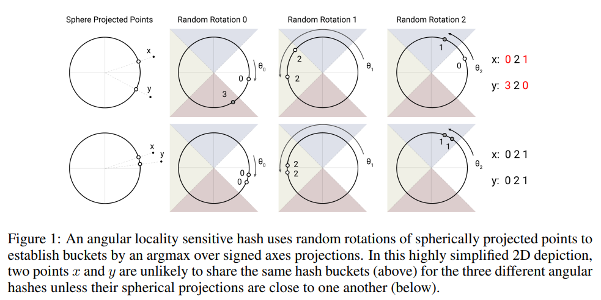

图1：角位置敏感哈希使用球面投影点的随机旋转，通过符号轴投影上的argmax建立桶。在这个高度简化的2D描述中，两个点x和y不太可能共享三个不同角度哈希的相同哈希桶（上图），除非它们的球形投影彼此接近（下图）。

**为了得到 $b$ 个哈希值**，作者首先固定了一个随机矩阵 $R$ ，形状是 $[d_k, b/2]$ ，其中，$d_k$ 是第 k 个 $q_k$ 的维度。然后定义了 $h(x) = \arg \max ([xR; -xR])$ （这里的 $xR$ 可以理解成embed之后向量），其中 $[u;v]$ 表示两个向量的连接。这个方法叫LSH策略，在[2015]()中提出，并且它很容易实现，并应用在batch向量计算。

##### LSH注意力

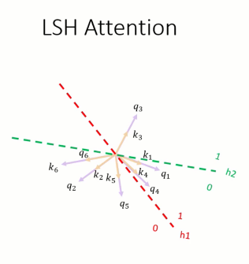

了解了局部敏感策略和哈希注意力的主要思想之后，给出LSH注意力的公式。作者首先重写了普通的注意力函数（公式(1)），对于单个的 $q_i$ ：
$$
o_i = \sum\limits_{j \in \mathcal{P}_i} \exp(q_i \cdot k_j - z(i, \mathcal{P}_i))v_j \qquad 其中, \mathcal{P}_i = \{j : i \geq j\}	\tag{2}
$$
作者引入了符号 $\mathcal{P}_i$ 表示第 i 个query参加的集合（比 i 小的所有位置）， $z$ 表示配分函数（例如，在softmax中归一化参数，即公式(1)中的 $\sqrt{d_k}$ ）。为了更清晰，作者省略了 $\sqrt{d_k}$ 的缩放。

为了batch的目的，我们通常子在一个更大的集合上执行注意力操作，$\widetilde{\mathcal{P}}_i = \{0, 1, ..., l\} \supseteq \mathcal{P}_i$ ，$l$ 是 $Q$ 的长度length，同时mask掉不在 $\mathcal{P}_i$ 中的元素：
$$
o_i = \sum\limits_{j \in \widetilde{\mathcal{P}}_i} \exp(q_i \cdot k_j - m(j, \mathcal{P}_i) - z(i, \mathcal{P}_i))v_j \qquad 其中 \enspace m(j,\mathcal{P}_i) = 
\begin{cases}
	\infty \qquad \mathrm{if} \enspace j\notin \mathcal{P}_i \\
	0 \qquad \mathrm{otherwise}
\end{cases}	\tag{3}
$$
现在转向LSH注意力，从限制目标项的集合 $\mathcal{P}_i$ 来考虑，我们考虑第ℹ个位置的 $q_i$ 和谁进行计算，现只在单个哈希桶内执行注意力操作。
$$
\mathcal{P}_i = \{j : h(q_i) = h(k_j)\}	\tag{4}
$$
用图1解释就是，只有当 $q_i, k_j$ 经过哈希函数后，落在同一个哈希桶内才和 $q_i$ 计算。

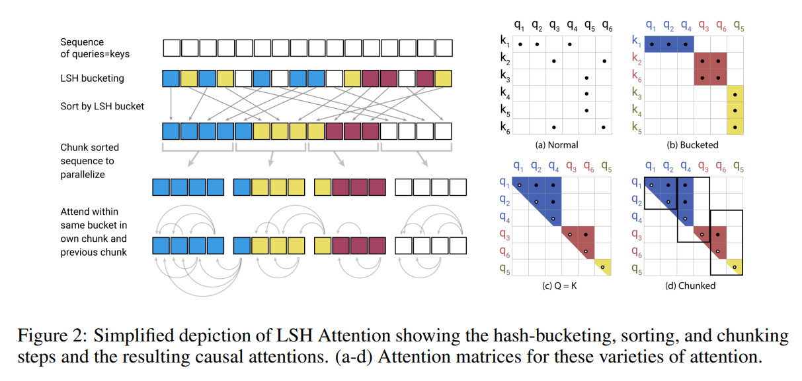

图2（a-b）展示了一个普通注意力和哈希注意力的比较。（a）描述了普通注意力机制的注意力矩阵一般是稀疏的，但是计算并没有利用这样的稀疏性。（b）中，querys和keys根据他们的哈希值进行了排序。query和key越相似，落在同一个桶内的可能性越大，那么普通的注意力机制就可以近似为在每个哈希桶内做注意力。

这个公式里的哈希桶的大小不均匀，这导致对每个桶内 q,k 不好做batch。而且，在一个桶内，querys和keys的数量可能不相等。实际上，一个桶内可能包含很多querys而不是keys。为了避免这些问题，我们首先确保 $h(k_j) = h(q_j)$ ，通过设置 $k_j = \frac{q_j}{\Vert q_j \Vert}$ （目的是让 $k_j$ 成为和 $q_j$ 同方向的单位向量）。接下来，我们根据桶号排序，在每个桶内，按原来的顺序排列。在排序之后，这就定义了一个变换 $i \mapsto s_i$ 。在排序之后的注意力矩阵中，来自同一个桶内的对（pairs）会聚集在对角线（图2（c））。我们可以采用batch处理方法，其中m个连续querys的块（排序后）相互关联，然后返回一个块（chunk）。这对应了如下设置：

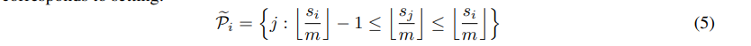

如果 $\max_i \vert \mathcal{P}_i \vert \lt m$ ，那么 $\mathcal{P}_i \subseteq \widetilde{\mathcal{P}}_i$ 。在实现上，我们把设置 $m = \frac{2l}{n_{buckets}}$ （ $l$ 是序列长度）。平均的桶的大小是 $\frac{l}{n_{buckets}}$ ，并且我们假设桶增长到两倍大小的概率足够低。整个LSH注意力机制如图2所示。

##### Multi-round局部敏感注意力

使用哈希，相似的q,k会落入相同的桶内。这个概率会变高，通过多做几轮的哈希，使用 $n_{rounds}$ 个不同的哈希函数 $\{ h^{(1)}, h^{(2)}, ... \}$ ，如下：

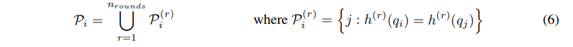

multi-round实际上就是并性的执行了 $n_{rounds}$ 次LSH注意力。附录A中描述了这个过程的细节。

##### Causal masking for shared-QK attention（因果mask：只前面的，不看后面的）

在一个Transformer的decoder中，mask（在公式3中表示为 $m(j, \mathcal{P}_i)$ ）是为了避免提前知道当前时间之后的输入。为了子阿LSH注意力中实现mask，我们用一个位置索引（position index）把每个query/key向量联系到了一起，和上述query/key向量排序额定过程一样，对所有位置索引进行排序，然后使用比较操作来计算mask。

由于mask的存在，当前时间点之后的注意力就不被允许了，原始的Transformer的实现允许在一个时间点自己和自己计算。这样的计算，共享QK方程中不被允许，因为一个query向量和它自己的点积总是比该query和其他位置的向量的点积值要大。因此，我们修改了mask去禁止自己和自己计算点积，除非当前的token（query）在桶内只有它一个（例如，序列中的第一个token）。

#### 2.1. 在一个合成任务上分析

为了验证LSH注意力的性能，并研究它的行为，我们进行如下的合成任务：复制符号序列。在这个任务中，每个训练和测试样本是这样的形式 $0w0w$ ，其中 $w \in \{ 1, ..., N \}^*$ 是一个符号序列，范围从 1到N（我们使用 N = 127）。一个长度为 3 的单词样本如下：

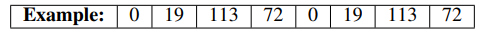

为了研究LSH注意力，我们训练了一个语言模型，在上面形式的样本上，其中每个单词w的长度都是511（所以整个输入 $0w0w$ 的长度就是1024=1+511+1+511）。因为这是一个语言模型任务，我们总是把标签设置为当前单词的下一个单词，但是我们mask损失和准确率，只考虑输入的样本的后半部分的位置（ $0w0w$ 的后 $0w$），即那些实际可以预测的位置。

上述任务可以被完美的解决（acc=100%，损失为0），通过一个一层的Transformer模型。但是，上述任务需要非局部注意力查找，因此任何依赖有限跨度的稀疏注意力的模型都无法解决此问题。为了更快更简单的训练，但是和在NLP中使用的模型相似，我们使用了一个 1 层的Transformer，它的 $d_{model} = d_{ff} = 256, head = 4$ 。我们在4个不同的设置下跑了150K步：普通的注意力， $n_{rounds} = 1$ LSH注意力，=2的注意力，=4的注意力。

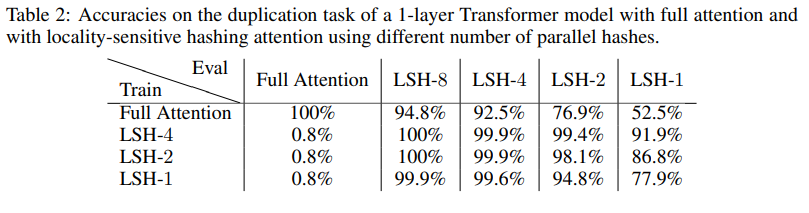

从表2中总结的结果来看，我们可以看出一个用普通注意力训练好的模型，可以直接用在LSH注意力上，但是会丢失一些准确率。当用LSH注意力从头开始训练时，用4个哈希训练的模型也达到了几乎完美的精度。用8个哈希验证，准确率更高。用1个或2个哈希时，准确率就下降了。使用的哈希越少，模型的结果越差，但是甚至只用1个哈希训练的模型，当用8个哈希验证它的时候，效果几乎完美。

### 3.可逆Transformer

正如上述小节中展示的那样，注意力的复杂度可以从平方减少到线性，提供了一可接受的近似的结果。

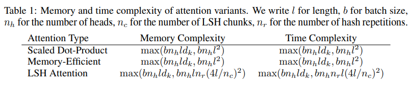

在这个小节中，我们展示了如何减少计算花费。首先我们使用可逆层处理第一项 $n_l$ ，然后用chunk处理 $d_{ff}$ 问题。

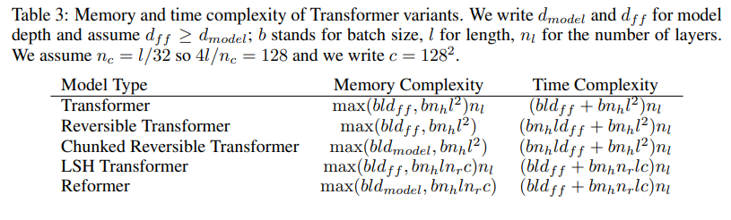

##### RevNets

可逆残差网络由 [2017]() 提出，这个网络可以替ResNet用于分类任务。其主要思想是允许仅使用模型参数从下一层的激活中恢复任何给定层的激活。而不是，在反向传播过程中，必须存中间值。当反向传播从网络的输出进行到其输入时，层可以一个接一个地可逆。一个普通的残差层执行了这样一个函数 $x \mapsto y$ ，单个的输入产生单个的输出 $y = x + F(x)$  ，一个可逆的层可以输入一对： $(x_1, x_2) \mapsto (y_1, y_2)$ ，计算如下：
$$
y_1 = x_1 + F(x_2) \qquad y_2 = x_2 + G(y_1)	\tag{7}
$$
可以通过减法（而不是加法），对层进行可逆计算：
$$
x_2 = y2 - G(y_1) \qquad x_1 = y_1 - F(x_2)	\tag{8}
$$

##### Reversible Transformer

作者在Transformer上应用了RevNet（把attention和feed-forward层放到了RevNet块里面），替换了原来的普通残差。沿用上面的符号， $F$ 成为了注意力层， $G$ 成为了 feed-forward层。注意[Layer Normalization]()在残差块中使用了（还是没用？）。

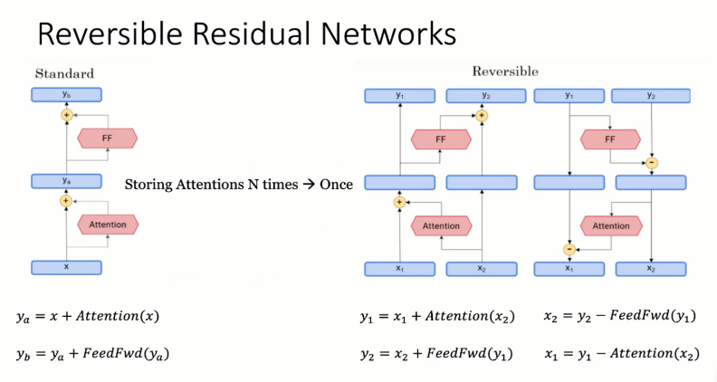

>  Note that Layer Normalization (Ba et al., 2016) is moved inside the residual blocks.

$$
Y_1 = X_1 + \mathrm{Attention}(X_2) \qquad Y_2 = X_2 + \mathrm{FeedForward}(Y_1)	\tag{9}
$$

这个可逆Transformer不需要存每层的激活，所以避免了 $n_l$ 这项的复杂度。在第5节中，这和普通的Transformer想过差不多，使用相同数量的参数。我们通过设置 $x_1, x_2$ 的大小都为 $d_{model}$ 来实现这点。

##### Chunking

当可逆操作消除了 $n_l$ 的复杂度，剩下的层仍然要使用很大的内存。特别的，feed-forward层可以使用维度是 $d_{ff} = 4K $ 或者 维度更高的中间向量。然而，feed-forward层中的计算在序列中的位置之间完全独立，所以计算可以被分割成 $c$ 个块：
$$
Y_2 = [Y^{(1)}_2; ...; Y^{(c)}_2] = [X^{(1)}_2 + \mathrm{FeedForward(Y^{(1)}_1)}; ...; X^{(c)}_2 + \mathrm{FeedForward(Y^{(c)}_1)}]	\tag{10}
$$
该层通常通过对所有位置并行执行操作进行batch处理，但一次对一个块进行操作会减少内存。在公式(8)中的可逆计算和反向传播也可以分成块计算。除了前馈层之外，对于词汇量较大的模型（多于 $d_{model}$ 个单词类型），我们还将输出处的对数概率分块，并计算一次序列部分的损失。

> we also chunk the log-probabilities at the output and calculate the loss for sections of the sequence at a time.

##### Chunking, large batches and parameter reuse

通过分块和可逆层，我们在整个网络中用于激活的内存和层的数量就无关了。但是对于参数并不是这样，层数越多参数越多。这个问题得到了解决，因为我们可以在CPU内存中交换层参数，当这个层不计算时。在标准的Transformer中，这样的操作是低效的，因为内存和CPU之间的交换很慢。然而，Reformer中的batch大小乘以长度要大得多，因此，使用参数进行的计算量将摊销其转移成本。

### 实验

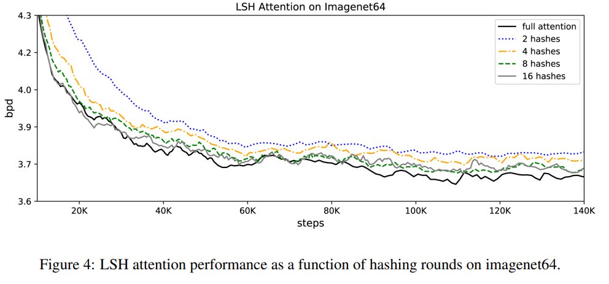

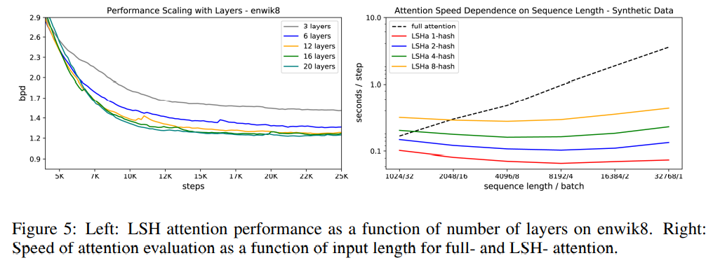

### 别人的理解

参考：[[youtube](https://www.youtube.com/watch?v=i4H0kjxrias)] [[b站](https://www.bilibili.com/video/BV13K4y1o7ae)]

