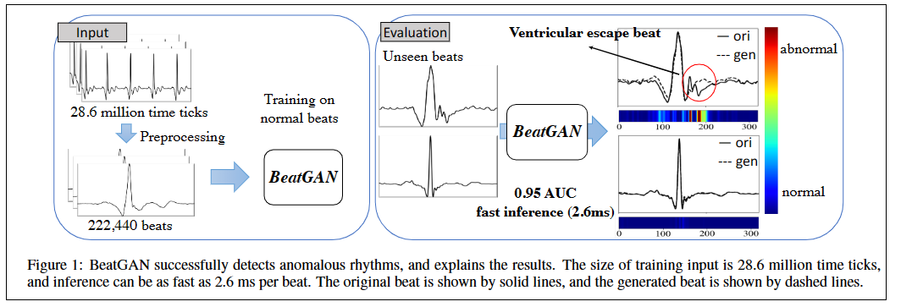
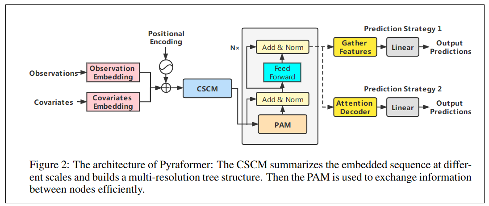
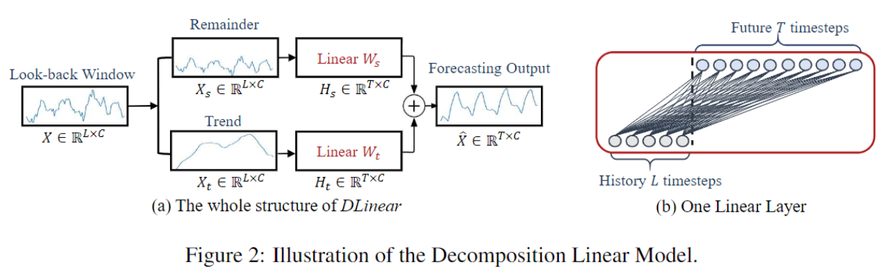

# 多维时序的的综述：异常检测、预测、分类

[TOC]

## 1. 时序分析的一些概念

时间序列通常分为单变量（univariate，一维）和多变量（multivariate，多维）。

### 1.1. 单变量时间序列

单变量时间序列， a univariate time series ，后面简称为（UTS）。
$$
X = (x_1, x_2, \ldots, x_t)	\tag{1}
$$
其中$x_i$是时间$i$的数据，$i \in T$，$T = \{1, 2, \ldots, t\}$。

例子：随时间变化的只有一个变量，记录一天中每个小时的湿度值。

### 1.2. 多变量时间序列

多变量时间序列，a multivariate time series (MTS) 。多元时序数据不仅受过去值的影响（temporal dependency，时间依赖性），还可能受其他相关（性）维度数据的影响。在不同的文献中，维度之间的相关性被称为空间相关性或者度量相关性（ spatial or intermetric dependencies，可以互相替换）。
$$
X_t = (x_t^1, x_t^2, \ldots, x_t^d)	\tag{2}
$$
其中，$X_t$是一个$d$维向量，表示$t$时刻的数据， $X_t$的第$j$行表示为$x_t^j$，表示$t$时刻的第$j$维数据，$j \in \{1,2,\ldots,d\}$。

例子：同时记录风扇功率、CPU使用率。

### 1.3. 时序分解

时序数据可以被分为4种分量：

- 趋势性（总体）：对应在曲线上，就是曲线的向上和向下的移动。长期趋势代表了数据随时间变化的一般模式，不一定是线性的。特定地区数年来人口的变化是非线性增长或衰减的一个例子，取决于各种动力（dynamical）因素。
- 季节性（固定频率）：根据月份、工作日或持续时间，时间序列可能呈现季节性模式。季节性总是以固定的频率出现。比如：能源消耗，网购成交数量等。
- 周期性（不固定频率）：被称作时序的形状。和季节性很像，但是波动的频率不固定，比如：太阳东出西落，夏热冬冷就是季节性。每天的温度变化是周期性。
- 不规则变化：随机的不规则的事件。上面的三种分量被提取出来后，剩下的就是不规则变量。地震或洪水等灾害会导致不规则的变化（突发事件）。

### 1.4. 异常检测

上面说的4种分量，每种分量都可能出现异常。

异常是指与数据总体分布的偏差，例如单个观测（点）或一系列观测（子序列）与总体分布有很大偏差。一小部分数据集存在异常，这意味着数据集是正态分布的。

**异常类型**

分为时间异常（temporal）、指标间异常（intermetric）、时间-指标间异常（temporal-intermetric）。

#### 1.4.1. 时间异常（temporal）

当前时间点的曲线相比于相邻的数据或者整个时间序列来说，出现的异常行为。如下图所示。

- 全局的（Global）：在时序曲线中是波峰，一般是极小或极大值点。    
  $$
  \vert x_t - \hat{x}_t \vert \gt threshold	\tag{3}
  $$
  其中，$\hat{x}_t$是模型的输出，如果输出和实际点值之间的差值大于阈值，则将其视为异常。上图种的global异常点$-6$和曲线有很大的偏差。

- 上下文的（Contextual）：局部的。与给定上下文的偏差将被定义为与相邻时间点的偏差，此处定义为位于某一接近范围内的偏差。一个点在当前上下文中是异常的，但是在其他上下文中可能不是异常点。判断公式和全局异常异常，但是阈值不同。
  $$
  threshold \approx \lambda \ast var(X_{t-w : t+w})	\tag{4}
  $$
  其中，$X_{t-w : t+w}$表示$X_{t}$前后$w$窗口内的数据，$var$是方差，$\lambda$是系数。

- 季节的（Seasonal）：上面说到季节性是固定频率的，当某个或某些子序列中的频率发生变化时，可以判断出现了季节性异常。
  $$
  dist_s(S - \hat{S}) \gt threshold	\tag{5}
  $$
  其中，$dist_s$表示两个子序列之间的不相似度，$\hat{S}$表示预期符合季节性的子序列。如上图季节性异常所示，该异常改变了当前子序列中，曲线波动的频率。

- 趋势的（Trend）：时序的整体趋势发生了变化，但是周期性和季节性仍然保留，斜率急剧改变。当一首新歌出现时，它会流行一段时间，然后从图表中消失，如图1中的片段，其中趋势发生了变化，被认为是趋势异常。
  $$
  dist_t(T - \hat{T}) \gt threshold	\tag{6}
  $$
  其中，$\hat{T}$是正常的趋势。

- 形状的（Shapelt）：子序列或者一个周期的形状和正常的形状不一样。
  $$
  dist_c(C - \hat{C}) \gt threshold	\tag{7}
  $$
  其中，$\hat{C}$是预期子序列的形状。如上图，由于某些原因，波峰变成了方形。

#### 1.4.2. 指标间异常 

用在MTS问题上。

空间依赖（apatial dependencies，每个特征之间的关系）也称作指标间依赖（ntermetric dependencies），它可以是线性或非线性的。如果这些相关性被破坏，MTS就会展现出广泛的异常行为。如下图所示，CPU使用率和功耗的关系（应该是正相关）：

指标间异常：
$$
dist_{corr}(corr(X^j,X^k), corr(X^j_{t:t+w},X^k_{t:t+w})) \gt threshold	\tag{8}
$$
其中，$X^j,X^k$是MTS的两个相关的指标，$corr$计算相关性。判断在$w$的窗口内关系出现异常。

衡量两个长度不同的时间序列的相似度的方法：DTW（Dynamic Time Warping）动态时间规整。

#### 1.4.3. 时间-指标异常

符合时间异常或者指标异常的情况。

### 1.5. 时序预测

**基本任务** 对于包含$C$个变量的时间序列，给定历史序列，$L$是滑动窗口大小，$X_i^t$是时间步$t$的第$i$个值。时序预测任务是预测，在未来的$T$个时间步。

**迭代多步预测** iterated multi-step (IMS) ，一步一步的预测，下一步的预测用到之前的预测结果。

**直接多步预测** direct multi-step（DMS），一次预测多步。

时序预测一般分为三种类型：

- 短序列预测
- 趋势预测
- 精准长序列预测

### 1.6. 时序分类

 **时序分类**  Time series classification (TSC) 。

给定数据集，其中由N个时间序列，训练得到模型，输出分好的类标签。

### 1.7. 判断结果好坏的标准

**异常检测** 精度（P precision，异常/异常+非异常判成异常），召回率（R recall，异常/异常+异常判成非异常），F1分数（F1-score，精度和召回率的调和平均数，2/(1/P + 1/R)）。

**时序预测** 预测值和实际值之间的MAE和MSE。

**时序分类** 准确率。

**[AUC](https://blog.csdn.net/liweibin1994/article/details/79462554)** 值在0.5-1之间，判断分类器的好坏，越接近1分类器效果越好。

## 2. 数据集

[UCI网站](https://archive.ics.uci.edu/ml/index.php)

### 2.1. 异常检测

[异常检测数据集](https://github.com/zamanzadeh/ts-anomaly-benchmark)

Entities：每个数据集中有多少组时序数据。

### 2.2. 时序预测

ILI：描述了流感样疾病患者的比例和患者数量。它包括美国疾病控制和预防中心2002年至2021的每周数据。

### 2.3. 时序分类

UCI网站。  

例子：[高校学生成绩](https://archive.ics.uci.edu/ml/datasets/Higher+Education+Students+Performance+Evaluation+Dataset)

## 3. 异常检测

下面给出时序异常检测的深度学习方法。

模型：

异常检测的过程：

上图中的Learning模块，一般有两种方法：基于预测的方法和基于重建的方法。这些模型如下表所示：

其中：

- Temporal/Spatial：输入单元时序捕捉时间依赖，如果输入的多元时序可能会捕捉到空间依赖，即指标之间的异常。

- 学习策略：无监督、有监督、半监督和自监督。

  有监督：训练集有标签，根据阈值判断模是否异常。

  无监督：一般的异常检测场景都是无监督。

  半监督：只有正常点组成的情况下使用，对模型进行训练以拟合时间序列分布，并将偏离该分布的任何点检测为异常。

  自监督：重建的方法。

- 输入：是单个点还是滑动窗口。（Window/Point）

- 可解释性。

- 异常类型：点异常还是子序列异常。
- 随机性
- 增量学习

### 3.1. 基于预测的方法

用模型预测出来的“正常数据”和实际数据相比较判断是否异常。因为显示生活中异常数据相比于正常数据非常少，所以基于预测的方法可行。

#### 3.1.1. RNN

##### ① 基于LSTM的方法

- [DeepLSTM（2015）](https://www.researchgate.net/profile/Sucheta-Chauhan/publication/308852664_Anomaly_detection_in_ECG_time_signals_via_deep_long_short-term_memory_networks/links/5a719365458515015e64a698/Anomaly-detection-in-ECG-time-signals-via-deep-long-short-term-memory-networks.pdf) [1]：Anomaly detection in ECG time signals via deep long short-term memory networks

  能够产生更好的特征。

  

- [ LSTM-PRED（2017）](https://www.researchgate.net/profile/Sridhar-Adepu/publication/316530203_Anomaly_Detection_in_Cyber_Physical_Systems_Using_Recurrent_Neural_Networks/links/5c93085392851cf0ae8bdfed/Anomaly-Detection-in-Cyber-Physical-Systems-Using-Recurrent-Neural-Networks.pdf)[2]：Anomaly detection in cyber physical systems using recurrent neural network

- NASA：[LSTM-NDT（2018）](https://arxiv.org/pdf/1802.04431)[3]：Detecting Spacecraft Anomalies Using LSTMs and
  Nonparametric Dynamic Thresholding

  LSTM和RNN通过从MTS中提取历史信息来实现高预测性能。提出了一种互补的无监督和非参数异常阈值方法，该方法是在SMAP异常检测系统的试点实施过程中开发的，并提供了假阳性缓解策略以及开发过程中的其他关键改进和经验教训。

  [csdn](https://blog.csdn.net/WangZixuan1111/article/details/105046528)：

  1. 第一步：用LSTM学习时序数据做预测
     1. 单通道模型
     2. 预测通道的值
  2. 第二步：收集每一步误差构成误差向量
  3. 第三步：对误差作加权平均的平滑处理
  4. 第四步：根据平滑后的数据计算阈值
  5. 第五步：高于阈值标为样本
  6. 为降低误报率，找出假阳性数据，提出“修剪策略”
  7. 实验参数设置及实验结果分析

- [LGMAD（2019）](https://www.sciencedirect.com/science/article/pii/S0045790618334372)[4]：Real-time anomaly detection based on long short-Term memory and Gaussian Mixture Model

  第一步使用LSTM检测一元时序异常，然后采用高斯混合模型以提供潜在异常的多维联合检测。

  

  

##### ② 基于GRU的方法

- [AD-LTI（2020）](https://arxiv.org/pdf/1908.01146)[5]：Developing an Unsupervised Real-time Anomaly Detection Scheme for Time Series with Multi-seasonality
  
  相比于一般的LSTM和GRU方法，这篇工作可以减少计算量。

  它是一种预测模型，使用名为Prophet[166]的时间序列分解方法集成GRU网络，以实现对无标签季节性时间序列数据的鲁棒学习。通过在运行预测模型之前进行时间序列分解，将输入数据的季节性特征显式地输入GRU网络。此外，由于预测基于先前的数据，可能包含异常点，因此可能不可靠。为了估计异常的可能性，提出了一种称为局部趋势不一致性（LTI，Local Trend Inconsistenc）的新度量。通过权衡基于最近时间点帧的预测及其正常概率，LTI克服了历史数据中可能存在异常帧的问题。

  

- [THOC（2020）](https://proceedings.neurips.cc/paper/2020/file/97e401a02082021fd24957f852e0e475-Paper.pdf)[6]：Time series Anomaly Detection using Temporal Hierarchical One-Class Network
  
  One-class classification 是一种流行的异常检测范式。它背后的想法是通过假设大多数训练数据是正常的，它们的特征被模型捕获和学习。当模型不能很好地拟合当前观测值时，就表示检测到异常值。
  
  文本受深度支持向量数据描述（deep support vector data description SVDD）启发。
  
  RNN提取不同尺度的特征+层次网络计算异常分数。
  
  

#### 3.1.2. CNN

RNN网络比CNN网络更容易处理时序数据，CNN一般用来对提取数据的高级特征，不能直接用于时序数据，所以针对时序数据专门提出了一些基于CNN的方法（时间卷积网络，[TCN（2018）](https://arxiv.org/pdf/1803.01271.pdf%E3%80%82%E6%9C%AC%E6%96%87%E5%BC%95%E7%94%A8%E7%94%A8(%5C*)%E8%A1%A8%E7%A4%BA%E3%80%82)， temporal convolutional network），空洞卷积能适应序列数据。许多CNN模型都使用TCN做异常检测。

- TCN使用空洞卷积控制模型不使用未来的数据。：An Empirical Evaluation of Generic Convolutional and Recurrent Networks for Sequence Modeling
  
  TCN的结构
  
  
  
- [DeepAnt（2018）](https://www.researchgate.net/profile/Mohsin-Munir/publication/329792334_DeepAnT_A_Deep_Learning_Approach_for_Unsupervised_Anomaly_Detection_in_Time_Series/links/5c331c27458515a4c7130eeb/DeepAnT-A-Deep-Learning-Approach-for-Unsupervised-Anomaly-Detection-in-Time-Series.pdf)[7]：A deep learning approach for unsupervised anomaly
  detection in time series

  

  CNN预测的和真实数据之间的欧氏距离作为异常分数。

- [TCN-ms（2019）](https://iopscience.iop.org/article/10.1088/1742-6596/1213/4/042050/pdf)[8]：Temporal convolutional networks for anomaly detection in time series

  TCN模型输出和真实数据的误差当作异常分数。

#### 3.1.3. Transformers

- [SAnD（2018）](https://ojs.aaai.org/index.php/AAAI/article/view/11635/11494)[9]：临床时序数据，Attend and diagnose: Clinical time series analysis using attention models
  
  Transformer在医学数据上的应用。
  
  

### 3.2. 基于重建的方法

如上图所示，有些时序数据很难预测，所以基于预测的方法在这些数据上并不适用。在这种情况下，就可以使用重建的方法。

在测试阶段，通过重建test数据和真实数据误差（重建误差），判断是否异常。

#### 3.2.1. AE

- [DAGMM（2018）](https://openreview.net/pdf?id=BJJLHbb0-) [10]：Deep autoencoding gaussian mixture model for unsupervised anomaly detection

  有两个部分组成：压缩网络和估计网络。压缩网络是一个AE，对输入的时序数据进行降维，估计网络通过低维表示中的高斯混合模型来计算样本能量。样本能量用来定义重建误差，越大异常可能性越高。

  

- [USAD（2020）](https://dl.acm.org/doi/pdf/10.1145/3394486.3403392)[11]：UnSupervised Anomaly Detection on Multivariate Time Series

  无监督异常检测，在AE中引入了对抗训练的思想。通过两个AE，加速训练，用两个AE的重建误差和判断异常。首先，对两种AEs进行训练，学习重建正常输入窗口。其次，两种AEs以对抗性的方式训练，AE1试图欺骗AE2，AE2的目标是学习数据是真实的（直接来自w）还是重构的（来自AE1）。

  

- [APAE（2020）](https://www.ijcai.org/proceedings/2020/0173.pdf)[12]：Robustness of Autoencoders for Anomaly Detection Under Adversarial Impact

  优化了USAD的性能，提出近似投影自动编码器（APAE），不是原来的数据了，用近似的数据训练。提高重建精度。

  

- [MSCRED（2019）](https://ojs.aaai.org/index.php/AAAI/article/download/3942/3820)[13]：A deep neural network for unsupervised anomaly detection and diagnosis in multivariate time series data

  AE、ConvLSTM、attention的结合。

  

-  [CAE-Ensemble（2021）](https://arxiv.org/pdf/2111.11108)[14]：Unsupervised Time Series Outlier Detection with
  Diversity-Driven Convolutional Ensemble--Extended Version

  在异常检测中使用集成学习。

  

  

  

- [RANSysCoders（2021）](https://dl.acm.org/doi/pdf/10.1145/3447548.3467174) [15]：Practical Approach to Asynchronous Multivariate Time Series Anomaly Detection and Localization

  ebay电商时序数据。首先利用 AutoEncoder 对原始异步时间序列提取特征，然后对序列特征进行傅里叶变换分析，学习到相位差来对齐异步时间序列获得同步的时间序列表示，最后选择同步时间序列的子集序列来训练 AutoEncoder 重构误差来推断和定位异常。

  

  

- [AMSL（2022）](https://arxiv.org/pdf/2201.00464)[16]： Adaptive memory networks with self-supervised learning for unsupervised anomaly detection
  
  自监督学习模块 ，全局记忆模块，局部记忆模块，自适应融合模块
  
  解决两个关键问题：数据源限制和特征表达限制（泛化性能）
  
  提出了AMSL方法，分别通过**自监督学习模块**和**记忆网络模块**来解决数据源限制和特征表达限制这两个挑战。
  
  提出了**全局和局部记忆模块**以增强模型的特征表达能力，并进一步提出**自适应记忆融合模块**用于融合正常数据的共有特征和特有特征。
  
  
  
  

#### 3.2.2. VAE

- [LSTM-VAE（2018）](https://arxiv.org/pdf/1711.00614)[17]：A Multimodal Anomaly Detector for Robot-Assisted Feeding
  Using an LSTM-based Variational Autoencoder

  LSTM和VAE的结合。

  

- [OmniAnomaly](https://netman.aiops.org/wp-content/uploads/2019/08/OmniAnomaly_camera-ready.pdf)（2019）[18]：Robust Anomaly Detection for Multivariate Time Series
  through Stochastic Recurrent Neural Network

  GRU+VAE，提出随机变量连接技术：线性高斯状态空间模型， 随机变量的连接，以及随机变量和GRU潜在变量的连接。为了帮助随机变量捕捉输入数据的复杂分布，采用平面归一化流，它使用一系列可逆映射来学习潜在空间中的非高斯后验分布。

  

  

- [InterFusion（2021）](https://netman.aiops.org/wp-content/uploads/2021/08/KDD21_InterFusion_Li.pdf)[19]：Multivariate Time Series Anomaly Detection and Interpretation
  using Hierarchical Inter-Metric and Temporal Embedding

  提出使用具有两个随机潜在变量的分层变分自动编码器（HVAE）来学习度量和时间表示；以及通过依赖于辅助“重建输入”的两视图嵌入，该辅助“重构输入”将MTS与度量和时间方面一起压缩。为了防止训练数据中的过度拟合异常，InterFusion采用了一种预滤波策略，其中通过重建过程消除时间异常，以学习精确的度量表示。

  

**一些关于噪声时间序列数据的异常检测的研究。**

- [SISVAE（2020）](https://arxiv.org/pdf/2102.01331)[20]：Anomaly detection of time series with smoothness-inducing sequential variational auto-encoder
  
  平滑诱导序贯变分自编码器（Smoothness-Inducing Sequential Variational Auto-Encoder, SISVAE）
  
  RNN+VAE+平滑损失。
  
  
  
  取时间序列中连续的两个时间点的重构分布，平滑损失定义：
  
  
  
  

- [VELC（2019）](https://arxiv.org/pdf/1907.01702)[21]：VELC: A New Variational AutoEncoder Based Model for Time Series Anomaly Detection
  
  两个部分：Re-Encoder + Latent Constraint network
  
  这个方法是在特征空间上的方法，Re-Encoder：生成重建向量的特征表示。Constraint network：限制模型重建异常点。
  
  
  
- [PAD（2021）](https://arxiv.org/pdf/1910.03818)[22]：A Joint Model for IT Operation Series Prediction and Anomaly Detection

  同时进行预测和异常检测

  VAE+LSTM，Spectral Residual：谱残差（2007）

  

- [VAE-GAN（2020）](https://www.mdpi.com/1424-8220/20/13/3738/pdf?version=1594212262)[23]：LSTM-Based VAE-GAN for Time-Series Anomaly Detection
  
  VAE+LSTM+GAN，生成器和判别器互相对抗（判断$Z \sim N(0,1)$，是不是真实数据重建的）。
  
  

- [RDSSM（2022）](https://ieeexplore.ieee.org/abstract/document/9773982)[24]：Learning Robust Deep State Space for Unsupervised Anomaly
  Detection in Contaminated Time-Series.

  pdf损坏暂时看不了。

#### 3.2.3. GAN

- [BeatGAN（2019）](https://www.ijcai.org/Proceedings/2019/0616.pdf)[25]：Anomalous Rhythm Detection using Adversarially Generated
  Time Series
  
  AE+GAN
  
  预处理时把有节奏的时序数据减少。AE结构是卷积。
  
  
  
  
  
- [MAD-GAN（2019）](https://arxiv.org/pdf/1901.04997)[26]： Multivariate anomaly detection for time series data with generative adversarial network

  LSTM+GAN

  

- [DAEMON（2021）](https://ieeexplore.ieee.org/abstract/document/9458835/)[27]：Daemon: Unsupervised anomaly detection and interpretation for multivariate time series.
  
  VAE+GAN
  
  
  
  
  
- [FGANomaly（2021）](https://ieeexplore.ieee.org/abstract/document/9618824/)[28]：GAN-Based Anomaly Detection for Multivariate Time
  Series Using Polluted Training Set
  
  暂时看不了。
  
  

#### 3.2.4. Transformers

- [DCT-GAN（2021）](https://ieeexplore.ieee.org/abstract/document/9626552/)[29]： Dilated Convolutional Transformer-based GAN for Time Series
  Anomaly Detection. 

  暂时看不了。
  
- [Anomaly Transformer（2022）](https://arxiv.org/pdf/2110.02642)[30]：Time series anomaly detection with association discrepancy

  提出了异常注意力机制（两个分支），上面的分支对异常点很少这个先验模式建模，下面的分支对时间依赖建模。

  

- [TranAD（2022）](https://arxiv.org/pdf/2201.07284)[31]：Deep transformer networks for anomaly detection in multivariate time
  series data
  
  Transformer+GAN
  
  这个Focus score初始化为一个全0的矩阵，用来过滤和当前时间点无关的数据。
  
  
  
  
  
  
  
- [MT-RVAE（2022）](https://www.sciencedirect.com/science/article/pii/S0263224122000914/pdfft?md5=7bddbf136fc425e55ac6fed3a9a1d6e2&pid=1-s2.0-S0263224122000914-main.pdf)[32]：Variational transformer-based anomaly detection approach for multivariate time series

  

  发现不同维度之间的关系：

  

### 3.3. 预测和重建的结合

预测模型用来预测下一时间的数据，重建方法使用时序的潜在表示。

#### 3.3.1. AE

- [CAE-M（2021）](https://arxiv.org/pdf/2107.12626)[33]： Unsupervised deep anomaly detection for multi-sensor time-series signals.

  AE+双向LSTM

  

## 4. 时序预测

近几年长时间序列预测领域的发展集中在基于Transformer的方法上。

Transformer相比于RNN更容易捕捉长时间序列的时间依赖。

- [LogTrans（2019）](https://proceedings.neurips.cc/paper/2019/file/6775a0635c302542da2c32aa19d86be0-Paper.pdf)[34]：Enhancing the locality and breaking the memory bottleneck of transformer on time series forecasting

  把TranFormer引入时序预测中，为了让Transformer的Q、K看到一定时间序列的局部特征，引入了卷积自注意力机制。

  

  

- [Informer（2021）](https://ojs.aaai.org/index.php/AAAI/article/download/17325/17132)[35]：Beyond efficient transformer for long sequence time-series forecasting

  优化基于Transformer方法的计算量。提出ProbSparse注意力，根据作者提供的计算方法，减少了Q，K的计算量。

  

- [AutoFormer（2021）](https://proceedings.neurips.cc/paper/2021/file/bcc0d400288793e8bdcd7c19a8ac0c2b-Paper.pdf)[36]：Decomposition transformers with auto-correlation for long-term series forecasting

  Informer的效果已经很好了，Autoformer从时序分解的角度切入，提出了时序分解模块，和自相关机制。

  

  

- [FedFormer（2022）](https://proceedings.mlr.press/v162/zhou22g/zhou22g.pdf)[37]：Frequency enhanced decomposed transformer for long-term series forecasting

  优化计算量。季节趋势分解，提出在频率的注意力机制。

  频域学习模块（Frequency Enhanced Block）、频域注意力模块（Frequency Enhanced Attention）、周期-趋势分解模块（MOE Decomp）、前向传播模块（Feed Forward）。

  

- [PyraFormer（2022）](https://openreview.net/pdf?id=0EXmFzUn5I)[38]：Low-complexity pyramidal attention for long-range time series modeling and forecasting

  进一步优化计算量。提出金字塔注意力模块。

  

  

- [Are Transformers Effective for Time Series Forecasting?（2022）](https://arxiv.org/pdf/2205.13504.pdf%E2%80%9D)[39]

  对Transformer在时序预测上的表现提出质疑。这里的时间序列分解和Autoformer 一模一样，后面就是两个线性层最后加一起，就效果好了。

  

  

- [PatchTST（2023）](https://arxiv.org/pdf/2211.14730)[40]：A Time Series is Worth 64 Words: Long-term Forecasting with Transformers

  作者说，Transformer效果没有DLinear好是因为没找到时序在transformer上的正确用法。

  

- [LaST（2022）](https://openreview.net/pdf?id=C9yUwd72yy)[41]：Learning Latent Seasonal-Trend Representations for Time Series Forecasting

  作者创建了一个模型(LAST)，使用变分推理创建季节性和趋势的分离表示。效果和autoFormer差不多。

  

## 5. 时序分类

多元时序分类。

时序分类的一篇综述（2023）[42]：[Deep Learning for Time Series Classification and Extrinsic Regression: A Current Survey](https://arxiv.org/pdf/2302.02515)

## 6. 基于图的时序异常检测

基于图的异常检测综述（2023）[43]：[Graph-based Time-Series Anomaly Detection: A Survey](https://arxiv.org/pdf/2302.00058)

在过去几年中，研究人员提出从MTS中提取空间信息并形成一个图结构。然后，将时间序列异常检测问题转化为检测图结构中时序的异常，并使用GNN对这些图进行建模。

### 6.1. 图网络 Graph Neural Network (GNN)

GNN中，图节点通过彼此交换信息来迭代更新其表示（图学习的关键在于消息传递）。在MTS异常检测中，每个维度（指标）就是图中的一个节点。图中的边就表示从MTS中学到的相关性。

第k+1步每个结点的更新：

### 6.2. 方法

[TopoMAD（2020）](https://yuxiaoba.github.io/publication/topomad20/topomad20.pdf)[44]：A Spatio temporal Deep Learning Approach for Unsupervised Anomaly Detection in Cloud Systems

GNN+LSTM+VAE

- [GTA（2021）](https://arxiv.org/pdf/2104.03466)[45]：Learning graph structures with transformer for multivariate time series anomaly detection in iot

  Transformer+GNN

  

  

- [FuSAGNet（2022）](https://scholar.archive.org/work/tmkmeflqbvgcfgq4k6viyti6me/access/wayback/https://dl.acm.org/doi/pdf/10.1145/3534678.3539117)[46]：Learning Sparse Latent Graph Representations for Anomaly Detection in Multivariate Time Series

  稀疏AE重建+GNN预测

  

## 参考文献

[1] Chauhan S, Vig L. Anomaly detection in ECG time signals via deep long short-term memory networks[C]//2015 IEEE international conference on data science and advanced analytics (DSAA). IEEE, 2015: 1-7.

[2] Goh J, Adepu S, Tan M, et al. Anomaly detection in cyber physical systems using recurrent neural networks[C]//2017 IEEE 18th International Symposium on High Assurance Systems Engineering (HASE). IEEE, 2017: 140-145.

[3] Hundman K, Constantinou V, Laporte C, et al. Detecting spacecraft anomalies using lstms and nonparametric dynamic thresholding[C]//Proceedings of the 24th ACM SIGKDD international conference on knowledge discovery & data mining. 2018: 387-395.

[4] Ding N, Ma H X, Gao H, et al. Real-time anomaly detection based on long short-Term memory and Gaussian Mixture Model[J]. Computers & Electrical Engineering, 2019, 79: 106458.

[5] Wu W, He L, Lin W, et al. Developing an unsupervised real-time anomaly detection scheme for time series with multi-seasonality[J]. IEEE Transactions on Knowledge and Data Engineering, 2020, 34(9): 4147-4160.

[6] Shen L, Li Z, Kwok J. Timeseries anomaly detection using temporal hierarchical one-class network[J]. Advances in Neural Information Processing Systems, 2020, 33: 13016-13026.

[7] Munir M, Siddiqui S A, Dengel A, et al. DeepAnT: A deep learning approach for unsupervised anomaly detection in time series[J]. Ieee Access, 2018, 7: 1991-2005.

[8] Zhang C, Song D, Chen Y, et al. A deep neural network for unsupervised anomaly detection and diagnosis in multivariate time series data[C]//Proceedings of the AAAI conference on artificial intelligence. 2019, 33(01): 1409-1416.

[9] Song H, Rajan D, Thiagarajan J, et al. Attend and diagnose: Clinical time series analysis using attention models[C]//Proceedings of the AAAI conference on artificial intelligence. 2018, 32(1).

[10] Zong B, Song Q, Min M R, et al. Deep autoencoding gaussian mixture model for unsupervised anomaly detection[C]//International conference on learning representations. 2018.

[11] Bäßler D, Kortus T, Gühring G. Unsupervised anomaly detection in multivariate time series with online evolving spiking neural networks[J]. Machine Learning, 2022, 111(4): 1377-1408.

[12] Goodge A, Hooi B, Ng S K, et al. Robustness of Autoencoders for Anomaly Detection Under Adversarial Impact[C]//IJCAI. 2020: 1244-1250.

[13] Zhang C, Song D, Chen Y, et al. A deep neural network for unsupervised anomaly detection and diagnosis in multivariate time series data[C]//Proceedings of the AAAI conference on artificial intelligence. 2019, 33(01): 1409-1416.

[14] Campos D, Kieu T, Guo C, et al. Unsupervised Time Series Outlier Detection with Diversity-Driven Convolutional Ensembles--Extended Version[J]. arXiv preprint arXiv:2111.11108, 2021.

[15] Abdulaal A, Liu Z, Lancewicki T. Practical approach to asynchronous multivariate time series anomaly detection and localization[C]//Proceedings of the 27th ACM SIGKDD conference on knowledge discovery & data mining. 2021: 2485-2494.

[16] Zhang Y, Wang J, Chen Y, et al. Adaptive memory networks with self-supervised learning for unsupervised anomaly detection[J]. IEEE Transactions on Knowledge and Data Engineering, 2022.

[17] Park D, Hoshi Y, Kemp C C. A multimodal anomaly detector for robot-assisted feeding using an lstm-based variational autoencoder[J]. IEEE Robotics and Automation Letters, 2018, 3(3): 1544-1551.

[18] Su Y, Zhao Y, Niu C, et al. Robust anomaly detection for multivariate time series through stochastic recurrent neural network[C]//Proceedings of the 25th ACM SIGKDD international conference on knowledge discovery & data mining. 2019: 2828-2837.

[19] Li Z, Zhao Y, Han J, et al. Multivariate time series anomaly detection and interpretation using hierarchical inter-metric and temporal embedding[C]//Proceedings of the 27th ACM SIGKDD conference on knowledge discovery & data mining. 2021: 3220-3230.

[20] Li L, Yan J, Wang H, et al. Anomaly detection of time series with smoothness-inducing sequential variational auto-encoder[J]. IEEE transactions on neural networks and learning systems, 2020, 32(3): 1177-1191.

[21] Zhang C, Li S, Zhang H, et al. Velc: A new variational autoencoder based model for time series anomaly detection[J]. arXiv preprint arXiv:1907.01702, 2019.

[22] Chen R Q, Shi G H, Zhao W L, et al. A joint model for IT operation series prediction and anomaly detection[J]. Neurocomputing, 2021, 448: 130-139.

[23] Niu Z, Yu K, Wu X. LSTM-based VAE-GAN for time-series anomaly detection[J]. Sensors, 2020, 20(13): 3738.

[24] Li L, Yan J, Wen Q, et al. Learning robust deep state space for unsupervised anomaly detection in contaminated time-series[J]. IEEE Transactions on Knowledge and Data Engineering, 2022.

[25] Zhou B, Liu S, Hooi B, et al. BeatGAN: Anomalous Rhythm Detection using Adversarially Generated Time Series[C]//IJCAI. 2019, 2019: 4433-4439.

[26] Li D, Chen D, Jin B, et al. MAD-GAN: Multivariate anomaly detection for time series data with generative adversarial networks[C]//Artificial Neural Networks and Machine Learning–ICANN 2019: Text and Time Series: 28th International Conference on Artificial Neural Networks, Munich, Germany, September 17–19, 2019, Proceedings, Part IV. Cham: Springer International Publishing, 2019: 703-716.

[27] Chen X, Deng L, Huang F, et al. Daemon: Unsupervised anomaly detection and interpretation for multivariate time series[C]//2021 IEEE 37th International Conference on Data Engineering (ICDE). IEEE, 2021: 2225-2230.

[28] Du B, Sun X, Ye J, et al. GAN-based anomaly detection for multivariate time series using polluted training set[J]. IEEE Transactions on Knowledge and Data Engineering, 2021.

[29] Li Y, Peng X, Zhang J, et al. DCT-GAN: dilated convolutional transformer-based gan for time series anomaly detection[J]. IEEE Transactions on Knowledge and Data Engineering, 2021.

[30] Xu J, Wu H, Wang J, et al. Anomaly transformer: Time series anomaly detection with association discrepancy[J]. arXiv preprint arXiv:2110.02642, 2021.

[31] Tuli S, Casale G, Jennings N R. Tranad: Deep transformer networks for anomaly detection in multivariate time series data[J]. arXiv preprint arXiv:2201.07284, 2022.

[32] Wang X, Pi D, Zhang X, et al. Variational transformer-based anomaly detection approach for multivariate time series[J]. Measurement, 2022, 191: 110791.

[33] Zhang Y, Chen Y, Wang J, et al. Unsupervised deep anomaly detection for multi-sensor time-series signals[J]. IEEE Transactions on Knowledge and Data Engineering, 2021.

[34] Li S, Jin X, Xuan Y, et al. Enhancing the locality and breaking the memory bottleneck of transformer on time series forecasting[J]. Advances in neural information processing systems, 2019, 32.

[35] Zhou H, Zhang S, Peng J, et al. Informer: Beyond efficient transformer for long sequence time-series forecasting[C]//Proceedings of the AAAI conference on artificial intelligence. 2021, 35(12): 11106-11115.

[36] Wu H, Xu J, Wang J, et al. Autoformer: Decomposition transformers with auto-correlation for long-term series forecasting[J]. Advances in Neural Information Processing Systems, 2021, 34: 22419-22430.

[37] Zhou T, Ma Z, Wen Q, et al. Fedformer: Frequency enhanced decomposed transformer for long-term series forecasting[C]//International Conference on Machine Learning. PMLR, 2022: 27268-27286.

[38] Liu S, Yu H, Liao C, et al. Pyraformer: Low-complexity pyramidal attention for long-range time series modeling and forecasting[C]//International conference on learning representations. 2021.

[39] Zeng A, Chen M, Zhang L, et al. Are transformers effective for time series forecasting?[J]. arXiv preprint arXiv:2205.13504, 2022.

[40] Nie Y, Nguyen N H, Sinthong P, et al. A Time Series is Worth 64 Words: Long-term Forecasting with Transformers[J]. arXiv preprint arXiv:2211.14730, 2022.

[41] Wang Z, Xu X, Zhang W, et al. Learning Latent Seasonal-Trend Representations for Time Series Forecasting[C]//Advances in Neural Information Processing Systems. 2022.

[42] Foumani N M, Miller L, Tan C W, et al. Deep Learning for Time Series Classification and Extrinsic Regression: A Current Survey[J]. arXiv preprint arXiv:2302.02515, 2023.

[43] Ho T K K, Karami A, Armanfard N. Graph-based Time-Series Anomaly Detection: A Survey[J]. arXiv preprint arXiv:2302.00058, 2023.

[44] He Z, Chen P, Li X, et al. A spatiotemporal deep learning approach for unsupervised anomaly detection in cloud systems[J]. IEEE Transactions on Neural Networks and Learning Systems, 2020.

[45] Chen Z, Chen D, Zhang X, et al. Learning graph structures with transformer for multivariate time-series anomaly detection in IoT[J]. IEEE Internet of Things Journal, 2021, 9(12): 9179-9189.

[46] Han S, Woo S S. Learning Sparse Latent Graph Representations for Anomaly Detection in Multivariate Time Series[C]//Proceedings of the 28th ACM SIGKDD Conference on Knowledge Discovery and Data Mining. 2022: 2977-2986.
