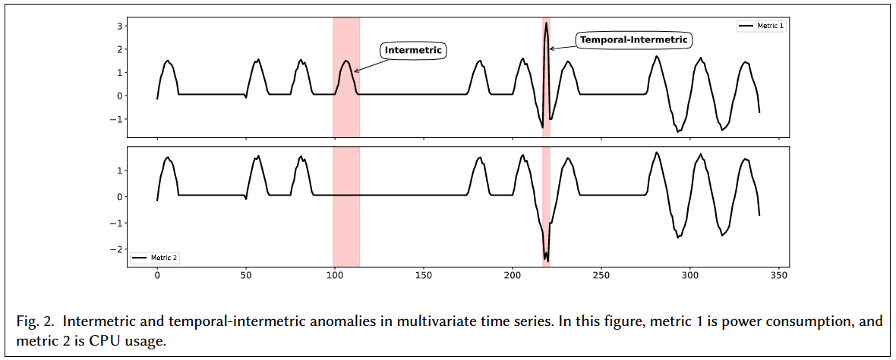

# 多维时序的的综述：预测、异常检测、分类、生成

[TOC]

## 1. 时序分析的基础

时间序列通常分为单变量（univariate，一维）和多变量（multivariate，多维）。

### 1.1. 单变量时间序列

单变量时间序列， a univariate time series ，后面简称为（UTS）。
$$
X = (x_1, x_2, \ldots, x_t)	\tag{1}
$$
其中$x_i$是时间$i$的数据，$i \in T$，$T = \{1, 2, \ldots, t\}$。

例子：随时间变化的只有一个变量，记录一天中每个小时的湿度值。

### 1.2. 多变量时间序列

多变量时间序列，a multivariate time series (MTS) 。多元时序数据不仅受过去值的影响（temporal dependency，时间依赖性），还可能受其他相关（性）维度数据的影响。在不同的文献中，维度之间的相关性被称为空间相关性或者度量相关性（ spatial or intermetric dependencies，可以互相替换）。
$$
X_t = (x_t^1, x_t^2, \ldots, x_t^d)	\tag{2}
$$
其中，$X_t$是一个$d$维向量，表示$t$时刻的数据， $X_t$的第$j$行表示为$x_t^j$，表示$t$时刻的第$j$维数据，$j \in \{1,2,\ldots,d\}$。

例子：同时记录风扇功率、CPU使用率。

### 1.3. 时序分解

时序数据可以被分为4种分量：

- 趋势性（总体）：对应在曲线上，就是曲线的向上和向下的移动。长期趋势代表了数据随时间变化的一般模式，不一定是线性的。特定地区数年来人口的变化是非线性增长或衰减的一个例子，取决于各种动力（dynamical）因素。
- 季节性（固定频率）：根据月份、工作日或持续时间，时间序列可能呈现季节性模式。季节性总是以固定的频率出现。比如：能源消耗，网购成交数量等。
- 周期性（不固定频率）：被称作时序的形状。和季节性很像，但是波动的频率不固定，比如：太阳东出西落，夏热冬冷就是季节性。每天的温度变化是周期性。
- 不规则变化：随机的不规则的事件。上面的三种分量被提取出来后，剩下的就是不规则变量。地震或洪水等灾害会导致不规则的变化（突发事件）。

### 1.4. 异常检测

上面说的4种分量，每种分量都可能出现异常。

时序
