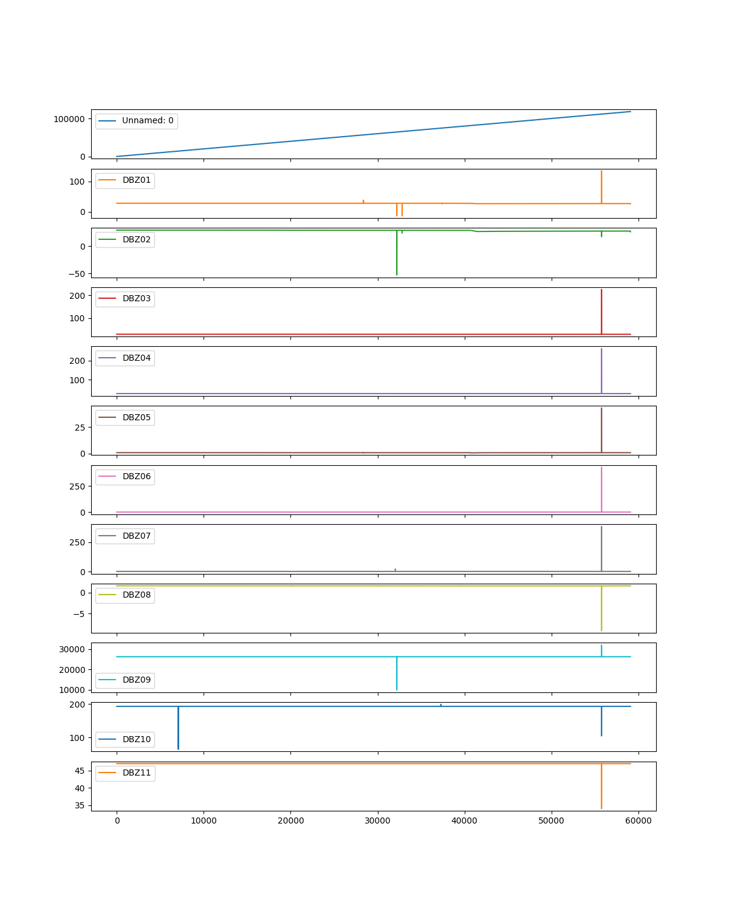
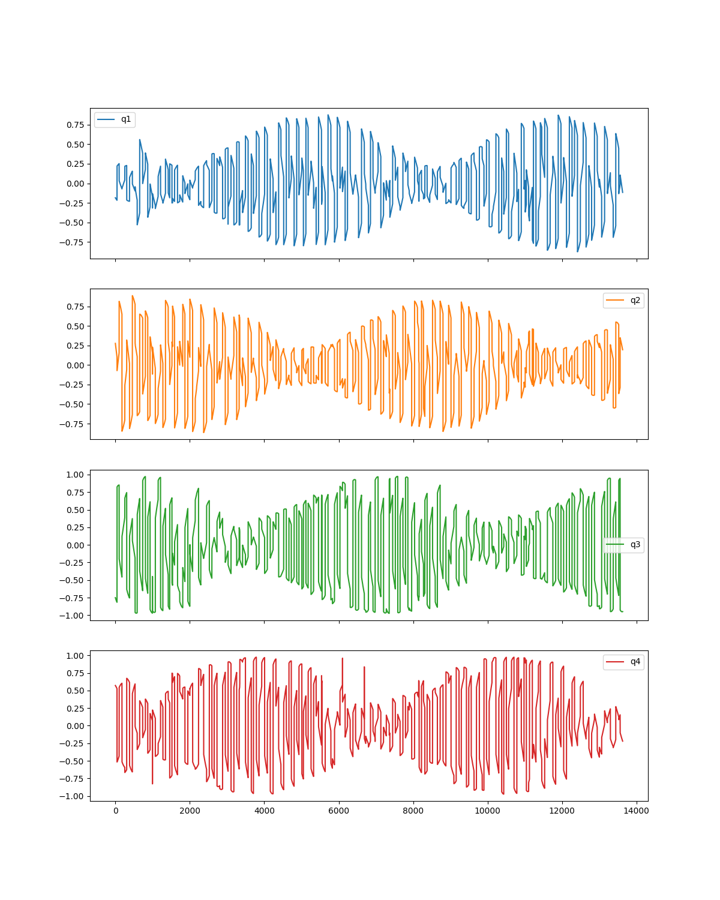
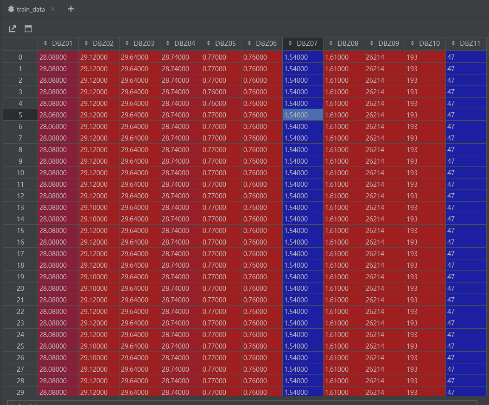
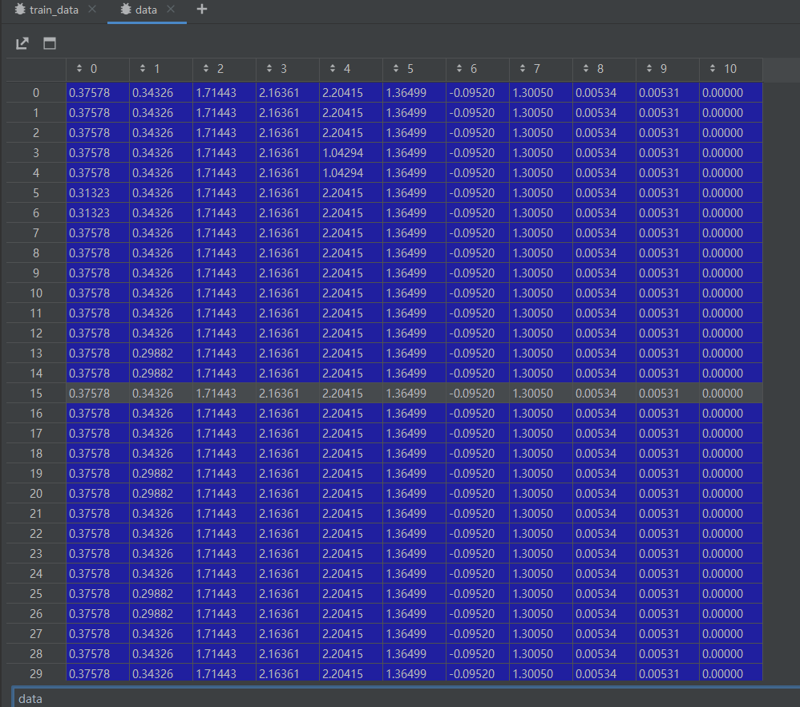

nlp预训练好的模型接解决时序的问题（gpt + transformer + rl）

一个窗口当成一个词向量

图 + transformer（子图当成一个词向量）

用yu训练好的transformer做迁移

### 2023.02.24（周四）

维度之间划pacth（不同维度之间的关联性）

卫星、飞机数据（x：油门，y: 转速）（x1,x2：油门/转速, y：转速）

### 2023.03.03（周五）

（时间较长的）数据：周期明显的，周期不明显的，低频和高频混合的，缓变的

wx数据，温度的数据集，SVR（怎么预测），LSTM，GRU预测，

Transformer，LSTM，GRU，SVR预测的对比

刘文博，李辉师兄要wx数据

周四之前写一个实验报告

时间知识图谱，==事件知识图谱==的预测（李辉）（二院的项目）

周三下午二院开会

wx数据：

北斗卫星数据（bd02），一共有33个参数（维度），第34，35，36个参数的数据只有2014年一年的，没有考虑。

这33个参数（维度）的长度都不一样，应该怎么处理呢？

取每一分钟的第一条数据对齐，取8个维度

温度单维度去预测，先那一个维度去测试

### 2023.03.09（周四）

TG没有周期性，预测结果不好。每条数据都相等，归一化处理后都等于0。

TG数据集：

卫星数据集：

TG数据：

TG归一化之后：

预处理过程中，把明显的野值去掉
