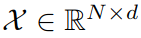
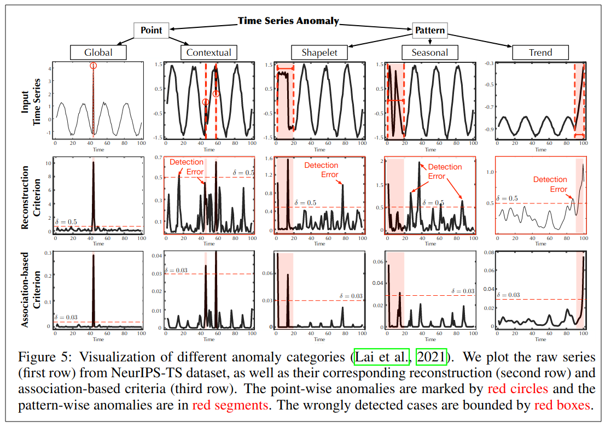

## Anomaly transformer: Time series anomaly detection with association discrepancy

作者：Jiehui Xu，Haixu Wu（清华大学）

来源： ICLR 2022

论文：[[arxiv](https://arxiv.org/pdf/2110.02642)]

代码：[[github](https://github.com/thuml/Anomaly-Transformer)]

引用数：45

参考：[[知乎1（作者博客）](https://zhuanlan.zhihu.com/p/466970544)]

关键词：Association Discrepancy，series-association（全局），prior-association（局部）

**它实验部分中有很多和其他方法的对比。**（生成的，密度的，自回归的，经典的机器学习方法）

### 摘要

异常点的无监督检测在时间序列中是一个具有挑战性的问题，这就要求模型推导出一个可区分的标准。以前的方法主要通过学习逐点表示或者逐对关联，然而，这两种方法都不足以对复杂的时间动态（dynamics）进行推理。最近，Transformer在逐点表示和逐对关联的统一建模方面展现出强大的能力，作者发现每个时间点的自注意权重分布可以体现与整个序列的丰富关联。我们的主要观测结果是，由于异常的罕见性，从异常点到整个序列建立非平凡关联是非常困难的，因此，异常的关联主要集中在相邻的时间点上。这种相邻浓度偏差意味着基于关联的标准在正常点和异常点之间本质上是可以区分的，我们通过关联差异来强调这一点（*Association Discrepancy*）。从技术上讲，我们提出了具有新的异常注意机制的Anomaly Transformer来计算关联差异。作者设计了极大极小策略来增强关联差异的正常-异常区分能力。Anomaly Transformer在服务监测、空间和地球探测以及水处理三个应用的六个无监督时间序列异常检测基准上取得了SOTA的结果。

### 1. 引言

现实世界的系统会有大量的连续数据，这些时序数据的异常检测对于保障系统安全、避免经济损失有着重要意义，例如服务器、地空设备的监测等。异常通常是罕见的，并且被大量的正常点隐藏起来，这使得数据标记变得困难和昂贵。本文关注**无监督时序异常检测**问题。

无监督时序异常检测在现实中有很大挑战性。模型通过无监督任务，从复杂的时间动态中学习信息表示。它也应该推导出一个可区分的标准，用来区分正常点和异常点。

无监督异常检测的方法（机器学习）：局部离群事实中提出的密度估计方法（LOF），基于聚类的单类支持向量机方法（OC-SVM和SVDD）。这些经典的方法没有考虑时间信息，并很难用到没见过的真实场景中。

无监督异常检测的方法（深度学习，RNN）：神经网络的表征学习能力，[Robust anomaly detection for 
multivariate time series through stochastic recurrent neural network(2019)]，[Timeseries anomaly detection using temporal hierarchical one-class network(2020)]，[Multivariate time series anomaly detection and interpretation using hierarchical inter-metric and temporal embedding(2021)]。这些性能很好。一大类方法侧重于通过精心设计的递归网络学习逐点表示，并通过重构或自回归任务进行自我监督。这里，一个自然和实用的异常标准是逐点重建或预测误差。然而，由于异常的罕见性，逐点表示对于复杂的时间模式来说信息量较小，并且可以被正常的时间点所主导，使得异常更难以区分。此外，重建或预测误差是逐点计算的，不能提供时间上下文的全面描述。

**因此，如何获取更具信息含量的表征，进而定义更加具有区分性的判据对于时序异常检测尤为关键。**

另一类主要的方法是基于显式关联建模来检测异常。向量自回归和状态空间模型属于这一类。该图还通过以不同时间点为顶点表示时间序列，并通过随机游走检测异常，来明确地描述关联[2008,2009]。一般来说，这些经典方法很难学习信息表示和建模细粒度关联。最近，图神经网络（GNN）被应用于学习多变量时间序列中多变量之间的动态图[Multivariate time-series anomaly detection via graph attention network(2020)]，[Graph neural network-based anomaly detection in multivariate time series(2021)]。虽然图神经网络的学到的表示更好，但是仍然局限于单个时间点，这对于复杂的时间模式来说是不够的。此外，基于子序列的方法通过计算子序列之间的相似性来检测异常[Graph-based subsequence anomaly detection for time series(2020)]。在探索更广泛的时间上下文时，这些方法无法捕捉每个时间点与整个序列之间的细粒度时间关联。

本篇论文中，作者使用了Transformer，在时序异常检测的无监督任务上。Transformer能看的更远，对全局信息进行统一建模。将Transformer应用于时间序列，发现可以从自注意图中得到各时间点的时间关联，~~其关联权重沿时间维分布~~。每个时间点的关联分布可以为时间上下文提供更多的信息描述，表明时间序列的周期或趋势等动态模式。我们将上面的关联分布命名为序列关联（*series-association*），它可以由 Transformers 从原始序列中发现。

此外，我们观察到，由于异常的罕见性和正常模式的主导性，异常很难与整个系列建立强有力的关联。异常的关联应集中在相邻的时间点，由于连续性，这些时间点更可能包含类似的异常模式。这种相邻的浓度归纳偏置被称为先验关联（*prior-association*）。相反，占主导地位正常时间点可以发现与整个系列的信息关联，而不限于相邻区域。基于这一观察，我们试图利用关联分布的固有正常-异常区分性。这导致了每个时间点的一个新的异常标准，**通过每个时间点先前关联（*prior-association*）与其序列关联（*series-association*）之间的距离来量化，称为关联差异（*Association Discrepancy*）**。如上所述，由于异常的关联更可能是集中在相邻的数据之间，异常将呈现比正常时间点**更小**的关联差异。

超越以往的方法，我们将Transformer引入到无监督时间序列异常检测中，并提出了用于关联学习的Anomaly Transformer。为了计算关联差异（*Association Discrepancy*），作者把自注意力机制改成了异常注意力（*Anomaly-Attention*），它包含两个分支结构，分别对每个时间点的先验关联（*prior-association*）和序列关联（*series-association*）进行建模。先验关联使用可学习的高斯核来表示每个时间点的邻近集中（adjacent-
concentration）归纳偏置，而序列关联对应于从原始序列中学习的自我注意权重。此外，在两个分支之间应用了极大极小策略，该策略可以放大关联差异的正常-异常可区分性，并进一步导出一个新的基于关联的准则。Anomaly Transformer在六个基准测试上取得了很好的结果，涵盖了三个实际应用。贡献汇总如下：

- 基于对关联差异的关键观察，我们提出了具有异常注意机制的Anomaly Transformer，该Transformer可以同时对先验关联和序列关联进行建模，以体现关联差异。

- 我们提出了一种极大极小策略来放大关联差异的正常异常可区分性，并进一步导出了一种新的基于关联的检测准则。

- Anomaly Transformer在三个实际应用的六个基准上实现了最先进的异常检测结果。提供了广泛的消融和深入的案例研究。

### 2. 动机

不同于点级别表征，我们注意到在时间序列中每一个点都可以由其与整个序列的关联来表示，可以表示为其在**时间维度上的关联权重分布**。同时，相比于正常点来说，异常点很难与序列的所有点都构建很强的关联，且由于连续性往往更加关注邻近区域。这种**整个序列和邻近先验之间的关联差异**为时序异常检测提供了天然的、强区分度的判据。

基于上述观察，我们提出了Anomaly Transformer模型用于建模时序关联，同时利用极小极大（Minimax）关联学习策略进一步突出正常、异常点之间差别，实现了基于关联差异（Association Discrepancy）的时序异常检测。Anomaly Transformer在不同领域的5个数据集上都取得了SOTA的效果。

### 3. 方法

假设监测连续的d测量系统，并记录随时间的等间隔观察结果。被观察的时间序列$\mathcal{X}$是个一个时间点的集合，其中表示时间步t的观测。无监督时间序列异常检测问题是在没有标签的情况下确定$x_t$是否异常。

如上所述，我们强调了无监督时间序列异常检测的关键，即学习信息表示和找到可区分的标准。作者提出了Anomaly Transformer去发现更多信息关联，并通过学习关联差异来解决这个问题，关联差异本质上是正常-异常可区分的。从技术上讲，我们提出了Anomaly-Attention来体现先验关联和序列关联，以及一个极大极小优化策略，以获得更可区分的关联差异。通过与该体系结构的协同设计，我们基于学习到的关联差异导出了基于关联的准则。

#### 3.1. Anomaly Transformer

把Transformer中的自注意力机制换成了异常注意力。

**总体架构** Anomaly attn + FFN的堆叠。这有利于模型从多层次深度特征中学习潜在的时序关联。假设模型包含了$L$个块（Anomaly attn + FFN），输入序列长度是$N$，。第$l$层的方程就是：

其中，。初始输入是。第l层隐藏层的表征。用来计算关联差异。

**异常注意力** Transformer单分支的自注意力机制不能同时建模先验关联和序列关联。作者提出的异常注意力有两个分支（图1）。对于**先验关联**，作者使用了一个可学习的高斯核，去计算相对时间距离的先验（差分？）。受益于高斯核的单峰特性，该设计可以在本质上更加关注邻近的点（局部的）。作者还对高斯核使用了一个可学习的标量参数$\sigma$，使先验关联适应各种时间序列模式，例如不同长度的异常段。**序列关联**分支从原始序列中学习关联，它可以自适应地找到最有效的关联。注意，这两种形式保持了每个时间点的时间相关性，这比逐点表示更具信息性。这两个关联也分别反映了相邻-集中先验和学到的真实关联，他们之间的差异应该是正常-异常可区分的。第l层的异常注意力：

其中，，。先验关联基于学到的生成，第i个元素$\sigma_i$表示第i个时间点。

具体来说，对于第i个时间点，它和第j个时间点的关联权重由高斯核这样计算： ，是两个时间点之间的距离。进一步，作者使用把关系权重转换乘离散值，通过除以行数和。表示序列关联。沿着注意图的最后一个维度操作。因此$\mathcal{S}^l$的每一行都形成了离散分布。第l层异常注意力之后的隐藏层。

作者使用了多头的版本，学到的标量参数$\sigma \in \mathbb{R}^{N \times h}$，h是几个头。表示Q,K,V，m是第几个头。最后每个头的输出是：，最后整个encoder的输出：。

**关联差异** 作者用对称的KL散度表示关联差异（*Association Discrepancy*），在先验关联和序列关联之间。

$\mathrm{KL}(\cdot \Vert \cdot)$散度计算$\mathcal{P}^l$和$\mathcal{S}^l$每行之间的KL散度。，N是序列长度。i是第几个时间点。基于以前的观测，异常的AssDis值比正常的时间点小，这让AssDis很容易区分。

#### 3.2. 极小极大关联学习

无监督任务，用重建损失优化模型。重建损失会使序列关联发现最具信息的关联。为了进一步放大异常点和正常点之间的关联差异，作者使用了一个额外的损失（差异损失），去增大关联差异。由于由于先验关联的单峰性质，差异损失将导致序列关联更关注与非邻近区域（全局的），这使得异常的重建更加困难，也使得异常更容易识别。输入序列：，损失函数如下：

其中，，表示Frobenius范数（就是对应元素的平方和再开方）。当$\lambda \gt 0$时，损失能增大关联差异。极小极大策略让关联差异更具区分性。

**极小极大策略** 然而直接最小化关联差异将使得高斯核的尺度参数$\sigma$急剧变小，结果就会导致先验分布无意义。因此，为了更好的控制关联学习的过程，我们采用了一种Minimax策略。具体上，**最小化阶段**：作者让先验关联P去近似从原始时序中学得的序列关联S，该过程将使得先验关联适应不同的时序模式。**最大化阶段**：作者优化序列关联S来最大化关联之间的差异，该过程将使得序列关联更加注意非临接的点，使得异常点的重建更加困难。

其中，$\lambda \gt 0$ 。下标detcah表示不进行梯度的反向传播（图1）。当P在最小化阶段接近S_detach时，最大化阶段将对序列关联进行更强的约束，迫使时间点更加关注非相邻区域。在重建损失下，异常比正常时间点更难实现，从而放大了关联差异的正常异常可区分性。

**基于关联的异常判据** 最终，我们将归一化后的关联差异与重建误差结合起来制定了新的**异常检测判据**：

其中，$\odot$是对应元素相乘。表示输入序列$\mathcal{X}$的每个点的异常判据。为了更好地重建，异常通常会减少关联差异，这仍然会导致更高的异常分数。因此，该设计可以使重建误差和关联差异协作以提高检测性能。

### 4. 实验

在3个具体应用的6个基准上测试了 Anomaly Transformer。

#### 数据集

| 数据集                                          | 描述                                                         |
| ----------------------------------------------- | ------------------------------------------------------------ |
| SMD (Server Machine Dataset)                    | 38维，5周长的数据集，从互联网大厂收集的                      |
| PSM (Pooled Server Metric)                      | 26维，从eBay多个服务器节点内部收集的                         |
| MSL (Mars Science Laboratory rover)             | 55维，NASA，包含了ISA报告的遥感异常数据                      |
| SMAP (Soil Moisture Active Passive satellite)   | 25维，NASA，同上                                             |
| SWaT (Secure Water Treatmen)                    | 51维，现实的传感器获得                                       |
| NeurIPS-TS (NeurIPS 2021 Time Series Benchmark) | 包括五个时间序列异常情景，按照行为驱动分类法分类为点-全局，模式-上下文，模式-小波，模式-季节和模式-趋势 |

#### 评判标准

精度（P precision），召回率（R recall），F1分数（F1-score，精度和召回率的调和平均数）。

#### 4.2. 可视化分析

针对5类不同的异常类别，作者可视化了其在不同异常判据下的区分性。可以发现基于关联差异的异常评判曲线有着更加准确的可区分性。

针对5类不同的异常类别，我们可视化了其在先验关联中最终学得的$\sigma$的大小。不难发现，在异常点处的$\sigma$在整个序列中都比较小（大？），这代表了它与非临接部分的关联较弱，这也支撑了我们认为异常点很难与整个序列构建强关联的判断。
