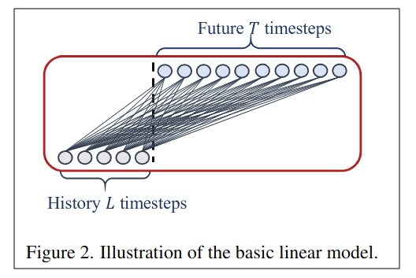

## Are Transformers Effective for Time Series Forecasting?

作者：Ailing Zeng（香港中文大学）

来源：AAAI 2023

论文：[[arxiv](https://arxiv.org/pdf/2205.13504)]

代码：[[github](https://github.com/cure-lab/LTSF-Linear)]

引用数：17

参考：[[知乎1](https://zhuanlan.zhihu.com/p/569194246)] [[知乎2](https://zhuanlan.zhihu.com/p/544622984)]

关键词：Linear, NLinear, and DLinear

### 摘要

最近在LTSF上有很多基于Transformer的工作。作者在这篇文章中，指出了这些方法中存在一些问题。特别地，Transformer是在长序列中提取元素之间相关行的最成功的方法。然而，在时间序列建模中，我们需要从一组有序的连续点中提取时间关系。在Transformer中用位置编码和tokens可以方便的保留顺序信息，但置换不变（permutation-invariant）自注意机制的性质不可避免地导致时间信息丢失。

为了验证我们的想法，我们使用了一个非常简单的一层线性模型（LTSF-Linear）和Transformer的方法比较。结果显示，一层线性模型在大部分情况下，效果更好。令人惊讶的是，我们的结果显示，LTSF Linear在所有情况下都优于现有的复杂Transformerbased模型，并且通常有很大的差距（20%∼ 50%)。

### 介绍和相关工作

参考第一篇博客。

### 2. TSF问题定义

对于包含$C$个变量的时间序列，给定历史序列，$L$是滑动窗口大小，$X_i^t$是时间步$t$的第$i$个值。

时序预测任务是预测，在未来的$T$个时间步。

IMS预测[23]学习一个单步的预测器，并迭代的获得多步于此。或者，DMS直接一次预测多步。

**IMS和DMS比较：** 与DMS预测结果相比，由于采用了自回归模式，IMS预测的方差较小，但不可避免地会受到误差累积效应的影响。因此，**当有一个高度准确的单步的predictor，且T相对较小时，IMS更可取。相比之下，当难以获得无偏的单步预测模型或T较大时，DMS预测会生成更准确的预测（make sense）**。

### 3. 基于Transformer的LSTF解决方案

基于Transformer的模型可以并行处理（多亏了多头注意力机制）。

当在LSTF任务上应用Transformer时，时空复杂度高，还有自回归解码器设计造成的误差累积。Informer解决了这些问题，并提出了一种降低复杂性的新型Transformer架构和DMS预测策略。后来，更多Transformer变体将各种时间序列特性引入其模型，以提高性能或效率[18,28,31]。我们将现有基于Transformer的LTSF解决方案的设计元素总结如下（见图1）。

**Time series decomposition:** 在数据预处理中，在TSF任务中，0均值归一化比较常见。Autoformer首次在每个神经块后应用了季节趋势分解，这是一个时序分析中标准的方法，使原始数据更可信[6,13]。特别的，他们使用了一个移动平均核在输入的序列上，去提取时序中的趋势周期性（trend-cyclical）因素。原始序列核趋势分量之间的差异被当作是**季节分量**。在Autoformer分解方案的基础上，FEDformer[31]进一步提出了专家策略的混合，以将通过移动平均核提取的趋势分量与各种核大小混合。

**Input embedding strategies:** Transformer中的自注意力层不能保留时序的位置信息。然而，局部的位置信息（时间序列的顺序）是重要的。并且，全局的时间信息，比如层次的时间戳（周，月，年）和未知（agnostic）时间戳（假期和事件）也是有信息性的[30]。为了加强输入时间序列的时间上下文，一些基于Transformer SOTA模型中的一些embed设计被应用了，像固定位置编码，通道映射嵌入，可学习的时间嵌入。带有时间卷积层的时间嵌入[16]和可学习的时间戳[28]在这两篇文章中被介绍。

**Self-attention schemes:** LogTrans和Pyraformer给自注意力机制引入了稀疏偏置。Informer和FEDformer在自注意力矩阵中使用了低秩属性。

| 方法                | 复杂度        | 备注                                       |
| ------------------- | ------------- | ------------------------------------------ |
| vanilla Transformer | $O(L^2)$      | 原始的Transformer                          |
| LogTrans            | $O(L \log L)$ | 使用了log稀疏的mask                        |
| Pyraformer          | $O(L)$        | 金字塔注意力，层次地捕获多尺度时间依赖     |
| Informer            | $O(L \log L)$ | 概率稀疏自注意力机制和一个自注意力蒸馏操作 |
| FEDformer           | $O(L)$        | 傅里叶加强块和随机选择小波增强块           |

 **Decoders:** 原始的Transformer解码器的输出是一种自回归的形式，又慢又累积误差，尤其对于长时期的预测来说。Informer为DMS设计了一个生成式的解码器。其他Transformer变种应用了相同的DMS策略。例如，Pyraformer使用了一个全连接层来连接时空轴，作为解码器。Autoformer从趋势周期成分和季节成分的叠加自相关机制中总结出两个细化的分解特征，以获得最终预测。FED 形成器也使用分解方案与提出的频率注意块解码的最终结果。

在时间序列的建模中，我们主要关注是一个连续点集中的时间关系，和这些元素之间的顺序，而不是对之间的关系。

### 4. 一个令人尴尬的简单的baseline

在基于Transformer的LTSF的实验中，所有对比的baseline（非Transformer）都是IMS预测技术，已知它们受到显著的误差累积效应的影响。我们假设这些工作中的性能改进很大程度上是由于其中使用的DMS策略。

为了验证这个假设，我们提出了最简单的DMS模型，即一个时间线性层，叫LTSF-Linear，作为baseline用来比较。LTSF-Linear的基本公式通过加权和运算直接回归历史时间序列，用于未来的预测(如图2所示)。数学上的表示是，，其中是一个沿着时间轴的线性层。注意LTSF-Linear在不同变量之间共享权重，并且不建模任何空间相关性。

LTSF-Linear是一个线性模型的集合。Vanilla Linear是一个一层的线性模型。为了处理不同领域的时间序列（例如，金融，交通，能源领域），作者进一步引入了两个变种，有两个预处理过程，叫DLinear和NLinear。

- 具体来说，DLinear是Autoformer和FEDformer中使用的分解方案与线性层的组合。它首先通过移动平均kernel和季节分量将输入的原始数据分解为趋势分量。然后，将两个一层线性层应用于每个组件，并将这两个特征进行汇总以获得最终预测。通过显式处理趋势，当数据中有明确的趋势时，DLinear增强了普通线性的性能。
- 同时，当数据集中存在分布偏移时，为了提高LTSF Linear的性能，NLinear首先用序列的最后一个值减去输入。然后，输入经过一个线性层，减去的部分在进行最终预测之前加回来。NLinear中的减法和加法是输入序列的简单规范化。（其实就是差分操作）

### 5. 实验

