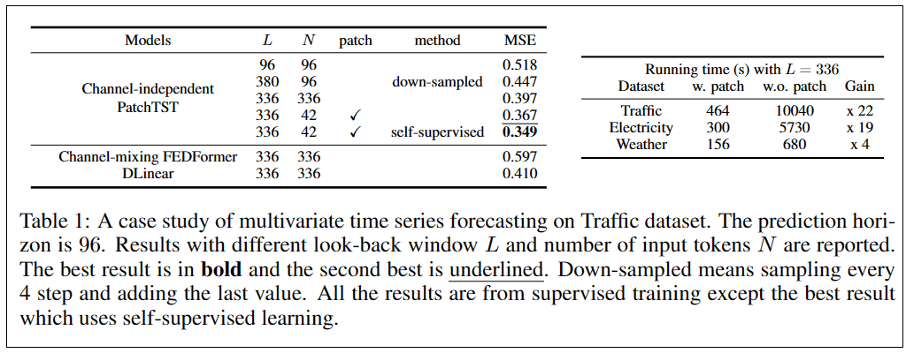
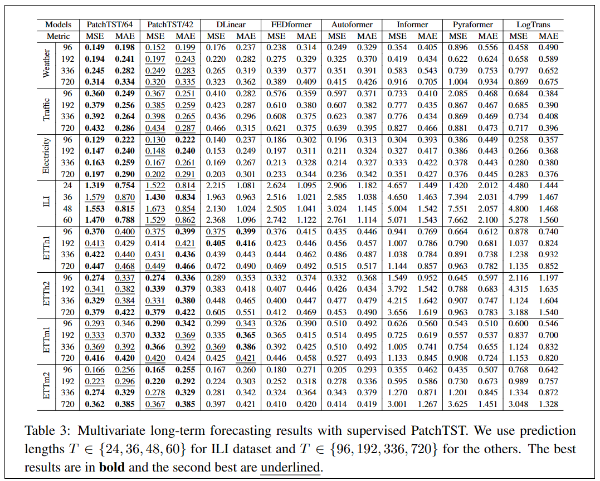
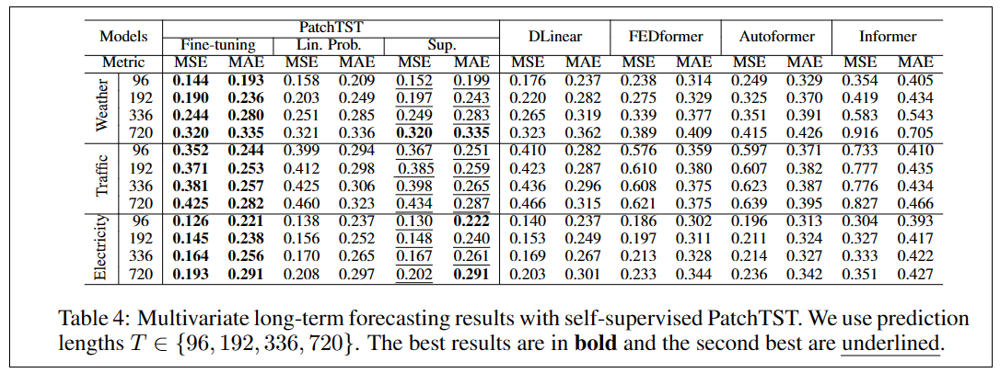

## A Time Series Is Worth 64 Words_Long-Term Forcasting With Transformers

作者：Yuqi Nie（普林斯顿大学）

来源：ICLR2023

论文：[[arxiv](https://arxiv.org/pdf/2211.14730)]

代码：[[github](https://github.com/yuqinie98/PatchTST)]

引用数：1

参考：[]

关键词：PatchTST（patch time series Transformer），通道独立结构。

### 创新点

多元时序数据预测的自监督表征学习基于Transformer的模型。有两部分组成：

- 在送入Transformer之前，把时序数据分割成子序列级别的patch。
- 每个通道独立，每个通道都包含一个单元时间序列，所有通道的时序共享embeding权重。

贡献：（表1）

1. 普通的Transformer是$O(N^2)$的。N是tokens的数量。对时序数据，如果不进行预处理，N就等于序列长度$L$。划分patch：$N \approx L/S$。这样计算量就减少了。

2. 从更大的滑动窗口中学习。从表1中看出，窗口大小L从96到336，MSE变小。然而窗口变大导致内存占用高。因为时间序列经常携带冗余的时间信息。之前的一些工作使用下采样或者稀疏注意力减少计算，也取得了比较好的预测结果。当$L=380$时，作者这样划分patch，在380的窗口内，每4步取一个token（最后一点补够4个），那么输入的token长度是$N=96$。通过token的方式，把相邻的时间点组到一起，比把单个时间点当成token输入进去效果更好。
3. 表征学习的能力更好。Transformer结构适合时序预测任务。

### 结论

### 实验结果

监督方式的结果：

自监督方式的结果：

### 3. 方法

#### 3.1. 模型结构

Transformer