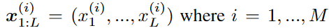
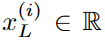
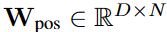
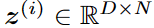
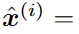
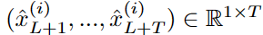
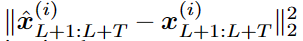
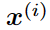

## A Time Series Is Worth 64 Words_Long-Term Forcasting With Transformers

作者：Yuqi Nie（普林斯顿大学）

来源：ICLR2023

论文：[[arxiv](https://arxiv.org/pdf/2211.14730)]

代码：[[github](https://github.com/yuqinie98/PatchTST)]

引用数：1

参考：[[智源社区](https://hub.baai.ac.cn/view/24048)]

关键词：PatchTST（patch time series Transformer），通道独立结构。

### 创新点

多元时序数据预测的自监督表征学习基于Transformer的模型。有两部分组成：

- 在送入Transformer之前，把时序数据分割成子序列级别的patch。
- 每个通道独立，每个通道都包含一个单元时间序列，所有通道的时序共享embeding权重。


贡献：（表1）

1. 普通的Transformer是$O(N^2)$的。N是tokens的数量。对时序数据，如果不进行预处理，N就等于序列长度$L$。划分patch：$N \approx L/S$。这样计算量就减少了。

2. 从更大的滑动窗口中学习。从表1中看出，窗口大小L从96到336，MSE变小。然而窗口变大导致内存占用高。因为时间序列经常携带冗余的时间信息。之前的一些工作使用下采样或者稀疏注意力减少计算，也取得了比较好的预测结果。当$L=380$时，作者这样划分patch，在380的窗口内，每4步取一个token（最后一点补够4个），那么输入的token长度是$N=96$。通过token的方式，把相邻的时间点组到一起，比把单个时间点当成token输入进去效果更好。
3. 表征学习的能力更好。Transformer结构适合时序预测任务。

### 结论


### 实验结果

监督方式的结果：


自监督方式的结果：


### 3. 方法

**问题定义** 回看窗口大小是，$x_t$是t时刻的$M$维向量，任务是预测未来$T$步的数据。


#### 3.1. 模型结构

- **前向过程** 

  $L$的窗口内，第$i$维的序列这样表示：，整个时序数据分成了$M$个独立的序列，每个序列独立的输入到Transformer中。由Transformer的backbone做出预测。

- **Patching** 

  把分好的单个序列分成Patch（以重叠或不重叠的方式）。patch长度是$P$，stride是两个连续patch之间的非重叠区域的长度（每隔几个时间点做一次patch），那么一个序列划分成：，$N$是patch的数量，。做patch的过程中，要把最后一个值重复$S$次，把序列补成$P$的整数倍。最后token的数量减少为（不重叠方式）：$L \rightarrow L/S$。

- **Transformer Encoder** （产生预测结果）

  首先把每个patch映射成$D$维向量（线性层），给$N$个patch加上位置编码（保存时间顺序信息），最后每个patch：。然后过多头注意力层。Encoder多头之后的Norm是BN。从Encoder出来的维度：。最后过一个全连接层产生预测结果：。

- **损失函数**

  MSE损失计算预测值和真实值之间的差异。每个通道的损失：

  

  $M$个通道的平均损失：
  

- **Instance Normalization** （patch之前的操作）

  （？）用来缩小训练数据和测试数据的偏移。就是把每个序列用mean=0，std=1做归一化。

  在patching之前对每个序列做归一化，得到最后的结果后，在反归一化（保留mean，std，做归一化的你操作）。

  > In essence, we normalize each $x^{(i)}$ before patching and the mean and deviation are added back to the output prediction.

  

#### 3.2. 表征学习（Transformer的自监督结构）

用时许数据的特征进行训练。提取特征用自监督与训练模型（如NLP的Bert和CV的MAE）。掩掉一部分数据，然后重建出来。

MAE已经用到时序分类和识别任务上，效果很好：[A transformer-based framework for multivariate time series representation learning](https://dl.acm.org/doi/pdf/10.1145/3447548.3467401)（表示在时序Transforme上，BatchNorm的效果好于LayerNorm）。这篇作者只是把单个时间步当成token输入进去。这样做mask就有两个问题：

第一，只在单个时间步这个粒度上做mask，mask 一个时间点的话，直接根据相邻点插值就可以重建，这就完全没必要学习了，而 mask一个patch来重建的话则更有意义更有难度。上面的作者就提出了一个复杂的随机策略解决这个的问题：随机mask，每个mask掉的大小不同。

（<font color=red>？</font>）第二，最后输出预测结果的输出层的设计比较麻烦。把$L$个的向量，映射成长为$T$的$M$维向量，这一层的参数量就是：。这四个数字有一个很大就会导致，整个矩阵过大，当训练的数据不够时，就会导致严重的过拟合。回到本篇文章，作者提出的PatchTST克服了这个问题：把预测头去掉，连接一个的线性层。

这就很直观了，直接 mask 掉一些 patch 然后进行重建即可。对于每一个 token（patch），它通过 Transformer Encoder 后输出维度是D，由于该 patch 本身的长度是P，因此要重建它的话，再加上一个D✖️P的 Linear 层即可。

### A 附录

#### A.1. 实验细节

##### A.1.1. 数据集


Exchange-rate是金融数据集，和其他领域的数据集的属性不一样。

Are transformers effective for time series forecasting?表明，通过简单地重复回看窗口中的最后一个值，MSE在汇率数据集上的损失可以超过或与最佳结果相当。因此，作者谨慎地将其纳入基准。

##### 通道独立性

很多 Transformer-based 模型采用了 channel-mixing 的方式，指的是，对于**多元时间序列（相当于多通道信号）**，直接将时间序列的所有维度形成的向量投影到嵌入空间以混合多个通道的信息。Channel-independence 意味着每个输入 token 只包含来自单个通道的信息。本文就采用了 Channel-independence，DLinear 中也采用了这种方式。


### 代码

#### 代码中遇到的问题

- 代码中使用的RevIN归一化和普通的归一化的区别是什么？

  答：参考该方法的论文。主要的作用是：训练过程中，在每个滑动窗口内，对时间序列做归一化（归一化的参数可以学习），防止预测的时间序列偏离整体的时序数据的分布太远。

##### 监督模型

- 时序预测的训练时，数据的组成是什么样的？是把数据shuffle之后再送进模型吗？（看之前的DLinear、AutoFormer和Informer的代码）。在data_loader里面打断点看一下。

  答：每次从训练集(8640,7)取出(128,336,7)，这128个子序列顺序是打乱(shuffle)的。

- `PatchTST_supervised/layers/PatchTST_backbone.py`中：其中的通道独立性体现在哪里？（看完之后在github issue中提问）

  ```python
  # ？？？？？？？？
  u = torch.reshape(x, (x.shape[0] * x.shape[1], x.shape[2], x.shape[3]))  # (896,42,16)：输入Transformer的维度，Transformer的encoder输入是(batch_size, patch_num, patch_dim)  # u: [bs * nvars x patch_num x d_model]
  u = self.dropout(u + self.W_pos)  # (896,42,16)=(896,42,16)+(42,16)  # 给每个patch加上位置编码因为是通道独立，所以只需要给每个通道的所有patch加上位置编码即可  # u: [bs * nvars x patch_num x d_model]
  
  # Encoder
  z = self.encoder(u)  # (896,42,16)  # z: [bs * nvars x patch_num x d_model]
  z = torch.reshape(z, (-1, n_vars, z.shape[-2], z.shape[-1]))  # (128,7,42,16)  # z: [bs x nvars x patch_num x d_model]
  z = z.permute(0, 1, 3, 2)  # (128,7,16,42)  # z: [bs x nvars x d_model x patch_num]
  ```

  答：Transformer的encoder的输入维度是(batch_size, patch_num, patch_dim)，encoder在处理这个维度的数据时，各batch维度的数据互不影响，所以上述代码实际上实现了896这个batch维度上的并行处理，也就是7个通道互相独立，但是通道之间的Transformer的encoder共享权重。

- 监督模型（标签是真实序列本身，长度是pred_len的大小）中的时序预测的输入是(128,336,7)，这128个子序列是打乱的，为什么这个数据送进encoder出来的结果就是预测结果呢？

  答：监督方式下的预测，是通过Flatten + Linear Head做预测的，把(128,336,7)经过一个线性层变成预测结果(128,7,96)、(128,7,192)、(128,7,336)、(128,7,720)。

- 训练和测试过程中的回看窗口（滑动窗口）的大小是什么？

  滑动窗口的大小是seq_len，每次滑动一个时间点。

  训练过程中：训练集在采样过程中的顺序是打乱的，每个子序列都是随机抽取的。

  测试过程中：从时间0开始，以seq_len的窗口，每个子序列滑动1格。

##### 自监督模型

- 预训练时候的参数设置是否要和下游任务中的设置保持一致？

  预训练的目的是学到更好的特征，和参数设置的关系可能不大？（预训练用不同的参数设置，==实验验证一下==）

- `find_lr()`函数中，回调的作用是什么？

  ```python
  # get callbacks
  cbs = [RevInCB(dls.vars, denorm=False)] if args.revin else []
  cbs += [PatchMaskCB(patch_len=args.patch_len, stride=args.stride, mask_ratio=args.mask_ratio)]
  ```

  答：这里代码实现的比较巧妙，利用Learner类里的`__call__(self, name)`方法，调用设置的回调函数，在训练之前实现归一化和mask_patch的操作。

  具体实现：

  ```python
      def fit(self, n_epochs, lr=None, cbs=None, do_valid=True):
          " fit the model "
          self.n_epochs = n_epochs
          if not self.dls.valid: do_valid = False
          if cbs: self.add_callbacks(cbs)
          if lr: self.opt = self.opt_func(self.model.parameters(), lr)  # Adam
  
          self('before_fit')  # 调用__call__()方法，该方法里面调用了之前设置的回调函数
          try:
              for self.epoch in range(n_epochs):            
                  self('before_epoch')                     
                  self.one_epoch(train=True)            
                  # if self.dls.valid:                    
                  if do_valid: self.one_epoch(train=False)                
                  self('after_epoch')        
          except KeyboardInterrupt: pass 
          self('after_fit')
          
      def __call__(self, name):        
          for cb in self.cbs: 
              attr = getattr(cb, name)
              if attr is not None: attr()
  ```

- 重建的过程是什么样的？

  整个重建过程都是在Transformer的encoder里面完成的，在encoder内完成重建后，通过一个线性层把encoder里隐层的维度映射回一个patch的长度。(64,7,128,42) -> (64,42,7,12)

  ==重建的过程一般是：重建好的patch和原始的patch做MSE，但是代码中是重建好patch之后，用重建好的patch再做预测，把预测结果和标签再做MSE。这样做的原因是什么？==

### 总结

- 时序预测的数据组成（监督模型）

  分成训练集和测试集。数据集中的每一条数据都是一个时间序列的子序列， 比如ETTh1数据集，训练集是(8640,7)，每个子序列长度是336（滑动窗口大小），每次滑动1步，每个子序列(336,7)，预测长度是96的话，标签序列就是(96,7)。所以数据集的每一条数据就是X:(336,7)和Y:(96,7)。

  训练过程中，若batch_size=128，那么一次从datalader中取(128,336,7)个子序列，每个子序列单独做预测任务，计算MSE损失。其中，128个子序列的顺序是shuffle之后的。

  测试过程中，和训练过程一样，但是128个子序列的顺序是连着的。[0:336],[1:337],[2:338]....

- 预训练过程（自监督模型）

  整个重建的过程在Transformer的encoder里完成。

- 微调过程（监督方式）

  预训练过后用监督的方式微调模型。

