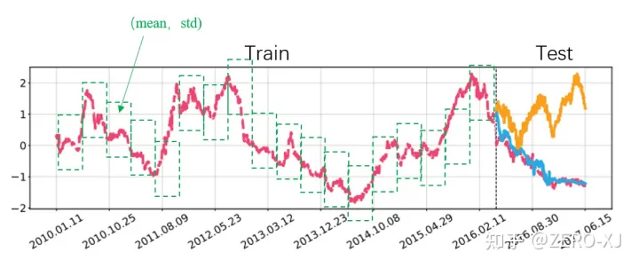

## Reversible Instance Normalization for Accurate Time-Series Forecasting against Distribution Shift

作者：Taesung Kim（韩国科学技术院，KAIST）

来源：ICLR2022

论文：[[openreview](https://openreview.net/pdf?id=cGDAkQo1C0p)]

代码：[[github](https://github.com/ts-kim/RevIN)]

引用数：15

参考：[[知乎](https://zhuanlan.zhihu.com/p/528990583)]

关键词：时间序列分布偏移，RevIN

