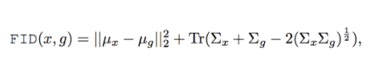
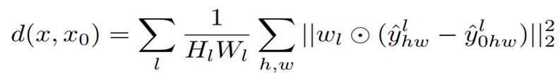

### FID

[[csdn](https://blog.csdn.net/qq_40608730/article/details/110546612)]

Frechet Inception 距离得分（Frechet Inception Distance score，FID）是计算真实图像和生成图像的特征向量之间距离的一种度量。
假如一个随机变量服从高斯分布，这个分布可以用一个均值和方差来确定。那么两个分布只要均值和方差相同，则两个分布相同。我们就利用这个均值和方差来计算这两个单变量高斯分布之间的距离。但我们这里是多维的分布，我们知道协方差矩阵可以用来衡量两个维度之间的相关性。所以，**我们使用均值和协方差矩阵来计算两个分布之间的距离。**

### SIFID

FID在原图上计算，SIFID在特征图上计算。

### Single-Scale 和 Multi-Scale

~~Single scale 就是指一个图片送给CNN一个图片，对应的Multi scale 一般是会送给CNN十张图片，比如高宽是256*256的图片。~~

~~multi scale 则会在四个角和中心crop 5个224*224，再把五个crop的图片flip ,总共得到十个图片送给CNN。~~

### LPIPS

[[csdn](https://blog.csdn.net/weixin_43466026/article/details/119898304)]

学习感知图像块相似度(Learned Perceptual Image Patch Similarity, LPIPS)也称为“感知损失”(perceptual loss)，用于度量两张图像之间的差别。来源于CVPR2018《The Unreasonable Effectiveness of Deep Features as a Perceptual Metric》，该度量标准学习生成图像到Ground Truth的反向映射强制生成器学习从假图像中重构真实图像的反向映射，并优先处理它们之间的感知相似度。LPIPS 比传统方法（比如L2/PSNR, SSIM, FSIM）更符合人类的感知情况。LPIPS的值越低表示两张图像越相似，反之，则差异越大。

