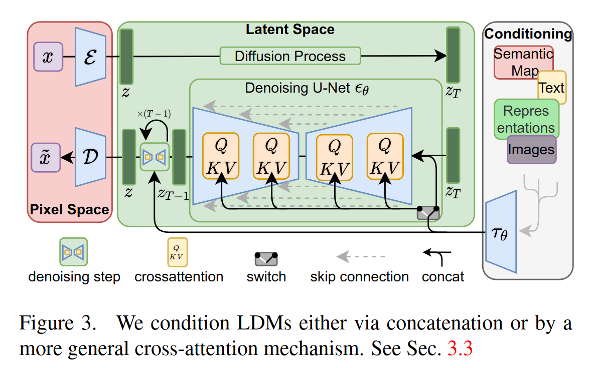
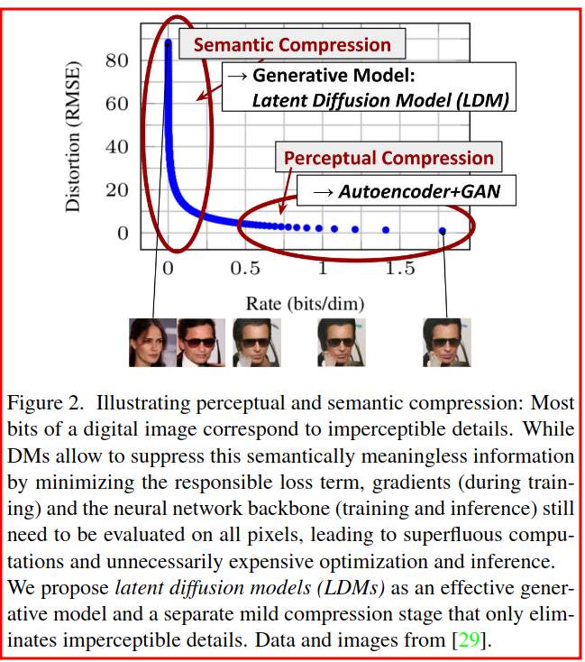
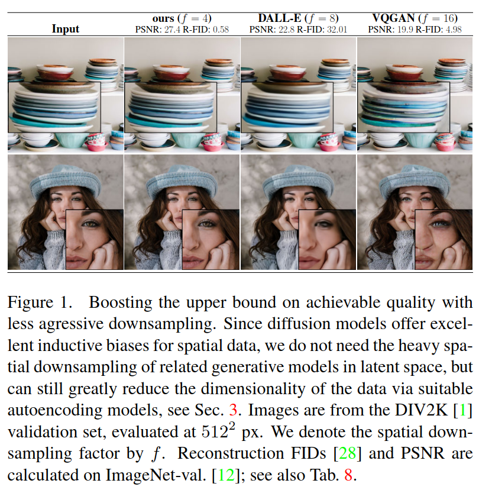
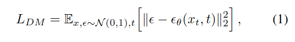
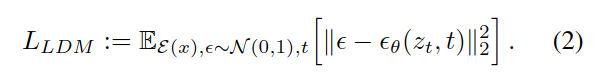
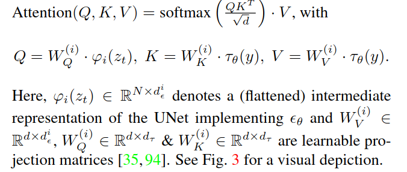
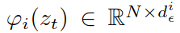
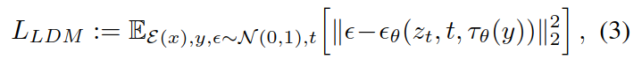

## High-Resolution Image Synthesis with Latent Diffusion Models

作者：Robin Rombach（海德堡大学）

来源：CVPR 2022

论文：[[thecvf](https://openaccess.thecvf.com/content/CVPR2022/papers/Rombach_High-Resolution_Image_Synthesis_With_Latent_Diffusion_Models_CVPR_2022_paper.pdf)]

代码：[[github](https://github.com/CompVis/latent-diffusion)]

引用数：302

demo测试网站：[[huggingface](https://huggingface.co/spaces/multimodalart/latentdiffusion)]

| 参数                | 备注                                |
| ------------------- | ----------------------------------- |
| $\epsilon$          | encoder：把原图像映射到latent space |
| $z$                 | 特征                                |
| $z_T$               | 经过 $T$ 轮加噪的特征               |
| $\tau_{\theta}$     | 把标签 $y$ 映射到特征空间           |
| $\epsilon_{\theta}$ | 去噪AE（UNet结构）                  |
| $Q$                 | 展平的 $z_i$ ，即 $\varphi_i(z_t)$  |
| $K,V$               | $y$ 的特征                          |
| $\mathcal{D}$       | decoder：把特征重建回像素空间       |

### 创新点

重新训练扩散模型（DM）需要很多GPU，在本篇工作中，作者把DM应用到了一个预训练好的特征空间中。即，用AE出来的特征重新训练DM。在网络架构中加入cross-attention层，就可把DM转换成一个生成器，输入文本或边界框，输出高分辨率的合成图像，以卷积的方式。作者的这个模型叫 latent diffusion models (LDMs)。LDM在无条件图像生成、文本-图像生成、超高分辨率生成都达到了SOT。并且相比于基于像素的DM，计算量显著减少。

### 1. 介绍

图像合成是计算机视觉领域最近取得快速发展的一个，但是这需要巨量的计算。尤其是复杂、自然场景的高分辨率合成目前主要由基于更大的似然的模型，在自回归transformer(AR)中可能有数十参数[64,65]。相比之下，GANs[3,26,39]的的预测结果大多局限于可变性相对有限的数据，因为其对抗性学习过程不容易扩展到建模复杂的多模态分布。最近，扩散模型[79]，它由一系列去噪AE组组成，在图像合成上取得了令人印象深刻的结果[29,82]，并超越了[7,44,47,56]，并定义了在类条件下图像合成[15,30]和超分辨率[70]的SOT。此外，即使是无条件的DM也可以很容易地应用于修复和上色[82]或基于笔划的合成[52]等任务，相比于其他生成模型来说[19,45,67]。作为基于可能性的模型，它们不像GAN那样表现出模式崩溃和训练不稳定性，并且通过大量利用参数共享，它们可以模拟自然图像的高度复杂分布，而不需要像AR模型中那样涉及数十亿个参数[65]。

**Democratizing High-Resolution Image Synthesis** DM属于基于似然性的模型，其模式覆盖行为使其易于在建模数据的不可察觉的细节上花费过多的内存（从而计算资源）[16，71]。尽管重新加权的变分目标[29]旨在通过对初始去噪步骤进行欠采样来解决这一问题，但DM仍然需要计算，因为训练和评估这样的模型需要在RGB图像的高维空间中重复进行函数评估（和梯度计算）。例如，训练最强大的DM通常需要数百GPU天（例如[15]中的150-1000 V100天），以及对输入空间的噪声版本进行重复评估，也会导致推断代价高昂，因此在单个A100 GPU上产生50k个样本需要大约5天[15]。总的来说，对研究者来和用户来说有两个后果：第一，训练这样一个模型需要大量的计算资源，只有一小部分领域可用，并留下巨大的碳足印[63,83]。第二，其次，评估一个已经准备好的训练模型在时间和内存上也是昂贵的，因为相同的模型架构必须按顺序运行大量的步骤(例如[15]中的25-1000步)。

为了提高这个强大模型类的可访问性，同时减少其大量资源消耗，需要一种方法来降低训练和采样的计算复杂性。因此，在不影响DM性能的情况下减少DM的计算需求是增强其可访问性的关键。

**Departure to Latent Space** 我们的方法从分析像素空间中已经训练好的扩散模型开始：图2显示了训练模型的速率失真权衡。与任何基于似然的模型一样，学习可以大致分为两个阶段：第一是一个感知压缩阶段，它去除了高频细节，但仍然学习到很少的语义变化。在第二阶段，实际生成模型学习数据的语义和概念组成（语义压缩）。因此，我们的目标是首先找到一个在感知上等效但在计算上更合适的空间，在该空间中，我们将训练用于高分辨率图像合成的扩散模型。

按照常规做法[11,23,64,65,93]，我们把训练分成两个不同的阶段：第一，我们训练一个AE，它提供了一个较低维（从而有效）的特征空间，在感知上等于数据空间。重要的是，相比于之前的工作[23,64]，我们不需要依赖于过度的空间压缩，因为我们在学习到的特征空间上训练DM，它表现出相对于空间维数更好的缩放性质。降低的复杂度还提供了利用单个网络从特征空间高效生成图像。**我们将生成的模型类称为特征扩散模型 Latent Diffusion Models（LDMs）**。

这种方法的一个显著优点是，我们只需要训练通用AE阶段一次，因此可以将其用于多次DM训练或探索可能完全不同的任务[78]。这使得能够有效地探索各种图像到图像和文本到图像任务的大量扩散模型。对于后者，我们设计了一种架构，将Transformer连接到DM的UNet backbone网络[69]，并允许基于token的任意类型的条件机制，见3.3小节。

我们的工作做了如下贡献：

1. 相比于纯粹的基于transformer的方法[23,64]，我们的方法更适合于更高维度的数据，因此可以（a）在压缩级别上工作，与之前的工作相比，该压缩级别提供了更可靠和详细的重建（图1），并且（b）可以有效的应用于百万像素图像的高分辨率合成。

2. 我们在多任务（无条件图像合成、修复、随机超分辨率）和数据集上实现了具有竞争力的性能，同时显著降低了计算成本。与基于像素的扩散方法相比，我们还显著降低了推理成本。
3. 相比之前的工作[90]：同时学习编码器/解码器架构和基于分数的先验的先前工作，我们表明，我们的方法不需要对重建和生成能力进行精确加权。这确保了极其可靠的重建，并且几乎不需要有特征空间的正则化。
4. 我们发现，对于条件密集的任务，如超分辨率、修复和语义合成，我们的模型可以以卷积的方式应用，并渲染出约 ~$1024^2$px的大而一致的图像
5. 此外，我们设计了一种基于交叉注意力的通用条件调节机制，实现了多模式训练。
6. 最后，我们发布了预训练好的特征扩散和AE模型，[[github](https://github.com/CompVis/latent-diffusion)]，除了训练DM外，它还可用于各种任务[78]。

### 2. 相关工作

**图像合成的生成模型** 图像的高维特性对生成建模提出了明显的挑战。生成对抗网络（GAN）[26]允许对具有良好**感知质量（合成图像和真实图像的相似程度）**的高分辨率图像进行有效采样[3,41]，但是很难去优化[2,27,53]，并且难以捕捉完整的数据分布[64]。相比之下，基于似然的方法强调好的密度估计，从而更好优化。变分自编码器（VAE）[45]和基于流的模型[18,19]使得能够高效地合成高分辨率图像[9,43,89]，但是生成的质量不能与 GAN 相提并论。虽然自回归模型（ARM）[6,10,91,92]在密度估计中获得了强大的性能，但计算要求较高的架构[94]和顺序采样（sequential sampling）过程将其限制在低分辨率图像中。由于基于像素的特征表示几乎感知不到的高频细节[16,71]，最大似然训练在建模上花费了大量的内存，导致训练时间较长。为了提升到更高的分辨率，几个两阶段方法[23,65,97,9]使用ARMs来建模压缩的特征空间，而不是原始像素。

最近，**Diffusion Probabilistic Models** (DM)[79]，在密度估计[44]和采样质量[15]方面取得了最先进的结果。当其基础神经骨干作为 UNet 实现[15,29,69,82]时，这些模型的生成能力源于对图像类数据的归纳偏见的自然适应。当重新加权的目标[29]用于训练时，通常可以获得最佳的合成质量。在这种情况下，DM对应于有损压缩器（lossy compressor），并允许以图像质量换取压缩能力。然而，在像素空间中评估和优化这些模型具有推理速度低和训练成本高的缺点。虽然前者可以通过先进的采样策略[46,73,81]和分层方法[30,90]部分解决，但对高分辨率图像数据的训练总是需要计算昂贵的梯度。我们用我们提出的LDM解决了这两个缺点，LDM在较低维度的压缩特征空间上工作。这使得训练在计算上更便宜，并加快了推理，而合成质量几乎没有降低（见图1）。

**Two-Stage Image Synthesis** 减轻单个生成方法的缺点，大量研究[11,23,65,68,97,99]已经通过两阶段方法将不同方法的优势结合到更高效、更高效的模型中。VQ-VAEs [65,97] 使用自回归模型来学习离散化特征空间上的表达先验。[64]通过学习离散化图像和文本表示上的联合分布，将这种方法扩展到文本到图像生成。更一般地说，[68]使用条件可逆网络来提供不同领域特征空间之间的迁移。与VQ-VAE不同，VQGAN[2,99]使用对抗性和感知性目标部署了第一阶段，以将自回归变换器缩放到更大的图像。然而，可行的ARM训练所需的高压缩率引入了数十亿可训练参数[2,64]，限制了此类方法的总体性能，并且以高计算成本为代价减少压缩[23,64]。我们的工作防止了这种权衡，因为我们提出的LDM由于其卷积作为backbone而更平缓地扩展到更高维度的特征空间。因此，我们可以自由选择在学习强大的第一阶段之间进行最佳调解的压缩级别，而不会在保证高保真重建的同时，为生成扩散模型留下太多的感知压缩（见图1）。虽然存在联合学习编码/解码模型和基于分数的先验的方法[90]，但它们仍然需要在重建和生成能力之间进行艰难的加权[11]，并且我们的方法优于我们的方法（第4节）。

### 3. 方法

为了降低训练扩散模型对高分辨率图像合成的计算需求，我们观察到，尽管扩散模型允许通过对相应的损失项进行欠采样来忽略感知上不相关的细节[29]，但它们仍然需要像素空间中昂贵的函数评估，这导致了计算时间和能量资源的巨大需求。

我们建议通过引入压缩学习阶段与生成学习阶段的显式分离来规避这一缺陷（见图2）。为了实现这一点，我们使用了一个自动编码（AE）模型，该模型学习一个在感知上与图像空间等效的空间，但提供了显著降低的计算复杂性。

这种方法提供了几个优点：（i）通过离开高维图像空间，我们获得了计算效率更高的DM，因为采样是在低维空间上执行的。（ii）我们利用了从其UNet架构中继承的DM的归纳偏置[69]，这使其对具有空间结构的数据特别有效，因此减轻了对先前方法所要求的激进、降低质量的压缩级别的需求[23,64]。（iii）最后，我们获得了通用压缩模型，其特征空间可用于训练多个生成模型，也可用于其他下游应用，如单基于CLIP的单个图像合成[25]（single-image CLIP-guided synthesis）。

#### 3.1. Perceptual Image Compression

我们的感知压缩模型基于之前的工作[23]，由通过组合感知损失[102]和基于补丁的对抗目标（损失）[20,23,99]训练的AE组成。这确保了通过增强局部真实性，重建仅限于图像流形，并避免了仅依赖像素空间损失（如 $L_2$ 或 $L_1$ 目标）而引入的模糊性。

具体来说，在RGB空间给定一张图像 $x \in \mathbb{R}^{H \times W \times 3}$ ，encoder $\epsilon$ 把 $x$ 编码成 $z = \epsilon(x)$ ，decoder $\mathcal{D}$ 重建这个特征： $\tilde{x} = \mathcal{D}(z) = \mathcal{D}(\epsilon(x))$ ，其中 $z \in \mathbb{R}^{h \times w \times c}$ 。重要的是，encoder执行了一个下采样，通过这样一个因子 $f = H/h = W/w$ ，并且，我们研究了不同的下采样因子 $f = 2^m$ ，其中 $m \in \mathbb{N}$ 。

为了避免任意高方差的特征空间，我们尝试了两种不同的正则化。第一个是KL-reg，对准高斯分布，在学习到的特征空间上施加轻微的KL惩罚，类似于VAE[45,67]，而VQ-reg在decoder内使用了一个向量量化层（vector quantization
layer[93]）。该模型可以解释为VQGAN[23]，但在decoder中使用了量化层。因为我们接下来的 DM 是设计来处理我们所学习的特征空间（$z = \epsilon(x)$）的二维结构的，我们可以使用相对温和的压缩率并达到非常好的重建效果。这与先前的工作[23,64]形成对比，之前的工作依赖于学习到的空间 $z$ 的任意1D排序来自回归地建模其分布，从而忽略了 $z$ 的许多固有结构。

#### 3.2. Latent Diffusion Models

**Diffusion Models [79]** 是概率模型，设计用来学习一个数据分布 $p(x)$ ，通过逐渐的加噪一个高斯分布噪声，这对应于学习长度为T的固定马尔可夫链的逆过程。对于图像合成，最成功的模型[15,29,70]依赖于 $p(x)$ 上的变分下界的重加权变体，这反映了去噪分数匹配[82]。这些模型可以解释为一个等权重的去噪AE序列 $\epsilon_\theta(x_t,t); t=1 \ldots, T $ ，训练这些AE预测加噪的 $x_t$ 的去噪样本，$x_t$ 是 输入 $x$ 的加噪版本。那么DM的损失就是：

其中， $t$ 均匀的取样于 $\{1, \ldots, T\}$ 。

**Generative Modeling of Latent Representations** 通过我们训练的由 $\epsilon$ 和 $\mathcal{D}$ 组成的感知压缩模型，我们现在可以访问高效、低维的特征空间，在该空间中，高频、不可察觉的细节被抽象掉。与高维像素空间相比，该空间更适合基于似然的生成模型，因为它们现在可以（i）关注数据的重要语义位，（ii）在低维、计算效率更高的空间中训练。与以前的工作不同，以前的工作依赖于高度压缩、离散的潜在空间中的自回归、基于注意力的变压器模型[23,64,99]，而我们可以利用我们的模型提供的图像特定的归纳偏置。这包括主要从2D卷积层构建基础UNet的能力，并且进一步使用重新加权的界限将目标聚焦在感知上最相关的比特上：（$:=$ 是定义符号）

模型的backbone $\epsilon_{\theta}(o,t)$ 可以看作是一个时间条件的 UNet[69]。因为前向传播过程是冻结的，在训练过程中，可以从 $\epsilon$ 中得到 $z_t$ ，并且，来自 $p(z)$ 的样本可以只通过单次 $\mathcal{D}$ （decoder）就能重建回原图像空间。

#### 3.3. Conditioning Mechanisms

与其他类型的生成模型[55,80]类似，扩散模型原则上能够对 $p(z|y)$ 形式的条件分布进行建模。这可以通过条件去噪自动编码器 $\epsilon_{\theta}(z_t，t，y)$ 实现，通过输入的条件 $y$ 控制合成， $y$ 可以是：文本[66]，语义图[32,59]，或者其他图像到图像的翻译任务[33]。

然而，在图像合成的背景下，将DM的生成能力与类别标签之外的其他类型的条件相结合[15]或输入图像的模糊变体[70]是迄今为止探索不足的研究领域。

我们通过交叉注意力机制来增强DMs的基础UNet backbone，从而将DMs转化为更灵活的条件图像生成器[94]，这对于学习各种输入模式的基于注意力的模型是有效的[34,35]（即有利于多模态输入）。为了预处理来自不同模态（例如语言提示）的标签 $y$ ，我们引进了一个encoder $\tau_{\theta}$ ，这把 $y$ 映射成一个中间特征 $\tau_{\theta}(y) \in \mathbb{R}^{M \times d_\tau}$ ，然后这个中间特征随后通过交叉注意力层映射到UNet的中间层，交叉注意力的实现：

其中，  ，表示一个（展平的）UNet中间特征（$\epsilon_{\theta}$ 由UNet实现，AE），i表示第几个去噪的AE，i 的范围是 $\{1, \ldots, T\}$ 。

基于图像-条件对，我们就可以学到条件LDM通过：

其中， $\tau_{\theta}$ 和 $\epsilon_{\theta}$ 通过等式（3）的一起优化。这个条件机制是很灵活的，因为 $\tau_{\theta}$ 可以用专家领域的经验初始化参数，比如，当 $y$ 是文本时，这个专家经验就是（unmasked）transformer[94]，