## SinDiffusion: Learning a Diffusion Model from a Single Natural Image

作者：Weilun Wang（中科大周文罡组）

来源：arxiv

论文：[[arxiv](https://arxiv.org/pdf/2211.12445)]

代码：[[github](https://github.com/WeilunWang/SinDiffusion)]

数据集：[[Places205](http://places.csail.mit.edu/user/account.php)]

被引数：1

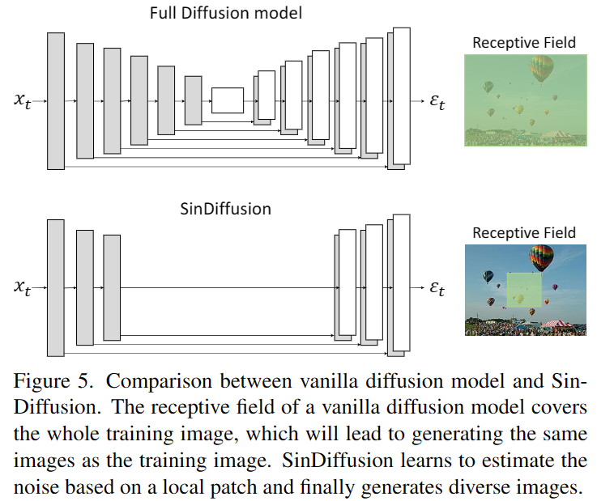

### 摘要

SinDiffusion模型，让降噪扩散模型捕捉一张自然图像的patches的内部分布。有两个核心设计：

1. SinDiffusion是单个模型单个尺度训练的，之前的工作是逐步增长的尺度多个模型。

   > First, SinDiffusion is trained with a single model at a single scale instead of multiple models with progressive growing of scales which serves as the default setting in prior work.

2. 扩散网络中patch级别的感受野，对捕捉图像patches分布有效，因此重新设计了扩散模型的网络结构。

综合上面两点设计，SinDiffusion就能从单张图像生成图像。

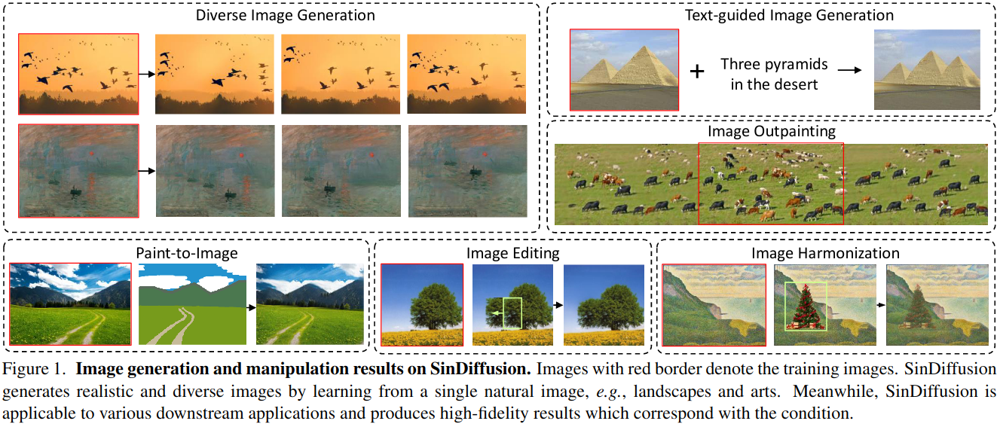

### 创新点

- 提出一个扩散模型的框架SinDiffusion，捕捉一张自然图像上patches的内部概率。
- single-scale训练（避免误差累积）和patch-level的网络。
- 下游任务：文本-图像，图像外推等。

### 3. 方法

分两部分展开：SinGAN（别人的工作）和Sindiffusion对它的改进。

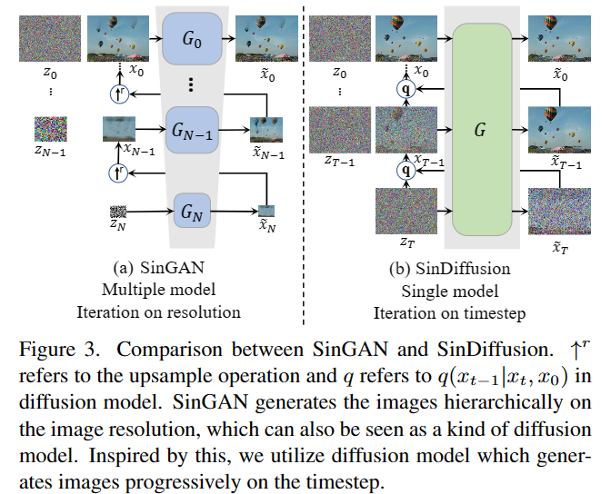

#### 3.1. SinGAN

图3（a）就是SinGAN的过程，SinGAN是由多个模型(G0,...,GN)和多个分辨率扩展过程组成的，这个过程会逐步累积误差。

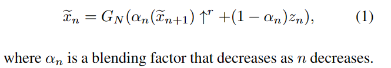

但是扩散模型不会累积误差，因为扩散模型有严格的数学推导，在推导过程中，误差被当作噪声。

#### 3.2. SinDiffusion

**动机** 常用的扩散模型趋向于生成和训练图像一样的图像，因为它的感受野很大，能看到整张图像，所以网络会记住图像长什么样，而不是学习其中的patches的数据分布。所以提出了patch-level的扩散结构。

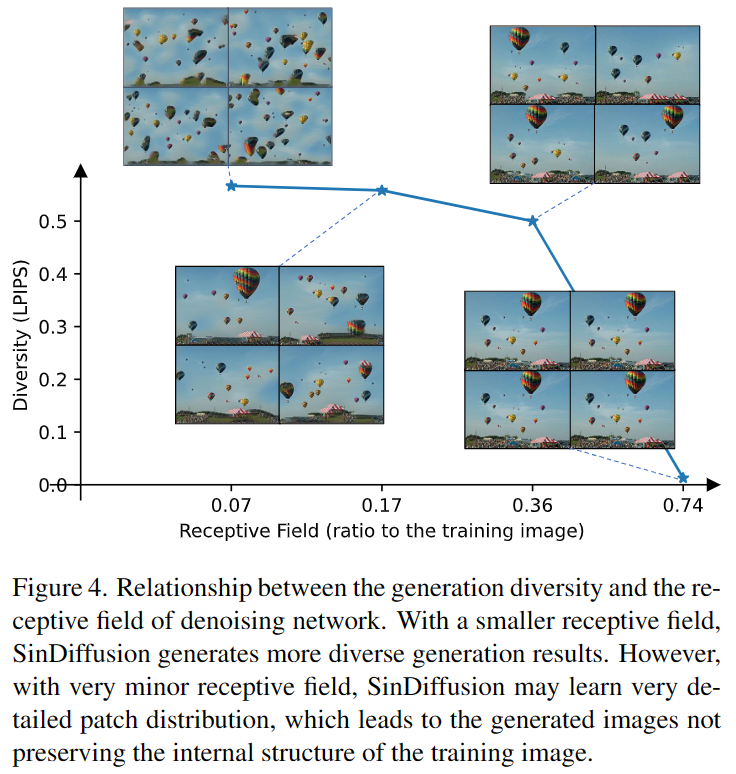

**网路结构** 从上图可知，在合理的范围内，感受野越小，图像的多样性越丰富。

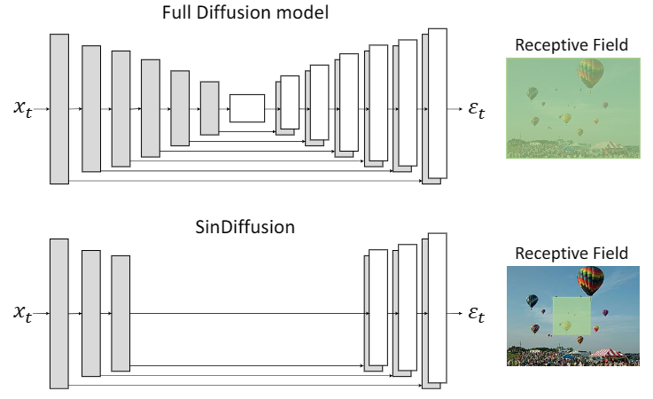

第一，修改了原始的网络结构，去掉了一些上采样和下采样的操作，把最深层的注意力层去掉，这样就能让SinDiffusion以全部卷积的形式生成任意分辨率的图像。第二，通过减少时间嵌入残差块进一步限制感受野。最后得到一个patch-wise的去噪网络。

**损失** 使用原始的去噪损失。在扩散模型中，给定一个训练的图像 $x$ 和随机的时间步 $t \in \{0,1,\ldots,T\}$ ，加噪过程如下：

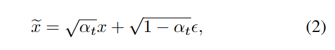

式中，$\epsilon$ 是标准高斯噪声。 $\alpha_t$ 是时间步$t$的噪声调度器。在这篇论文中，$T$设置为1000。SinDiffusion通过重建图像$x$（已经注入噪声$\epsilon$），损失如下：

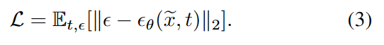

训练好之后，Sindiffusion就可以通过不断降噪生成图像：

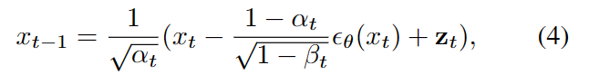

式中，$\alpha_t$和$\beta_t$是扩散模型中的调度因子。$z_t$是时间步$t$处的高斯噪声。

### 4. 实验

#### 4.1. 设置

**数据集** 在SinGAN中使用的Places50。在这个数据集中的每张图像都训练了一次。

> Places50 is the set of 50 landscapes image used in SinGAN (50 images from Places365 dataset [50]). 

**实现细节** Adam优化器。训练过程中，使用指数移动平均（EMA，decay=0.9999）。

**评估度量** 单图像Frechet起始距离（SIFID）度量，和FID相似，SIFID度量生成图像的逐patch分布和真实图像的偏差。为了评估生成多样性，我们计算了由 LPIPS 指标[45]测量的多模式生成结果之间的平均距离。

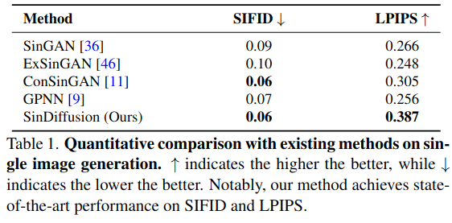

#### 4.2. 质量评估

在单张图像上训练，生成不同分辨率的图像。

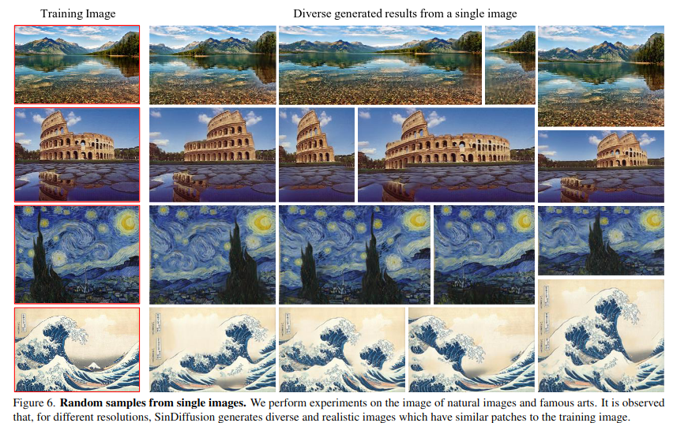

生产更高分辨率的图像需要使用加强版本的SinDiffusion结构（见论文）。

#### 4.3. 和之前的方法比较

#### 4.4. 图像处理

图像编辑，图像融合，图像到图像的转换，文本-图像生成，图像外推。SinGAN通过加入条件图像完成这些操作，SinDiffusion通过设计采样程序完成。

**文本-图像生成** 为了从给定的的单张图像和文本生成图像，我们通过预先训练的视觉语言模型的梯度来指导采样过程$C(\cdot,\cdot)$（即 CLIP）。假设有一个预训练扩散模型，它的估计平均是$\mu_{\theta}(x_{t-1}\vert x_t)$，那么生成和给定文本$L$相关的图像，就可以通过扰乱估计平均实现：

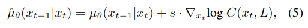

式中，$s$是一个引导标量。

**图像外推** 假设有一个预训练好的扩散模型，它的迭代特征是$x_{\theta}(z_t)$，那么对图像$x^a$进行外推：

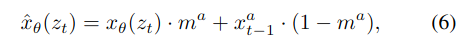

式中，$m^a$表示外推的区域。$x_{t-1}^a$表示在时间步$t-1$的噪声版本。

#### 4.5. 消融实验

在**Places50**的子集上进行了消融实验。

**多尺度 vs 单尺度** 把SinGAN中的每个GAN模型转换乘扩散模型，和SinDiffusion中的单个扩散模型形成对比。

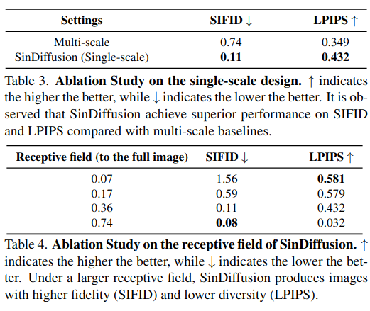

**感受野** 如表4所示，感受野越大，SIFID越小（好），感受野越小，LPIPS越大（好）。

### 5. 结论

主要在各种自然图像上进行了实验，并在**Places50**数据集上证明了本论文方法的有效性。图像处理的性能进一步证明了SinDiffusion的实用性和灵活性。

### 代码实现

两个度量的计算方法
