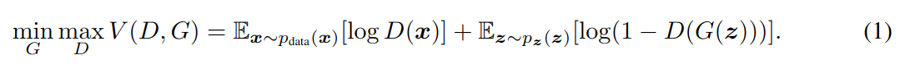

## Generative Adversarial Nets

作者：Ian J. Goodfellow（蒙特利尔大学）

论文：[[acm](https://dl.acm.org/doi/pdf/10.1145/3422622)]

代码：[[github](https://github.com/eriklindernoren/PyTorch-GAN/blob/master/implementations/gan/gan.py)]

引用数：54000

### 摘要

提出了通过一个对抗过程评估生成模型的新框架，在这个框架里，我们同时训练两个模型：一个生成模型$G$，用来捕捉数据分布，和一个判别模型$D$，用来估计来自训练数据的可能性，而不是$G$。训练$G$就是最大化$D$的犯错概率。这个框架对应一个最大最小的两人游戏。在任意函数$G$和$D$的空间中，存在唯一解，$G$恢复训练数据分布，$D$每个地方都等与$\frac{1}{2}$。当$G$和$D$都是MLP时，就可以用后向传播训练整个系统。在训练或生成样本期间，不需要任何马尔可夫链或展开的近似推理网络。通过对生成的样本进行定性和定量评估，实验证明了该框架的潜力。

### 3. 对抗网络

对抗模型框架可以直接用在MLP网络结构中。为了学习在$\mathbf{x}$上，生成器的分布$p_g$，我们定义了一个输入噪声变量的先验$p_z(z)$，然后是一个映射到数据空间的$G(z;\theta_g)$，$G$是一个MLP结构的可微函数，参数是$\theta_g$。定义了第二个MLP$D(x;\theta_d)$，输出一个标量。$D(x)$表示$\mathbf{x}$来自训练数据而不是来自$p_g$的概率。训练$D$是为了最大化一个概率，就是给训练样本和从$G$中采样的样本分配正确标签的概率。我们同时训练$G$去最小化$\log (1-D(G(z)))$：

可以这样理解，$D$和$G$在完一个双人游戏，最大最小化这个值函数$V(G,D)$：

在下一节，我们对对抗网络进行了理论分析，基本上表明，当G和D具有足够的容量时，训练准则允许恢复数据生成分布，即，在非参极限中（non-parametric limit）。如图一所示，可以了解这个分析。在实现中，我们必须使用迭代的数值方法来实现上述过程。