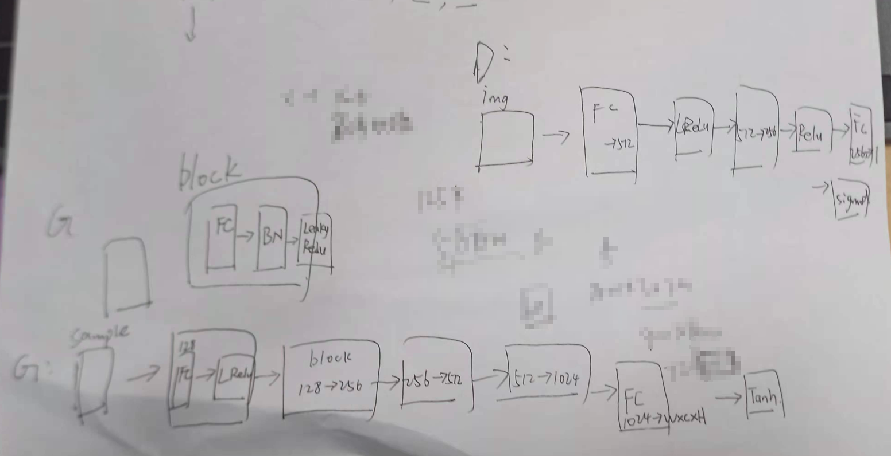
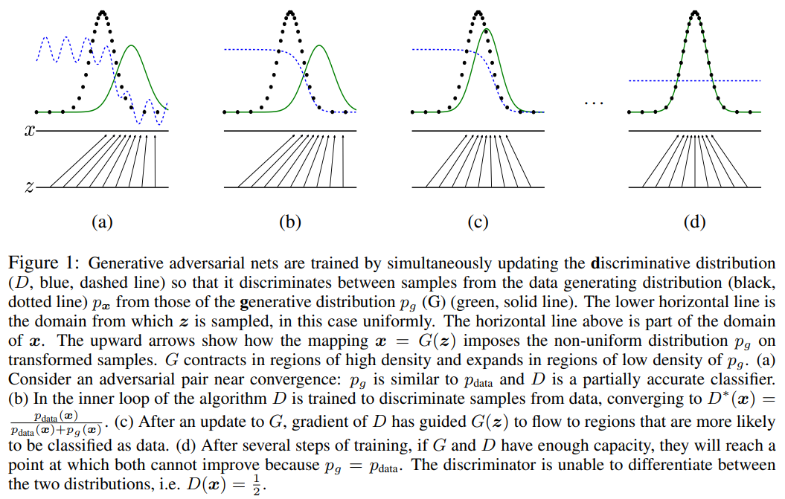
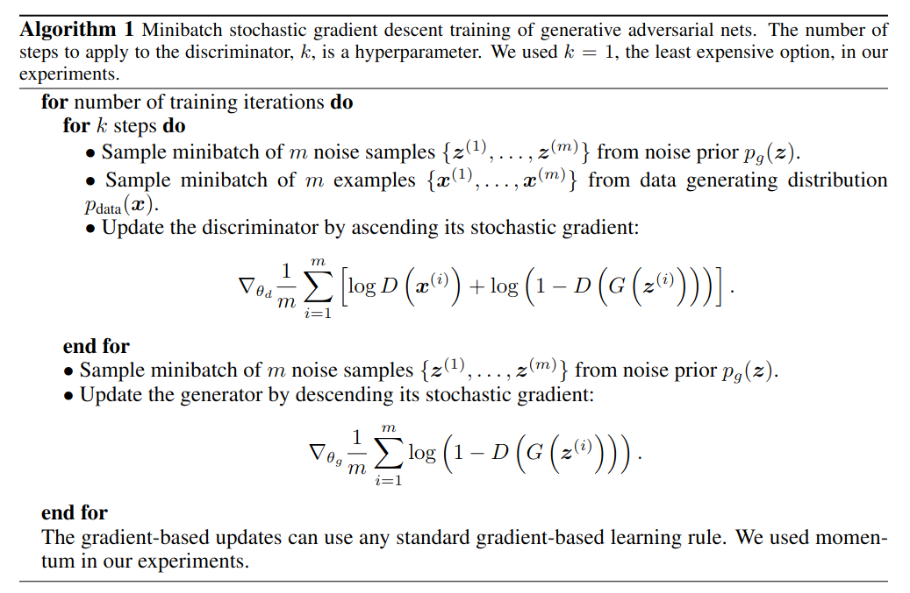
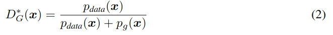
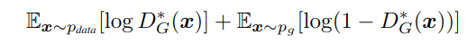

## Generative Adversarial Nets

作者：Ian J. Goodfellow（蒙特利尔大学）

论文：[[acm](https://dl.acm.org/doi/pdf/10.1145/3422622)]

代码：[[github](https://github.com/eriklindernoren/PyTorch-GAN/blob/master/implementations/gan/gan.py)]

引用数：54000

### 网络结构

### 摘要

提出了通过一个对抗过程评估生成模型的新框架，在这个框架里，我们同时训练两个模型：一个生成模型$G$，用来捕捉数据分布，和一个判别模型$D$，用来估计来自训练数据的可能性，而不是$G$。训练$G$就是最大化$D$的犯错概率。这个框架对应一个最大最小的两人游戏。在任意函数$G$和$D$的空间中，存在唯一解，$G$恢复训练数据分布，$D$每个地方都等与$\frac{1}{2}$。当$G$和$D$都是MLP时，就可以用后向传播训练整个系统。在训练或生成样本期间，不需要任何马尔可夫链或展开的近似推理网络。通过对生成的样本进行定性和定量评估，实验证明了该框架的潜力。

### 3. 对抗网络

对抗模型框架可以直接用在MLP网络结构中。为了学习在$\mathbf{x}$上，生成器的分布$p_g$，我们定义了一个输入噪声变量的先验$p_z(z)$，然后是一个映射到数据空间的$G(z;\theta_g)$，$G$是一个MLP结构的可微函数，参数是$\theta_g$。定义了第二个MLP$D(x;\theta_d)$，输出一个标量。$D(x)$表示$\mathbf{x}$来自训练数据而不是来自$p_g$的概率。训练$D$是为了最大化一个概率，就是给训练样本和从$G$中采样的样本分配正确标签的概率。我们同时训练$G$去最小化$\log (1-D(G(z)))$：

可以这样理解，$D$和$G$在完一个双人游戏，最大最小化这个值函数$V(G,D)$：

在下一节，我们对对抗网络进行了理论分析，基本上表明，当G和D具有足够的容量时，训练准则允许恢复数据生成分布，即，在非参极限中（non-parametric limit）。如图一所示，可以了解这个分析。在实现中，我们必须使用迭代的数值方法来实现上述过程。

|  |
| ------------------------------------------------------------ |
| 图一：生成对抗网这样训练，通过同时更新判别分布（$D$，蓝色虚线），从而区分数据生成分布的样本$p_x$（黑色点线）和生成的分布$p_g$（$G$，绿色实线）。最下面的水平线是$z$的取样区域，均匀取样。上面的水平线是$x$的区域。上箭头是$x = G(z)$映射，加强了非均匀份分布$p_g$。$G$在$p_g$低密度处收缩，高密度处膨胀。（a）考虑一个在收敛点附近的对抗对：$p_g$和$p_{data}$相似，$D$是部分准确判别器。（b）在算法的循环过程中，$D$被训练用来从数据中区分样本，收敛到$D^*(x) = \frac{p_{data}(x)}{p_{data}(x) + p_g(x)}$。（c）$G$更新后，$D$的梯度引导$G(z)$流向更有可能被归类为数据的区域。（d）在几轮训练过后，如果$G$和$D$有足够的容量，就收敛到一个不会再被更新的点，因为$p_g = p_{data}$。这时判别器就不能区分两个分布之间的区别了，即$D(x) = \frac{1}{2}$。 |

在训练的内循环中优化$D$以完成训练在计算上是禁止的，并且在有限的数据集上会导致过度拟合。相反，我们在优化$D$的$k$个步骤和优化$G$的一个步骤之间交替进行。只要 $G$ 的变化足够缓慢，这就导致 $D$ 保持在接近其最优解的水平。算法1介绍了上述过程。

|  |
| ------------------------------------------------------------ |

### 4. 理论结果

生成器$G$隐式的定义了一个概率分布$p_g$作为所获得的样本$G(z)$的分布，当$z \sim p_z$时。因此，如果给定足够的容量和训练时间，我们希望算法1收敛到一个良好的$p_{data}$估计量。本节的结果是在非参数设置下完成的，例如，我们通过研究概率密度函数空间中的收敛性来表示具有无限容量的模型。

4.1节展示了一个对最大最小游戏的全局优化$p_g = p_{data}$。4.2节展示了用公式(1)优化算法1，然后得到理想的结果。

#### 4.1. 全局优化 $p_g = p_{data}$

我们首先考虑任意给定生成器$G$的最优判别器$D$。

**Proposition 1.** 对于$G$固定的情况，最有判别器是：

证明：。。。

**Theorem 1.** 虚拟训练准则$C(G)$的全局最小值仅在$p_g = p_{data}$取到。此时，$C(G)$的值为$-\log4$。

证明：。。。

#### 4.2. 算法1的收敛性

**Proposition 2.** 如果$G$和$D$有足够的容量，并且在算法1的每一步，允许判别器达到其最佳给定$G$，并且$p_g$根据下面的公式进行更新

那么，$p_g$就收敛到了$p_{data}$。

证明：。。。

在实践中，对抗网络通过函数 $G(z; θ_g)$表示 $p_g$ 分布的一个受限制的族，我们优化 $θ_g$ 而不是 $p_g$ 本身。使用多层感知器定义$G$在参数空间中引入了多个临界点。然而，实践中多层电纳的优异性能表明，尽管缺乏理论保证，但它们是一个合理的模型。

### 5. 实验

在MNIST，Toronto Face Database(TFD)，CIFAR-10数据集上训练了对抗网络。

### 代码

