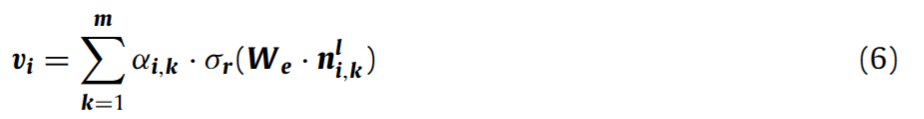
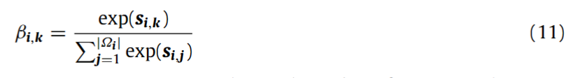
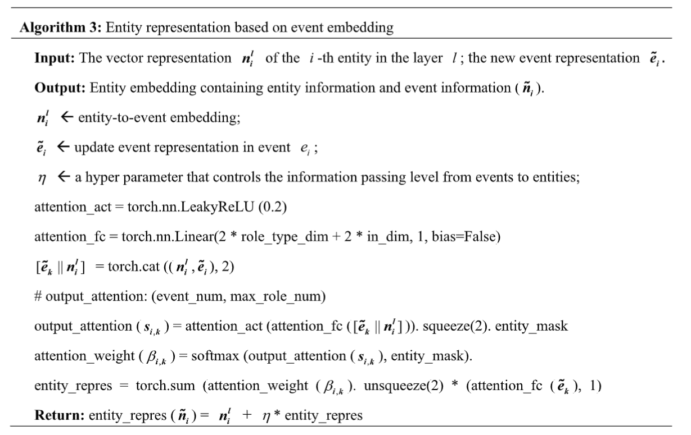
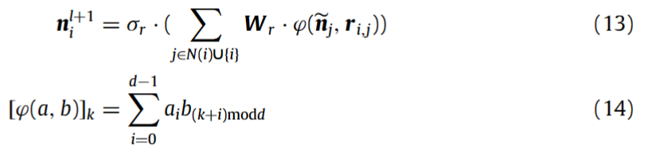
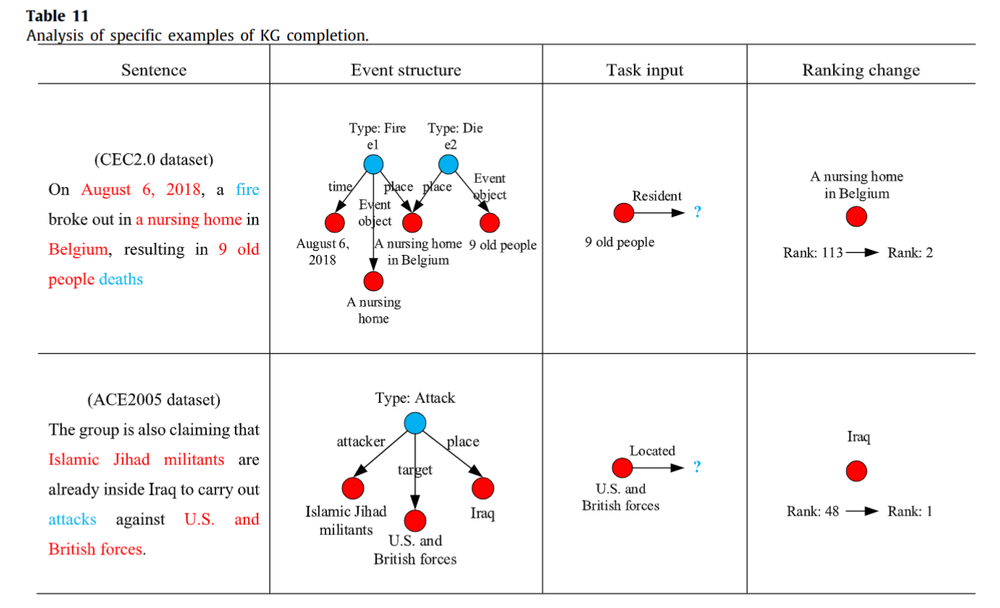

## EventKGE: Event knowledge graph embedding with event causal transfer
作者：Daiyi Li（南航）

来源：2023 Knowledge-Based Systems（中科院一区，影响因子8.8）

论文：[[ScienceDirect](https://www.sciencedirect.com/science/article/pii/S0950705123006676)]

代码：[暂无]

引用数：2

参考：[]

关键词：事件因果转移、事件知识图谱

数据集：[[CEC2.0](https://github.com/shijiebei2009/CEC-Corpus)] [[ACE2005（收费）](https://catalog.ldc.upenn.edu/LDC2006T06)] [[ACE（github）](https://github.com/Aureliu/BIU-RPI-Event-Extraction-Project/tree/master/ACE_EVENT/corpus)]

### 摘要

传统的知识图嵌入（KGE）旨在将实体和关系映射到连续的空间向量中，为下游任务提供高质量的数据特征表示。然而，大多数KGs中的关系往往只反映静态实体之间的联系，而不能代表相关实体的动态活动和状态变化，这使得KGE模型无法有效地学习到丰富而全面的实体表示。在本文中，我们验证了嵌入事件知识在KG表示学习中的重要性，并提出了一种新的基于事件因果转移的事件KGE模型（EventKGE），该模型可以有效地维护事件KG中事件、实体和关系的语义信息，第二，对于给定的事件KG，通过构造的异构图（heterogeneous graph）将KG中的事件节点和实体节点进行集成。同时，在异构图中，事件节点和实体节点通过事件~~自~~变量类型连接，事件节点通过因果关系连接。最后，针对事件、事件与实体、实体与实体之间的关系，设计了一种基于注意力网络的信息传递方法，将事件信息集成到KGE中。在ACE2005语料库和CEC2.0数据集上的综合实验验证了我们设计的事件KGE模型在多个下游任务中是有效和稳定的。

==注==：问题是传统的KG中，关系只是连接静态的实体，关系本身也是静态的，没办法学到动态的实体和关系的表征。本篇工作解决的是优化表征的学习，让实体和关系的表征对实体活动的动态关系更好的建模。

#### 同构图和异构图

同构图中，node的种类只有一种，一个node和另一个node的连接关系只有一种

1. 例如在社交网络中，可以想象node只有‘人’这一个种类，edge只有‘认识’这一种连接。而人和人要么认识，要么不认识。
2. 但是也可能细分有人，点赞，推文。则人和人可能通过认识连接，人和推文可能通过点赞连接，人和人也可能通过点赞同一篇推文连接(meta path）。这里节点、节点之间关系的多样性表达就需要引入异构图了。

异构图中，有很多种node。node之间也有很多种连接关系(edge)，这些连接关系的组合则种类更多(meta-path), 而这些node之间的关系有轻重之分，不同连接关系也有轻重之分。比如在IMDB中，可以有三类node分别是Movie，Director和Actor

### 引言

第一段：KG的概念、应用和构建。略。

目前，大多数KGE方法都可以使用低维向量来捕捉KGs中实体和关系的语义信息，并取得了显著的效果。然而，由于传统KGs中的关系仅代表实体之间的静态物理连接，因此KGE模型无法学习全面的实体信息。同时，世界包含许多事件信息，这些信息主要用于传递动态和过程性知识。因此，以事件为中心的知识表示（如事件KGs）也是人们理解客观世界的一种重要方法。事实上，要理解客观世界中的一个实体，不仅需要考虑其==静态属性==和事实（facts），更重要的是，要理解和理解与该实体相关的动态事件。因此，基于这一思想，我们认为事件知识（event knowledge）不仅可以帮助嵌入模型学习更多关于KGs中实体和关系的信息，而且可以有效地提高KGE的质量，这对与知识表示相关的下游任务有很大帮助。

近年来，虽然对事件KGE的研究很少，但也取得了一些进展。例如：Ringsquandl等人[10]提出了一种基于事件日志增强KG中实体和关系表示的框架，有效提高了KG完成任务的准确性；程等人[11]提出了一种基于KGs的事件嵌入模型，该模型可以有效地将KGs的信息纳入事件嵌入学习的目标函数中，所学习的知识表示在下游任务中取得了显著效果。尽管这些方法通过事件信息有效地加强了KG的嵌入，但它们忽略了事件之间以及事件与实体之间的信息传递，这将导致KG中某些实体信息的丢失。因此，这些研究为事件信息有助于提高KGE的质量提供了证据。

在事件KG中，事件子图通常由以下部分组成：事件触发词event trigger words（描述事件的动词或短语，如图1中的火灾、逃生和伤害）和事件自变量arguments（事件中涉及的元素和相应的角色，如图中的事件时间、事件地方和事件对象  图1）。具体来说，事件知识对KG嵌入式模型的好处主要体现在四个方面：

（1） 与传统KGs中包含的信息的实体和关系相比，该事件的信息更加丰富和全面。事件之间的关系可以使不同事件中的实体获得关联。如图1所示，Event3可以让我们知道，上海一栋老别墅在景观过程中不仅发生了火灾，还有一位老人受伤。然而，传统KGs中的Event3只能指示损伤（*injury*）的发生。

（2） 传统的幼儿园往往只涉及两个整体和关系的三重。然而，由于事件通常包含事件触发词和事件自变量，因此可以捕获多个实体之间的关系，这使得信息在KG中的表示更加全面。如图1所示，事件1可以与两个实体（如“老别墅和上海”）相关联。

（3） 与传统的KGs相比，事件包含更多的关系信息（例如，实体之间的关系、实体与实体之间的联系以及事件之间的关系），可以有效地缓解数据稀疏的问题。事件不仅可以减少两个实体之间的距离，还可以连接更多孤立的实体节点（如“火灾、逃生和受伤”），从而丰富KG。

（4） 一般来说，事件的因果关系是事件关系中一种重要的语义关系，可以有效地表示客观世界中的因果关系。基于关系的传递性，可以根据因果关系来组织彼此相关的事件。因此，事件之间的因果关系可以为嵌入模型提供实体的静态信息和动态特征。如图1所示，原始KG可能只包含火灾事件的时间和地址等信息。然而，事件序列Fire→ 逃跑→ 伤害可以提供更多与火灾事件相关的信息（如逃生事件和伤害事件）。总之，相关事件可能包含不同的事件信息。因此，使用事件因果关系作为实体信息动态转换的桥梁，不仅可以清楚地了解相关事件的原因和影响，而且有助于重新理解实体表示

在本文中，为了优化事件KGE模型，我们提出了一种新的基于事件因果转移的事件KGE（EventKGE）模型。EventKGE模型可以有效地将事件信息纳入KG表示中，并有效地维护事件KG中事件、实体和关系的语义信息。如图1所示，事件KG中的事件节点和实体节点分布在构建的异构图的两侧。具体来说，实体节点是事件信息中的事件触发词和事件自变量。此外，事件节点通过事件之间的因果关系连接，事件节点和实体节点通过事件自变量类型连接，实体主要通过事件触发词和事件自变量之间的关系连接。在Velikovic等人[12]提出的图形注意力网络（GAT）的基础上，我们设计了一个基于图形注意力的信息聚合模型，该模型将事件信息有效地融合到KGE中。具体来说，本文主要介绍了以下创新点：（i）首先，构造了一个包含事件和实体的异构图，并在该异构图中使用图注意力向量来完成基于实体嵌入的事件嵌入计算；（ii）第二，通过事件之间的因果关系更新事件嵌入，然后通过翻转的事件信息更新实体嵌入，再通过实体之间的关系合并信息；以及（iii）最后，使用基于卷积的得分函数来学习事件KG的三分之一，实现了优化模型的目标。在ACE2005语料库和CEC2.0数据集上的一些实验验证了我们设计的模型在下游任务中是有效和稳定的。本文提出的EventKGE嵌入模型的主要贡献总结如下

1） 为了更全面地描述事件信息，我们定义了一个基于六元组的事件表示模型，该模型由事件触发词、事件自变量和事件描述文本组成，可以有效地以结构化的形式表达事件；（2） 为了有效地进行嵌入，我们提出并改进了基于事件因果转移的KGE模型（EventKGE），它可以有效地维护事件KG中事件、实体和关系的语义信息；（3） 为了验证所提出的事件-KGE方法的有效性，在事件-KGE的基础上，我们对下游KG完成、实体分类和关系分类任务进行了相关研究。实验结果表明，本文提出的EventKGEmo模型是有效的、稳定的。

本研究的总体描述如下。在第2节中，我们回顾了一些关于事件KG和KGE的相关研究。我们首先给出了事件和事件KG的形式化定义，然后在第3节中简要描述了本文的研究问题。随后，在第4节中，我们详细描述了所提出方法的设计流程。第5节在两个数据集上验证了所提出的EventKGE模型的稳定性和有效性。最后，我们在最后一节中给出了最后的结论。

### 事件图谱的概念

#### coreference

在知识图谱中，"coreference"（共指消解）是指识别文本中提及的多个表达式是否指向相同的实体的过程。这是自然语言处理（NLP）和知识图谱构建中的一个重要步骤，因为它帮助系统理解不同表述方式或代词在文本中指向的是同一个实体。

例如，假设我们有这样一个句子：“比尔盖茨创立了微软。他是一位成功的企业家。”在这个例子中，“比尔盖茨”和“他”指的是同一个人。通过共指消解，知识图谱构建过程能够识别这两个表述指向相同的实体（即比尔盖茨），并据此构建一个更加丰富和准确的知识图谱。

知识图谱中的共指消解有助于：

- 提高实体识别的准确性，确保相同实体的不同称呼被正确关联。
- 增强知识图谱的连贯性，通过识别文本中的实体引用，可以更好地理解实体间的关系。
- 改善查询响应的质量，使得基于知识图谱的搜索和分析更加准确和有效。

共指消解技术通常依赖于机器学习算法，这些算法可以根据上下文线索、语言模式和世界知识来判断文本中的不同表述是否指向同一实体。在构建知识图谱的过程中，正确执行共指消解对于提高数据的质量和可用性至关重要。

### 3. Preliminary

#### 3.1 事件图谱模型的定义

（1）Event data model 事件数据模型

Table 1 中对事件图谱的定义很乱。但还是有相似之处：（1） 事件是知识的重要组成部分；（2） 特定的时间、环境和参与对象是事件发生的必要条件。本文通过对当前事件研究成果的总结和分析，给出了事件的定义。

**定义1（Event data model）**。事件是指在特定时间段或特定区域内，由一个或多个自变量参与的新的反应特征组成的客观事件或状态变化。该事件的正式表述如下：

这里，A表示动作元素（即事件触发词）。通常，动词或短语用于描述事件期间的状态变化；O表示对象元素（object）：事件的参与者。它主要由事件参与者的主体和客体组成；T表示时间元素（time）：事件发生的时间。具体来说，有两类：绝对时间和相对时间；L表示环境元素（如位置）：事件发生的地点及其临时特征，主要用于描述位置信息；C表示事件原因（cause）：事件的原因，主要用于描述导致事件的反应。R表示事件结果（result）：事件的结果，主要用于描述原因事件引起的结果。

交通事故的一个例子“19日下午6时左右，在香港新界，一辆公共汽车与一辆出租车相撞，导致出租车失控，造成1人死亡，19人受伤”。实例中包含的事件类型和事件元素如表2所示。

(2) Event KG model 事件图谱模型

在本文中，我们认为事件KG是以事件为中心的，包括两种类型的节点（事件和实体）和三种类型的有向边（事件之间、事件和实体之间，以及实体和实体之间）。如图2所示，事件之间存在因果关系，也可能存在以下与公司之间的关系；事件与实体之间的关系主要包括事件与触发词之间的关系、事件与事件论据之间的关系；实体间的关系是由触发词和事件自变量组成的实体之间的关系，如位置、参与者等。

**定义2  (Event KG Model)**。考虑到客观事件、事件自变量和事件关系，事件KG的结构形式化表示为G，如下所示：

这里，事件KG中的节点表示为N，主要包括事件节点N_evt和实体节点N_ent（即论证和触发词）。同时，事件KG中的边表示为P，主要包括事件之间的关系P_evt−evt、事件和实体之间的关系P_evt−ent以及实体之间的关联P_ent−ent。显然，KG是事件KG的特例，它只包括实体节点和实体之间的关系。

例如，新闻文本中的一句话“2018年8月6日，比利时一家疗养院发生火灾，导致9名老人死亡，3人重伤”。实例中包含的事件类型和事件元素如图2所示：

#### 3.2 Problem definition

对于KGE问题，假设给定一个三元组（s，r，o）∈∆⊆V×r×V，其中V表示实体集，r表示关系集。嵌入的目标是将实体v∈v映射到低维表示向量v_v∈U^d_V，将关系r∈r映射到低维度表示向量rr∈UdR，这里U是一个可选的嵌入空间，用于维护KG结构的语义信息。

在定义2中，我们给出了事件KG模型的形式化定义。在这些事件中，我们考虑了另一组具有事件因果关系的事件节点。==假设E用于表示事件节点集，其中每个事件ei∈E由一个事件触发词ti（事件的动作元素也称为事件的触发词）、其事件类型di∈D和一组事件自变量Ai组成（事件=事件触发词(动词)+事件类型+事件属性）==。如图2所示，“重伤”是“3名老人重伤”事件的触发词，“死亡”是“9名老人死亡”事件的触发词。事件类型di来自预定义的事件类型类别D，例如图2中前两个节点的火灾和死亡。2。事件参数集Ai由参数实体和参数角色组成。

这里，m表示事件e_i中的事件自变量的数量；n_i,k表示事件e_i中的第k个事件自变量，z_i,k表示在事件e_i中第k个事件自变量的角色类型（事件自变量的作用类型是预定义的）。如图2所示，（时间，2018年8月6日）是事件e1的事件自变量，（Event object，9老年人）是事件自变量e2。事件KGE的目标是学习事件KGG中每个节点ni∈N的低维向量表示。==（n_i,k是自变量节点，z_i,k是事件到自变量节点的边。）==

### 4. Methodology

#### 4.1 Overview of the event KG embedding model

对于给定的事件KG G，我们根据事件KG中节点和边的分布构建了一个异构图网络，其中entity nodesN和event nodesE分布在异构图网络的两侧。如图所示。1，事件节点和实体节点通过自变量角色类型连接，而实体节点主要包括事件自变量和事件触发器，实体节点通过事件触发器和事件自变量之间的关系进行连接。此外，事件之间存在因果关系。为了确保事件KG中嵌入的信息更全面，我们提出了一个名为EventKGE的高效事件KGE模型，该模型可以有效地维护事件KG中事件、实体和关系的尾数信息。

如图3所示，为给定的事件KG建立了一个包含事件、实体和关系的异构图网络。首先，用图注意力机制表示从实体（事件自变量和事件触发器）到事件的有向图；然后，基于图卷积神经网络，在事件之间具有因果关系的事件节点上传输消息，完成事件表示的更新；最后，在事件到实体定向图上使用另一个图注意力机制，将事件信息传递回实体，然后使用另一GCN网络在相关实体节点上完成实体表示。

#### 4.2. Event KG embedding model based on event causal transfer

在本研究中，我们设计了一个多层事件信息分离模型来有效地表示事件KG中的信息。其中，我们使用n^l_i来表示第l层中第i个实体的表示向量，关系类型的嵌入表示为r_i,j，表示边（i，j），这里（i，j）表示第i个实体节点和第j个实体节点之间的关系。同时，事件触发词的嵌入向量表示为t_i，事件类型的嵌入向量表达为d_i。对于每个事件中的事件自变量，由于KG中的事件参数都由实体表示，因此事件e_i中的第k个事件自变量表示为n^l_i,k，自变量的作用表示为z_i,k。在训练过程中，每层中只更新实体嵌入，而每层中嵌入的内容相同。此外，通过端到端的训练实现了统一的参数优化，以降低模型的计算复杂性。

**(1) Event information representation based on entity embedding**

==注：事件实体||事件类型||事件变量实体||事件到事件变量的边==

图注意力网络：为了有效地提取异构图中事件的有效信息，我们使用图注意力机制来表示有向图上从实体（事件自变量和事件触发器）到事件的事件。GAT[12]是在GCN的基础上改进的。它使用自注意机制将适当的权重分配给相邻节点。在训练过程中，它主要关注相邻节点的配对，不需要依赖于特定的网络结构。

为了获得输入数据的更深层次的特征，对输入特征进行可学习的线性变换。每个节点（事件触发器、事件类型、事件自变量和角色类型）通过共享权重矩阵进行线性变换，权重矩阵表示为Wα。最后，k的归一化结果ei，k与事件ei不相连，计算如下:

LeakyReLU函数将非零斜率分配为所有负值，||是特征链接运算，Wα是神经网络中连接层之间的权重矩阵。此外，ti表示事件ei在事件KG中的触发词嵌入，n^l_i,k表示事件ei中第k个事件自变量的事件自变量嵌入（事件ei中的事件自变量数量为m）。然后使用注意力方法来确定相邻节点之间的关联度，并将节点特征聚合到注意力图上。求解注意力系数a_i,k的具体过程如等式（5）所示：

这里，t_i表示事件e_i在事件KG中的触发字嵌入，n^l_i,k表示事件ei中的第k个事件自变量的事件自变量embeding（事件ei中事件自变量的数量为m）。通过注意力系数的计算，链接每个头部的输出特征（即通过注意力机制有效聚合事件的相关信息，包括事件触发器、事件类型和事件自变量角色类型）。然后，可以通过加权计算来获得从其自变量传递到每个事件e_i的实体信息v_i：

其中，σr（·）表示ReLU激活函数，W_e表示可训练的参数矩阵。最后，获得的事件触发词嵌入t_i、事件类型嵌入d_i和实体信息嵌入v_i作为事件的嵌入表示e_i（如图3第一部分所示）：

算法1给出了基于实体嵌入的事件表示算法:

**(2) Transmission of information between events based on causality**

==注：事件e_i + 事件过网络后的特征 = /hat{e_i}==

如图3的第二部分所示，事件之间的信息通过因果关系传递，从而通过消息传输完成事件表示的最新e_i。具体来说，我们使用N（i）来表示通过因果关系与事件i连接的事件集。因此，GCN网络用于更新事件表示，如下所示。

其中，γ表示控制合并相邻事件的信息量的超级参数，|N（i）|表示事件集中事件的总数，Wc表示可调度参数矩阵。因此，事件之间的信息可以通过事件之间的消息传递有效地提供给模型。

算法2中给出了基于事件因果关系的事件表示更新。

**(3) Entity representation based on event embedding**

==注：这个模块的作用是，把表征好的事件，反过来再去影响实体。==

如图3的第三部分所示，我们主要完成从事件到实体的信息聚合任务。具体而言，基于图注意力机制，将获得的事件信息（==事件的表示==）（如公式（8）所示）传输回实体。对于每个实体n_i，我们使用Ω以通过参数类型表示连接到实体n_i的事件集：==（通过自参数实体反推回事件）。这里n_j,k表示事件j的第k个属性。例如在第三个模块中，实体v4的事件集合为{e1, e2, e3}。==

如图3所示，连接到entity node n_i的事件集表示为Ω =｛ej，ej+1，ej+2｝。为了获得输入数据的更深层次的特征，对输入特征进行可学习的线性变换。每个节点（事件节点和事件自变量）通过共享的权重矩阵进行线性变换，权重矩阵表示为Wβ。最后，连接到entity n_i的k的归一化结果s_i,k计算如下：==（实体的表征 = 事件的表征 + 实体）==

LeakyReLU函数将非零斜率赋值为所有负值，||是特征链接运算，Wβ是神经网络中连接层之间的权重矩阵。然后使用注意力方法获得相邻节点之间的关联度，并将节点特征聚合到注意力图上。求解事件ek的注意力系数β_i,k的具体过程如下： ==（实体和表征后事件的注意力分数）==

在这里Ω_i|表示事件集中的事件总数。通过注意力系数的计算，将每个头部的输出特征联系起来（即通过注意力机制有效地聚合实体的相关信息）。然后，通过加权计算获得实体节点n_i的实体信息向量n_i：==（实体的表征 = 实体表征后特征的每一层表征 + 和事件之间的注意力）==

与等式（8）类似，η表示控制从事件到实体的信息传递水平的超参数，W_n表示可训练参数矩阵。实体信息转换器n_i包含任何信息，包括事件触发器、事件自变量、自变量角色和事件因果关系。

算法3给出了基于事件嵌入的实体表示。

**(4) Information transfer based on the relationship between entities**

==注：实体和关系之间的表征。==

如图3第四部分所示，在具有连接的实体之间传递信息，以完成实体之间静态关系信息的组合。由于实体之间存在不同的关系类型，我们使用GCN网络来对不同关系类型的嵌入进行建模。具体来说，我们使用N（i）来表示通过实体之间的关系与entity node n_i连接的实体节点集。最后，使用GCN网络[9]来更新实体表示。==（）==

这里，σr（·）表示ReLU激活函数，r_i,j表示关系类型嵌入。φ（a，b）表示a向量和b向量之间的循环相关函数（d表示向量的维数），用于表示实体的相关对。最后，得到了更新的实体表示n^l+1_j，它主要包括关于实体和事件的信息。最后一层的输出n^L_i用于模型优化和KG表示学习。

算法4中给出了基于实体之间关系的实体表示更新。

#### 4.3. Model optimization and KG representation learning

为了优化嵌入模型，我们将数据分为训练集和测试集，并通过得分函数（测量三元组的可能性）进行嵌入学习。嵌入学习的目标是测试集中三元组的分数高于不在测试集中的三元组。

具体来说，首先，我们通过设计的多层事件信息聚合模型，获得包含事件信息的==实体表示==n^L_i和关系类型r_i,j的嵌入。其次，通过最大化每个知识三元组（n_i，r_i,j，n_j）的得分函数（卷积2D）来优化模型。具体地，基于给定的头部实体n_i和关系r_i,j，预测可能的尾部实体。假设N+表示预测的样本实体的集合，N−表示随机的负样本实体。最后，使用二进制交叉熵来计算知识三元组（n_i，r_i,j，n_j）的损失。

这里σ_s（·）表示s形函数，CONV（·）是记分函数（卷积2D）[51]。具体来说，假设有一个三元组（s，r，o），CONV（·）计算如下：

### 5. Experiment

在本节中，首先介绍了事件KGE模型的训练数据、超参数集和评估指标。其次，我们给出并分析了下游任务的实验结果。最后，我们讨论了所提出的方法的优点和缺点，以及未来的研究。

#### 5.1 数据集和实验设置

使用当前公认的事件提取（EE）基准数据集（ACE2005语料库1和CEC2.0数据集2）进行实验。此外，为了进一步测试所开发的KGEmodel的能力和可靠性，将其与相同数据集上的现有高级模型进行比较。

（1） 数据集ACE2005数据集（LDC2006T06）为实体、关系和事件公告提供了文档级语料库，包括分别用于训练集、验证集和测试集的569个文档、64个文档和64个文档。

由于数据集具有良好的事件注释，因此有助于评估事件KGEmodel的性能。此外，为了进一步证明KGEmodel的有效性，我们还对==CEC2.0Chinese==事件提取数据集进行了相关实验，该数据集包含533个文档，分为新冠肺炎、火灾、地震、交通事故和恐怖袭击七类。从两个事件数据集中提取的事件、实体和关系的统计结果如表3所示。

（3）评价指标。

Hits@n，MRR，F1-measure。

此外，F1用于评估实体和关系分类任务模型的性能。

#### 5.2 下游验证任务

KG completion（Hits@n和MRR）、Entity classification、Relation classification

#### 5.3 Baseline

TransE、DisMult、ConvE、HyConvE、EventKG

#### 5.4 实验结果（KG补全）

#### 5.6 示例分析

为了进一步验证本文提出的事件KGE模型是否如设计的那样有效，进行了具体的案例研究。如表11所示，对于KG完成任务，我们给出了其在验证集上的输出结果。具体来说，给定一个头部实体和关系，它显示正确的尾部实体排名，并合并事件信息。

第一个实例是从CEC2.0数据集中选择的。这一立场通过KGcompletion模型预测了“9名老人”的居住地址，但KG（培训集）中实体之间的关系不包含任何信息，这使得模型输出的正确实体“比利时养老院”的排名更低。然而，“A nursing home in Belgium”和“9 old people”这两个词通过第2节点（类型：Die）连接起来，这表明有9名老人居住在养老院，因此，两个实体之间的距离可以大大缩短，从而使模型能够根据事件信息正确预测三元组的尾部实体。

第二个实例是从ACE2005数据集中选择的。该实例通过KG完成模型预测了（美国和英国军队）的位置，但KG（训练集）中实体之间的关系不包含任何信息，这使得模型输出正确的实体“Raq”排名较低。在这个例子中，有一个袭击事件，表明“伊斯兰圣战武装分子”的目标是袭击驻伊拉克的军队（美国和英国军队）。因此，通过事件信息可以很容易地获得当前军队（美国和英国军队）在伊拉克的存在，并将尾部实体“伊拉克”的排名从48位降低到1位。这个例子有力地证明了事件信息有助于提高KG完成模型的性能。

