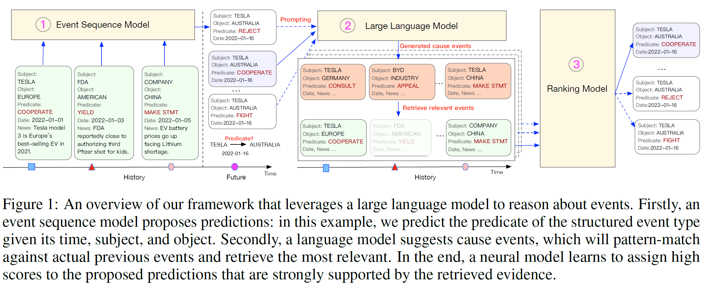
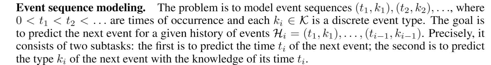
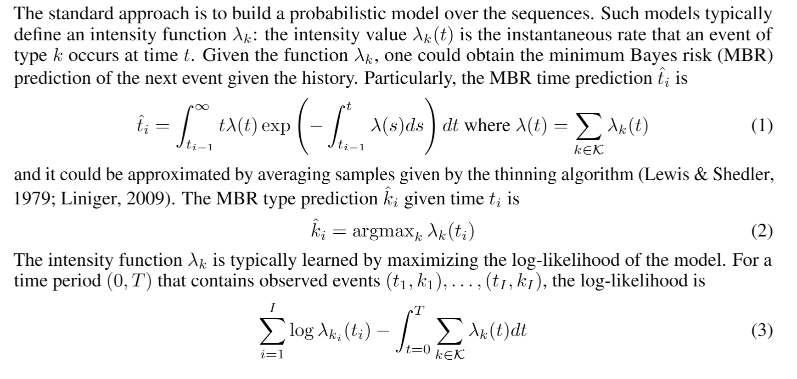
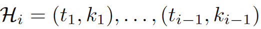

## Language Models Can Improve Event Predictionby Few-Shot Abductive Reasoning
作者：Xiaoming Shi（蚂蚁集团）

来源：Neurips2023

论文：[[neurips.cc](https://proceedings.neurips.cc/paper_files/paper/2023/file/5e5fd18f863cbe6d8ae392a93fd271c9-Paper-Conference.pdf)]

代码：[[github](https://github.com/iLampard/lamp)]

引用数：12

参考：[[zhihu](https://zhuanlan.zhihu.com/p/676674268)] [[zhihu2](https://zhuanlan.zhihu.com/p/635455540)]

关键词：事件预测

### 摘要

大型语言模型在广泛的推理任务中表现出了惊人的性能。在本文中，我们研究了它们是否可以对真实世界的事件进行推理，并有助于提高事件序列模型的预测性能。我们设计了LAMP，这是一个在事件预测中集成了大型语言模型的框架。特别地，该语言模型执行溯因推理以辅助事件序列模型：事件模型在给定过去的情况下提出对未来事件的预测；在一些专家注释的演示的指导下，语言模型学会为每个提议提出可能的原因；搜索模块找出与所述原因匹配的先前事件；评分函数学习检查检索到的事件是否真的会导致该提议。通过在几个具有挑战性的真实世界数据集上进行的广泛实验，我们证明，由于大型语言模型的推理能力，我们的框架可以显著优于最先进的事件序列模型。

### 1 介绍

提示（prompting）大型语言模型（LLM）（如GPT-3.5）最近已成为执行基于文本的推理任务的标准方法。在本文中，我们研究了它们对真实世界事件进行推理和改进事件预测的能力。特别是，我们关注的是对带有==时间戳的事件序列==进行建模，并在给定过去的情况下预测未来事件的问题。例如，在医疗保健领域，我们希望对患者的时间戳医院就诊序列进行建模，并根据他们过去的诊断和治疗预测他们未来的症状。这是机器学习中一个长期存在的重要问题。大型语言模型可能有助于推进该问题的解决方案，因为事件序列通常伴随着丰富的文本信息，而大型语言模型擅长处理这些信息。例如：

*医疗保健*。每次医院就诊都会有一份医生笔记，总结这次就诊，包括患者就诊的科室、临床测量和治疗，以及任何未来的医疗计划。通过阅读这样的文本信息，可以引出一个大型语言模型来回忆它在预训练期间阅读的医学知识，然后对未来的医院就诊进行推理，例如患者可能有什么症状或治疗。

*政治*。政治的每一个政治事件都可能产生一系列新闻文章，描述参与其中的政治代理人，并讨论其可能的影响。阅读这些文章的语言模型可能会回忆起它从预训练中获得的关于这些代理人、他们的关系和政治基本原则的知识，从而对未来的政治事件进行推理。

类似的情况出现在商业、对话、金融等领域。

在本文中，我们提出了LAMP，这是一个在事件预测中集成了大型语言模型的框架。我们的框架概述如图1所示。

给出历史事件，我们使用预先训练（pretrained model）的事件序列模型来提出对未来事件的预测，然后在LLM的帮助下对其进行检查。LLM学习执行溯因推理：它由一些专家注释的演示指导，并生成可能的原因，这些原因可以解释每个提案可能发生的情况。（it is instructed by a few expert-annotated demonstrations, and generates possible causes that may
explain the possible occurrence of each proposal.）每个生成的原因都用作查询，以搜索实际发生的类似或相关事件。然后，另一个神经模型学习嵌入这些检索结果，并检查它们是否真的能证明相应的建议是合理的。

图片解释：给出(s, ?, o, t)，预测关系。LLM生成可能的三元组对，再检索历史事件四元组，找到最相关的。在LLM生成的所有四元组中，结合评分函数和历史检索结果给出最合适的关系预测。

据我们所知，我们是==第一个将大型语言模型集成到事件序列建模==中的人。我们的建模和预测框架是通用的：它可以包含各种事件序列模型和大型语言模型。我们对一系列模型选择进行了实验，并证明大型语言模型确实有助于提高事件序列模型的预测性能。在几个具有挑战性的真实世界数据集上，我们的框架显著优于当前最先进的事件序列模型。

### 2 问题的形成和技术背景

现在我们正式介绍一下我们的问题设置，并复习一下背景知识。

**事件序列建模**。事件序列是：（t, k）其中，t是时间、k是事件类型。事件预测任务是：给出历史事件（ t\_{1-i-1}, k\_{1-i-1} ），先后分别预测 t_i 和 k_i 。

标准方法是在序列上建立一个概率模型。此类模型通常定义强度函数λk：强度值λk（t）是k型事件在时间t发生的瞬时速率。给定函数λk，可以获得给定历史的下一个事件的最小贝叶斯风险（MBR）预测。特别地，MBR时间预测为公式（1）。

并且它可以通过对稀疏算法给出的样本进行平均来近似（Lewis和Shedler，1979；Liniger，2009）。给定时间ti的MBR类型预测，公式（2）。

强度函数λk通常通过最大化模型的对数似然来学习。对于包含观察到的事件（t1，k1）的时间段（0，T），。。。，（tI，kI），对数似然为

**富文本信息（Rich text information）。**在现实世界的数据中，每种类型的k都可以表示为一个基于文本的标识符：在图1的例子中，每一种k都是二十国集团国家的政治实体（组织和个人）之间可能的==互动==之一，可以用一个结构化的名称表示，如特斯拉与澳大利亚的合作。此外，每个事件都可能有一个文本标记m，其中包含有关该事件的额外信息：在图1中，每个m都是有关该事件（例如，“电动汽车电池价格上涨”）的新闻标题。为了表示法的简单性，我们只在必要时提及事件的标记m。在阅读此类文本信息时，人类可能会回忆起他们的相关领域知识（例如，电池价格对特斯拉和澳大利亚的影响），并增加他们对特斯拉与澳大利亚合作事件在不久的将来发生的概率的估计。人类学习这些知识的一个重要方式是阅读教科书、研究出版物和新闻文章等文本。但是事件序列模型不能直接利用这类信息。

**大型语言模型。**语言模型通过阅读文本来学习。在过去的几年里，几乎阅读了整个互联网的大型语言模型在许多具有挑战性的任务上表现出了惊人的性能，如算术推理和多回合对话（Wei et al.，2022b；OpenAI，2023）。因此，将大型语言模型与事件序列模型配对以提高其预测性能似乎很诱人：语言模型消耗了大量信息，而事件模型可能没有看到这些信息，但应该能够从中受益。

### 3 LAMP: Large Language Model in Event Prediction

现在我们介绍我们的LAMP框架，其中利用LLM来增强事件序列模型的预测过程。如图1所示，LAMP有三个关键组件：

- 基本事件序列模型。这个模型是经过预训练的，我们用它来提出候选预测。第3.1节是对这一阶段的讨论。

- 一个大型语言模型。它在框架中的职责是执行溯因推理，这是一种逻辑推理形式，旨在为给定的观察结果寻求最合理的解释（Russell&Norvig，2010）。特别是，语言模型读取每个提出的预测，并为其提出可能的原因事件。然后，我们将LLM生成的每个原因与历史中实际的先前事件进行模式匹配，并检索最相似的原因。第3.2节讨论了这一阶段。
- 排名模型。排名模型学习检查候选预测及其检索到的事件的每个组合，或者换言之，检查其证据，并为检索到的证据有力支持的候选分配高分。第3.3节讨论了这一阶段。

#### 3.1 Phase-I: Proposing Predictions

给定先前事件的历史，基本事件序列模型被用作命题器，以生成关于下一个事件的时间和类型的候选预测。

### 实验

