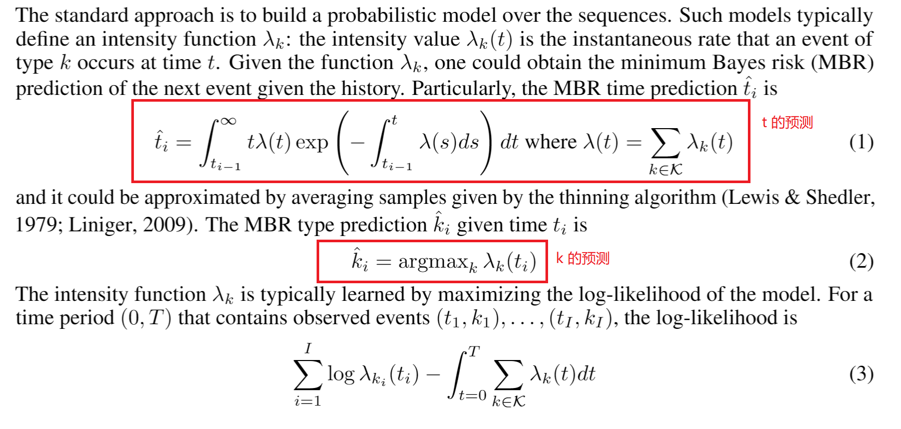
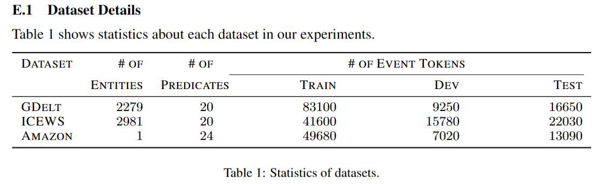

## Language Models Can Improve Event Predictionby Few-Shot Abductive Reasoning
作者：Xiaoming Shi（蚂蚁集团）

来源：Neurips2023

论文：[[neurips.cc](https://proceedings.neurips.cc/paper_files/paper/2023/file/5e5fd18f863cbe6d8ae392a93fd271c9-Paper-Conference.pdf)]

代码：[[github](https://github.com/iLampard/lamp)]

引用数：12

参考：[[zhihu](https://zhuanlan.zhihu.com/p/676674268)] [[zhihu2](https://zhuanlan.zhihu.com/p/635455540)]

关键词：事件预测

### 摘要

大型语言模型在广泛的推理任务中表现出了惊人的性能。在本文中，我们研究了它们是否可以对真实世界的事件进行推理，并有助于提高事件序列模型的预测性能。我们设计了LAMP，这是一个在事件预测中集成了大型语言模型的框架。特别地，该语言模型执行溯因推理以辅助事件序列模型：事件模型在给定过去的情况下提出对未来事件的预测；在一些专家注释的演示的指导下，语言模型学会为每个提议提出可能的原因；搜索模块找出与所述原因匹配的先前事件；评分函数学习检查检索到的事件是否真的会导致该提议。通过在几个具有挑战性的真实世界数据集上进行的广泛实验，我们证明，由于大型语言模型的推理能力，我们的框架可以显著优于最先进的事件序列模型。

### 1 介绍

提示（prompting）大型语言模型（LLM）（如GPT-3.5）最近已成为执行基于文本的推理任务的标准方法。在本文中，我们研究了它们对真实世界事件进行推理和改进事件预测的能力。特别是，我们关注的是对带有==时间戳的事件序列==进行建模，并在给定过去的情况下预测未来事件的问题。例如，在医疗保健领域，我们希望对患者的时间戳医院就诊序列进行建模，并根据他们过去的诊断和治疗预测他们未来的症状。这是机器学习中一个长期存在的重要问题。大型语言模型可能有助于推进该问题的解决方案，因为事件序列通常伴随着丰富的文本信息，而大型语言模型擅长处理这些信息。例如：

*医疗保健*。每次医院就诊都会有一份医生笔记，总结这次就诊，包括患者就诊的科室、临床测量和治疗，以及任何未来的医疗计划。通过阅读这样的文本信息，可以引出一个大型语言模型来回忆它在预训练期间阅读的医学知识，然后对未来的医院就诊进行推理，例如患者可能有什么症状或治疗。

*政治*。政治的每一个政治事件都可能产生一系列新闻文章，描述参与其中的政治代理人，并讨论其可能的影响。阅读这些文章的语言模型可能会回忆起它从预训练中获得的关于这些代理人、他们的关系和政治基本原则的知识，从而对未来的政治事件进行推理。

类似的情况出现在商业、对话、金融等领域。

在本文中，我们提出了LAMP，这是一个在事件预测中集成了大型语言模型的框架。我们的框架概述如图1所示。

给出历史事件，我们使用预先训练（pretrained model）的事件序列模型来提出对未来事件的预测，然后在LLM的帮助下对其进行检查。LLM学习执行溯因推理：它由一些专家注释的演示指导，并生成可能的原因，这些原因可以解释每个提案可能发生的情况。（it is instructed by a few expert-annotated demonstrations, and generates possible causes that may
explain the possible occurrence of each proposal.）每个生成的原因都用作查询，以搜索实际发生的类似或相关事件。然后，另一个神经模型学习嵌入这些检索结果，并检查它们是否真的能证明相应的建议是合理的。

图片解释：给出(s, ?, o, t)，预测关系。LLM生成可能的三元组对，再检索历史事件四元组，找到最相关的。在LLM生成的所有四元组中，结合评分函数和历史检索结果给出最合适的关系预测。

据我们所知，我们是==第一个将大型语言模型集成到事件序列建模==中的人。我们的建模和预测框架是通用的：它可以包含各种事件序列模型和大型语言模型。我们对一系列模型选择进行了实验，并证明大型语言模型确实有助于提高事件序列模型的预测性能。在几个具有挑战性的真实世界数据集上，我们的框架显著优于当前最先进的事件序列模型。

### 2 问题的形成和技术背景

现在我们正式介绍一下我们的问题设置，并复习一下背景知识。

**事件序列建模**。事件序列是：（t, k）其中，t是时间、k是事件类型。事件预测任务是：给出历史事件（ t\_{1-i-1}, k\_{1-i-1} ），先后分别预测 t_i 和 k_i 。

标准方法是在序列上建立一个概率模型。此类模型通常定义强度函数λk：强度值λk（t）是k型事件在时间t发生的瞬时速率。给定函数λk，可以获得给定历史的下一个事件的最小贝叶斯风险（MBR）预测。特别地，MBR时间预测为公式（1）。

并且它可以通过对稀疏算法给出的样本进行平均来近似（Lewis和Shedler，1979；Liniger，2009）。给定时间ti的MBR类型预测，公式（2）。

强度函数λk通常通过最大化模型的对数似然来学习。对于包含观察到的事件（t1，k1）的时间段（0，T），。。。，（tI，kI），对数似然为

**富文本信息（Rich text information）。**在现实世界的数据中，每种类型的k都可以表示为一个基于文本的标识符：在图1的例子中，每一种k都是二十国集团国家的政治实体（组织和个人）之间可能的==互动==之一，可以用一个结构化的名称表示，如特斯拉与澳大利亚的合作。此外，每个事件都可能有一个文本标记m，其中包含有关该事件的额外信息：在图1中，每个m都是有关该事件（例如，“电动汽车电池价格上涨”）的新闻标题。为了表示法的简单性，我们只在必要时提及事件的标记m。在阅读此类文本信息时，人类可能会回忆起他们的相关领域知识（例如，电池价格对特斯拉和澳大利亚的影响），并增加他们对特斯拉与澳大利亚合作事件在不久的将来发生的概率的估计。人类学习这些知识的一个重要方式是阅读教科书、研究出版物和新闻文章等文本。但是事件序列模型不能直接利用这类信息。

**大型语言模型。**语言模型通过阅读文本来学习。在过去的几年里，几乎阅读了整个互联网的大型语言模型在许多具有挑战性的任务上表现出了惊人的性能，如算术推理和多回合对话（Wei et al.，2022b；OpenAI，2023）。因此，将大型语言模型与事件序列模型配对以提高其预测性能似乎很诱人：语言模型消耗了大量信息，而事件模型可能没有看到这些信息，但应该能够从中受益。

### 3 LAMP: Large Language Model in Event Prediction

现在我们介绍我们的LAMP框架，其中利用LLM来增强事件序列模型的预测过程。如图1所示，LAMP有三个关键组件：

- 基本事件序列模型。这个模型是经过预训练的，我们用它来提出候选预测。第3.1节是对这一阶段的讨论。

- 一个大型语言模型。它在框架中的职责是执行溯因推理，这是一种逻辑推理形式，旨在为给定的观察结果寻求最合理的解释（Russell&Norvig，2010）。特别是，语言模型读取每个提出的预测，并为其提出可能的原因事件。然后，我们将LLM生成的每个原因与历史中实际的先前事件进行模式匹配，并检索最相似的原因。第3.2节讨论了这一阶段。
- 排名模型。排名模型学习检查候选预测及其检索到的事件的每个组合，或者换言之，检查其证据，并为检索到的证据有力支持的候选分配高分。第3.3节讨论了这一阶段。

LLM 的引入类似于推荐里面的检索和精排机制。在 Base model 的预测值基础上，利用 LLM 推理并且从历史序列中检索出 cause events，根据这些事件序列，重新再做一次精排，最终输出预测值。

模型架构：

#### Prompt模板

#### 3.1 Phase-I: Proposing Predictions（给出预测）

给定先前事件的历史，基本==事件序列模型==被用作命题器，以生成关于下一个事件的时间和类型的候选预测。

给定先前事件的历史Hi＝（t1，。。。，（ti−1，ki−1），基本事件序列模型被用作命题器，以生成关于下一个事件的时间和类型的候选预测。对于时间预测，我们绘制了==L==个i.i.d.样本，，通过细化算法从基本模型中得到的数据。如果我们只使用这个基本模型，而不使用LLM增强的框架，那么最终的MBR时间预测将是样本的平均值，即。然而，MBR预测可能并不准确，因为基本模型是不完美的。因此，我们的LAMP框架将所有L+1个样本（其中，Plot t（L+1）i表示MBR预测）（）视为候选者，并利用LLM和排序模型在稍后阶段对其进行评分。如果L中的任何一个绘图实际上比MBR估计更好的预测，我们的框架有机会将其排名更高。

正如我们将在第3.2节和第3.3节中很快展示的那样，LLM和排名模型适用于完整的事件。因此，我们发现最可能的M个完全事件{（ξt(ℓ) i，ξk(ℓ,m） i）}Mm=1，对于每个时间命题(ℓ) i，其中(ℓ,m） i是在时间ξt具有第m个最高强度的事件类型(ℓ) 我。

对于给定地面实况时间ti的类型预测，我们发现M个事件类型为ξk（1）i，。。。，其中，在基本模型下，在时间ti处，Plot k（M）i具有第M个最高强度。如果我们只使用这个基本模型进行预测，MBR类型的预测将是具有最高模型强度的事件类型的ξk（1）i。然而，我们的完整框架将使用LLM和排序模型来检查时间ti处的前M个完整事件{（ti，ξk（M）i）}Mm=1中的每一个，以便做出更明智的预测。

在实践中，事件类型通常具有结构，我们可能对预测结构化类型的属性感兴趣。图1显示了一个示例，在该示例中，我们试图预测给定时间、主题和对象的结构化事件类型的谓词。在这种情况下，我们只需要选择最可能的M个事件类型作为提案，这些事件类型的其他属性与已知信息相同（例如，图1中的特斯拉和澳大利亚)。

L和M是超参数。理想情况下，我们希望分析所有可能的候选者（即，L=∞和M=|K|），这对于时间预测来说是棘手的，对于类型预测来说是昂贵的。在实践中，我们将重点放在最合理的候选者上，以保持较低的计算成本。在我们的实验中，我们的框架已经在小L和M的情况下表现得非常好。

L是大模型生成的样本数量，M是给出预测的事件类型的数量。

#### 3.2 Phase-II: Prompting LLM to Perform Abductive Reasoning

对于每个提出的事件（t，k），我们的框架从其完整历史中选择一组以前的事件作为其支持证据e（t，k）。该选择由LLM（例如GPT-3.5）指导。从技术上讲，我们提示LLM想象一些可能的原因事件，在LLM的信念下，这些事件将能够解释这一提议的发生。想象中的原因事件可能与历史中的任何实际事件都不完全匹配，但我们可以将它们用作查询来搜索最相似的事件。

提示是一种广泛使用的从LLM中提取知识的技术。提示是一种简洁的语句，旨在引起LLM的响应。它通常包括任务描述和一些演示。我们的提示遵循清单1和2中的格式。

每个LLM生成的原因事件都被用作查询，以搜索历史中D个最相似的事件，其中D>0是一个超参数。然后，总体证据e（t，k）被定义为LLM生成的原因检索到的先前事件的并集。检索是基于向量的：我们为查询事件构造查询嵌入vq，为每个实际的先前事件构造密钥嵌入vk；相似性是通过vq和vk之间的余弦来测量的，即v⊤q-vk½vq½vk½。我们使用预训练的句子ERT（SBERT）（Reimers&Gurevych，2019）作为我们的嵌入模型。该模型将连接事件时间t、事件类型k的文本标识符（例如，主谓对象）以及事件的文本标记m（如果有的话）的文本字符串作为输入。它为每个令牌返回一个嵌入，我们将事件嵌入v作为SBERT嵌入的平均值。

#### 3.3 Phase-III: Ranking Proposals

在这个阶段，我们的框架根据与检索到的证据（历史事件）e（t，k）的兼容性对每个提出的事件（预测的事件）（t，k）进行评分。准确地说，分数定义为

函数c将所提出的事件（t，k）及其证据e（t，k）作为输入，并返回标量∈R。c的高值意味着这一提议得到了其检索到的证据的有力支持，因此更有可能是时间t的实际事件；低值意味着即使在我们尽力从历史中搜索之后，该提案也没有强有力的证据。

给定在时间t发生的最可能的M个事件{（t，k（M））}Mm=1，我们将它们的s_event得分相加，以衡量我们的框架对时间t发生事件的总体信念

直观地说，当此时任何排名靠前的事件类型都能得到检索到的证据的有力支持时，该分数就很高。否则，即使是排名靠前的事件类型在历史上也没有强有力的证据，这意味着下一个事件不太可能在此时发生。

对于时间预测，每个建议的时间具有分数—更准确地说，——我们的最终预测是得分最高的提案

对于给定时间t的类型预测，每一个提出的类型都有一个分数为，并且我们的框架将最终预测视为具有最高分数的类型。

**模型架构。**我们的函数c是一个具有连续时间变换器结构的能量函数（Xue et al.，2022）。它按时间顺序读取建议（t，k）及其证据事件，并返回兼容性分数∈R。我们选择这种架构是因为它的持续时间关注适合我们的环境。首先，注意力机制可以学会忽略任何检索到的并不真正相关的事件，并将注意力集中在那些能够实际支持提案的事件上。其次，它对时间的复杂处理可能会捕捉到证据事件的时间如何影响其与提案的相关性（例如，最近的证据事件可能比古代事件更重要）

**训练。**我们通过最大化目标J def=J_actual+βJ_no来训练排名模型，其中β≥0是超参数。第一个术语J_actual定义为

其中（t1，k1），。。。，（tI，kI）是时间间隔（0，T）上的事件序列，每个k（m）i是在时间tI时在基本模型下具有第m个最高强度的事件类型。通过最大化J_actual，函数c学习增加实际发生的事件的得分，但抑制时间t1，。。。，tI。第二个术语J_no定义为

其中，每个tn是从（0，T）均匀采样的时间点，每个k（m）n是在时间tn具有第m个最高强度的事件类型。通过最大化J_no，函数c学习在除t1，…之外的时间（0，T）上降低非事件的得分，。。。，tI

尽管在方程（6）和（7）中没有明确提及，但计算J_actual和J_no涉及搜索实际和拟议事件的证据。

### 4 训练和预测

Event Sequence Model 和 Ranking Model 都是用经典方法单独训练的， LLM 直接调用接口，不做微调。训练与预测的细节见论文。

Event Sequence Model（4个sota）：NHP（Mei&Eisner，2017a）、Know Evovle（KE）（Trivedi等人，2017）、DyRep（Trivedy等人，2019）和ANHP（Yang等人，2022）。对于它们中的每一个，我们都将其作为一种基线方法进行了评估，并将其集成到我们的LAMP框架中。KE和DyRep需要特定领域的知识来配置其结构稀疏架构：我们在GDELT上对它们进行评估，因为它们的GDELT特定架构在原始论文中可用；我们没有在亚马逊评论上对它们进行评估，因为我们对这些数据没有这样的了解。ANHP可以将领域知识纳入其架构，但这是可选的，因此我们在GDELT和Amazon数据上对其进行了评估：在GDELT上，我们将KE和DyRep中使用的知识改编为其结构；在亚马逊评论上，我们使用通用架构。在亚马逊评论上，我们也对NHP进行了实验，因为它不需要任何特定领域的结构知识。

我们用三种强LLM进行了实验：GPT-3-davinci（Brown et al.，2020），我们也将其表示为G3.0；GPT-3.5-turbo（Brown等人，2020；Stiennon等人，2020年；Gao等人，2022），我们也将其表示为G3.5，以及具有13B参数的Llama-2-chat（Touvron等人，2023），我们也称其为美洲驼。对于GDELT和ICEWS数据，我们使用了10个镜头提示；对于亚马逊评论的数据，我们使用了8次提示。每个“镜头”都是一个演示，其中包含一个效果事件，然后是一个或多个专家注释的原因事件。提示性示例见附录E.4。

### 5 实验

我们在三个开源数据集，两个是时序图谱数据集 GDELT 和 ICEWS，一个是 推荐系统常用的 Amazon Review 序列数据。我们用Mean Rank 作为指标来衡量模型的性能。从 Base Model 的预测值中取出分数最高的M个，然后对这M个进行重排（第二步和第三步），我们看 ground truth event 的排名会不会更好 （Rank 数值会更低，比如从排名第8 到 排名第 2）。

LLM 我们测试了 GPT-3.0 和 GPT-3.5 两个选择。在消融实验的时候我们也测试了 Llama2，详见文章的实验部分。

从结果来看，不同的 Base Model 和 Ranking Model 组合下，GPT-3.5 都能提升最终的预测性能，GPT-3.0 效果相对一般。开源的 LLM 中 Llama2 也表现较好。

### 6 数据集

GDELT（Leetaru&Schrodt，2013）。GDELT项目监测世界各地的事件，每15分钟更新一次实时数据集。我们只关注了2022-01-01年至2022-07-31年20国集团国家发生的政治事件，最终获得了109000个带有时间戳的事件tokens。这种时间范围的选择保证了我们的数据==不包括在最新GPT的训练数据中==。每个token的事件类型k具有格式主谓对象的结构化名称。每个谓词都是二十个CAMEO代码中的一个，如CONSULT和INVESTIGATE（完整列表见附录E.4）；每个主体或对象都是2279个政治实体（个人、团体和州）中的一个，如特斯拉和澳大利亚。因此，总共约有104M（2279 x 2279 x 20）种事件类型，这使得该数据集极具挑战性。每个事件标记都有一个简要描述事件的新闻标题。我们根据数据集的日期将数据集划分为不相交的训练集、开发集和测试集：2022-07-05之前发生的83100个事件是训练数据；2022-07-19年之后的16650个事件是测试数据；这两个日期之间的9250个事件是发展数据。

