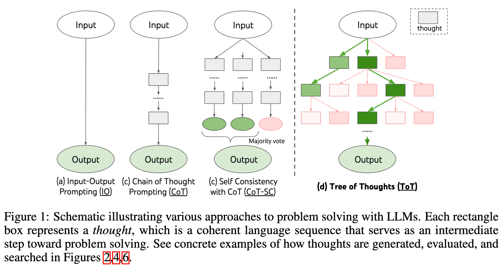
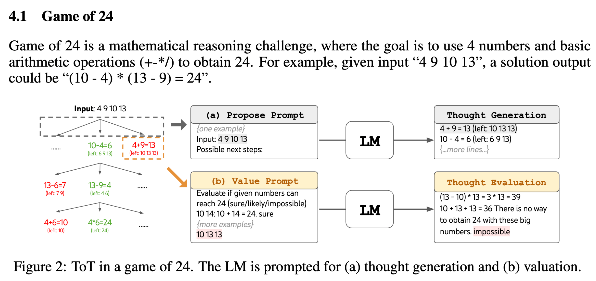
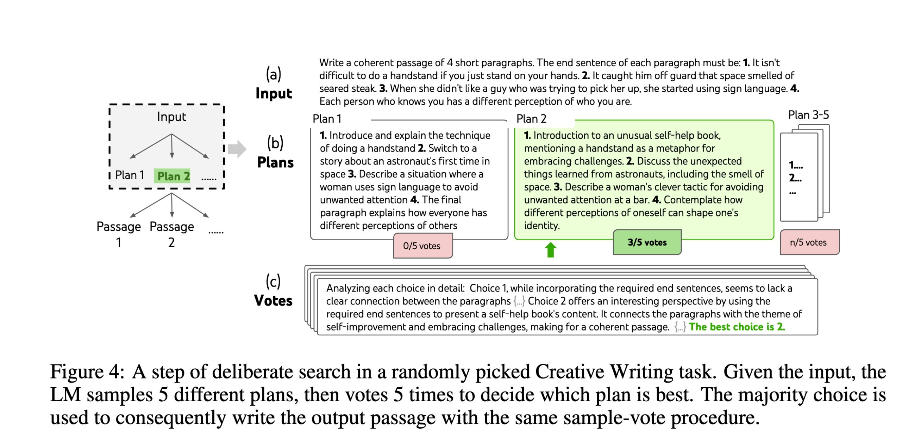
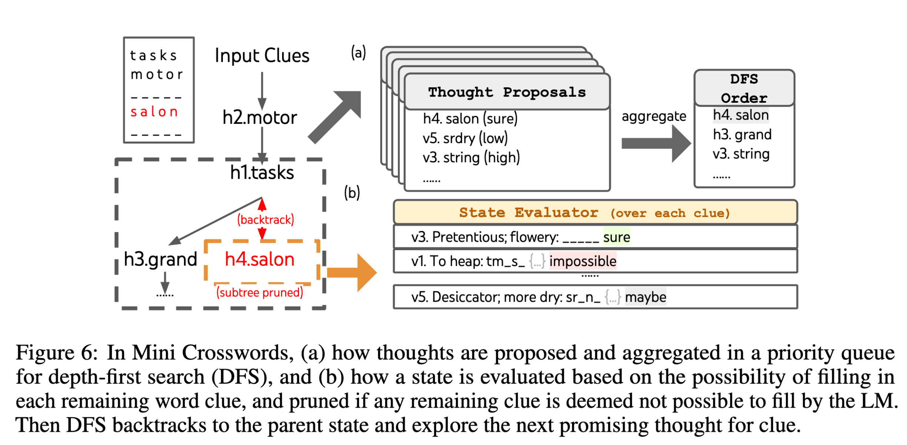

## 大模型思维链COT

参考：[[https://zhuanlan.zhihu.com/p/670907685](https://zhuanlan.zhihu.com/p/670907685)]

### 问题

COT是用在大模型（超大参数）的prompt上的，与知识图谱的推理没什么关系，但是ToT和GoT（树状和图状思维链）的构建还是值得参考的。

### TOT（代码待分析）

==大模型输入之前的思维链。思维链的构建可以从KG或者事件链中游走（生成）得到==

论文：[https://proceedings.neurips.cc/paper_files/paper/2023/file/271db9922b8d1f4dd7aaef84ed5ac703-Paper-Conference.pdf](https://proceedings.neurips.cc/paper_files/paper/2023/file/271db9922b8d1f4dd7aaef84ed5ac703-Paper-Conference.pdf)

plug代码：[https://github.com/kyegomez/tree-of-thoughts](https://github.com/kyegomez/tree-of-thoughts)

代码：[https://github.com/kyegomez/tree-of-thoughts](https://github.com/kyegomez/tree-of-thoughts)

作者：Shunyu Yao（普林斯顿大学）、Google DeepMind

24点：

开放写作：

迷你填字游戏：

