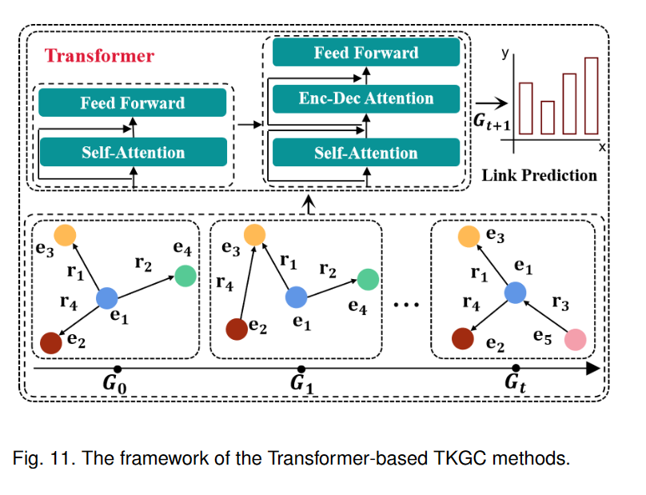

## 时间KG补全外推

### 基于Transformer的方法

来自综述：[A Survey on Temporal Knowledge Graph Completion: Taxonomy, Progress, and Prospects]

基于Transformer的TKGC方法利用Transformer强大的建模能力来捕捉TKG中的结构和时间关联。Transformer不仅能够探索每个历史快照内的结构关联，还可以捕捉不同历史快照之间的时间关系，以完成链接预测任务。

现有的TKGC方法往往只关注实体或关系，而忽略了整个TKG的结构信息。HSAE[119]采用自注意机制来捕捉实体和关系的结构信息，并利用历时嵌入函数（diachronic embedding）来探索实体和关系。事件往往带有某些前兆，这意味着未来的事件往往是从历史事件演变而来的。rGalT[120]提出了一种新的自动编码器架构，该架构在Transformer中引入了关系感知图注意力层，以适应TKG上的外推推理。GHT[121]通过引入Transformer框架来捕获结构和时间信息。它不仅预测事件的发生时间，还通过连续时间编码功能处理看不见的时间戳（continuous-time encoding function），并提供个性化的查询响应。