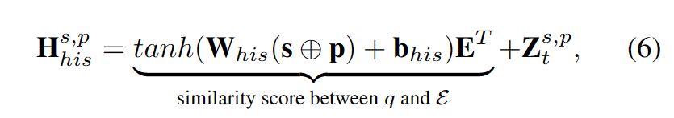

## Temporal Knowledge Graph Reasoning with Historical Contrastive Learning

作者：Yi Xu（上海交通大学）

来源：AAAI2023

论文：[[aaai.org](https://ojs.aaai.org/index.php/AAAI/article/view/25601/25373)]

代码：[[github](https://github.com/xyjigsaw/CENET)]

引用数：23

参考：[]

关键词：TKGC, 对比学习

### 摘要

时态知识图作为一种有效的动态关系存储和建模方法，在事件预测中具有广阔的应用前景。然而，大多数时间知识图推理方法高度依赖于事件的重复性或周期性，这给推断与缺乏历史交互的实体相关的未来事件带来了挑战。事实上，当前时刻往往是一小部分历史信息和那些未被观察到的潜在因素的综合作用。为此，我们提出了一种新的事件预测模型，称为对比事件网络（CENET），基于一种新颖的历史对比学习训练框架。CENET学习历史和非历史依赖性，以区分最能匹配给定查询的最潜在实体。同时，它通过启动对比学习来训练查询的表示，以调查当前时刻更多地取决于历史事件还是非历史事件。这些表示进一步帮助训练二进制分类器，该分类器的输出是布尔掩码（bool mask）以指示搜索空间中的相关实体。在推理过程中，CENET采用基于掩码的策略来生成最终结果。我们在五个基准图上评估了我们提出的模型。结果表明，CENET在大多数指标上显著优于所有现有方法，实现了至少8.3%的相对改进Hits@1在基于事件的数据集上超过以前最先进的基线。

### 实验结果

### 介绍

TKGC的下游应用：政策制定、股票预测、对话系统。

TKGC的外推就是事件预测，预测未来时间在训练集中没有发生的事件。本篇工作的目的是预测尾实体。

**创新性**

具体而言，首先采用基于复制机制的评分策略（copy mechanism-based scoring strategy）来对历史事件和非历史事件的依赖性进行建模。此外，所有查询都可以根据其真实的对象实体分为两类：对象实体o是历史实体或非历史实体。因此，CENET自然地使用监督对比学习来训练两类查询的表示，进一步帮助训练输出为布尔值的分类器，以确定哪类实体应该受到更多关注。在推理过程中，CENET结合了历史和非历史相关性的分布，并根据分类结果进一步考虑具有高度相关性的实体和基于掩码的策略

1. CENET模型。
2. 第一个把对比学习应用在TKGC领域的工作。
3. SOTA。

**TKG推理**

分为外推和内推。

**自监督对比学习**

上述公式中的`i, j`，在这篇论文中，他俩是同一类（要么历史实体，要么非历史实体）里的。

### 方法

#### 历史和非历史依赖

历史实体频率：

非历史实体没有频率，给出一个copy term的定义：

采用两个部分学习历史和非历史的依赖信息：1. 实体集里的实体和query里实体的相似度分数。2. 询问里实体的copy term频率值。

历史的依赖学习：

非历史的依赖学习：

总的学习依赖部分的对比损失：

训练完成后，推理过程中使用计算所有实体的概率矩阵：

