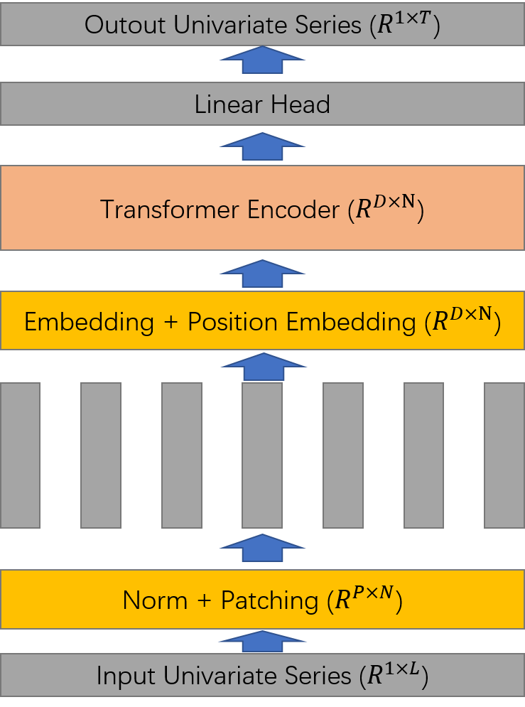
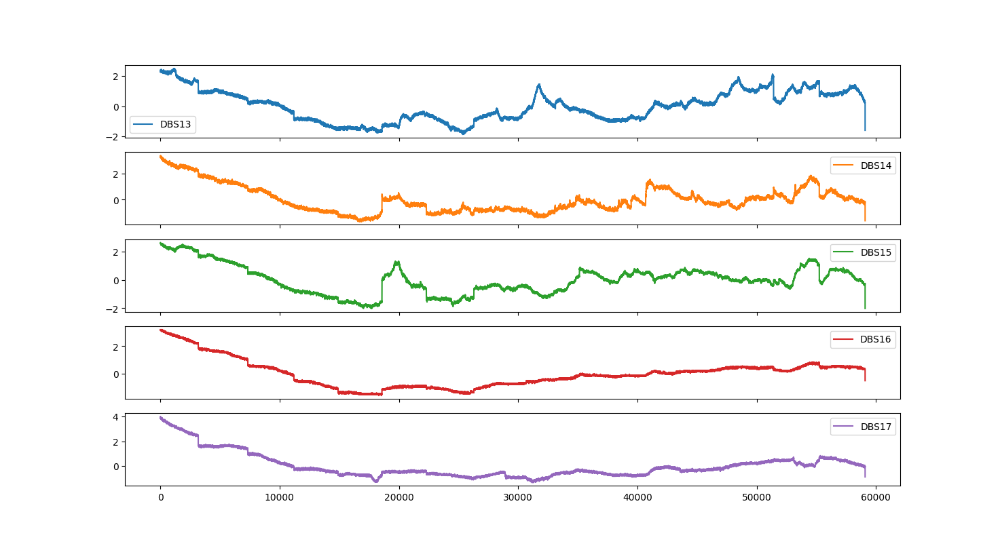

# Transformer-Based Model for Multivariate Time Series Forcasting

Zihang Liu 
Xi'an Jiaotong University shananXi, China

<h2 align=center>abstract</h2>

Transformer-based models have recently gained significant attention for time-series forecasting due to their ability to model long-term dependencies and capture complex temporal patterns in data. These models utilize self-attention mechanisms to learn the importance of different time steps and can process sequential data in parallel, making them computationally efficient.

In comparison to traditional time-series forecasting methods, transformer-based models have demonstrated superior performance in various applications, such as energy demand forecasting, financial market prediction, and natural language processing. However, challenges such as handling missing data, adapting to non-stationary data, and scalability remain open research questions.

Overall, transformer-based models have shown great potential for time-series forecasting and are expected to have a significant impact in various industries in the future.

## 1. Related Work

Transformer[1] has demonstrated a sig-
nificant potential on different data modalities. Among all applications, patching is an essential
part when local semantic information is important. In NLP, BERT[2] considers
subword-based tokenization [3] instead of performing character-based
tokenization. In CV, Vision Transformer (ViT)[4] is a milestone work that
splits an image into 16×16 patches before feeding into the Transformer model. The following influential works such as BEiT[5] and masked autoencoders[6] are all using
patches as input. Similarly, in speech researchers are using convolutions to extract information in
sub-sequence levels from raw audio input[7].

There is a large body of work that tries
to apply Transformer models to forecast long-term time series in recent years. We here summarize
some of them. LogTrans[8] uses convolutional self-attention layers with LogSparse
design to capture local information and reduce the space complexity. Informer[9]
proposes a ProbSparse self-attention with distilling techniques to extract the most important keys
efficiently. Autoformer[10] borrows the ideas of decomposition and auto-correlation
from traditional time series analysis methods. FEDformer[11] uses Fourier enhanced
structure to get a linear complexity. Pyraformer[12] applies pyramidal attention module
with inter-scale and intra-scale connections which also get a linear complexity.

## 2. Method

### 2.1. Baseline

In this section, we introduce PatchTST[13] model for multivariate time series forcasting, which is channel-independent. PatchTST is illustrated in Figure 1 where the
model makes use of the vanilla Transformer encoder as its core architecture.

First, Multivariate time series data is divided into different channels. They share the same Transformer backbone, but the forward processes are independent. Second, Each channel univariate series is passed through instance normalization operator and segmented into
patches. These patches are used as Transformer input tokens.

Figure 1: PatchTST architecture.

### 2.2. Models for comparison

In this paper, we use 5 different models to predict future time series including SVR, PatchTST,  DLinear[14], LSTM, GRU. 

In time series forecasting, SVR works by using past observations of a time series to predict future values. The algorithm uses a sliding window approach to create input-output pairs, where the input variables are the past observations and the output variable is the future observation.

LSTMs are particularly effective in modeling time series data because they can capture long-term dependencies and memory of past inputs, which is crucial in predicting future values. In time series forecasting, LSTM networks take past observations of a time series as input and predict future values. The input sequence is fed into the network, and each LSTM cell processes the input and updates its internal state. The output of the final LSTM cell is then fed into a fully connected layer to produce the final prediction. LSTMs have several advantages over traditional time series forecasting methods, including the ability to capture non-linear dependencies and adapt to changes in the input data. They can also handle missing data and can be trained end-to-end using backpropagation.

GRUs have several advantages over LSTMs, including faster training times and lower computational requirements. They are also more resistant to overfitting and can handle longer sequences of input data. GRUs are a powerful and effective algorithm for time series forecasting and are a good alternative to LSTMs for applications with limited computational resources or shorter input sequences.

DLinear is a combination of a Decomposition scheme used in Autoformer and FEDformer
with linear layers. It first decomposes a raw data in-
put into a trend component by a moving average ker-
nel and a remainder (seasonal) component. Then, two
one-layer linear layers are applied to each component,
and we sum up the two features to get the final prediction. By explicitly handling trend, DLinear enhances
the performance of a vanilla linear when there is a clear
trend in the data.

## 3. Experiments

### 3.1. Experimental Settings

**Dataset.** We conduct experiments on two aerospace datasets. All of them are multivariate time series.

**Evaluation metric.** we use Mean Squared Error (MSE) and Mean Absolute
Error (MAE) as the core metrics to compare performance.

(a) Posture 

(b) Temperature

Figure 1: Visualization of two datasets.

### 3.2. Comparison with Different Methods

As shown in Table 1, we plot the prediction results on two time series datasets
with Transformer-based solutions and DLinear. The input length is 336 steps, and the output horizon
is 96 steps.

|          | Temperature |           | Posture   |           |
| -------- | ----------- | --------- | --------- | --------- |
|          | MSE         | MAE       | MSE       | MAE       |
| DLinear  | 0.010       | 0.056     | **0.607** | **0.586** |
| PatchTST | **0.009**   | **0.052** | 0.720     | 0.648     |
| LSTM     | 0.012       | 0.065     | 0.672     | 0.627     |
| GRU      | 0.010       | 0.057     | 0.663     | 0.625     |
| SVR      | 0.017       | -         | 1.057     | -         |

Table 3: Multivariate long-term forecasting results. The best
results are in bold

  
<table>
## 4. Conclusion

Time series forecasting is a critical tool in the aerospace industry for predicting future trends, identifying potential issues, and optimizing operations. Aerospace data can include a wide range of variables such as flight paths, fuel consumption, engine performance, weather patterns, and more. The accurate forecasting of these variables can improve the safety, efficiency, and profitability of aerospace operations. Overall, time series forecasting has the potential to revolutionize the aerospace industry by improving safety, reducing costs, and increasing efficiency. As the amount of available data continues to grow, the use of machine learning algorithms for time series forecasting is likely to become even more important in the aerospace industry.

## References

[1] Vaswani A, Shazeer N, Parmar N, et al. Attention is all you need[J]. Advances in neural information processing systems, 2017, 30.

[2] Devlin J, Chang M W, Lee K, et al. Bert: Pre-training of deep bidirectional transformers for language understanding[J]. arXiv preprint arXiv:1810.04805, 2018.

[3] Schuster M, Nakajima K. Japanese and korean voice search[C]//2012 IEEE international conference on acoustics, speech and signal processing (ICASSP). IEEE, 2012: 5149-5152.

[4] Dosovitskiy A, Beyer L, Kolesnikov A, et al. An image is worth 16x16 words: Transformers for image recognition at scale[J]. arXiv preprint arXiv:2010.11929, 2020.

[5] Bao H, Dong L, Piao S, et al. Beit: Bert pre-training of image transformers[J]. arXiv preprint arXiv:2106.08254, 2021.

[6] He K, Chen X, Xie S, et al. Masked autoencoders are scalable vision learners[C]//Proceedings of the IEEE/CVF Conference on Computer Vision and Pattern Recognition. 2022: 16000-16009.

[7] Baevski A, Zhou Y, Mohamed A, et al. wav2vec 2.0: A framework for self-supervised learning of speech representations[J]. Advances in neural information processing systems, 2020, 33: 12449-12460.

[8] Li S, Jin X, Xuan Y, et al. Enhancing the locality and breaking the memory bottleneck of transformer on time series forecasting[J]. Advances in neural information processing systems, 2019, 32.

[9] Zhou H, Zhang S, Peng J, et al. Informer: Beyond efficient transformer for long sequence time-series forecasting[C]//Proceedings of the AAAI conference on artificial intelligence. 2021, 35(12): 11106-11115.

[10] Wu H, Xu J, Wang J, et al. Autoformer: Decomposition transformers with auto-correlation for long-term series forecasting[J]. Advances in Neural Information Processing Systems, 2021, 34: 22419-22430.

[11] Zhou T, Ma Z, Wen Q, et al. Fedformer: Frequency enhanced decomposed transformer for long-term series forecasting[C]//International Conference on Machine Learning. PMLR, 2022: 27268-27286.

[12] Liu S, Yu H, Liao C, et al. Pyraformer: Low-complexity pyramidal attention for long-range time series modeling and forecasting[C]//International conference on learning representations. 2021.

[13] Nie Y, Nguyen N H, Sinthong P, et al. A Time Series is Worth 64 Words: Long-term Forecasting with Transformers[J]. arXiv preprint arXiv:2211.14730, 2022.

[14] Zeng A, Chen M, Zhang L, et al. Are transformers effective for time series forecasting?[J]. arXiv preprint arXiv:2205.13504, 2022.