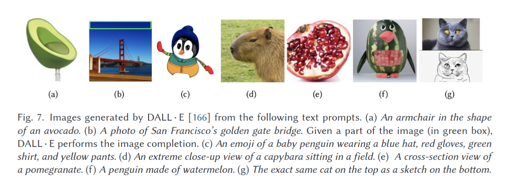

### 3.5 Transformers for Image and Scene Generation

在此，我们讨论了用于图像合成的基于Transformer的体系结构[33，60，91，154，212]，从生成建模和学习下游任务的无监督表示的角度来看，这很有趣。

Parmar等人[154]开发了一种图像生成模型，该模型可以在给定先前生成的像素的情况下顺序预测输出图像的每个像素。他们的方法通过将图像像素的联合分布分解为逐像素条件分布的乘积来对其进行建模。先前开发的用于该任务的自回归模型，如PixelCNN[199]，受到有限的感受野的影响，这阻碍了对图像中的长期关系进行建模，例如部分关系或遮挡。参考文献[154]使用自我注意增强了感受野，而不会产生高计算成本（例如，与PixelCNN[199]的25个像素相比，可以实现高达256个像素的有效感受野）。生成流水线也在条件生成任务上进行了测试，例如图像超分辨率、图像完成和去噪。

受GPT模型[163]在语言领域的成功启发，iGPT[33]证明了这种模型可以直接用于图像生成任务，并学习下游视觉任务的强特征（例如，图像分类）。具体而言，iGPT在平坦的图像序列（1D像素阵列）上训练GPT v2模型[163]，并表明它可以在没有任何外部监督的情况下生成合理的图像输出。他生成的样本描述了模型理解像素和高级属性（如对象类、特征和比例）之间的空间关系的能力。值得注意的是，该设计在设计中没有使用任何图像特定知识（例如，图像转换器[154]中使用的2D位置嵌入）。使用iGPT的无监督训练机制学习的特征与其他无监督方法竞争激烈，在CIFAR-10/100[108]和STL[44]数据集上实现了最先进的性能，同时在ImageNet数据集上与SimCLR（一种对比学习方法）[34]形成了可比性。这是一个令人震惊的结果，因为iGPT体系结构与用于语言建模任务的体系结构完全相同，因此它没有包含任何先前的领域特定知识。值得注意的是，竞争性的基于无监督CNN的解决方案以结构设计、注意力机制、损失函数和正则化的形式广泛采用此类先验[12，78，82100194]。然而，不利的一面是，iGPT的计算成本很高，例如，与MoCo[78]相比，iGPT-L版本的训练成本大约高出36倍，MoCo[78]是一种最先进的自我监督特征学习方法。因此，训练通常局限于≤64×64的低分辨率，而卷积架构可以有效地从高分辨率输入中学习。

变换器在应用于高维序列时通常会产生高计算成本。为了克服这一限制，Esser等人[60]建议在变压器的同时加入电感偏置（通常用于细胞神经网络），以提高变压器的效率。具体而言，通过学习丰富的视觉模式词汇（使用生成对抗性方法），利用CNN结构中内置的局部连通性和空间不变性偏差。然后使用Transformer来学习字典项之间的长期交互，以生成输出。反过来，他们开发了一个条件图像生成模型，能够使用变形金刚生成非常高分辨率的图像（高达百万像素的范围）。这是第一部展示变形金刚应用于生成此类高分辨率图像的作品。

以细胞神经网络为默认骨干的GANs[71]在视觉吸引力的图像合成方面非常成功[65，97161]。TransGAN[91]建立了一个强大的GAN模型，没有任何卷积运算，生成器和鉴别器都基于Transformer模型[201]。生成器和鉴别器的架构都基于原始Transformer模型[201]中的编码器。为了提高内存效率，生成器包含多个阶段，在这两个阶段之间具有上采样模块，这会逐渐提高特征图的分辨率（输入序列长度），同时降低嵌入维度。与参考文献[57]类似，TransGAN的鉴别器将平坦的图像块作为标记。作者介绍了不同的训练技术，包括数据扩充、辅助任务训练和注入局部自注意，以放大他们的模型，实现高质量图像合成[60]。TransGAN模型在STL-10上      的Inception Score和Fréchet Inception Distance方面达到了最先进的结果，并且与其他数据集上基于CNN的GAN模型相比表现良好。

与之前直接预测图像输出的图像生成方法[33,60154]不同，[212]学习生成要放置在给定场景中的3D对象的参数。具体而言，场景形成器[212]研究了3D房间布局条件下的场景生成任务。考虑到空房间的形状，参考文献[212]可以在房间中提出新的对象配置，同时保持真实感。值得注意的是，该模型不使用任何外观信息，只通过在Transformers中使用自我注意对对象间关系进行建模来学习生成新场景。类似于Transformer对句子的操作，它被应用于一系列对象，以预测场景中下一个合适的对象。具体来说，下一个对象的大小、姿势、位置和类别由Transformer模型预测。开始令牌表示推理的开始，输出令牌的数量表示模型在序列中生成的对象。作者还探讨了在对房间布局进行文字描述的情况下生成新场景。与外观的独立性使该方法变得高效，从而实现交互式场景生成。

从文本中生成逼真图像的任务既有趣又实用（例如，对于艺术内容创作），但同时又极具挑战性。先前的文本到图像合成方法[169252240241]主要基于GAN[71]。尽管这些方法产生了令人鼓舞的结果，但它们远非照片逼真。Ramesh等人[166]最近提出了DALL·E，这是一种能够从给定的文本描述中生成高保真图像的Transformer模型。DAL·E模型有120亿个参数，它是在从互联网上获取的大量文本图像对上训练的。在训练之前，首先将图像的大小调整为256×256分辨率，然后使用预先训练的离散VAE将其压缩为32×32的潜在网格编码[102, 167]。DALL·E以1280个令牌的单个流作为输入（256个用于文本，1024个用于图像），并经过训练以自回归（一个接一个）生成所有其他令牌。它提供了从零开始生成图像（图7（a））或通过扩展现有图像（图8（b））的灵活性，同时保持对文本标题的忠实。

作者通过从描述各种真实和虚构概念的文本中创建图像来证明DALL·E的有效性。虽然DALL·E纯粹从纹理上限生成图像，但它在控制多个对象及其属性（图7（c））、渲染特定视点（图7的（d））、捕捉对象的内部结构（图7中的（E））和组合不相关对象（图7为（f））方面表现出了令人印象深刻的性能。此外，DALL·E可以在输入文本的指导下进行图像到图像的翻译（图7（g））。

### 3.6 Transformers for Low-level Vision

在见证了Transformer模型在高级视觉问题中的成功之后，已经为低级视觉任务提出了许多基于Transformer的方法，包括图像超分辨率[30124227]、去噪[302216]、去噪[202216]和着色[109]。图像恢复需要从输入图像到输出图像的像素到像素的对应关系。恢复算法的一个主要目标是在恢复的图像中保留所需的精细图像细节（如边缘和纹理）。细胞神经网络通过采用不涉及任何下采样操作的单尺度架构设计来实现这一点。由于Transformer模型中自注意的计算复杂度随着图像块的数量呈二次方增加，因此不可能开发出能够在单尺度特征处理流水线上操作的Transformer模型。因此，这些基于Transformer的图像恢复模型利用各种策略来减少计算负担，例如计算局部图像窗口上的注意力[124]、执行空间减少注意力[139]以及采用编码器-解码器设计[30216]。在这里，我们简要讨论了一些图像恢复Transformer模型。

#### 3.6.1 Transformers for Image Processing Tasks

用于高级计算机视觉任务（如对象检测和语义分割）的高性能算法通常使用在大规模数据集（如ImageNet）上预先训练的骨干模型。相反，低水平视觉任务的算法，如图像去噪、超分辨率和去噪，是直接在特定任务的数据上训练的，从而受到这些限制：（i）特定任务数据集中可用的图像数量很少（例如，用于图像超分辨率的常用DIV2K数据集仅包含2000个图像），以及（ii）为一个图像处理任务训练的模型不能很好地适应其他相关任务。

Chen等人[30]提出了一种基于Transformer架构的预训练模型，称为Image Processing Transformer（IPT）。它能处理各种图像重建任务，例如：超分辨率，降噪，去雨。IPT的总体架构由多头和多头组成，分别处理不同的任务，以及共享的编码器-解码器-转换器主体。充分利用变压器的潜力需要对大规模数据进行训练，参考文献[30]从ImageNet基准中获取干净的（基本事实）图像，并为不同的任务合成其降级版本。例如，使用双三次插值来生成低分辨率图像，添加高斯白噪声来准备有噪声的数据，并应用手工制作的雨带来获得下雨图像。总共有1000万张图像用于对IPT模型进行预训练。在训练过程中，每个特定任务的头部将退化的图像作为输入，并生成视觉特征。这些特征图被划分为小作物，然后在将其提供给Transformer编码器（其架构与参考文献[201]中相同）之前进行平坦化。编码器的输出以及任务特定的嵌入被作为变压器解码器的输入给出。解码器输出的特征被重新整形并传递到产生恢复图像的多尾部。IPT模型在L1损耗的情况下进行了优化。实验结果表明，当针对特定的低级别视觉任务进行微调时，预先训练的IPT模型可以比最先进的方法提供显著的性能增益[48，148，246]

#### 3.6.2 Transformers for Super-Resolution

近年来，由于细胞神经网络的出现，超分辨率（SR）的性能取得了重大突破。原则上，细胞神经网络生成的超分辨率图像的质量取决于优化目标的选择。虽然基于逐像素损失函数（例如，L1、MSE等）的SR方法[752126187246247]在图像保真度指标（如PSNR和SSIM）方面产生了令人印象深刻的结果，但它们很难恢复精细的纹理细节，并且经常产生过于平滑和感觉不太愉快的图像。此外，感知SR方法[1121121152171213]除了每像素损失外，还基于从预训练的CNN中提取的深度特征，采用对抗性损失[71]和感知损失[95]。虽然这些方法生成的图像清晰、视觉愉悦且在感知上合理，但它们显示出在PSNR/SSIM中测量的重建精度显著降低。此外，感知SR算法有产生幻觉的倾向，产生伪纹理并导致伪影。上述SR方法遵循两个不同（但相互冲突）的重新搜索方向：一个最大化重建精度，另一个最大限度地提高概念质量，但绝不能两者兼而有之。

为了缓解感知再现和精确再现之间的权衡，Yang等人[227]提出了一种用于超分辨率的变压器网络（TTSR）。在训练过程中，TTSR使用成对的低分辨率-高分辨率（LR-HR）图像，以及与LR图像内容相似的参考（Ref）图像。TTSR学习搜索Ref图像中的相关区域，并传输丰富的纹理以帮助超分辨率输入LR图像。TTSR方法的纹理转换器模块由四个核心组件组成：（1）可学习纹理提取器：将LR作为输入↑, 裁判↓↑, 和Ref图像，并分别生成纹理特征query（Q）、key（K）和value（V）。在这里↑表示双三次上采样操作，以及↓↑ 表示双三次下采样，然后是上采样操作。（2） 相关性嵌入：首先将Q和K展开为补丁，然后计算Q中每个补丁与K中每个补丁的相似性，以生成硬注意力图和软注意力图。（3） 硬注意力：使用硬注意力映射将HR纹理特征从V转移到（LR特征）Q。（4） 软关注：进一步增强相关特征，同时抑制不太相关的特征。

虽然TTSR[227]方法处理基于参考的图像超分辨率，但大多数重新搜索都是针对单个图像超分辨率问题进行的，其中只有LR-HR配对图像可用。由于对于高分辨率图像，原始自注意操作的计算复杂度高得令人望而却步，最近提出了一些高效的变换器模型，它们使用基于窗口的注意（SwinIR[124]）和注意模块中的空间分辨率降低操作（ESRT[139]）来执行超分辨率。

### 3.6.3 Colorization and Stylization Transformer

给定灰度图像，彩色化试图产生相应的彩色化样本。这是一个一对多的任务，因为对于给定的灰度输入，在彩色输出空间中存在许多可能性。这项任务的挑战性需要能够产生多个彩色输出样本的概率模型。Colorization Transformer[109]是一个基于条件注意机制[83]的概率模型。它将图像着色任务分为三个子问题，并提出通过不同的Transformer网络依次解决每个任务。作者首先训练Transformer网络，将低分辨率灰度图像映射到3位低分辨率彩色图像。低分辨率图像反过来允许训练更大的模型。然后，在训练的第二阶段，由另一个Transformer网络将3位低分辨率彩色图像上采样为8位RGB样本。最后，训练第三级Transformer，以提高第二级Transformer产生的8位RGB采样的空间分辨率。彩色变换器中使用的自注意是基于参考文献[83]中引入的行/列注意层。这些层捕获输入图像的每个像素之间的交互，同时在计算上成本较低。逐行关注层将自关注应用于给定行中的所有像素，而逐列关注层仅考虑图像的给定列中的像素。这项工作[109]是变形金刚的首次成功应用，该变形金刚被训练为在高（256×256）分辨率下对灰度图像进行着色。相关工作StyleFromer[219]使用特征级信息，通过基于转换器的编码和解码机制来传输样式。