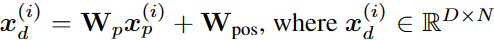

<h2 align=center>Transformer在时序预测和异常检测任务上的方法</h2>

刘自航 3122351077

<h3 align=center>摘要</h3>

Transformer模型已经在时序预测和异常检测任务中展现出了显著的效果。在时序预测方面，Transformer利用自注意力机制来建模序列中的长期依赖关系，避免了传统循环神经网络的顺序计算。通过编码输入序列，并将其转换为上下文感知的表示，Transformer能够有效地预测未来时间步的数值。其自注意力机制还使得模型能够在多个时间尺度上捕捉序列中的关键模式和趋势，从而提高了预测准确性。

在异常检测方面，Transformer模型利用其编码器和解码器结构，通过学习正常数据的分布模式来检测异常。在训练阶段，模型通过最小化重构误差来学习正常数据的表示。一旦遇到与正常模式不匹配的输入，模型将产生较大的重构误差，从而指示可能的异常情况。Transformer模型还可以通过引入额外的标签或特定的异常类别来进行有监督的异常检测。

综上所述，Transformer模型在时序预测和异常检测任务中展现出了出色的性能。其能够捕捉序列中的长期依赖关系，并有效地预测未来数值。同时，它也能够学习正常数据的分布模式，并识别异常情况。这使得Transformer成为处理时序数据的强大工具，具有广泛的应用前景。

**关键词：** Transformer；时序预测；异常检测

<h3 align=center>Abstract</h3>

Transformer models have demonstrated significant effectiveness in time series prediction and anomaly detection tasks. In the context of time series prediction, Transformers utilize self-attention mechanisms to model long-term dependencies in sequences, avoiding the sequential computation of traditional recurrent neural networks. By encoding input sequences and transforming them into context-aware representations, Transformers can effectively predict the values of future time steps. The self-attention mechanism enables the model to capture key patterns and trends in the sequence across multiple time scales, thereby improving prediction accuracy.

Regarding anomaly detection, Transformer models leverage their encoder-decoder structure to detect anomalies by learning the distribution patterns of normal data. During the training phase, the model learns the representation of normal data by minimizing reconstruction errors. When encountering inputs that deviate from the normal patterns, the model produces larger reconstruction errors, indicating potential anomalies. Transformer models can also perform supervised anomaly detection by introducing additional labels or specific anomaly classes.

In summary, Transformer models exhibit outstanding performance in time series prediction and anomaly detection tasks. They can capture long-term dependencies in sequences and make accurate predictions of future values. Additionally, they can learn the distribution patterns of normal data and identify anomalous situations. This makes Transformers a powerful tool for handling time series data with a wide range of potential applications.

**KEY WORDS：** Transformer；Time series forcasting；Time series anomaly detection

### 1. 相关工作

近年来，有大量的研究致力于将Transformer模型应用于长期时间序列预测。以下是其中一些工作的概述。LogTrans [1] 采用带有LogSparse设计的卷积自注意力层，以捕捉局部信息并降低空间复杂度。Informer [2] 提出了ProbSparse自注意力和蒸馏技术，以高效地提取最重要的关键信息。Autoformer [3] 借鉴了传统时间序列分析方法中的分解和自相关思想。FEDformer [4] 采用傅里叶增强结构，以获得线性复杂度。Pyraformer [5] 应用了金字塔式的注意力模块，其中包括了线性复杂度的跨尺度和内尺度连接。这些模型大多专注于设计新颖的机制，以降低原始注意力机制的复杂度，在预测中取得更好的性能，特别是在预测长度较长的情况下。然而，大多数模型使用点对点的注意力，忽略了补丁的重要性。LogTrans [6] 避免了关键字和查询之间的点对点乘积，但其值仍基于单个时间步长。Autoformer [7] 使用自相关来获取补丁级别的连接，但这是一种手工设计，没有包括补丁内的所有语义信息。Triformer [8] 提出了补丁注意力，但其目的是通过在补丁内部使用伪时间戳作为查询来降低复杂度，因此它既不将补丁视为输入单元，也没有揭示其背后的语义重要性。

时序异常检测一种主要的方法是基于显式关联建模来检测异常。向量自回归和状态空间模型属于这一类。该图还通过以不同时间点为顶点表示时间序列，并通过随机游走检测异常，来明确地描述关联。一般来说，这些经典方法很难学习信息表示和建模细粒度关联。最近，图神经网络（GNN）被应用于学习多变量时间序列中多变量之间的动态图[Multivariate time-series anomaly detection via graph attention network(2020)]，[Graph neural network-based anomaly detection in multivariate time series(2021)]。虽然图神经网络的学到的表示更好，但是仍然局限于单个时间点，这对于复杂的时间模式来说是不够的。此外，基于子序列的方法通过计算子序列之间的相似性来检测异常[Graph-based subsequence anomaly detection for time series(2020)]。在探索更广泛的时间上下文时，这些方法无法捕捉每个时间点与整个序列之间的细粒度时间关联。

下面提到的方法，针对上述两个问题，提出了解决方案。

### 2. 方法

#### 2.1. DLinear

- 模型结构

  

  
图1 Anomaly transformer模型结构

- 前向过程 

  $L$的窗口内，第$i$维的序列这样表示：，整个时序数据分成了$M$个独立的序列，每个序列独立的输入到Transformer中。由Transformer的backbone做出预测。

- **Patching** 

  把分好的单个序列分成Patch（以重叠或不重叠的方式）。patch长度是$P$，stride是两个连续patch之间的非重叠区域的长度（每隔几个时间点做一次patch），那么一个序列划分成：，$N$是patch的数量，。做patch的过程中，要把最后一个值重复$S$次，把序列补成$P$的整数倍。最后token的数量减少为（不重叠方式）：$L \rightarrow L/S$。

- **Transformer Encoder** （产生预测结果）

  首先把每个patch映射成$D$维向量（线性层），给$N$个patch加上位置编码（保存时间顺序信息），最后每个patch：。然后过多头注意力层。Encoder多头之后的Norm是BN。从Encoder出来的维度：。最后过一个全连接层产生预测结果：。

- **损失函数**

  MSE损失计算预测值和真实值之间的差异。每个通道的损失：

  

  $M$个通道的平均损失：
  

- **Instance Normalization** （patch之前的操作）

  用来缩小训练数据和测试数据的偏移。就是把每个序列用mean=0，std=1做归一化。

  在patching之前对每个序列做归一化，得到最后的结果后，在反归一化（保留mean，std，做归一化的你操作）。

#### 2.2. Anomaly transformer

本篇论文中，作者使用了Transformer，在时序异常检测的无监督任务上。Transformer能看的更远，对全局信息进行统一建模。将Transformer应用于时间序列，发现可以从自注意图中得到各时间点的时间关联。每个时间点的关联分布可以为时间上下文提供更多的信息描述，表明时间序列的周期或趋势等动态模式。我们将上面的关联分布命名为序列关联（*series-association*），它可以由 Transformers 从原始序列中发现。

此外，我们观察到，由于异常的罕见性和正常模式的主导性，异常很难与整个系列建立强有力的关联。异常的关联应集中在相邻的时间点，由于连续性，这些时间点更可能包含类似的异常模式。这种相邻的浓度归纳偏置被称为先验关联（*prior-association*）。相反，占主导地位正常时间点可以发现与整个系列的信息关联，而不限于相邻区域。基于这一观察，我们试图利用关联分布的固有正常-异常区分性。这导致了每个时间点的一个新的异常标准，通过每个时间点先前关联（*prior-association*）与其序列关联（*series-association*）之间的距离来量化，称为关联差异（*Association Discrepancy*）。如上所述，由于异常的关联更可能是集中在相邻的数据之间，异常将呈现比正常时间点更小的关联差异。

超越以往的方法，我们将Transformer引入到无监督时间序列异常检测中，并提出了用于关联学习的Anomaly Transformer。为了计算关联差异（*Association Discrepancy*），作者把自注意力机制改成了异常注意力（*Anomaly-Attention*），它包含两个分支结构，分别对每个时间点的先验关联（*prior-association*）和序列关联（*series-association*）进行建模。先验关联使用可学习的高斯核来表示每个时间点的邻近集中（adjacent-
concentration）归纳偏置，而序列关联对应于从原始序列中学习的自我注意权重。此外，在两个分支之间应用了极大极小策略，该策略可以放大关联差异的正常-异常可区分性，并进一步导出一个新的基于关联的准则。

- 模型结构

  

  
图2 Anomaly transformer模型结构

### 3. 在航天领域的应用

航天时序数据应用过程中经常需要解决预测问题，也就是根据过去和当前时间窗口内的信息预测未来时间窗口内的数据值。解决时序数据问题常用的方法有：用滑动窗口平均、ARIMA模型、支持向量回归（SVR）、GRU、LSTM等相对传统的机器学习方法。2022年 曾爱玲提出了DLinear模型[1]，2023年聂雨琪提出了PatchTST模型[2]。文本用最新提出的2个时序数据预测模型与LSTM、GRU[3]和SVR等3个老模型在航天数据上进行了一下对比。经过对比，我们发现新模型的预测能力比老模型相对较好，但是不同模型在不同类型数据上表现略有区别。

- DLinear：分量分解线性模型，将原始数据分别分解为移动平均分类量、季节趋势分量。然后将两个单层线性层应用于每个分量，我们将两个特征相加，得到预测结果。

- PatchTST：基于Transformer的模型，把时间序列分成子序列级别的patch，作为Transformer的输入，通道之间独立，每个通道只处理一个维度的时序数据，通道之间权重共享。

- LSTM：长短期记忆网络，它在RNN的基础上加入了输入门、遗忘门和输出门单元，可以保存时序中的长期依赖关系，我们直接把多维时序数据输入模型，得到预测结果。

- GRU：门控循环单元，它是LSTM一个简化的变体，有重置门和更新门，看可以捕捉到时序数据中的短期和长期依赖关系。

- SVR：支持向量回归，SVR在线性函数两侧制造了一个区间，对于所有落入到该区间内的样本，都不计算损失，只有区间之外的，才计入损失函数。之后再通过最小化该区间的宽度与总损失来最优化模型。我们为每一维的时序数据都训练了一个SVR模型，把每个模型的预测结果合并到一起作为最后的预测结果。

本文使用了2种航天时序数据：一种是座舱温度（五维），另一种是卫星姿态数据（四维），如图1所示。座舱温度数据是一种典型的缓变时序数据，没有明显周期性。而卫星姿态数据则具有明显的周期性。

图3 原始数据

本文实验中，输入序列长度是336秒，输出（预测）长度是96秒。对比实验结果如表1所示。

表1 对比实验结果

|          | 座舱温度  | 卫星姿态  |           |           |
| -------- | --------- | --------- | --------- | --------- |
|          | MSE       | MAE       | MSE       | MAE       |
| DLinear  | 0.010     | 0.056     | **0.607** | **0.586** |
| PatchTST | **0.009** | **0.052** | 0.720     | 0.648     |
| LSTM     | 0.012     | 0.065     | 0.672     | 0.627     |
| GRU      | 0.010     | 0.057     | 0.663     | 0.625     |
| SVR      | 0.017     | -         | 1.057     | -         |

 

从实验结果来看，SVR在两个数据上的表现都是最差。其它四个模型在缓变数据（座舱温度）上的预测结相差不太大，基于Transformer的模型预测结果相对较好一点。在周期性数据（卫星姿态）上Dlinear的效果更好，PatchTST效果略差一些。在两个数据集上，LSTM和GRU的表现很接近，但是GRU相对LSTM的预测结果略微好一点点。