### 实验探究部分（lcge）

#### 实验目的

在ICEWS14数据集上，预测时序知识图谱中的尾实体，分析lcge算法的hit指标，判断其算法的有效性。

#### 算法

Logic and Commonsense-Guided Temporal Knowledge Graph Completion

首先我们给出一个使用LCGE算法在时序知识图谱上补全尾实体的例子：

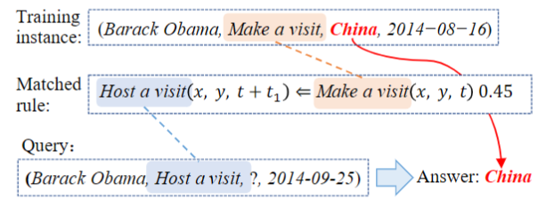

在上图的例子中，有这样一个训练样本：奥巴马在2014-08-16访问了中国，又有一条时序规则访问之后很大可能是接待访问，所以根据这条规则匹配推断出奥巴马在2014-09-25会接待来自中国的访问。

分析上面的例子，算法中加入的时序逻辑规则可以提高尾实体推理的准确性。

LCGE的算法步骤如下：

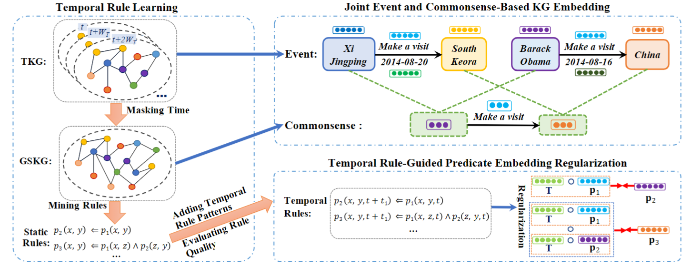

1. 首先在一个静态图（不包含时间信息）上使用规则学习算法AMIE，学习所有的静态规则（常识）。

   抽出来的静态规则有两种：长度为1和长度为2的规则。
   $$
   p_2(x,y) \Leftarrow p_1(x,y)  \tag{1}
   $$

   
   $$
   p_3(x,y) \Leftarrow p_1(x,z) \wedge  p_2(z,y)  \tag{2}
   $$

   

2. 在对实体和关系的表征上，使用四阶张量分解的方法，学习实体、关系（分为时间相关的关系和时间无关的关系）和时间的表征。对静态图谱进行二阶张量分解（只有实体和关系）。

   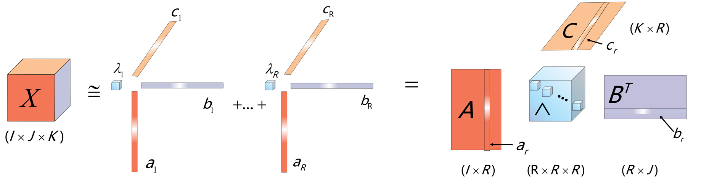

   上图是一个三阶张量分解的示意图，但是四阶张量分解和二阶张量分解的原理和上图一样。

3. 对静态规则加入时间信息，形成时序规则，对实体补全进行辅助。

   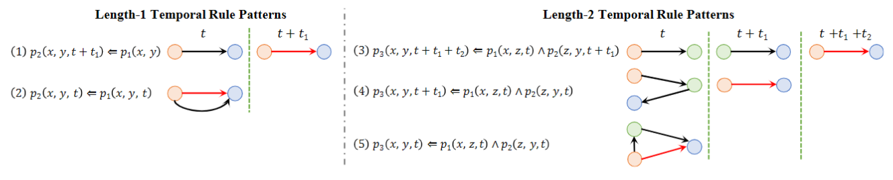

   - 长度为1的规则，两个事件之间发生的时间有先后：

   $$
   p_2(x,y,t+t_1) \Leftarrow p_1(x,y,t)  \tag{3}
   $$

   - 长度为1的规则，两个事件之间发生的时间相同：

   $$
   p_2(x,y,t) \Leftarrow p_1(x,y,t)  \tag{4}
   $$

   - 长度为2的规则，三个事件之间发生的时间各有先后：

   $$
   p_3(x,y,t+t_1+t_2) \Leftarrow p_1(x,z,t) \wedge  p_2(z,y,t+t_1)  \tag{5}
   $$

   - 长度为2的规则，前两个事件同时发生，后一个事件后于前两个事件发生：

   $$
   p_3(x,y,t+t_1) \Leftarrow p_1(x,z,t) \wedge  p_2(z,y,t)  \tag{6}
   $$

   - 长度为2的规则，三个事件同时发生：

   $$
   p_3(x,y,t) \Leftarrow p_1(x,z,t) \wedge  p_2(z,y,t)  \tag{7}
   $$

4. 损失函数是时序图谱和静态图谱的损失加权和。

   总损失如下：
   $$
   L = \sum_{(s,p,o,t) \in \tau }^{} (L_1 + \lambda \cdot L_2)  \tag{8}
   $$
   时序知识图谱上的损失：
   $$
   \begin{align}
   L_1 & = - \log (\frac{\exp (E_1(s,p,o,t))}
   { {\textstyle \sum_{e_i \in \varepsilon}^{} \exp (E_1(e_i,p,o,t))} } )  \\
   & - \log (\frac{\exp (E_1(s,p,o,t))}
   { {\textstyle \sum_{e_i \in \varepsilon}^{} \exp (E_1(s,p,e_i,t))} } )  \\
   & + \alpha_1(\Vert \mathbf{s}  \Vert_3^3 + \Vert \mathbf{p} _t \Vert_3^3 + 
   \Vert \mathbf{p} _r \Vert_3^3 + \Vert \mathbf{o}  \Vert_3^3)
   \end{align}  \tag{9}
   $$
   静态图谱上的损失：
   $$
   \begin{align}
   L_2 & = - \log (\frac{\exp (E_2(s,p,o))}
   { {\textstyle \sum_{e_i \in \varepsilon}^{} \exp (E_1(e_i,p,o))} } )  \\
   & - \log (\frac{\exp (E_2(s,p,o))}
   { {\textstyle \sum_{e_i \in \varepsilon}^{} \exp (E_1(s,p,e_i))} } )  \\
   & + \alpha_2(\Vert \mathbf{s}_c  \Vert_3^3 + \Vert \mathbf{p}_c + \Vert \mathbf{o}_c  \Vert_3^3)
   \end{align}  \tag{10}
   $$

#### 实验结果

本次实验在ICEWS14数据集上测试。

**ICEWS14数据集**

ICEWS14（Integrated Crisis Early Warning System 2014）是一个用于国际关系研究的事件数据集，用于分析和预测国际冲突和危机。它提供了大量关于全球事件的结构化数据，包括事件的参与方、时间、地点、类型和相关属性等。

ICEWS14数据集是由加州大学圣地亚哥分校（University of California, San Diego）的国际危机与冲突项目（International Crisis and Conflict Project）收集和维护的。该数据集的时间跨度为2014年，覆盖了全球范围内的事件。

ICEWS14数据集的主要特点包括：

1. 事件级别的数据：数据集提供了对国际事件的详细描述，每个事件都包含了参与方、时间、地点、类型和相关属性等信息。
2. 多个数据维度：数据集提供了多个维度的数据，包括行为者（Actors）、行为（Actions）、地点（Locations）和时间（Time）等，以支持多角度的分析。
3. 全球范围的覆盖：数据集覆盖了全球各个地区和国家的事件，使得研究者可以在全球范围内进行国际关系的分析和研究。
4. 时间关联和序列分析：数据集中的事件数据具有时间顺序，可以用于时间关联和序列分析，以揭示事件之间的因果关系和演化趋势。

该数据集中的包含的实体和关系数量，以及时间跨度如下：

==三线表==

下图是实验的时序图训练损失曲线、静态图训练损失曲线、训练、测试和验证过程中的mrr指标，以及测试集上的hit@1、hit@3和hit@10指标。

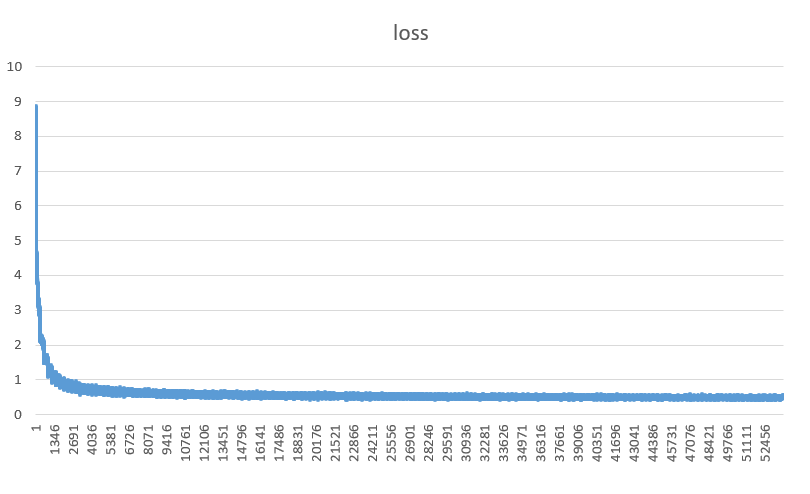

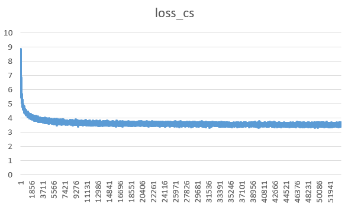

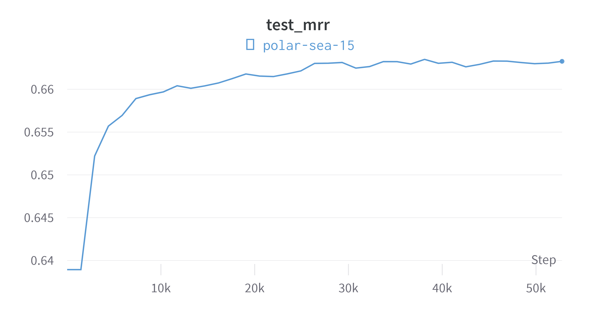

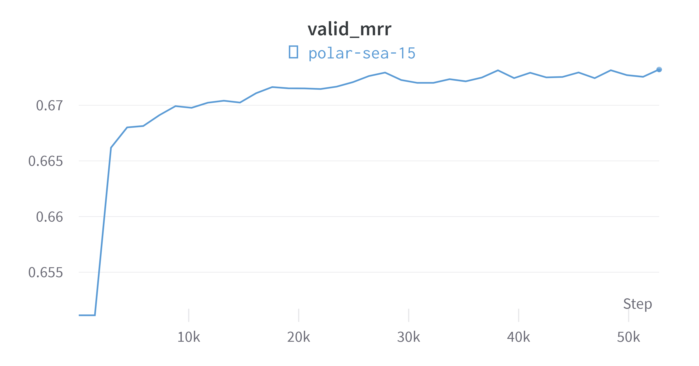

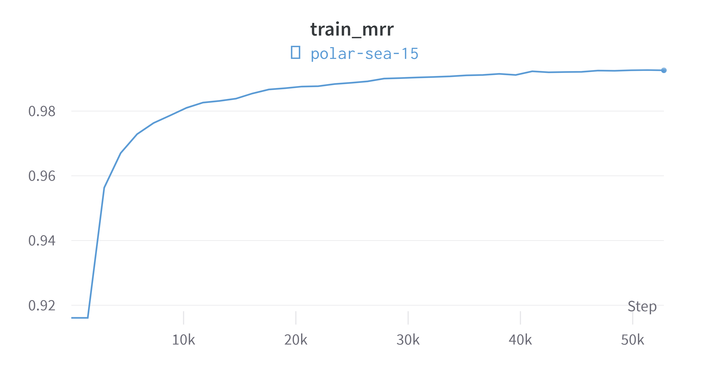

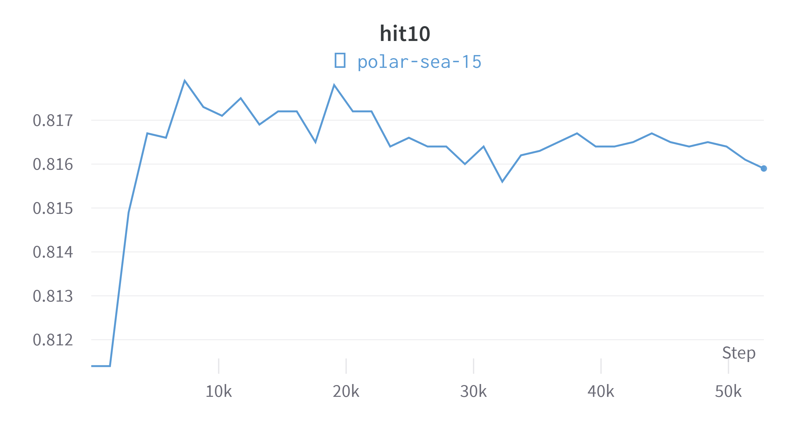

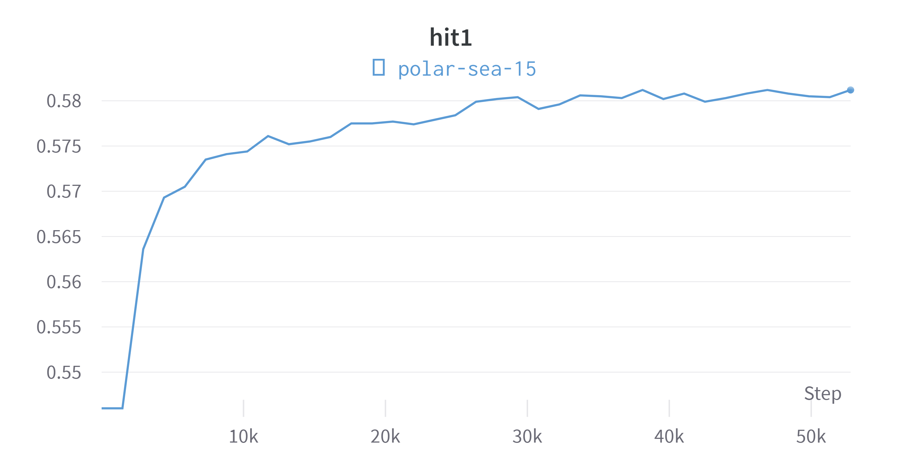

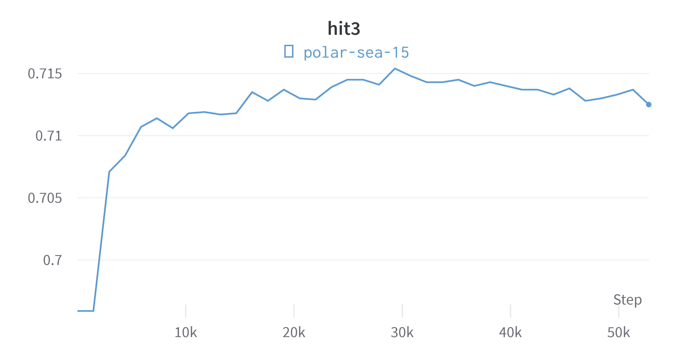

其中最好的mrr值是0.663，最好的hit@1为0.581，hit@3为0.714，hit@10为0.817。

