## 3.2 Client and Server Stubs（客户端和服务端存根）

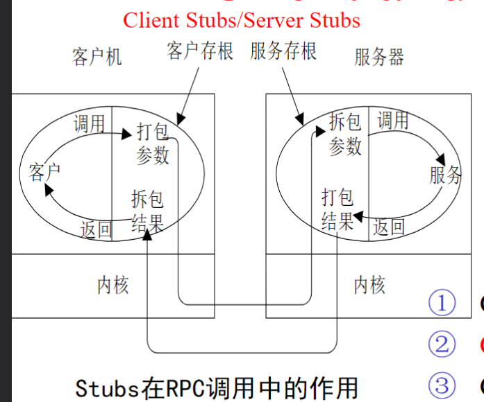


在分布式系统中，Client和Server Stubs可以翻译为“客户端存根”和“服务器端存根”。

客户端存根（Client Stubs）是一种代理程序，它位于客户端和服务器之间，用于将客户端发出的请求转换为远程过程调用（RPC），并将结果返回给客户端。客户端存根可以==隐藏底层通信细节==，使客户端能够像调用本地函数一样调用远程函数。

服务器端存根（Server Stubs）则是一个类似的代理程序，位于服务器端，用于接收客户端发出的请求，并将请求转发给相应的服务端函数进行处理。服务器端存根还可以将处理结果返回给客户端。

客户端存根和服务器端存根是分布式系统中的关键技术，可以大大简化远程过程调用的实现和部署。它们可以自动生成，或者手动编写，具体取决于使用的分布式系统平台和编程语言。

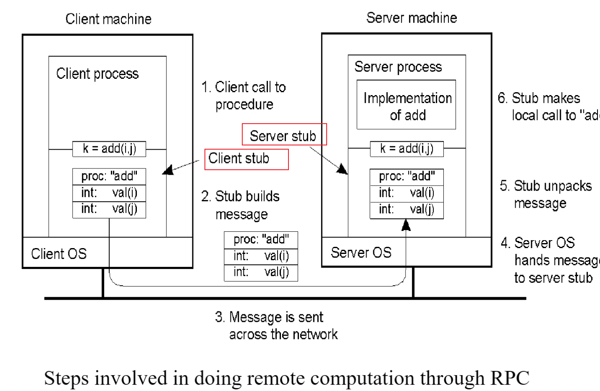

### IDL（接口描述语言）

IDL（Interface Definition Language）即接口定义语言，是一种用于描述分布式系统中接口的语言。它可以用来定义各种类型、数据结构和函数签名，并提供给不同的编程语言使用。

IDL常用于RPC（远程过程调用）系统中，它定义了客户端和服务器端之间进行通信的协议。使用IDL可以将接口定义与实现分离，从而使不同编程语言的开发者能够使用统一的接口规范进行编程。在IDL中，接口的定义是独立于底层的网络协议和数据传输机制的，这使得IDL成为一种跨平台的解决方案。

IDL支持各种数据类型，例如整数、浮点数、字符、结构体和数组等。它还支持定义函数和异常，以及定义接口的版本和实现。IDL文件通常使用特定的语法格式编写，例如CORBA（Common Object Request Broker Architecture）IDL和Microsoft COM（Component Object Model）IDL等。

使用IDL，可以使不同平台和语言之间的通信变得更加容易和标准化。

下面是一个简单的IDL例子，它定义了一个包含两个操作的接口，用于计算两个整数的和和差：

```c#
csharpCopy codeinterface Calculator {
  long add(in long a, in long b);
  long subtract(in long a, in long b);
};
```

在这个例子中，我们定义了一个名为Calculator的接口，其中包含了两个操作：add和subtract。每个操作都需要两个输入参数a和b，它们的类型为long，并且都是"in"参数类型（即输入参数）。这表示客户端调用这个操作时需要传递参数。每个操作的返回值类型也为long。

这个IDL文件可以用于生成客户端和服务器端存根，以便客户端和服务器之间进行远程调用。例如，使用CORBA IDL编译器可以将这个IDL文件编译成Java或C++代码，以便客户端和服务器端使用。

要使用Calculator接口生成客户端和服务器端存根，通常需要以下步骤：

1.编写IDL文件：首先，需要编写一个包含Calculator接口定义的IDL文件，如上一个问题的例子所示。

2.使用IDL编译器：接下来，需要使用IDL编译器将IDL文件编译成客户端和服务器端存根。不同的IDL编译器可能有不同的命令行选项和配置方式。例如，使用CORBA IDL编译器可以通过以下命令生成Java代码：

```shell
Copy codeidl calculator.idl
javac Calculator.java CalculatorHelper.java
```

这将生成一个Calculator.java文件和一个CalculatorHelper.java文件，用于在Java中实现客户端和服务器端存根。

3.实现服务器端：接下来，需要实现服务器端存根以提供对Calculator接口的实际实现。这涉及编写服务器端代码来响应客户端发出的远程调用请求。通常需要将服务器端存根绑定到一个特定的网络地址和端口号上，以便客户端可以连接和调用。

4.实现客户端：最后，需要实现客户端存根以调用远程服务器上的Calculator接口。这通常涉及编写客户端代码来创建一个远程对象，并使用该对象调用远程方法。例如，在Java中，可以使用以下代码创建远程对象并调用add方法：

```java
javaCopy codeorg.omg.CORBA.ORB orb = org.omg.CORBA.ORB.init(args, null);
org.omg.CORBA.Object objRef = orb.string_to_object("corbaname::localhost:1050#Calculator");
Calculator calc = CalculatorHelper.narrow(objRef);
long sum = calc.add(2, 3);
```

这将创建一个远程对象，使用它调用服务器端的add方法，然后返回结果。

需要注意的是，具体的步骤和实现方式可能因使用的IDL编译器和分布式系统平台而有所不同。

### 异步RPC和门RPC

传统方式：同步RPC。和异步RPC

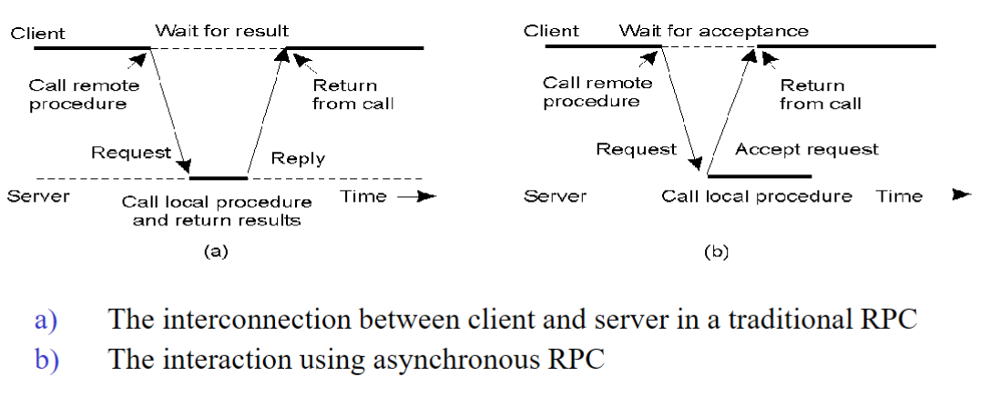

（？）门RPC：

Door RPC是一种分布式系统中的远程过程调用（RPC）协议，它是在Plan 9操作系统中开发的一种RPC协议。

Door RPC的主要思想是将远程调用的请求和响应传输通过本地系统中的特殊进程间通信机制——Door来完成。在Door RPC中，客户端进程向服务器进程的Door发送一个请求消息，服务器进程接收该消息并处理请求，然后将响应消息发送回客户端进程的Door。因此，Door RPC的本质上是一种基于进程间通信的本地RPC协议。

### DCE RPC（编写RPC的一般步骤）

DCE RPC（Distributed Computing Environment Remote Procedure Call）是一种由OSF（Open Software Foundation）定义的远程过程调用（RPC）协议，用于构建分布式系统中的服务和应用程序。

DCE RPC的主要特点包括：

1.支持多种编程语言：DCE RPC支持多种编程语言，包括C、C++、Java等，可以为不同的编程语言提供统一的RPC接口。

2.跨平台性：DCE RPC可以在不同的操作系统和平台之间进行远程调用，例如在Unix、Windows和VMS等系统之间。

3.安全性：DCE RPC提供了多种安全性机制，包括身份验证、加密、访问控制等，可以确保远程调用的安全性和可靠性。

4.灵活性：DCE RPC提供了灵活的接口定义语言（IDL），可以通过IDL来定义远程调用的接口和数据类型。

在使用DCE RPC构建分布式系统时，通常需要进行以下步骤：

1.编写IDL文件：首先，需要编写一个包含远程接口定义的IDL文件，该文件定义了远程过程的参数、返回值和异常信息等。

2.使用IDL编译器：接下来，需要使用IDL编译器将IDL文件编译成客户端和服务器端的存根和代理代码。IDL编译器会根据IDL文件生成相应的C、C++或Java代码等。

3.实现服务器端：然后，需要实现服务器端的RPC接口，提供对远程调用的实际实现。

4.实现客户端：最后，需要实现客户端的RPC调用代码，通过RPC代理代码调用远程接口。

需要注意的是，DCE RPC是一种比较老的RPC协议，而现在通常使用更先进的RPC协议，如gRPC和Apache Thrift等。

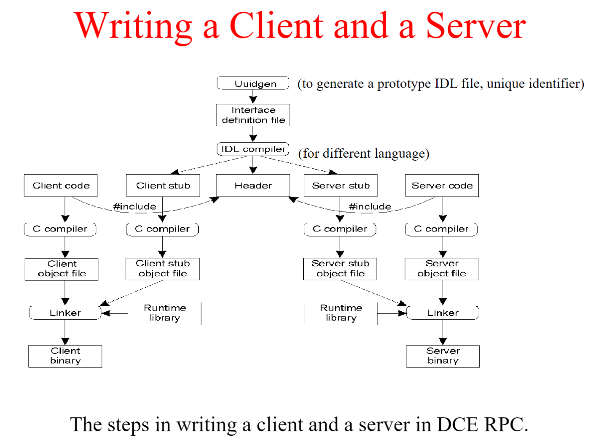

### 给服务器绑定客户端

Binding a Client to a Server是指在分布式系统中建立客户端和服务器之间的连接和通信关系。在分布式系统中，客户端和服务器通常运行在不同的计算机上，因此需要一种机制来建立它们之间的连接和通信。

在建立客户端和服务器之间的连接时，需要进行以下步骤：

1. 查找服务器：客户端需要知道服务器的网络地址和端口号才能与其建立连接。因此，客户端需要使用特定的机制（如DNS、配置文件、服务注册中心等）来查找服务器。
2. 创建连接：客户端使用特定的协议和端口号来连接服务器。例如，在使用TCP/IP协议时，客户端需要使用服务器的IP地址和端口号来建立TCP连接。
3. 建立会话：客户端和服务器之间的连接建立后，需要进行握手和认证等步骤来建立会话。在建立会话后，客户端和服务器之间就可以进行数据交换了。
4. 绑定服务：在建立会话后，客户端需要将自己绑定到服务器上的特定服务。在RPC协议中，客户端需要使用特定的标识符来标识服务器上的服务，例如，在DCE RPC中，使用UUID来标识服务。
5. 调用远程过程：最后，客户端可以通过远程过程调用（RPC）机制调用服务器上的远程过程。在RPC中，客户端会将调用请求发送到服务器上，服务器接收请求并执行相应的远程过程，然后将结果返回给客户端。

需要注意的是，绑定客户端和服务器之间的连接是分布式系统中非常关键的一步，它决定了客户端和服务器之间的通信是否能够成功建立。因此，在设计分布式系统时，需要考虑绑定机制的可靠性、安全性和灵活性等方面的问题。

**在DCE RPC中的具体流程**：

在DCE RPC中，Binding a Client to a Server的流程如下：

1. 客户端调用rpc_binding_inq_handle函数来查找服务器的绑定句柄。该函数接受服务器的UUID（Universally Unique Identifier）作为参数，该UUID标识了服务器上的特定接口。
2. rpc_binding_inq_handle函数首先会在本地绑定缓存中查找是否已经存在与服务器的绑定句柄。如果已经存在，则直接返回该句柄；否则，它会创建一个新的绑定句柄。
3. 客户端通过rpc_binding_set_auth_info函数来设置绑定句柄的身份验证信息，包括身份验证类型、用户名和密码等。这些信息将用于建立与服务器的安全通信。
4. 客户端调用rpc_ep_resolve_binding函数来解析绑定句柄，该函数将查找与绑定句柄相关联的服务器端点（endpoint）。服务器端点是服务器上特定接口的网络地址和端口号的组合。
5. 客户端使用绑定句柄和服务器端点来创建连接。在DCE RPC中，连接可以是无连接的UDP协议，也可以是有连接的TCP协议。
6. 客户端调用rpc_binding_set_object函数来将绑定句柄绑定到服务器的接口对象。在DCE RPC中，接口对象是服务器上实现特定接口的对象。
7. 客户端调用rpc_mgmt_is_server_listening函数来检查服务器是否正在监听请求。如果服务器正在监听，则客户端与服务器之间的绑定就建立成功了。
8. 客户端使用绑定句柄来调用服务器上的远程过程。

需要注意的是，DCE RPC中的绑定流程涉及多个步骤，其中包括绑定句柄的创建、身份验证信息的设置、服务器端点的解析、连接的建立和接口对象的绑定等。在实际应用中，需要根据具体的需求和安全策略来设计和实现绑定流程。

### DCE RPC Daemon


在Distributed Computing Environment（DCE）中，DCE daemon是一种运行在服务器上的后台程序，用于管理和提供各种服务。DCE daemon可以提供多种服务，包括远程过程调用（RPC）、名字服务、时间服务、安全服务等，这些服务是DCE的核心组成部分。DCE daemon是DCE架构中的重要组件之一，它负责在服务器上启动、运行和管理各种服务，为客户端提供可靠、高效的分布式服务。

DCE daemon有多种实现方式，包括使用inetd（Internet super-server daemon）、使用自带的dced daemon等。在inetd方式中，DCE daemon会将各种服务注册到inetd中，并且在需要服务时由inetd来启动。而在dced方式中，DCE daemon会启动一个后台守护进程，负责管理各种服务，包括创建和销毁服务，为客户端提供服务等。

DCE daemon在DCE架构中起着重要的作用，它能够提供各种服务，使得分布式应用程序能够在网络上进行通信和协作。同时，DCE daemon还具有可扩展性和灵活性，可以根据具体的需求和安全策略进行配置和部署。

## 3.3 ROI（远程对象调用）

在分布式系统中，Remote Object Invocation（远程对象调用，ROI）是指通过网络在不同的计算机之间调用对象的方法。ROI是==一种远程过程调用（Remote Procedure Call，RPC）的实现方式==，它可以让一个计算机上的应用程序通过网络调用另一个计算机上的对象方法，就好像这个对象就存在于本地一样。

在ROI中，远程对象通常通过网络传输协议（如TCP/IP）进行通信，并且需要提供一些通信协议以确保通信的可靠性和安全性。远程对象通常需要实现一些特殊的接口，以便可以通过网络进行调用。这些接口通常被称为远程接口或远程代理。

ROI的实现需要考虑到多种因素，例如网络延迟、带宽限制、安全性等，因此需要进行一些优化以提高系统的性能和可靠性。常见的ROI实现方式包括Java RMI（Remote Method Invocation，Java远程方法调用）和CORBA（Common Object Request Broker Architecture，通用对象请求代理架构）等。

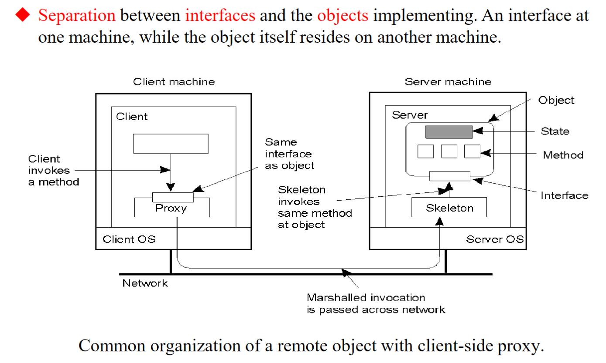

### 编译时与运行时对象-持久型和暂时型对象

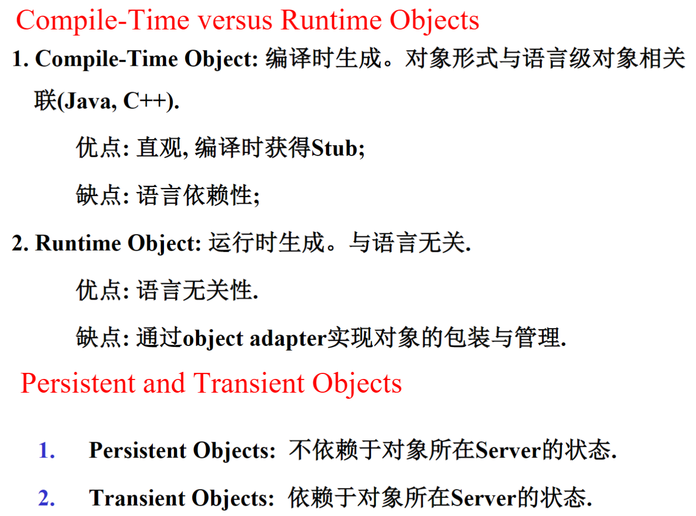

### 将客户端绑定到对象（Binding a Client to an Object）

隐式绑定：没有代理对象。

显示绑定：由一个代理对象去调用RPC。


### 对象引用的实现

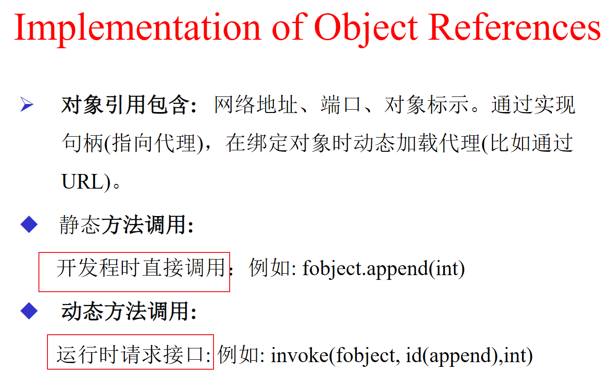

### ROI传递参数的规则


在分布式系统中，远程对象调用（ROI）传递参数时，如果传递的参数为对象，其传递方式取决于被引用对象的位置和状态。

如果被引用对象位于本地，那么传递的实际上是该对象的副本，也就是按值传递。这是因为本地对象可以直接访问，不需要通过网络传输。在这种情况下，传递的副本会在远程调用结束后被销毁。

但是，如果被引用对象位于远程节点，那么传递的是对象的引用，也就是按对象引用传递。这是因为如果将整个对象传递过去，那么将需要大量的网络带宽和时间来复制对象，这会严重影响性能。因此，只传递对象的引用，让远程节点能够访问该对象的属性和方法。

需要注意的是，如果在远程节点上修改了通过引用传递的对象，那么本地节点也会受到影响，因为它们引用的是同一个对象。因此，在分布式系统中，需要特别小心地处理引用传递的对象，以避免意外的副作用。

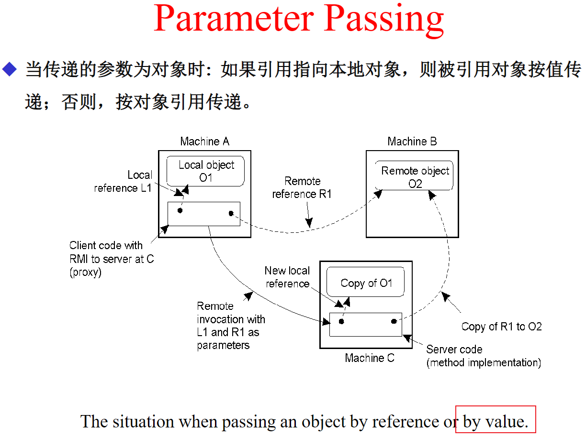

### 分布式动态对象和分布式命名对象

在DCE RPC中，Distributed Dynamic Object和Distributed Named Object是两种不同类型的分布式对象。

Distributed Dynamic Object（分布式动态对象）是一种动态生成的对象，它的结构和内容是在运行时根据需要动态生成的。这种对象的定义是在运行时完成的，可以在不同的进程之间传递，可以跨越不同的平台和编程语言。它具有灵活性和可扩展性，适合于需要频繁更改的应用程序。在DCE RPC中，使用“interface”定义来描述Distributed Dynamic Object的接口。

Distributed Named Object（分布式命名对象）是一种静态定义的对象，它具有固定的接口和实现，可以通过一个固定的名称在不同的进程之间访问。这种对象通常是在编译时就定义好的，不支持动态的修改。在DCE RPC中，使用“binding handle”来引用Distributed Named Object。

这两种分布式对象在DCE RPC中都具有重要的作用，可以实现不同进程之间的通信和协作。选择哪种对象取决于应用程序的具体需求和设计。

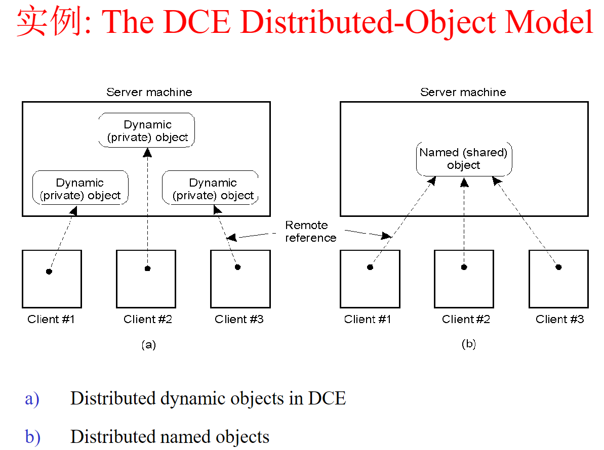

## 3.4 面向消息的通信

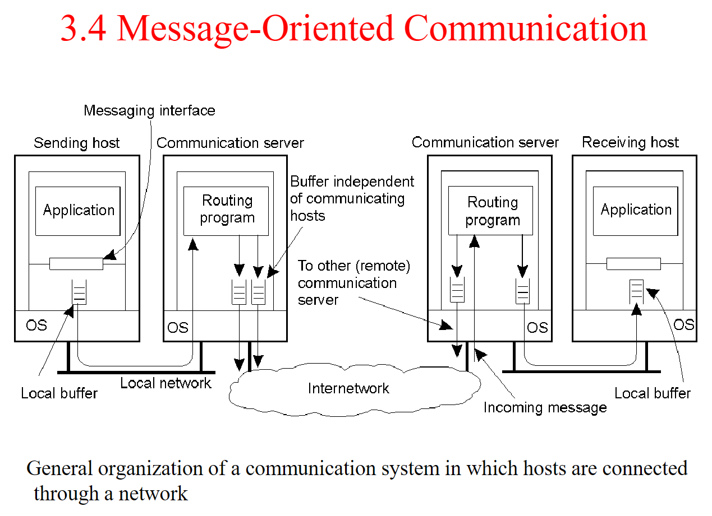

### 六种不同语义的通信方式（同步异步）

ppt 第三章p35。

### 瞬时通信-Socket

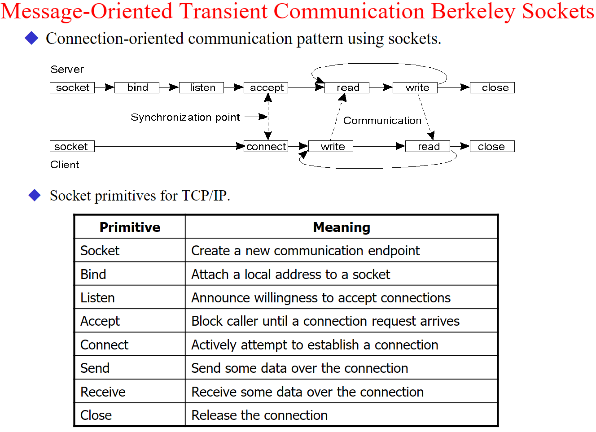

### 并行程序设计平台-MPI

第三章pdf p42。

### 消息队列模型

第三章pdf p46。

==队列-网络映射表==：

分布式系统中的消息队列中，队列集合通常会分布在多台机器上，为了实现跨节点的消息传递和路由，需要一个队列-网络地址映射表，也称为消息路由表（Message Routing Table）。

该映射表的作用是将队列名称映射到相应的网络地址，以便消息能够正确地发送到对应的队列所在的机器上。通常情况下，这个映射表由系统管理员或者应用程序动态维护。

在实际的实现中，这个映射表可以采用不同的数据结构来存储，例如哈希表或者基于前缀树的数据结构（Trie）。在更新映射表时，需要确保线程安全和原子性，以避免并发更新导致的错误。

除了映射表，还可以采用其他的路由机制，例如基于主题的路由（Topic-based Routing），其中消息的目标不是特定的队列，而是根据主题（Topic）进行路由，可以达到更灵活和高效的消息路由。

==消息代理==：


==消息队列系统==：

当前最常用的消息队列系统包括：

1. Apache Kafka：是一个分布式流处理平台，主要用于处理大规模数据流，支持高吞吐量和低延迟的消息传递。Kafka提供了持久化存储、消息订阅和发布、流处理、批处理等功能。
2. RabbitMQ：是一个基于AMQP（Advanced Message Queuing Protocol）协议的开源消息队列系统，提供了高度可靠的消息传递机制和广泛的编程语言支持。RabbitMQ支持多种消息模式，如点对点、发布/订阅、RPC等。
3. ActiveMQ：是一个基于JMS（Java Message Service）规范的开源消息队列系统，支持多种消息协议和传输方式，如TCP、UDP、HTTP等。ActiveMQ提供了高可用性、负载均衡、消息分发等特性。
4. Redis：是一个高性能的开源内存数据库，支持多种数据结构和模式，包括消息队列模式。Redis的消息队列模式支持发布/订阅、阻塞队列、优先队列等特性，适用于快速、实时的消息处理。

以上这些消息队列系统都被广泛应用于分布式系统、微服务架构、大规模数据处理等场景，具有不同的特点和优势，根据具体的应用场景和需求选择合适的消息队列系统非常重要。

### 数据流（Data Stream）

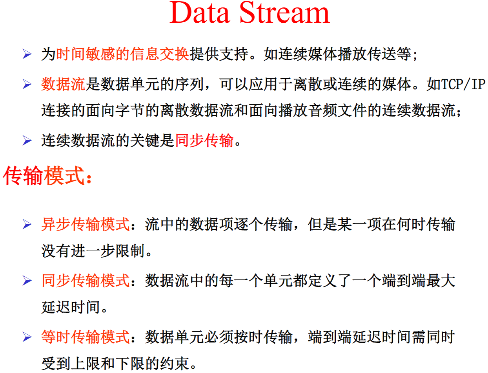

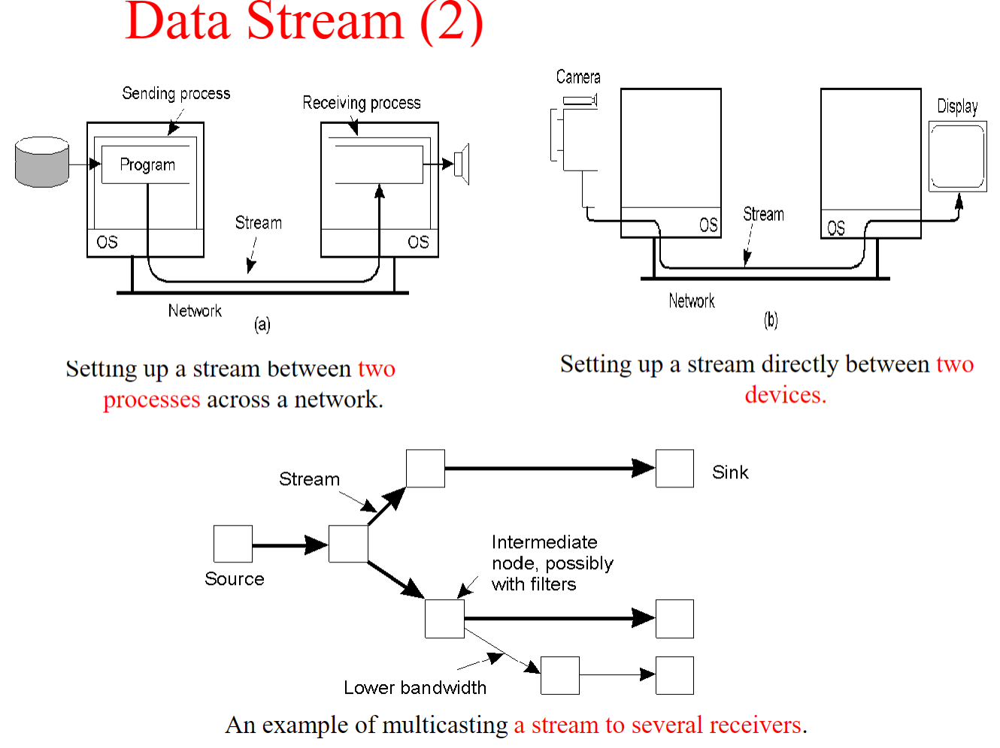

### 服务质量和两个控制拥塞算法

第三章 pdf p57。