### 实现分布式透明的策略

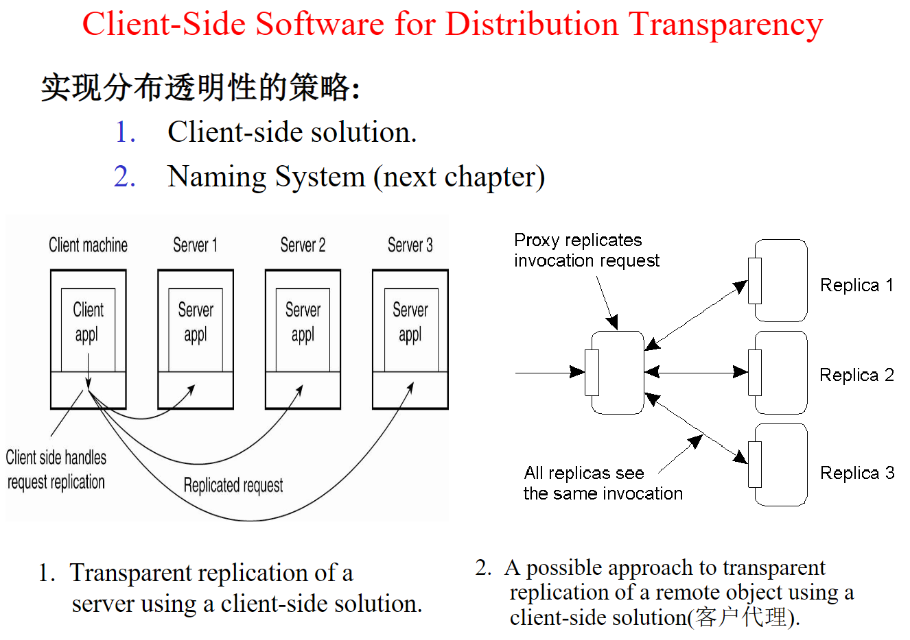

分布透明性是指分布式系统中用户无需了解分布式系统的物理结构和分布式计算的细节，即可像访问本地系统一样使用分布式系统的能力。为了实现分布透明性，以下是一些策略：

1. 位置透明性：让用户对资源的位置无感知，用户可以通过逻辑名称或地址的方式访问资源，而不需要知道其实际位置。例如，使用域名系统（DNS）或服务发现机制，将实际的物理地址映射为逻辑地址。
2. 访问透明性：让用户无需了解访问资源的方式和协议，可以透明地访问远程资源。例如，通过使用Web服务和RESTful API等协议和接口，隐藏了底层实现的复杂性。
3. 并发透明性：让用户无需关心分布式系统中的并发问题，分布式系统会自动处理并发问题。例如，使用分布式锁、事务等机制来解决并发问题。
4. 复制透明性：让用户无需知道资源是否被复制，即可访问资源。例如，通过使用负载均衡器和分布式缓存等机制，将请求分发到多个副本上，实现复制透明性。
5. 容错透明性：让用户无需关心分布式系统的故障和恢复问题。例如，使用冗余和备份机制来确保系统的可用性和可靠性，让用户感知不到系统的故障。

以上是实现分布透明性的一些策略，但在实际应用中，可能需要根据具体的应用场景和需求，采用不同的策略组合来实现分布透明性。

### 多线程服务器设计问题

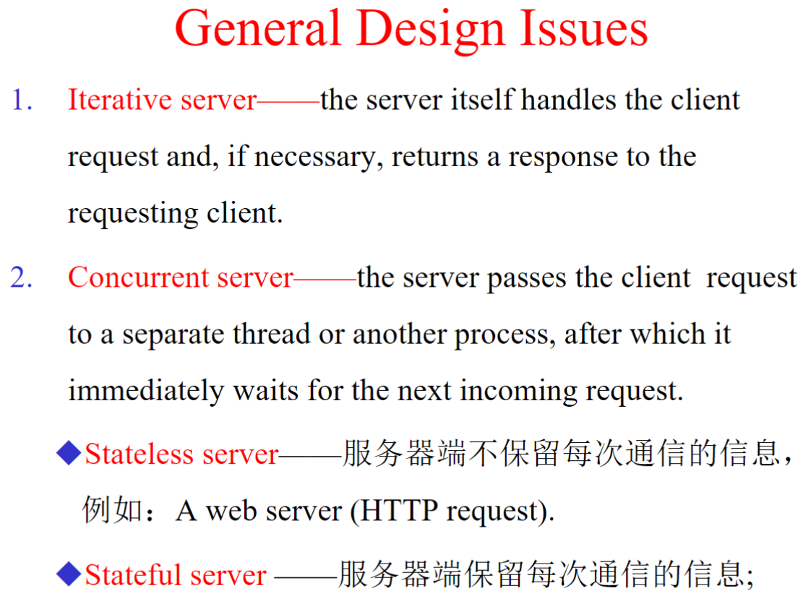

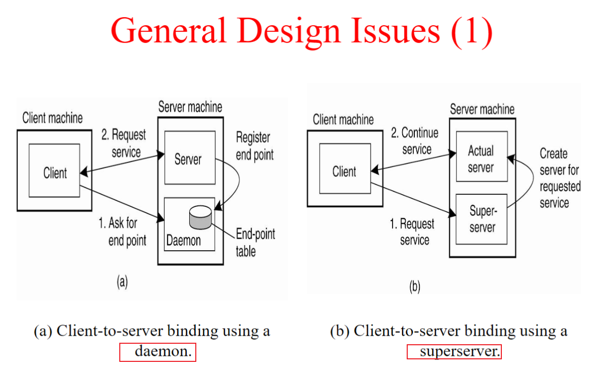

### 服务器集群

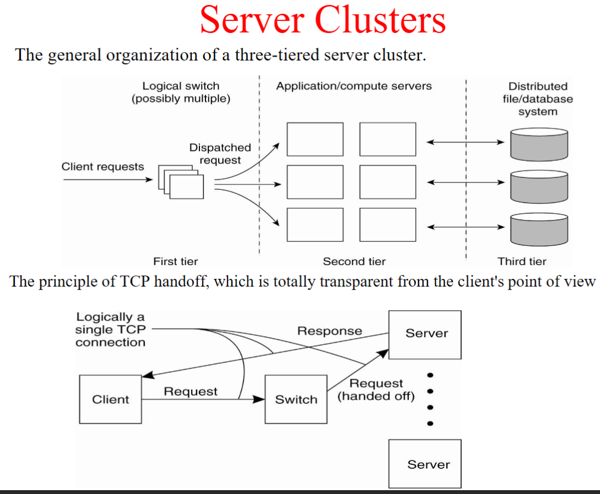

服务器集群是指将多台服务器连接在一起，形成一个逻辑上的单一服务器系统，以提供更高的可用性、可扩展性和性能。服务器集群可以提供负载均衡、故障转移、容错性、灵活性等优势，因此被广泛应用于Web应用程序、数据库等高可用性和高并发性要求的场景中。

服务器集群通常由若干个服务器节点、一台负载均衡器和一份共享存储组成。服务器节点负责处理客户端请求和提供服务，负载均衡器则将请求分发到不同的服务器节点上，共享存储则提供对数据和文件的共享访问。

服务器集群可以采用不同的架构模式，如对等集群、主从集群、主备集群等。对等集群中所有节点平等对待，可以相互协作，实现数据和计算的共享。主从集群则有一个主节点和多个从节点，主节点负责处理客户端请求，从节点则复制主节点的数据和状态，并在主节点故障时接管服务。主备集群则有一台主服务器和一台备份服务器，当主服务器发生故障时，备份服务器将接管服务。

服务器集群的设计和实现需要考虑多个方面，如负载均衡算法、故障检测和恢复机制、数据一致性和复制策略等。同时，也需要进行维护和管理，如节点的监控、升级和扩容等操作。

### 负载均衡、反向代理nginx、代码迁移

参考 第四章 pdf p19。

### 虚拟机分类

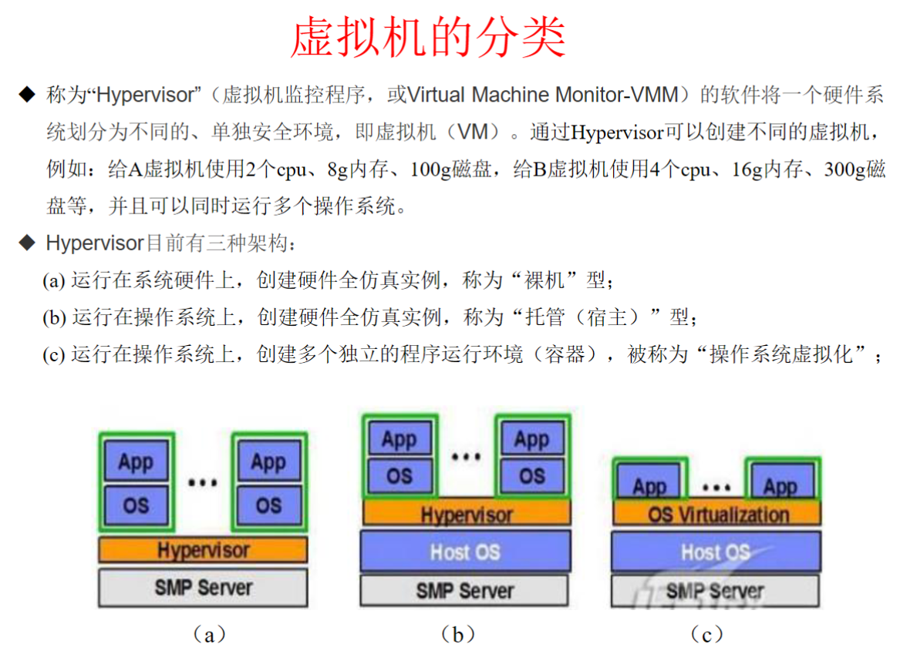

虚拟机是一种虚拟化技术，它可以将一台物理服务器划分为多个虚拟的逻辑服务器，每个逻辑服务器可以运行不同的操作系统和应用程序，并且相互之间互不干扰。根据虚拟化技术的不同，虚拟机可以分为裸机型、托管型和容器型。

1. 裸机型虚拟机：裸机型虚拟机也称为完全虚拟化，它是在物理服务器上安装一个虚拟化层，将硬件资源虚拟化成多个独立的虚拟机，每个虚拟机都运行自己的操作系统。由于每个虚拟机都是完整的操作系统和应用环境，因此裸机型虚拟机可以提供最高的隔离性和安全性，但是相对于其他虚拟化技术而言，其性能会有一定的损失。
2. 托管型（宿主型）虚拟机：托管型虚拟机也称为部分虚拟化，它是在物理服务器上安装一个操作系统，然后在操作系统上安装虚拟化软件，将操作系统上的资源虚拟化成多个独立的虚拟机，每个虚拟机运行一个应用程序或服务。由于托管型虚拟机共享宿主操作系统，因此相对于裸机型虚拟机，其性能会更高一些。
3. 容器：容器是一种轻量级的虚拟化技术，它利用操作系统内核提供的虚拟化功能，将一个应用程序及其依赖的库文件和配置文件打包成一个镜像，然后在操作系统上启动容器，每个容器都是相互隔离的应用程序运行环境。相对于虚拟机，容器的优势在于更高的性能和更快的启动时间，但是其隔离性和安全性相对较弱。

### 容器技术

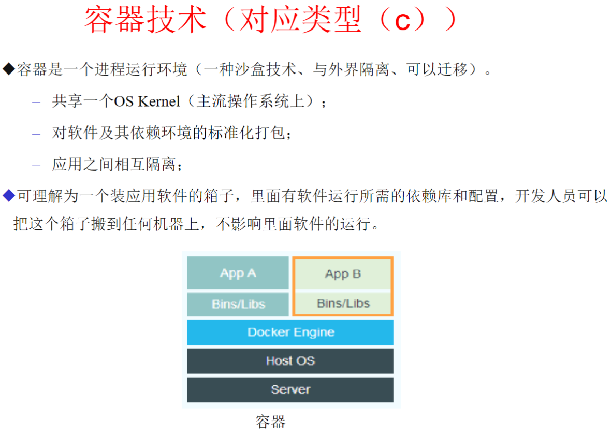

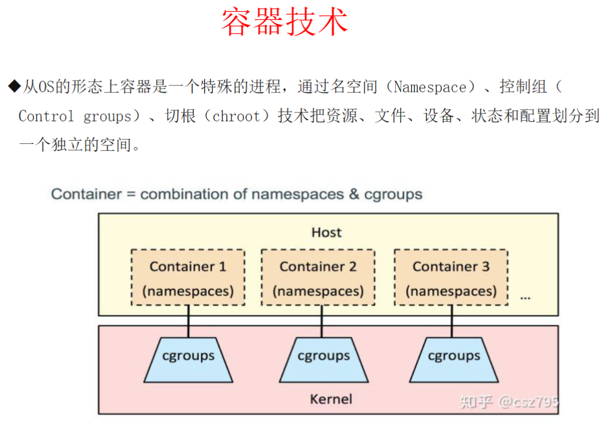

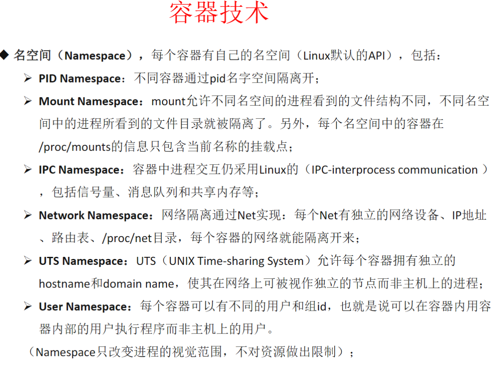

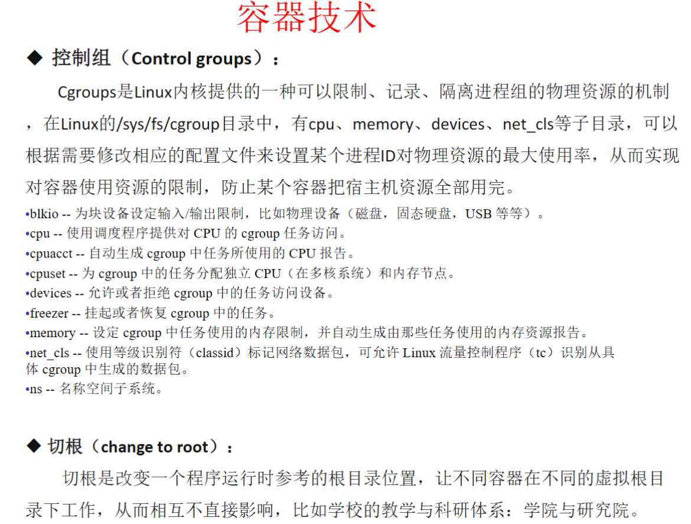

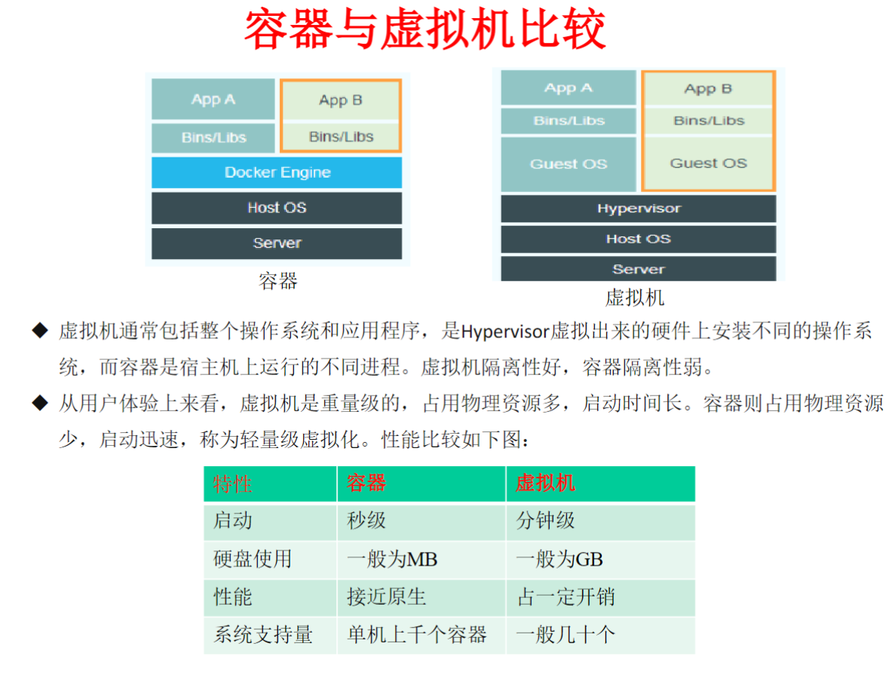

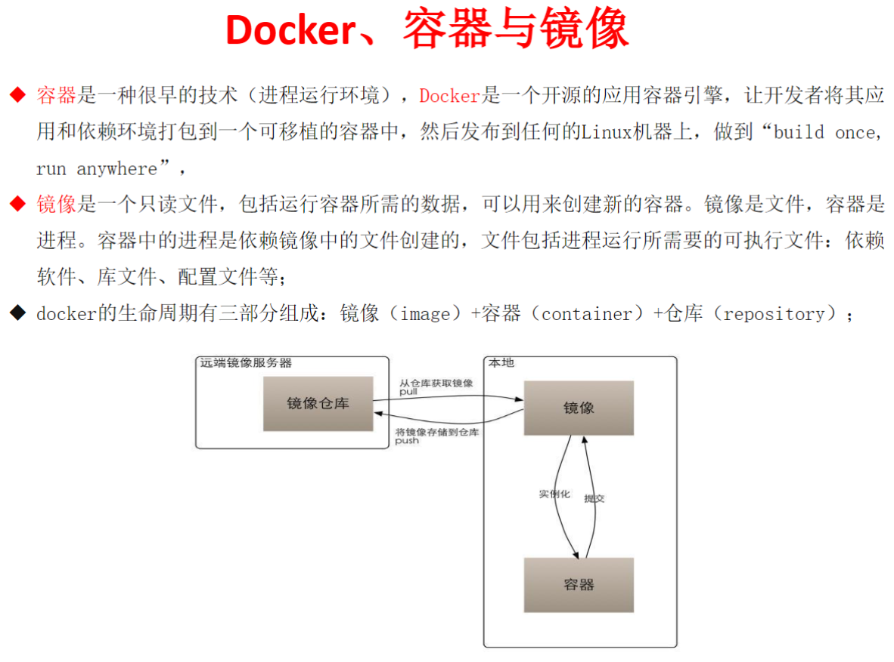

### 处理机分配算法

第四章 pdf p54。

