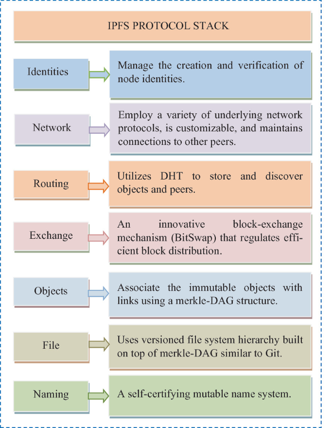
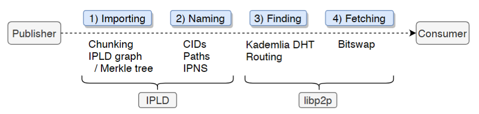
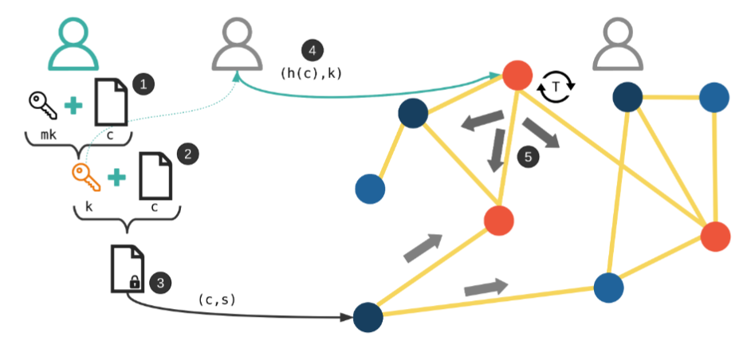
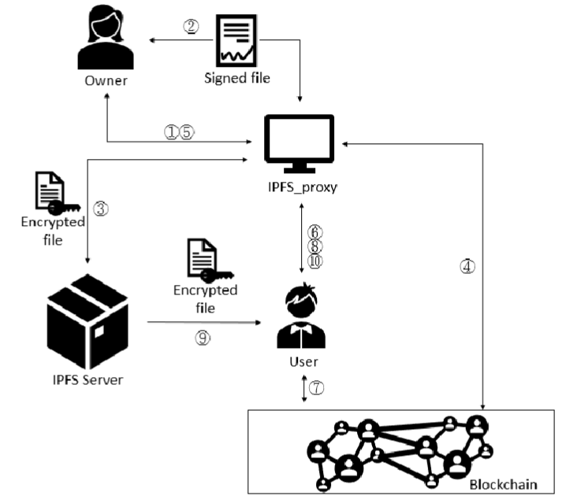
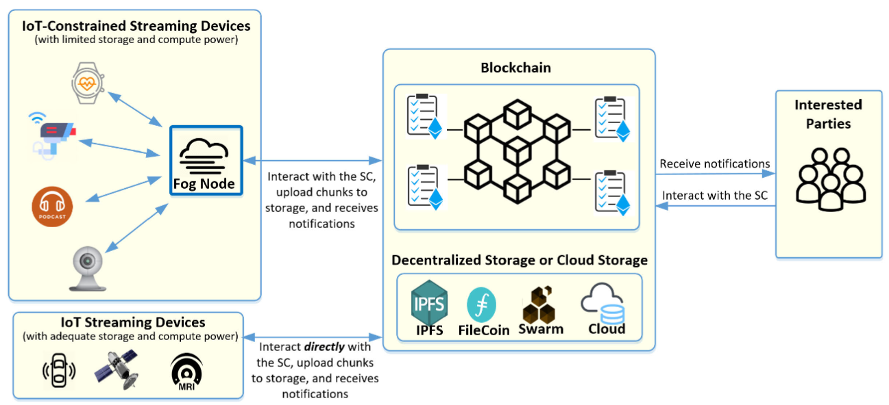
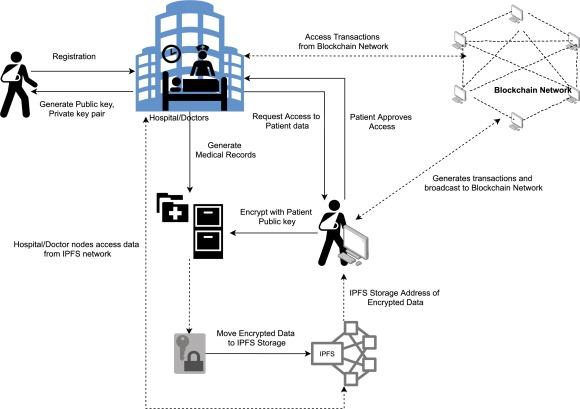
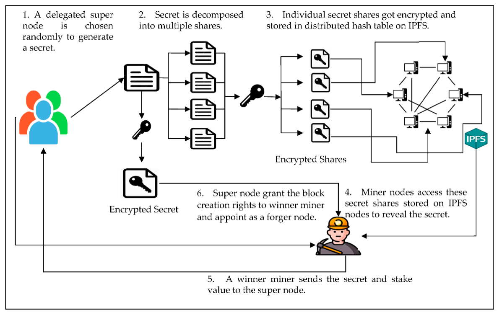

<h2 align=center>IPFS综述</h2>

刘自航 3122351077

### 介绍

IPFS (Inter Planetary File System) 是一个分布式的文件系统，可以在网络上存储和访问任何类型的数据，包括文本、图片、视频等等。IPFS 的核心思想是将文件存储在网络上的多个节点上，而不是集中存储在单个服务器上。这种分布式的存储方式使得文件可以更加安全、可靠、可持续地保存。

IPFS 的分布式存储方式可以通过使用哈希算法来实现。每个文件都会被分配一个唯一的哈希值，这个哈希值可以用来定位文件在网络上的位置。当需要获取文件时，IPFS 会在网络上寻找存储该文件的节点，并从多个节点上下载该文件，从而实现高效的文件共享和传输。

在分布式环境中，IPFS 可以通过多个节点来存储同一个文件，这些节点之间可以相互复制和备份，从而保证了数据的高可用性和可靠性。同时，由于文件被分散存储在多个节点上，所以即使有节点发生故障或被攻击，数据也可以通过其他节点重新获取，从而提高了系统的安全性和鲁棒性。

总的来说，IPFS 提供了一种分布式、去中心化的文件存储和访问方式，具有高效、可靠、安全、可持续等优点，因此在分布式应用开发中具有重要的作用。

### IPFS架构

IPFS是一个没有特权节点的对等网络。本地存储由IPFS节点用来保存IPFS对象。节点之间进行通信并交换数据对象。文件和其他数据结构由这些对象表示。IPFS的协议栈如图1所示，由以下讨论的各种子协议组成：

图1 内容发布（导入和命名）和检索过程（查找和获取）的概述，以及所涉及的IPLD和libp2p协议栈

### 方法

IPFS的设计最开始在2014年的白皮书[1]中进行了描述，其灵感来自网络和文件管理领域先前工作中的各种概念。它结合了一组协议，在P2P网络的基础上构建了一个分布式文件系统。图1概述了在IPFS中发布和检索内容的过程：内容发布者运行IPFS节点并向IPFS添加文件。

图2 内容发布（导入和命名）和检索过程（查找和获取）的概述，以及所涉及的IPLD和libp2p协议栈

Nizamuddin等人[2]提出了一种将区块链和智能合约与IPFS相结合的文档共享和版本控制系统。版本控制标准和文档共享程序是使用智能合约自行执行的。为了确保系统的稳定性和安全性，对建议的系统进行了实施和评估。

随着去中心化文件存储和共享系统越来越广泛地用于存储机密信息，其不变性和数据持久性在遵守隐私权和数据保护权方面产生了重大的不确定性。Politou等人[3]开发了一种特定于IPFS的内容擦除方法，该方法处理分布在多个节点上的个人数据的单个内容擦除请求。然而，这种擦除仅允许原始内容所有者执行。

图3 模型概述: (1) Alice使用她的主密钥mk来创建内容c的内容相关密钥k。(2) Alice使用k和c来导出所有权证明。(3) Tuple(c,s)被推送到IPFS网络。(4) Alice或她的代表之一使用内容相关密钥k通过计算(h(c),k)来发出对c的擦除请求。(5) 请求被分发到IPFS网络，每个节点检查请求的有效性.

Huang等人[4]发现，当必须存储大文件时，去中心化存储介质对于缓解区块链节点的存储限制是必要的。作为应对这一挑战的解决方案，IPFS似乎是理想的。另一方面，必须解决与IPFS相关的安全问题。因此，建立了一个IPFS代理服务器，以提供具有组密钥管理的去中心化访问控制。

图4 安全文件共享系统概述

Hasan等人[5]指出，由于物联网设备的存储和处理能力有限，物联网设备创建的流数据存在一些问题。因此，云已经与这些流媒体设备集成在一起。由于单点故障的风险和中央控制带来的安全问题，创建了一个基于区块链的去中心化安全解决方案。此外，通过IPFS的链下存储已被部署为将数据存储在加密区块中，这些数据区块的哈希保存在区块链上，以确保不变性和透明度。

图5 物联网流媒体设备基于区块链的解决方案系统图

Jayabalan等人[6]旨在创建一个具有IPFS的区块链基础设施，使医院能够安全地共享医疗信息。AES-128用于在将患者数据放入IPFS之前对其进行加密，RSA-1024用于将对称密钥传输到适当的机构。利用IPFS链下存储解决了与区块链相关的可扩展性问题。区块链的内在属性保护了医疗记录的机密性。

图6 论文中提出的模型预览图

Kaur等人[7]提出了一种新的共识算法DPoAC，该算法利用IPFS来存储为确定网络节点之间的块生成权限而产生的秘密的加密部分。该协议基于秘密共享，能够解决当前共识方法所面临的高资源需求和低效率的限制。

图7 DPoAC:论文中提出的系统设计

Eleks Labs[8]开发了一种使用以太坊为各种金融、法律或其他类型的敏感文件提供安全存储和传输的新方法，以确保文件传输的安全。该组织创造了一个可以安全处理法律交易的环境，不需要第三方中介。开发的系统是一个无许可的区块链，任何人都可以作为网络的参与者加入，并可以查看或提交所有交易。该系统的目的是为任何类型的文件提供安全的存储和传输机制，如法律协议、财务文件、个人文件等。开发这样一个系统的主要目的是确保有效和安全的交易，消除对中间产品的需求。实际上，为了验证法律协议，参与实体需要一个验证内容、签名和注册的证明人。区块链技术具有成本效益，因为它不需要公证机构。在这里，基于以太坊的智能合约执行IPFS上文档的验证和维护功能。通过使用加密技术，可以确保来自各方的签名。智能合约为受限访问和跟踪文档中的更改提供了一个接口。如果他们拥有加密密钥的话，网络中的所有合法参与者都可以更改现有文档，并查看链上跟踪的更新。

### 参考文献

[1] Benet J. Ipfs-content addressed, versioned, p2p file system[J]. arXiv preprint arXiv:1407.3561, 2014.

[2] Nizamuddin N, Salah K, Azad M A, et al. Decentralized document version control using ethereum blockchain and IPFS[J]. Computers & Electrical Engineering, 2019, 76: 183-197.

[3] Politou E, Alepis E, Patsakis C, et al. Delegated content erasure in IPFS[J]. Future Generation Computer Systems, 2020, 112: 956-964.

[4] Huang H S, Chang T S, Wu J Y. A secure file sharing system based on IPFS and blockchain[C]//Proceedings of the 2nd International Electronics Communication Conference. 2020: 96-100.

[5] Hasan H R, Salah K, Yaqoob I, et al. Trustworthy IoT data streaming using blockchain and IPFS[J]. IEEE Access, 2022, 10: 17707-17721.

[6] Jayabalan J, Jeyanthi N. Scalable blockchain model using off-chain IPFS storage for healthcare data security and privacy[J]. Journal of Parallel and Distributed Computing, 2022, 164: 152-167.

[7] Kaur M, Gupta S, Kumar D, et al. Delegated Proof of Accessibility (DPoAC): A Novel Consensus Protocol for Blockchain Systems[J]. Mathematics, 2022, 10(13): 2336.

[8] Nizamuddin N, Salah K, Azad M A, et al. Decentralized document version control using ethereum blockchain and IPFS[J]. Computers & Electrical Engineering, 2019, 76: 183-197.
