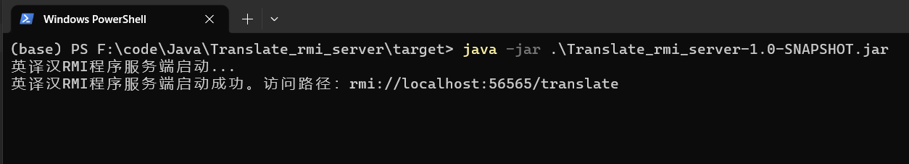

### 第三章-实验1：基于RMI技术的远程词典应用

**刘自航 3122351077**

#### 实验环境

Windows10、jdk-17、maven-3.8.8。

#### 实验目的

熟悉RMI协议原理和工作流程，使用Java编程实现英汉互译词典的服务。

#### 实现细节

首先在客户端和服务端定义一个统一的接口`TranslatorService`:

```JAVA
public interface TranslatorService extends Remote {

    public String translate(String word) throws RemoteException;
}

```

根据RMI协议，只需要服务端实现该接口：

```java
/**
 * 提供英汉互译的远程服务
 */
public class TranslatorServiceImpl extends UnicastRemoteObject implements TranslatorService {

    private final Map<String, String> map = new HashMap<>();

    public TranslatorServiceImpl() throws RemoteException {
        map.put("apple", "苹果");
        map.put("banana", "香蕉");
        map.put("water", "水");
        map.put("啤酒", "beer");
        map.put("课程", "course");
        map.put("中国", "china");
    }

    @Override
    public String translate(String word) {
        return map.getOrDefault(word, null);
    }
}
```

在接口的实现中，维护了一个6个词的Map，客户端的询问词不匹配Map中的键就返回`null`。

下面是服务端的主程序代码

```java
public class Main {

    public static void main(String[] args) throws RemoteException {
        System.out.println("英译汉RMI程序服务端启动...");
        TranslatorServiceImpl service = new TranslatorServiceImpl();
        try {
            LocateRegistry.createRegistry(56565);
            Naming.rebind("rmi://localhost:56565/translate", service);
            System.out.println("英译汉RMI程序服务端启动成功。访问路径：rmi://localhost:56565/translate");
        } catch (Exception e) {
            e.printStackTrace();
        }
    }
}
```

在客户端中，访问rmi接口，通过接口调用服务端的远程对象：

```java
    public static void main(String[] args) {
        System.out.println("英汉互译RMI客户端程序启动...");
        try {
            TranslatorService service = (TranslatorService) 									Naming.lookup("rmi://localhost:56565/translate");
            Main.translateWord(service);
        } catch (Exception e) {
            e.printStackTrace();
        }
    }

    // 在主线程中翻译所有单词
    public static void translateWord(TranslatorService service) throws RemoteException {
        List<String> words = new ArrayList<String>();
        words = Arrays.asList("apple", "banana", "water", "啤酒", "课程", "中国", "哈密瓜");
        System.out.println("==== 以下是翻译结果： ====");
        for (String word : words) {
            String targetWord = null;
            targetWord = service.translate(word);
            System.out.println(word + " --> " + targetWord);
        }
    }
```

#### 运行结果

开启服务端：



运行客户端：

