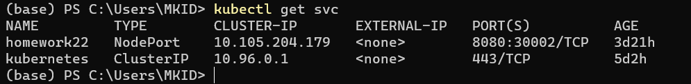
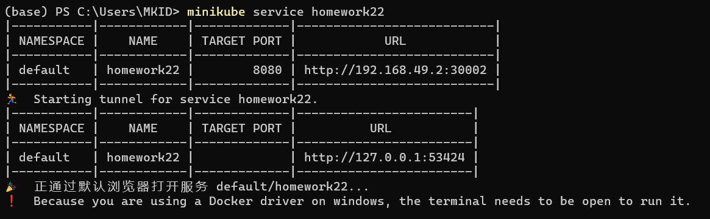
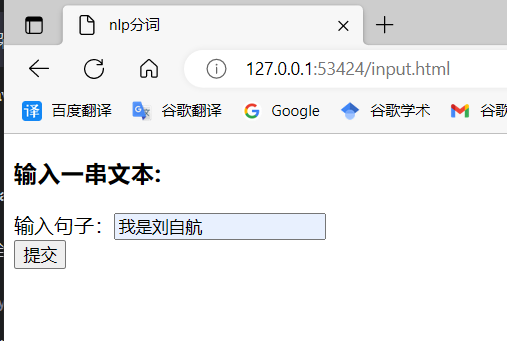
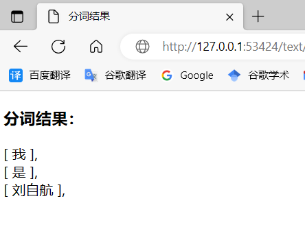

### 第四章-实验2_基于k8s的微服务应用部署与管理

**刘自航 3122351077**

#### 实验环境

Windows10、jdk-17、maven-3.8.8。

#### 实验目的

1. 学习并理解微服务架构的概念、原理以及与传统架构的不同之处；

2. 学习并掌握 Docker 容器化技术的基本概念、使用方法以及与虚拟机技术的区别；

3. 使用 Spring Boot 框架编写一个简单的微服务应用程序（内容自定，比如自然语言处理服务中的分词等，用户发送文本处理请求，并获取处理后的结果）；

4. 学习并实践 Kubernetes 的基本操作，如容器集群的创建、扩容、缩容、升级等；

5. 进一步学习 Kubernetes 的高级特性，如服务发现、负载均衡、容错恢复等。 

#### 实现细节

本程序是一个Web程序，客户端是网页，服务端是SpringBoot程序实现的服务。

客户端页面如下：

```html
<!DOCTYPE html>
<html lang="en" xmlns="http://www.w3.org/1999/html">
<head>
    <meta charset="UTF-8">
    <title>nlp分词</title>
</head>
<body>
    <div>
        <h3>输入一串文本: </h3>
        <form action="/text/str" method="post">
            输入句子：<input type="text" name="text"></br>
            <input type="submit" value="提交">
        </form>
    </div>
</body>
</html>
```

客户端分词结果返回页面：

```html
<!DOCTYPE html>
<html lang="en">
<head>
    <meta charset="UTF-8">
    <title>分词结果</title>
</head>
<body>
  <div>
    <h3>分词结果：</h3>
    <div th:each="split : ${splits}">
      [
        <span th:text="${split}"></span>
        ],
    </div>
  </div>
</body>
</html>
```

服务端控制路由的Controller代码如下：

```java
@Controller
public class TextController {

    @Autowired
    private TextSplitServiceImpl textSplitService;

    @PostMapping("/text/split")
    public String textSplit(@RequestParam("text") String text, Model model) {
        List<String> resList = textSplitService.textSplit(text);
        model.addAttribute("splits", resList);
        return "split";
    }
}
```

自然语言分词处理的接口：

```java
public interface TextSplitService {

    public List<String> textSplit(String str);
}
```

对接口的实现：

```java
@Service
public class TextSplitServiceImpl implements TextSplitService {

    @Override
    public List<String> textSplit(String text) {
        List<String> resList = new ArrayList<>();
        if (text == null) {
            return resList;
        }
        List<Term> segment = HanLP.segment(text);
        for (Term term : segment) {
            resList.add(term.word);
        }
        return resList;
    }
}
```

先把整个程序打包成jar包，并使用docker打包成镜像。

Dockerfile如下：

```dockerfile
FROM openjdk:17

VOLUME E:/Docker/volume/homework22

#ADD 后面的参数是项目名字 / 后面的参数是自定义的别名
COPY Homework2-0.0.1-SNAPSHOT.jar /homework22.jar

EXPOSE 8080

#这里的最后一个变量需要和前面起的别名相同
ENTRYPOINT ["java", "-jar", "/homework22.jar"]
```

接着使用如下命令，把jar包打包成镜像：

```bash
docker build -t mkid223/homework22:v1 .
```

接下来在本地主机安装minikube，模拟一个集群。然后把上面的自然语言处理分词项目部署到集群中的某些节点上。

启动minukube：

```bash
minikube start
```

部署的`deployment.yaml`配置文件如下：

```yaml
apiVersion: apps/v1
kind: Deployment
metadata:
  name: homework22
spec:
  selector:
    matchLabels:
      app: homework22
  template:
    metadata:
      labels:
        app: homework22
    spec:
      containers:
      - name: homework22
        image: mkid223/homework22:v1
        resources:
          limits:
            memory: "128Mi"
            cpu: "500m"
        ports:
        - containerPort: 8080
---
apiVersion: v1
kind: Service
metadata:
  name: homework22
spec:
  selector:
    app: homework22
  type: NodePort
  ports:
  - port: 8080
    nodePort: 30002
```

用下面的命令完成部署：

```bash
kubectl apply -f ./deployment.yaml
```



在minikube上，需要使用额外的命令，启动服务让浏览器可以正常访问服务接口：

```java
minukube service homework22
```



现在可以正常访问服务了。

#### 运行结果

访问项目主页：`http://127.0.0.1:53424/input.html`，输入文本`我是刘自航`:



然后服务端返回处理后的结果：



