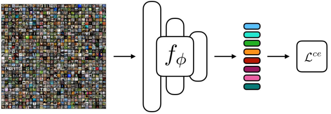
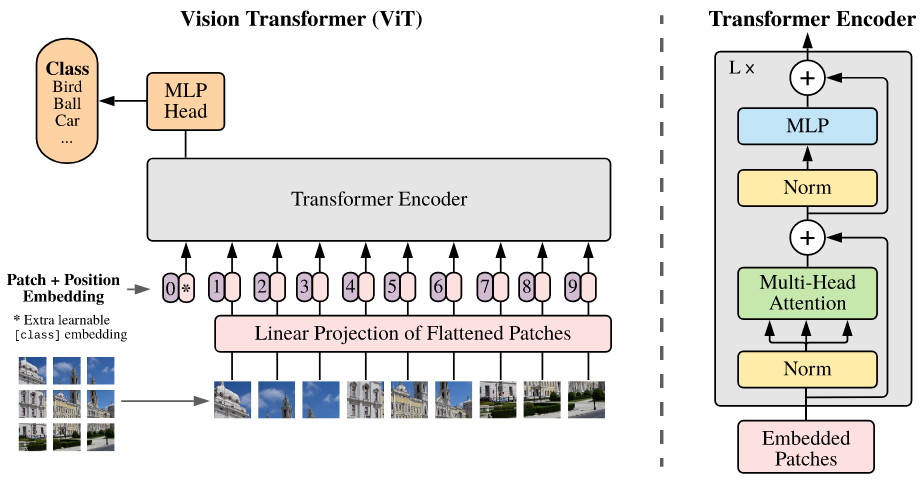
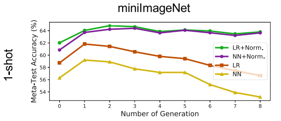

<h1 align="center">Few-Shot Classification with Contrastive Learning and ViT Extractor</h1>

Zihang Liu (3122351077) 

Xi'an Jiaotong University shananXi.China

**Abstract.** Few-shot learning is a method in deep learning field, which is less manually cost. According to the previous work, contrastive learning is a useful  method to improve the performence in image classification. In this paper, we apply this idea by constructing an infoNCE loss, which can make the network better discriminate the difference between two images from different class, meanwhile find the similarity from same class. Before transformer proposed, features extractor is implemented in a convolution-based methed. Typical convolution is limited to its receptive fields size so that the obtained features contain less relationship between pixels in a given image. To solve this problem, we use a ViT to extract feature. Extensive experiments validate the performance of our approch. We test our approch in Mini-Imagenet, and achieved a good classification accuracy.

**Keywords:** Few-shot learning · Vision Transformer learning · Contrastive learning

### 1 Introduction

The time-consuming and costly collection process makes it a challenge for these deep learning-based methods to generalizein real-life scenarios with scarce annotated data. Inspired by the capability of human to learn new concepts from a few examples, few-shot learning (FSL) is considered as a promising alternative to meet the challenge, as it can adapt knowledge learned from a few samples of base classes to novel tasks.

Over the past several years, many datasets have been proposed to test meta-learning or few-shot learning algorithms. Omniglot [24] was one of the earliest few-shot learning datasets; it contains thousands of handwritten characters from the world’s alphabets, intended for one-shot “visual Turing test”. In [25], the authors reported the 3-year progress for the Omniglot challenge, concluding that human-level one-shot learnability is still hard for current meta-learning algorithms. [51] introduced mini-ImageNet, which is a subset of ImageNet [8]. In [40], a large portion of ImageNet was used for few-shot learning tests. Meta-dataset [50] summarized recent datasets and tested several representative methods in a uniform fashion.

Recently, popular FSL methods [10,28,31,36,40,42,47] mainly adopt the meta-learning strategy. These meta-learning based methods typically take episodic training mechanism to perform meta-training on base classes with abundant data. During meta-training, the episodes consist of a support set and a query set, which are used in few-shot classification to mimic the evaluation setting. 

However, both the pre-training and meta-training procedures only minimize the standard cross-entropy (CE) loss with labels from base classes. The resulting models are optimized to solve the classification tasks of base classes. Due to this, these methods may discard the information that might benefit the classification tasks on the unseen classes. 

In this work, we add the infoNCE loss to the normal episodic framework, whose feature extractor is replaced with a vision transformer. First, in the meta-training statge, we generate two SimCLR[1] style data augmented versions of one support examples. For example, in a 5-way 1-shot classification task, each support example has two versions exclude itself, so total numbers of the support examples is 10. Second, we input all the data augmented support examples and query examples to a vision transformer to obtain the features. Then, we conbine one example and its data augmented version as a positive pair, and the remaining examples are negative pairs. Based on these pairs, we can calculate the infoNCE loss in one episode. 

### 2 Method

#### 2.1 Preliminary

The few-shot classification task is slightly different from the standard supervised classification task. The meta-training set $\mathcal{D}_{train} = \{(x_i, y_i) \vert y_i \in \mathcal{C}_{base} \}$ consists of the samples from the base classes $\mathcal{C}_{base}$ and the meta-test set $\mathcal{D}_{test} = \{ (x_i, y_i) \vert y_i \in \mathcal{C}_{novel} \}$ consists of the samples from the novel classes $\mathcal{C}_{novel}$ . Here, $y_i$ is the class label of sample $x_i$. In FSL, we aim to learn a model based on $\mathcal{D}_{train}$ and generalize it over $\mathcal{D}_{test}$ , where $\mathcal{C}_{base} \cap \mathcal{C}_{novel} = \emptyset$. Concretely, each $M$−way $K$−shot episode $E$ consistso f a support set and a query set. We first randomly sample $M$ classes from $\mathcal{C}_{base}$ for meta-training (or from $\mathcal{C}_{novel}$ for meta-testing) and $K$ instances per classt o obtain the support set $S = \{ x_i, y_i \}^{M*K}_{i=1}$. Then, we sample $Q$ instances in each of the selected classes to obtain the query set $Q = \{ x_i, y_i \}^{M*Q}_{i=1}$. Note that $y_i \in \{1,2,...,M\}$ and $S \cap Q= \emptyset$. The episodic training procedure classifies thes amples in $Q$ into the categories corresponding to the samples in $S$.

**Fig.1.** **Network Architecture.** In the meta-training, there are different FSL tasks in the left. The next is the feature extractor $f_{\Phi}$ and it implemented by a ViT. In the right, we use the faetures to calculate the infoNCE loss, which can be implemented in a form of cross entropy loss in PyTorch.

#### 2.2 Network

In this work, we apply a very simple architecture to show our method is useful, shown in Fig .1.

##### Meta-training

**Data augmentation.** For each task, we only apply data augment in support set. We use the same operation in [SimCLR], A stochastic data augmentation module that transforms any given data example randomly resulting in two correlated views of the same example, denoted $\tilde{x_i}$ and $\tilde{x_j}$, which we consider as a positive pair. We sequentially apply three simple augmentations: randomc ropping followed by resize back to the original size, random color distortions, and random Gaussian blur.

**Fig. 2. ** **Vision Transformer.** We split an obtained feature into fixed-size patches, linearly embed each of them, add position embeddings, and feed the resulting sequence of vectors to a standard Transformer encoder. 

**Vision transformer feature extractor.** Transformer architecture has become the de-facto standard for natural language processing task. Inspired by [ViT], we use a ViT architecture to extract more useful features than those implements based on CNNs. An overview of the ViT is depicted in Fig. 2. We put the obtained features into the ViT instead of original pictures in typical ViT. What's more, we discard the class token, and use a simple MLP to achieve the purpose of classification.

**Contrastive Loss.** Follow the [SimCLR], for a task, we calculate the infoNCE loss in support features that obtained before. In contrastive learning, we should normalize the features. We do not sample negative examples explicitly. Instead, given a positive pair, we treat the remaining  augmented examples within a task as negative examples. Let $sim(u, v) = u^Tv / \Vert u \Vert \Vert v \Vert$ denote the dot product between $l_2$ normalized $u$ and $v$ (i.e. cosine similarity). Then the loss function for a positive pairo f examples $(i,j)$ is defined as
$$
l_{i,j} = - \log \frac{\exp(sim(z_i, z_j) / \tau)}{\sum^{2N}_{k=1} \mathbb{1}_{[k \neq i]} \exp(sim(z_i,z_k) /  \tau)}	\tag{1}
$$
where $\mathbb{1}_{[k \neq i]} \in \{0,1\}$ is an indicator function evaluating to $1$ if $k \neq i$ and $\tau$ denotes a temperature parameter, $N$ is the size of support set. The final loss is computed across all positive pairs, both $(i,j)$ and $(j,i)$, in a task.

### Experiments

In the meta-testing stage, we fixed the feature extractor network, and train a simple linear classifier that is implemented in a MLP with one hidden layer or use the LogisticRegression implemention in sklearn which is a machine leaning repo. 

We test our approch in Mini-Imagenet dataset that is mentioned in Section 1. Except LR classifier, we also try to classify based on nearest neighbours (NN). The results are shown in Fig. 3.

**Fig. 3.** **Classification accuracy.** Logistic regression (LR) and nearest neighbours (NN) are evaluated.

### Conclusion

We show that our approach can extract more discriminate features by a slightly modified ViT. To calculate the infoNCE, we make the model more general.

### References

1. Chen T, Kornblith S, Norouzi M, et al. A simple framework for contrastive learning of visual representations[C]//International conference on machine learning. PMLR, 2020: 1597-1607.
2. Snell J, Swersky K, Zemel R. Prototypical networks for few-shot learning[J]. Advances in neural information processing systems, 2017, 30.
3. Dosovitskiy A, Beyer L, Kolesnikov A, et al. An image is worth 16x16 words: Transformers for image recognition at scale[J]. arXiv preprint arXiv:2010.11929, 2020.
4. Yang Z, Wang J, Zhu Y. Few-Shot Classification with Contrastive Learning[C]//European Conference on Computer Vision. Springer, Cham, 2022: 293-309.
5. Tian Y, Wang Y, Krishnan D, et al. Rethinking few-shot image classification: a good embedding is all you need?[C]//European Conference on Computer Vision. Springer, Cham, 2020: 266-282.
6. Vaswani A, Shazeer N, Parmar N, et al. Attention is all you need[J]. Advances in neural information processing systems, 2017, 30.
7. Sung F, Yang Y, Zhang L, et al. Learning to compare: Relation network for few-shot learning[C]//Proceedings of the IEEE conference on computer vision and pattern recognition. 2018: 1199-1208.
8. Vinyals O, Blundell C, Lillicrap T, et al. Matching networks for one shot learning[J]. Advances in neural information processing systems, 2016, 29.
