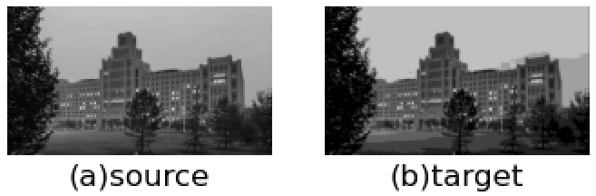
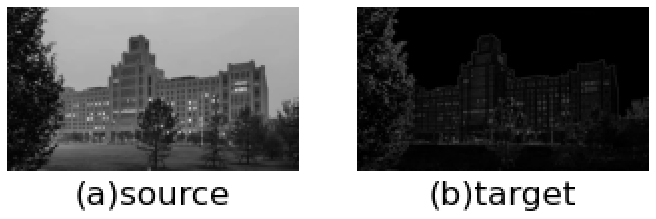
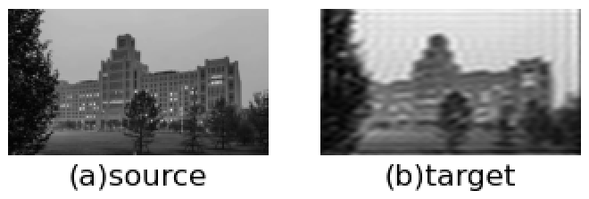
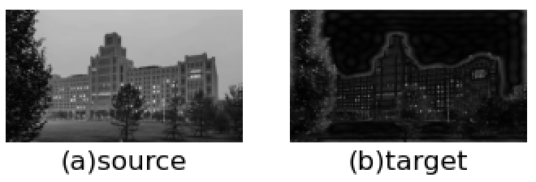

## FFT实现图像频率域滤波

运行环境：Linux内核版本为5.15.0-56-generic，操作系统是Ubuntu20.04 SMP，硬件架构是x_86_64。

### 1.介绍

快速傅里叶变换（FFT）是一种计算序列的离散傅里叶变换（DFT）或其逆（IDFT）的算法。傅里叶分析将信号从其原始域（通常是时间或空间）转换为频域中的表示，反之亦然。DFT是通过将一系列值分解为不同频率的分量而获得的。这一操作在许多领域都很有用，但直接从定义中计算它往往太慢而不实用。FFT通过将DFT矩阵分解为稀疏（大部分为零）因子的乘积来快速计算此类变换。因此，它把DFT的复杂性从$\textstyle{O}\left(N^{2}\right)$降低到$\textstyle{O}\left(N \log N\right)$，如果简单地应用DFT的定义，则会出现这种情况，其中$\displaystyle N$是数据大小。处理速度上的差异可能非常大，特别是对于很长的数据集，其中 $N$ 的数量级超过百万。在存在舍入误差的情况下，许多FFT算法比直接或间接评估DFT定义的精度要高得多。基于已发表的各种理论，有许多不同的FFT算法，从简单的复数算法到群论和数论。快速傅里叶变换广泛应用于工程、音乐、科学和数学领域。基本思想在1965年得到普及，但一些算法早在1805年就已经问世。最著名的FFT算法依赖于N的因子分解，但对于所有N，甚至对于素数N，FFT都有$O(N \log N)$的复杂度。许多FFT算法仅依赖于以下事实：$e^{-2\pi i/N}$是单位的第N个原根，因此可以应用于任何有限域上的类似变换，例如数论变换。由于逆DFT与DFT相同，但指数中有相反的符号，且因子为1/N，因此任何FFT算法都可以很容易地适用于它。

### 2.具体方法

#### 2.1. 问题定义

图像处理领域的计算开销很大，因此了解如何简化和加速傅里叶变换的计算就很重要。FFT最开始是用在通信领域，对一维的信号进行处理，但是在图像处理中，需要做二维的变换，这时候需要用到二维傅里叶变换。在本次实验中，我们用二维傅里叶变换主要解决如下问题：把图像从空间域转换到频率域，在频率域进行滤波，从而提高图像的分辨率或降低图像的噪声。

傅里叶变换用大小为$m\times n$元素的核对大小为$M\times N$的图像进行滤波时，需要的运算次数为$MNmn$（乘法和加法）。如果核是可分离的，那么运算次数可减少为$MN(m+n)$。在频率域中执行等效滤波所需要的运算次数仅为$2MN\log_{2}{MN} $，前面的系数$2$表示我们要计算一次正FFT和一次反FFT。

为了说明频率域滤波相对于空间域滤波的计算优势，我们分别考虑大小为$M\times M$和$m\times m$​的方形图像与核。与采用不可分离的核相比，采用FFT对这种图像滤波的计算优势（它是核大小的函数）定义为
$$
C_n(m)=\frac{M^2m^2}{2M^2\log_{2}{M^2}} = \frac{m^2}{4\log_{2}{M}}	\tag{1}
$$
如果核是可分离的，那么这一优势变为
$$
C_n(m)=\frac{M^2m}{2M^2\log_{2}{M^2}} = \frac{m}{2\log_{2}{M}}	\tag{2}
$$


#### 2.2. 公式推导

首先给出二维离散傅里叶变换（DFT）的公式
$$
F(u,v) = \sum_{x=0}^{M-1} \sum_{y=0}^{N-1}f(x,y)e^{-j2\pi (ux/M+vy/N)}	\tag{3}
$$

式中，$f(x,y)$是大小为$M \times N$ 的数字图像。类似与一维的情况，上式必须对离散变量$u$和$v$在$u=0,1,2,\ldots,M-1$和$v=0,1,2,\ldots,N-1$的范围内求值。

已知变换$F(u,v)$时，可用傅里叶反变换（IDFT）得到$f(x,y)$
$$
f(x,y) = \frac{1}{MN} \sum_{u=0}^{M-1} \sum_{v=0}^{N-1} F(u,v)e^{-j2\pi (ux/M+vy/N)}	\tag{4}
$$
是式中，$x=0,1,2,\ldots,M-1$，$y=0,1,2,\ldots,N-1$。式(3)和式(4)构成一个二维离散傅里叶变换对$f(x,y)\Leftrightarrow F(u,v)$。知道$f(x,y)$和$F(u,v)$是傅里叶变换对，对于证明函数及其变换之间的关系是非常又用的。

二维的离散傅里叶及其反变换在频率域和空间域有如下性质：（1）频率域中样本之间的间隔，与空间样本之间的间隔及样本数量成反比。（2）若$f(x,y)$旋转$\theta_0$角度，则$F(u,v)$也旋转相同的角度。反之，若$F(u,v)$旋转某个角度，$f(x,y)$也旋转相同角度。（3）二维傅里叶变换及其反变换在$u$方向和$v$方向是无限周期的。（4）实函数$f(x,y)$的傅里叶变换是共轭对称的，即$F^{*} (u,v) = F(-u,-v)$。（5）二维DFT的幅度是一个阵列的同时，其分量决定了图像中的灰度，对应的相位是一个角度阵列，它携带了大量关于图像中可识别目标的位置信息。

还有一个重要的性质就是二维离散卷积定理
$$
(f\star h)(x,y) \Leftrightarrow (F\cdot H)(u,v)	\tag{5}
$$
或者反写为
$$
(f\cdot h)(x,y) \Leftrightarrow (F\star H)(u,v)	\tag{6}
$$
用上面提到这些性质，我们可以推导FFT的公式。首先二维的DFT可以分成多个一维变换，我们可以把式(3)写为
$$
F(u,v) = \sum_{x=0}^{M-1} e^{-j2\pi ux/M} \sum_{y=0}^{N-1}f(x,y)e^{-j2\pi vy/N} = 
F(x,v) = \sum_{x=0}^{M-1} e^{-j2\pi ux/M}	\tag{7}
$$
式中，
$$
F(x,v) = \sum_{y=0}^{N-1}f(x,y)e^{-j2\pi vy/N}	\tag{8}
$$
可以的出结论：$f(x,y)$的二维DFT可以通过计算$f(x,y)$的每一行中的一维变换，然后沿计算结果的每一列计算一维变换来得到的。这是一个重要的简化，因为我们必须一次处理一个变量，由类似的推导可知，我们可用一维IDFT来计算二维IDFT。但是我们可用计算DFT的算法来计算IDFT。

式(4)的两边取复共轭，并将得到的结果乘以$MN$得
$$
MNf^{*} (x,y) = \sum_{u=0}^{M-1} \sum_{v=0}^{N-1} F^{*}(u,v)e^{-j2\pi (ux/M+vy/N)}	\tag{9}
$$
这时，我们发现上式的右侧是$F^{*}(u,v)$的DFT。因此，式(9)表明，若把$F^{*}(u,v)$代入计算二维傅里叶正变换的算法中，则结果将是$MNf^{*}(x,y)$。取复共轭并将结果乘以$1/MN $将得到$f(x,y)$，它是$F(u,v)$的反变换。

若我们直接实现式(3)和式(4)，则在频率域进行处理并不实际。暴力实现这些公式时，需要约$(MN)^2$次乘法和加法运算。对于中等大小的图像（如 $2048 \times 2048$像素），这意味着仅进行一次二维DFT运算就需要约17万亿次乘法和加法，还不包括计算一次并存储到查找表中的指数运算。而FFT算法可以把计算量降到$MN\log_{2}{MN}$次乘法和加法，那么上述大小的图像仅需要9200万次量级的乘法和加法。

这里实现FFT的的算法是逐次加倍法，这个特殊的算法假设取样数是2的整数次幂，由之前的推导可知，二维DFT可通过逐次调用一维变换来实现，因此我们只需要关注一个变量的FFT。

在推导FFT时，将一维的DFT写为
$$
F(u) = \sum_{x=0}^{M-1} f(x)W_{M}^{ux}	\tag{10}
$$
式中，$u=0,1,2,\ldots,M-1$。其中，$W_{M} = e^{-j2\pi /M}$，并假设$M$具有形式$M=2^p$，其中$p$是一个正整数。于是，可将$M$写为$M=2K$，其中$K$也是一个正整数。代入式(10)得
$$
F(u) = \sum_{x=0}^{2K-1} f(x)W_{2K}^{ux}= \sum_{x=0}^{K-1} f(2x)W_{2K}^{u(2x)} + 
\sum_{x=0}^{K-1} f(2x+1)W_{2K}^{u(2x+1)}	\tag{11}
$$
进一步，可以证明$W_{2K}^{2ux} = W_{K}^{ux}$，因此式(11)可以写为
$$
F(u) = \sum_{x=0}^{K-1} f(2x)W_{K}^{ux} + 
\sum_{x=0}^{K-1} f(2x+1)W_{K}^{ux}W_{2K}^{u}	\tag{12}
$$
对于$u=0,1,2,\ldots,K-1$，规定
$$
F_{even}(u) = \sum_{x=0}^{K-1} f(2x)W_{K}^{ux}	\tag{13}
$$

$$
F_{odd}(u) = \sum_{x=0}^{K-1} f(2x+1)W_{K}^{ux}	\tag{14}
$$

于是，式(12)化简为
$$
F(u) = F_{even}(u) + F_{odd}(u)W_{2K}^{u}	\tag{15}
$$
另外，因为$W_{K}^{u+K} = W_{K}^{u}$和$W_{2K}^{u+K} = -W_{2K}^{u}$，于是有
$$
F(u+K) = F_{even}(u) - F_{odd}(u)W_{2K}^{u}	\tag{16}
$$
分析式(13)到式(16)可以发现这些表达式的一些重要性质。一个$M$点的DFT可通过把原表达式分为两部分来计算。计算$F(u)$的前一半要求计算式(13)和式(14)中给出的两个$(M/2)$点变换。然后将$F_{even}(u)$和$F_{odd}(u)$的值代入式(15)得到$F(u)$，$u=0,1,2,\ldots,(M/2-1)$。$F(u)$的后一半可由式(16)直接计算，不需要额外的变换计算。

若用上述推导出来的公式实现FFT算法，那么，对任意正整数$p$，可推出完成FFT所需要的乘法次数和加法次数的递归表达式为
$$
m(p) = 2m(p-1)+2^{p-1},p\geq 1 	\tag{17}
$$

$$
a(p) = 2a(p-1)+2^{p-1},p\geq 1	\tag{18}
$$

式中，$m(0)=0$且$a(0)=0$，因为一点变换不需要任何加法和乘法运算。上述推导方法称为逐次加倍FFT算法，因为对于等于2的整数次幂的任意$M$，这个算法由两个单点变换来计算一个两点变换，由两个两点变换来计算一个四点变换，以此类推。

与直接计算一维DFT相比，FFT的计算优势定义为
$$
C(M) = \frac{M^2}{M\log_{2}{M} } = \frac{M}{\log_{2}{M} }  	\tag{19}
$$
式中，$M^2$是“暴力”实现一维DFT所需的运算次数，因此可以将式(19)写成关于$p$的形式
$$
C(p) = 2^p / p	\tag{20}
$$
显然，$p$越大，FFT的计算优势就越明显。


#### 2.3. FFT伪代码

```fortran
X0,...,N−1 ← ditfft2(x, N, s):                        x是采样序列，N是点数，s是步长
    if N = 1 then
        X0 ← x0                                        递归已经到底了
    else
        X0,...,N/2−1 ← ditfft2(x, N/2, 2s)             一半点数的偶数DFT
        XN/2,...,N−1 ← ditfft2(x+s, N/2, 2s)           一半点数的奇数DFT...）
        for k = 0 to N/2−1 do                          逐次加倍，将两个子DFT合并为完整的DFT
            t ← Xk
            Xk ← t + exp(−2πi k/N) Xk+N/2
            Xk+N/2 ← t − exp(−2πi k/N) Xk+N/2
        end for
    end if
```

#### 2.4. 核心代码解释

下面的代码是FFT理想低通滤波器的实现。

假定原图像$f(x,y)$经傅里叶变换为$F(u,v)$，滤波器函数是$H(u,v)$。那么下面的代码可以理解为如下过程
$$
f(x,y) \stackrel{DFT}{\longrightarrow} F(u,v) \stackrel{H(u,v)}{\longrightarrow} G(u,v)
\stackrel{IDFT}{\longrightarrow} g(x,y)
$$
代码中，DFT和IDFT的过程使用numpy库fft对象里的快速傅里叶变换函数实现。

```python
f1 = np.fft.fft2(new_img)
    # 使用np.fft.fftshift()函数实现平移，让直流分量输出图像的中心
    f1_shift = np.fft.fftshift(f1)
    # 实现理想低通滤波器
    rows, cols = new_img.shape
    crow, ccol = int(rows / 2), int(cols / 2)   # 计算频谱中心
    mask = np.zeros((rows, cols), np.uint8)  # 生成rows行cols列的矩阵，数据格式为uint8
    for i in range(rows):
        for j in range(cols):
            if np.sqrt(i*i+j*j) <= D:
                # 将距离频率中心小于D的部分设置为1，否则为0
                mask[crow - D: crow + D, ccol - D: ccol + D] = 1
    mask = 1 - mask
    f1_shift = f1_shift * mask
    # 傅里叶逆变换
    f_ishift = np.fft.ifftshift(f1_shift)
    img_back = np.fft.ifft2(f_ishift)
```


### 3.实验

为了说明FFT在计算上优于DFT，下面的实验分为三部分：第一是在空间域上的滤波算法，第二和第三个实是用傅里叶变换转到频率域上的滤波算法。所有代码全部用python实现，使用了numpy和scipy这样的数学计算库，matplotlib可视化库和skimage数字图像处理库。具体代码放在附录部分。

#### 3.1. 空间域上的低通和高通滤波

低通滤波器又称平滑滤波器，使用给定邻域内像素的平均灰度值或逻辑运算值代替原始图像中像素的灰度值，这种处理降低了图像灰度的“尖锐”变化。这里我们使用平滑线性空间滤波器。平滑线性空间滤波器的输出是给定邻域内的像素灰度值的简单平均值或加权平均值。平滑线性空间滤波器有时也称为均值滤波器。均值滤波器的一个重要应用是降低图像中的噪声。均值滤波器还有一个重要的应用，去除图像中不相关的细节，使不相关细节与背景柔和在一起。

**空间低通滤波** 我们首先读取一张创新港涵英楼（分辨率是$1921\times 1080$）的照片，为了观察中值滤波的降噪效果，首先对涵英楼的彩色图像加入椒盐噪声，然后使用$3 \times 3$的中值滤波器对图像进行中值滤波。加入噪声后如图1（b）所示，平滑滤波结果如图1（c）所示。并且统计了中值滤波过程的运行时间为0.520秒。



<p align=center><b>图1</b> 空间低通滤波</p>

  

**空间高通滤波** 相比于低通滤波，高通滤波是增强图像中目标的细节、边缘、轮廓和其他灰度突变，消弱了灰度变化缓慢的区域。由于微分是对函数的局部变化率的一种描述，因此图像锐化算法的实现可基于空间微分。图像平滑处理有边缘和细节模糊的负面效应。图像平滑和图像锐化在逻辑上是相反的操作，因此也可以使用原始图像减去平滑处理后的图像实现锐化处理，这称为反锐化遮掩。二维图像的梯度是一个二维列向量，梯度向量的两个分量都是一阶偏导数，即两个分量都是线性算子。下面我们使用罗伯特算子实现高通滤波。图2（b）显示了高通滤波之后的图像，可以看出把涵英楼的边缘信息过滤了出来。空间高通滤波运行时间为0.095秒。



<p align=center><b>图2</b> 空间高通滤波</p>

#### 3.2. FFT实现频率域上的低通和高通滤波

在频率域上进行图像处理，首先要把图像从空间域转换到频率域，基于上一小节中的公式，我们可以用二维DFT的公式实现从空间域到频率域的转换。频率域滤波有三个基本步骤：（1）对原始图像$f(x,y)$进行傅里叶变换得到$F(u,v)$。（2）将$F(u,v)$与传递函数$H(u,v)$进行卷积运算得到$G(u,v)$。（3）将$G(u,v)$进行傅里叶逆变换得到增强图像$g(x,y)$。

**频率低通滤波** 图像从空间域变换到频域后，其低频分量对应图像中灰度值变化比较缓慢的区域，高频分量则对应图像中物体的边缘和随机噪声等信息。低通滤波是指保留低频分量，而通过滤波器函数$H(u,v)$减弱或抑制高频分量在频域进行的滤波。和空间中的平滑滤波器一样，可以消除图像中的随机噪声，减弱边缘效应，起到平滑图像的作用。

下面实现理想低通滤波器，二维理想低通滤波器的传递函数如下
$$
H(u,v) = \begin{cases}
 1 & \text{ if } D(u,v) \leq D_0 \\
 0 & \text{ if } D(u,v) \gt D_0
\end{cases}	\tag{21}
$$
截断频率$D_0$是一个非负整数。理想低通滤波器的含义是指小于$D_0$的频率，即以$D_0$为半径的圆内的所有频率分量可以完全无损的通过，而圆外的频率，即大于$D_0$的频率分量则完全被除掉。滤波结果如图3所示。处理时间是0.748秒。



<p align=center><b>图2</b> 频域低通滤波</p>

**频率高通通滤波** 图像的边缘、细节主要在高频，图像模糊的原因是高频成分较弱。为了消除模糊，突出边缘，可以采用高通滤波的方法，使低频分量得到抑制，从而达到增强高频分量，使图像的边缘或线条变得清晰，实现图像的锐化。理想高通滤波器和理想低通滤波器正好相反，只需要修改传递函数参数$D_0$的判断条件即可。结果如图4所示。处理时间是0.767秒。



<p align=center><b>图4</b> 频域低通滤波</p>

#### 3.3. 结果分析

我们在空间域用滤波算子实现了低通和高通滤波，在频率域上用FFT实现。对于一张分辨率是$1921 \times 1080$的图像，空间域上的实现会更快一些。另一方面，对于一张普通的照片，频域上的滤波似乎表现不如空间上的好。但是单独分析FFT在频域上的表现，可以得出：FFT确实大大优化了处理速度。正如上一小节中的复杂的分析式(19)：$C(1921) \times C(1080) = \frac{1921}{\log_{2}{1921} } \times\frac{1080}{\log_{2}{1080} } \approx 18876  $ ，即比两个分开的一维DFT快了$18876$倍。

### 附录（代码）

```python
import numpy as np
from scipy import ndimage, signal
from skimage import data, util, io, filters, color
from matplotlib import pyplot as plt
import time
from datetime import datetime

img_path = 'img/cxg.jpg'


def add_noise(img):
    # img = data.astronaut()
    noise_img = np.zeros(img.shape)
    for i in range(3):
        grayimg = img[:, :, i]
        # 对图像加入椒盐噪声
        noise_img[:, :, i] = util.random_noise(grayimg, mode='s&p', seed=None, clip=True, amount=0.3)
    return noise_img


def spatial_mean_filter(img):
    window = np.ones((9, 9)) / (3 ** 2)
    new_img = signal.correlate2d(img, window, mode='same', boundary='fill')
    return new_img.astype(np.uint8)


def spatial_robert_filter(img):
    img_robert_pos = filters.roberts_pos_diag(img)
    img_robert_neg = filters.roberts_neg_diag(img)
    img_robert = filters.roberts(img)
    return img_robert


def freq_low_filter(img):
    D = 20
    # new_img = color.rgb2gray(img)
    new_img = img
    # numpy中的傅里叶变换
    f1 = np.fft.fft2(new_img)
    # 使用np.fft.fftshift()函数实现平移，让直流分量输出图像的中心
    f1_shift = np.fft.fftshift(f1)
    # 实现理想低通滤波器
    rows, cols = new_img.shape
    crow, ccol = int(rows / 2), int(cols / 2)   # 计算频谱中心
    mask = np.zeros((rows, cols), np.uint8)  # 生成rows行cols列的矩阵，数据格式为uint8
    for i in range(rows):
        for j in range(cols):
            if np.sqrt(i*i+j*j) <= D:
                # 将距离频率中心小于D的部分设置为1，否则为0
                mask[crow - D: crow + D, ccol - D: ccol + D] = 1
    f1_shift = f1_shift * mask
    # 傅里叶逆变换
    f_ishift = np.fft.ifftshift(f1_shift)
    img_back = np.fft.ifft2(f_ishift)
    img_back = np.abs(img_back)
    img_back = (img_back - np.amin(img_back)) / (np.amax(img_back) - np.amin(img_back))
    return img_back


def freq_high_filter(img):
    D = 10
    # new_img = color.rgb2gray(img)
    new_img = img
    # numpy中的傅里叶变换
    f1 = np.fft.fft2(new_img)
    # 使用np.fft.fftshift()函数实现平移，让直流分量输出图像的中心
    f1_shift = np.fft.fftshift(f1)
    # 实现理想低通滤波器
    rows, cols = new_img.shape
    crow, ccol = int(rows / 2), int(cols / 2)   # 计算频谱中心
    mask = np.zeros((rows, cols), np.uint8)  # 生成rows行cols列的矩阵，数据格式为uint8
    for i in range(rows):
        for j in range(cols):
            if np.sqrt(i*i+j*j) <= D:
                # 将距离频率中心小于D的部分设置为1，否则为0
                mask[crow - D: crow + D, ccol - D: ccol + D] = 1
    mask = 1 - mask
    f1_shift = f1_shift * mask
    # 傅里叶逆变换
    f_ishift = np.fft.ifftshift(f1_shift)
    img_back = np.fft.ifft2(f_ishift)
    img_back = np.abs(img_back)
    img_back = (img_back - np.amin(img_back)) / (np.amax(img_back) - np.amin(img_back))
    return img_back


def spatial_show_imgs(imgs):
    titles = ['(a)source', '(b)target']
    plt.figure()
    for i, img in enumerate(imgs):
        plt.subplot(f'13{i+1}')
        plt.imshow(img, cmap='gray')  # 原图
        plt.title(titles[i], y=-0.3)
        plt.axis('off')
    plt.show()

if __name__ == '__main__':

    # set_ch()
    img = io.imread(fname=img_path)
    print('图像大小是, ', img.shape)
    img = color.rgb2gray(img)

    # 空间低通滤波
    # noise_img = add_noise(img)
    st = datetime.now()
    new_img = spatial_mean_filter(img)
    et = datetime.now()
    print('空间低通滤波，处理时间是: ', (et - st).microseconds/1e6)
    spatial_show_imgs([img, new_img])

    # 空间高通滤波
    st = datetime.now()
    img_robert = spatial_robert_filter(img)
    et = datetime.now()
    print('空间高通滤波，处理时间是: ', (et - st).microseconds / 1e6)
    spatial_show_imgs([img, img_robert])

    # 频率低通滤波
    st = datetime.now()
    img_low_back = freq_low_filter(img)
    et = datetime.now()
    print('频率低通滤波，处理时间是: ', (et - st).microseconds / 1e6)
    spatial_show_imgs([img, img_low_back])

    # 频率高通滤波
    st = datetime.now()
    img_high_back = freq_high_filter(img)
    et = datetime.now()
    print('频率高通滤波，处理时间是: ', (et - st).microseconds / 1e6)
    spatial_show_imgs([img, img_high_back])


```

