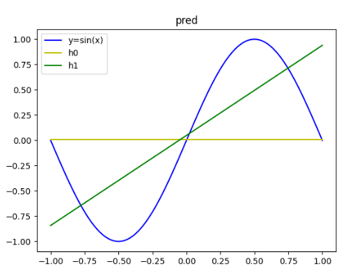

#### 实验目的

用数据集拟合给定的两个模型，分别计算两个模型在测试集上的偏差和方差，根据实验结果分析两个模型的好坏。

#### 原理

给定一个目标函数 $f(x) = sin(\pi x)$，$x \in [-1, 1]$ ，在 $[-1, 1]$ 的均匀分布上取 $(x, f(x))$ 的值当作数据集(训练集和测试集)。 

给定两个模型：
$$
H0: h(x) = b \\
H1: h(x) = ax+b \\
$$
其中，$H0$ 和 $H1$ 都是很多直线的集合。

原理的伪代码如下：

```python
# 1.从目标函数上取两个点
train_set = uniform(-1, 1)	# 其中 y = sin(x)
# 2. 用上述两个点拟合
b0 = (y1 + y2) / 2	# h0
a1 = (y2 - y1) / (x2 - x1)	# h1
b1 = y1 - a * x1
# 3. 在目标函数上取一个或多个点当测试集，计算bias和variance
x_truth, y_truth = uniform(-1, 1)
y_pred = h$(x_truch)	# 两个模型的预测值
bias = y_pred - y_truth
variance = var(y_pred)
```


#### 关键代码实现

下面主要介绍拟合函数和测试函数，完整的代码在最后一节中补充。

- `fiiting` 拟合函数

  该函数执行的此书是：提前设置好的训练次数（100次），即一个模型具体要拟合多少条直线。

  ```python
  def fitting(args):
      # print('拟合参数...')
      train_set = data_loader('train', args)
      x1, x2 = train_set[0][0], train_set[1][0]
      y1, y2 = train_set[0][1], train_set[1][1]
      b0 = (y1 + y2) / 2
      a1 = (y2 - y1) / (x2 - x1)
      b1 = y1 - x1 * a1
      # 初始化两个列表保存所有拟合好的直线
      if 'h0_b' not in args and 'h1_a_b' not in args:
          args['h0_b'] = []
          args['h1_a_b'] = []
          args['h0_b'].append(b0)
          args['h1_a_b'].append([a1, b1])
      else:
          args['h0_b'].append(b0)
          args['h1_a_b'].append([a1, b1])
  ```

- `run_test` 测试函数

  该函数只执行一次，测试集取了100个点。对于上述两个模型中的任意一个，在训练结束后，模型中有100条直线，那么输入一个点($x$)，模型就会输出100个预测值($\hat{y}$)，然后计算这100个预测值的方差和平均偏差。为了说明实验结果的普遍性，对测试集上的每个点重复上述过程，100个点算出来的方差和偏差取平均当作对应模型的总方差和总平均偏差。

  ```python
  def run_test(args):
      test_set = data_loader('test', args)
      args['test_set'] = test_set
      for i in range(test_set.shape[0]):	# 算100次
          x_test = test_set[i, 0]
          y_truth = test_set[i, 1]
          h0_pred = args['h0_b']
          args['h0_bias'].append(np.mean(np.abs(y_truth - h0_pred))) # 计算平均偏差
          args['h0_variance'].append(np.var(h0_pred))	# 计算方差
          h1_pred = h1(x_test, args['h1_a_b'][:, 0], args['h1_a_b'][:, 1])
          args['h1_bias'].append(np.mean(np.abs(y_truth - h1_pred)))
          args['h1_variance'].append(np.var(h1_pred))
      h0_bias = np.mean(args['h0_bias'])	# 计算整个测试集的平均偏差
      h0_variance = np.mean(args['h0_variance'])	# 方差
      h1_bias = np.mean(args['h1_bias'])
      h1_variance = np.mean(args['h1_variance'])
      print(f'模型h0的偏差是：{h0_bias}，方差是：{h0_variance}')
      print(f'模型h1的偏差是：{h1_bias}，方差是：{h1_variance}')
  ```

  

#### 实验结果与分析

**根据实验结果，只是说明了简单模型(H0)的方差比复杂模型(H1)的方差小，但并不能说明复杂模型(H1)的偏差就一定小。（后面又做了不同的实验验证复杂模型的偏差确实比较小。）**

根据上述思路，做了多次实验（一个模型多条直线）：

| 实验次数 |      | 偏差               | 方差                |
| -------- | ---- | ------------------ | ------------------- |
| #1       | H0   | 0.7344658740355708 | 0.2467520855597941  |
|          | H1   | 0.9772856778515567 | 2.090931368680554   |
| #2       | H0   | 0.7572273601526409 | 0.23734583704636536 |
|          | H1   | 0.832904604487792  | 1.6124664553947077  |
| #3       | H0   | 0.720061595109578  | 0.2724860555349887  |
|          | H1   | 0.8682408561486004 | 1.7678746588571033  |

下图是第2次实验中画出的，在第1个测试点上，两个模型分别预测出来的前10个点。


按照直觉来说，复杂模型的偏差应该小于简单模型，然而实验结果却不是这样。所以我修改了测试代码，把每个模型中的所有直线拟合成了一条直线（对所有参数取平均），得到的实验结果说明了复杂模型比简单模型的偏差小。

两个模型都拟合成了一条直线：

| 实验次数 |      | 偏差               | 方差               |
| -------- | ---- | ------------------ | ------------------ |
| #1       | H0   | 0.6411520738843399 | 0                  |
|          | H1   | 0.4507207906598482 | 0.1386701570132488 |
| #2       | H0   | 0.6170447537231738 | 0                  |
|          | H1   | 0.4005163882839881 | 0.1667768179991113 |
| #3       | H0   | 0.6523415902070336 | 0                  |
|          | H1   | 0.4298385871989209 | 0.1361750540928407 |

下图是第2次实验拟合出来的两条直线：



#### 代码

```python
import numpy as np
import matplotlib.pyplot as plt
import os

# 初始化参数
def load_args():
    conf = {
        'train_num_samples': 2,
        'test_num_samples': 100, # 取值100个点，计算每个点在两个模型上的bias和variance
        'train_epochs': 100,
        'h0_bias': [],
        'h0_variance': [],
        'h1_bias': [],
        'h1_variance': [],
        'h0_pred': [],
        'h1_pred': [],
        # 'visualize_path': './img'
    }
    return conf

# 1. 构建训练集和测试集
def data_loader(dataset_type, args):
    num = args['train_num_samples'] if dataset_type == 'train' else args['test_num_samples']
    x = np.random.uniform(-1, 1, num)
    y = np.sin(np.pi * x)
    dataset = np.vstack((x, y))
    return dataset.T

def h0(x, b):  # h(x) = b, b = (y1+y2)/2
    return b

def h1(x, a, b):    # h(x) = a*x+b
    return a * x + b

# 2. 拟合参数
def fitting(args):
    # print('拟合参数...')
    train_set = data_loader('train', args)
    x1, x2 = train_set[0][0], train_set[1][0]
    y1, y2 = train_set[0][1], train_set[1][1]
    b0 = (y1 + y2) / 2
    a1 = (y2 - y1) / (x2 - x1)
    b1 = y1 - x1 * a1
    if 'h0_b' not in args and 'h1_a_b' not in args:
        args['h0_b'] = []
        args['h1_a_b'] = []
        args['h0_b'].append(b0)
        args['h1_a_b'].append([a1, b1])
    else:
        args['h0_b'].append(b0)
        args['h1_a_b'].append([a1, b1])

def run_train(args):
    for i in range(args['train_epochs']):
        fitting(args)
    args['h0_b'] = np.asarray(args['h0_b'])
    args['h1_a_b'] = np.asarray(args['h1_a_b']).reshape((-1, 2))

def run_test(args):
    test_set = data_loader('test', args)
    args['test_set'] = test_set
    for i in range(test_set.shape[0]):
        x_test = test_set[i, 0]
        y_truth = test_set[i, 1]
        h0_pred = args['h0_b']
        args['h0_pred'].append(h0_pred)
        args['h0_bias'].append(np.mean(np.abs(y_truth - h0_pred))) # 计算平均偏差
        args['h0_variance'].append(np.var(h0_pred))
        h1_pred = h1(x_test, args['h1_a_b'][:, 0], args['h1_a_b'][:, 1])
        args['h1_pred'].append(h1_pred)
        args['h1_bias'].append(np.mean(np.abs(y_truth - h1_pred)))
        args['h1_variance'].append(np.var(h1_pred))
    h0_bias = np.mean(args['h0_bias'])
    h0_variance = np.mean(args['h0_variance'])
    h1_bias = np.mean(args['h1_bias'])
    h1_variance = np.mean(args['h1_variance'])
    print(f'计算在{args["test_num_samples"]}个测试点上的平均偏差和方差:')
    print(f'模型h0的偏差是：{h0_bias}，方差是：{h0_variance}')
    print(f'模型h1的偏差是：{h1_bias}，方差是：{h1_variance}')

if __name__ == '__main__':
    args = load_args()
    run_train(args)
    run_test(args)
    visualize(args)

```

